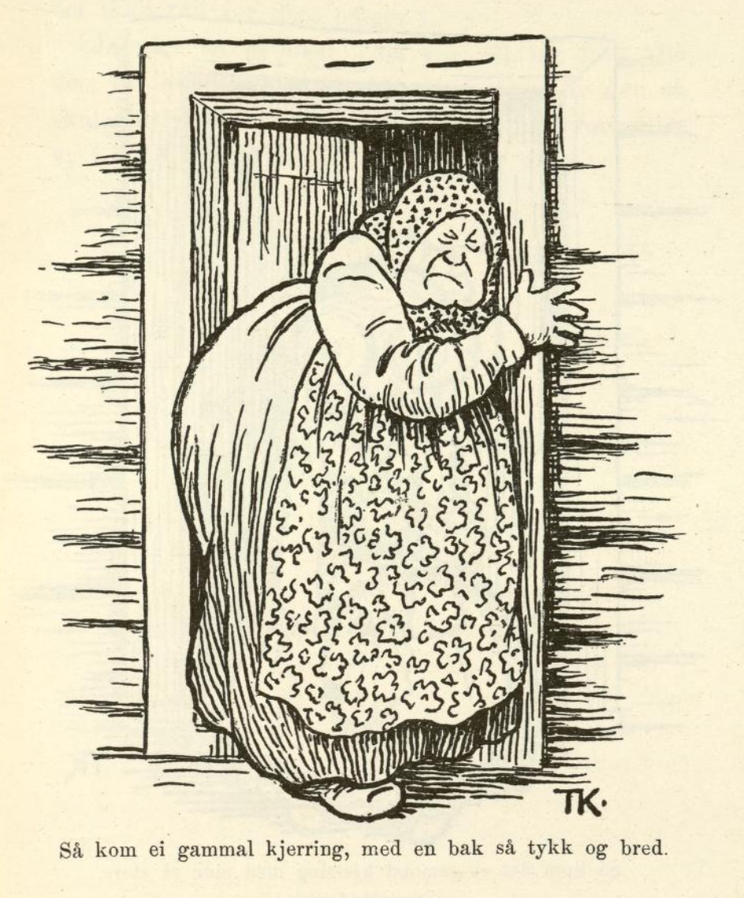
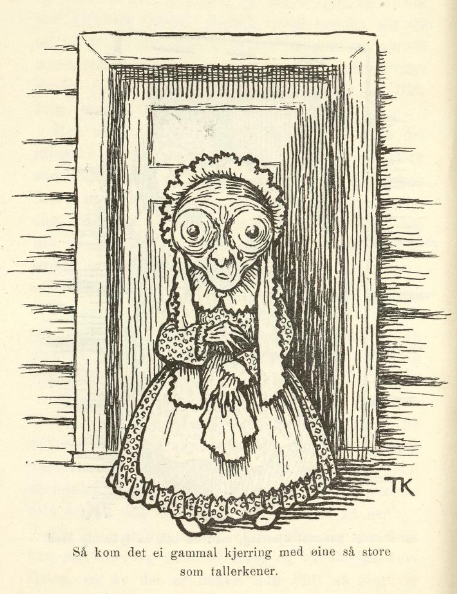

# De tre mostrene.

Det var engang en fattig mann, som bodde i ei stue langt borti skogen og levde av skytteri. Han hadde en eneste datter, og hun var både vakker og ven. Da moren var død tidlig, og jenta alt var halvvoksen, sa hun at hun vilde bort til folk, så hun kunde lære å tjene sitt brød, hun også. «Ja, datter mi,» sa faren, «riktignok har du ikke lært annet hos meg enn å ribbe fugl og steike, men du får vel prøve å tjene for ditt brød likevel.»

Så gikk da jenta ut og skulde be om tjeneste, og da hun hadde gått en stund, kom hun til kongsgården. Der blev hun, og dronningen syntes så vel om henne, at de andre ternene blev rent misunnelige på henne. De fant på å si til dronningen, at jenta hadde sagt seg god for å spinne et pund lin i fire og tyve timer; for dronningen gjorde så mye av alle slags håndarbeider.

«Ja, har du sagt det, skal du gjøre det,» sa dronningen; «men litt lengere tid kan du vel få.» Jenta, stakkar, torde ikke si hun aldri hadde spunnet, men bad bare om et kammers for seg sjøl; det fikk hun, og ditop blev båret både rokk og lin. Der satt hun da og gråt og var ille ved og visste ikke sin arme råd; hun stelte med rokken og snudde og vendte på den, og visste ikke hvordan hun skulde bære seg at — hun hadde aldri før sett en hjulrokk engang.

Men som hun satt slik, kom det inn til henne en gammel kone.

«Hva feiler deg, barnet mitt?» sa hun.

«Å,» svarte jenta, «det kan vel ikke nytte jeg sier deg det; du kan så ikke hjelpe meg likevel!»

«Det kan ingen vite det,» sa konen. «Kan hende jeg torde vite råd for det likevel jeg.»

Ja, jeg kan jo gjerne si henne det, tenkte jenta, og så fortalte hun da, at medtjenerne hennes hadde satt ut, hun hadde sagt seg god for å spinne et pund lin i fire og tyve timer; «og jeg, min stakkar,» sa hun, «jeg har aldri i mine dager sett en hjulrokk dess mer, og enda skulde jeg spinne så mye i et jevndøgn!»

«Ja, det er det samme det, barn,» sa konen; «vil du kalle meg moster på din hedersdag, skal jeg spinne for deg; så kan du gå bort og legge deg til å sove.»

Ja, det vilde jenta gjerne, og gikk bort og la seg.

Om morgenen da hun våknet, lå alt linet spunnet på bordet, og det så pent og fint at aldri noen hadde sett så jevnt og vakkert garn. Dronningen blev så glad over det vakre garnet hun hadde fått, og holdt enda mer av jenta enn før. Men dette blev de andre enda misunneligere på henne for, og så fant de på å si til dronningen, at nå hadde hun sagt seg god for å veve det garnet hun hadde spunnet, i fire og tyve timer. Dronningen sa igjen, at hadde hun sagt det, så skulde hun gjøre det; men om det ikke nettopp blev i fire og tyve timer, så kunde hun vel få litt lengere dag. Jenta torde ikke si nei da heller, men bad om et kammers for seg sjøl, så fikk hun vel prøve.

Der satt hun igjen og gråt og bar seg ille, og visste ikke hva hun skulde ta seg til; så kom det inn en gammel kone igjen og spurte: «Hva feiler deg, barnet mitt?»

Jenta vilde først ikke ut med det, men til slutt fortalte hun da hva hun var så sørgmodig for.

«Ja,» svarte konen, «det er det samme, vil du kalle meg moster på din hedersdag, skal jeg veve for deg; så kan du gå bort og legge deg til å sove.»

Det lot jenta seg ikke si to ganger, og så gikk hun sta og la seg.

Da hun våknet, lå bunken på bordet, vevet så nett og så tett som veves kunde. Hun tok bunken og gikk ned til dronningen med, og hun blev vel glad over den vakre veven hun hadde fått, og holdt enda mer av jenta enn før. Men så blev de andre enda mer avindsyke på henne, og tenkte ikke på annet enn hva de skulde finne på.

Til sist så fortalte de dronningen, at nå hadde hun sagt seg god for å sy op vevbunken til skjorter i fire og tyve timer. Ja, det gikk like ens som før: Jenta torde ikke si at hun ikke kunde sy; hun kom op på et kammers for seg sjøl igjen, og satt der og gråt og var ute av seg. Men så kom det igjen en gammel kone til henne, som lovte å sy for henne, når hun bare vilde kalle henne moster på sin hedersdag; det lovte jenta mer enn gjerne, og så gjorde hun som konen sa, og gikk bort og la seg til å sove. Om morgenen da hun våknet, fant hun bunken opsydd til skjorter liggende på bordet. Så vakker søm hadde aldri noen sett, og skjortene hadde navn og var fullt ferdige.

Da dronningen fikk se det arbeidet, blev hun så glad i sømmen at hun slo hendene ihop; «for så vakker søm har jeg hverken hatt eller sett,» sa hun, og siden holdt hun jenta så kjær som sitt eget barn.

«Dersom du vil ha prinsen, så kan du få ham,» sa hun til jenta, «for du trenger aldri leie bort noen ting; du kan sy og spinne og veve altsammen sjøl.» Da jenta var så vakker og prinsen syntes vel om henne, blev det bryllup straks. Men aller best prinsen vel hadde satt seg til brudebordet med henne, kom det inn ei gammal stygg kjerring, med ei lang nese — den var visst tre alen lang.

Så stod bruden op og neide og sa: «God dag, moster!»

«Er det moster til min brud?» sa prinsen.

Ja, hun var da det.

«Ja, så får hun vel sette seg inn til bordet da,» sa prinsen; men både han og de andre syntes hun var fæl å sitte til bords med.

Men rett som det var, så kom det igjen ei gammal stygg kjerring inn; hun hadde en bak så tykk og bred at hun med nød og neppe fikk klemt seg inn gjennem døren. Straks reiste bruden seg op og hilste: «God dag, moster!» og prinsen spurte igjen, om det var moster til hans brud. Begge svarte ja, og prinsen sa, at når så var, så fikk hun vel sette seg inn til bordet, hun også.

Men aldri før hadde hun satt seg, så kom det igjen ei gammal stygg kjerring, med øine så store som tallerkener, og så røde og rinnende at det var fælt å se. Bruden reiste seg igjen og hilste: «God dag, moster!» og prinsen bad henne også sette seg inn til bordet; men glad var han ikke, og han tenkte ved seg sjøl: «Gud hjelpe meg for mostre min brud har!»

Da han hadde sittet litt, kunde han ikke bare seg, men spurte: «Men hvordan i all verden kan da min brud, som er så vakker, ha så fæle og vanskapte mostrer?»

«Det skal jeg nok si deg,» sa den ene. «Jeg var likeså vakker jeg som bruden din, da jeg var på hennes alder; men det at jeg har fått så lang nese, det kommer seg av at jeg støtt og stadig har sittet og hakket og nikket med spinning, så har nesa mi tøid seg, så den er blitt så lang som du nå ser.»

«Og jeg,» sa den andre, «like siden jeg var ung, har jeg sittet og skubbet fram og tilbake på vevfjelen, og av det er baken min blitt så stor og hoven som du ser.»

Så sa den tredje: «Like fra jeg var ganske liten, har jeg sittet og stirret og sydd natt og dag; av det er øinene mine blitt så fæle og røde, og nå er det ikke råd for dem lenger.»

«Ja så,» sa prinsen, «det var vel jeg fikk vite det; for kan folk bli så fæle og stygge av det, så skal aldri min brud hverken spinne eller veve eller sy i sine dager mer!»
