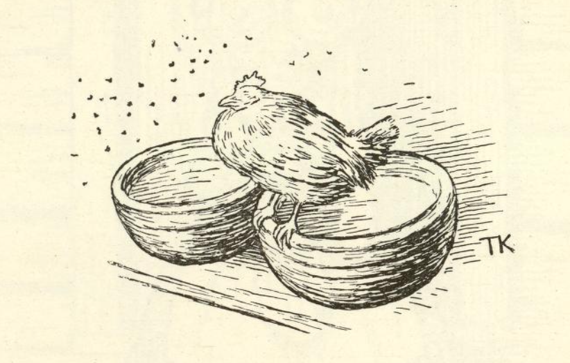
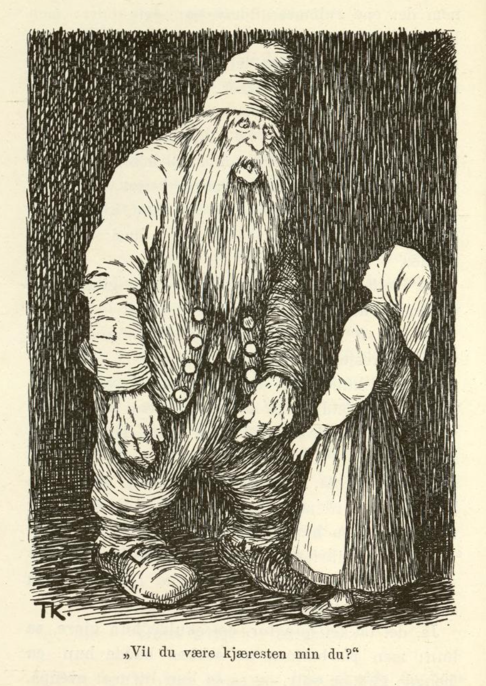
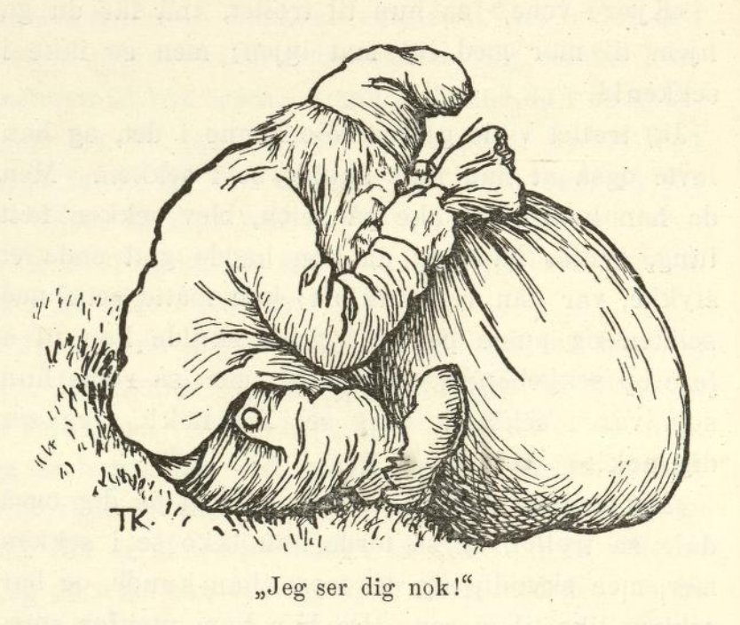

# Høna tripper i berget.

Det var engang en gammel enke som bodde i en avgrend av bygda, langt opunder en ås, med de tre døtrene sine. Hun var så fattig at hun ikke eide annet enn ei høne, og den hadde hun så kjær som øiestenen sin; den kaklet hun for, og den stelte hun med, både tidlig og sent.

Men en dag, rett som det var, så blev høna borte. Konen gikk da ut, rundt om stua, og lette og lokket; men høna var og blev borte. «Du får ut og prøve å se efter høna vår du,» sa konen til den eldste datteren; «ha den igjen må vi, om vi så skal ta den ut av berget.»

Ja, datteren skulde da ut og se efter den; hun gikk både hit og dit og lette og lokket, og ingen høne fant hun. Men aller best det var, så hørte hun det sa borte i en bergvegg:

«Høna tripper i berget!
Høna tripper i berget!»

Hun skulde da bort og se hva det var, men ved bergveggen falt hun gjennem en lem, dypt, dypt ned i en hvelving under jorden. Der nede gikk hun frem igjennem mange rum, det ene gildere enn det andre, men i det innerste kom en stor stygg bergmann til henne.

«Vil du være kjæresten min?» spurte han.

Nei, sa hun, det vilde hun slett ikke, hun vilde op igjen og se efter høna si, som var blitt borte.

Så blev bergmannen så sint at han tok henne og vrei hodet av henne, og kastet kropp og hode ned i kjelleren.

Moren satt hjemme og ventet og ventet, men ingen datter kom igjen. Hun ventet enda en god stund, men da hun hverken hørte eller så noe til henne, sa hun til den mellemste datteren, at hun fikk gå ut og se efter søster si; «og høna kan du lokke på med det samme,» sa hun.

Den andre søsteren skulde da ut, og henne gikk det nettop like ens; hun gikk og lette og lokket, og med ett så hørte hun også det sa borti bergveggen:

«Høna tripper i berget!
Høna tripper i berget!»

Dette syntes hun var underlig; hun skulde da bort og se hva det var, og så falt hun også gjennem lemmen, dypt, dypt ned i hvelvingen. Der gikk hun gjennem alle rammene, men i det innerste kom bergmannen til henne, og spurte om hun vilde være kjæresten hans. Nei, det vilde hun slett ikke, hun vilde straks op igjen og lete efter høna som var blitt borte, hun. Men så blev bergmannen sint; han tok henne og vrei hodet av henne og kastet hode og kropp ned i kjelleren.

Da nå konen hadde sittet og ventet på den andre datteren også i sju lange og sju breie, og ingen datter var å høre eller se, så sa hun til den yngste:

«Nå får riktig du i veien og se efter søstrene dine. Ille var det at høna blev borte, men enda verre blev det, skulde vi ikke finne igjen søstrene dine; men høna kan du alltid lokke på med det samme.»

Ja, den yngste skulde da ut; hun gikk hit og dit og lette og lokket, men ikke så hun høna, og ikke så hun søstrene sine. Langt om lenge kom hun også bort imot bergveggen, og så hørte hun det sa:

«Høna tripper i berget!
Høna tripper i berget!»

Dette syntes hun var rart; hun skulde da bort og se, og så falt hun også igjennem lemmen, dypt, dypt ned i hvelvingen. Der nede gikk hun igjennem det ene rammet gildere enn det andre; men hun var ikke så redd hun; hun gav seg god tid og så både på det ene og det andre, og så fikk hun øie på kjellerlemmen også; hun så nedi der, og straks kjente hun søstrene sine, som lå der.

Med det samme hun vel hadde fått lukket igjen kjellerlemmen, kom bergmannen til henne. «Vil du være kjæresten min du?» spurte bergmannen.

«Ja, gjerne det,» sa jenta, for hun kunde nok skjønne hvordan det hadde gått med søstrene hennes.

Da trollet hørte det, fikk hun gilde, gilde klær, de fineste hun kunde ønske seg, og alt hun ellers vilde ha, så glad blev han for det at noen vilde være kjæresten hans.

Men da hun hadde vært der en tid, var det en dag hun var enda mere stur og still enn hun brukte være. Så spurte bergmannen, hva det var hun sturet for.

«Å,» sa jenta, «det er for det jeg ikke kan komme hjem til mor; hun er visst både sulten og tørst, og ingen har hun hos seg heller.»

«Ja, gå til henne kan du ikke få lov til,» svarte trollet, «men stapp noe mat i en sekk, så skal jeg bære den til henne.»

Ja, det takket hun for, det skulde hun gjøre, sa hun; men på bunnen av sekken hadde hun en mengde gull og sølv, og så la hun litt mat ovenpå, og sa så til trollet, at nå var sekken ferdig, men han måtte slett ikke se ned i den, og det lovte han også han ikke skulde gjøre.

Da så bergmannen gikk, kikket hun ut efter ham i et lite hull som var på lemmen; da han hadde kommet et stykke på veien, sa han: «Den er så tung denne sekken, jeg vil nok se hva som er i den, jeg,» og vilde løse op sekkebandet; men så ropte jenta: «Jeg ser deg nok! Jeg ser deg nok!»

«Det er da pokker til øier i hodet på deg også da,» sa trollet, og så torde han ikke prøve på det mere.

Da han var kommet dit enken bodde, kastet han sekken inn gjennem stuedøren. «Der har du mat fra datter di; det leter ikke på henne,» sa han.

Da nå jenta hadde vært i berget ennu en god stund, falt det en dag en gjeitebukk ned igjennem lemmen.

«Hvem er det som har sendt bud efter deg, ditt langraggete best?» sa trollet, han var fælt vill, og så tok han bukken og vrei hodet av den og kastet den ned i kjelleren.

«Å nei, hvorfor gjorde du det da?» sa jenta; «den kunde jeg hatt og moret meg med her nede.»

«Du trenger ikke sette op noen surmule for det, vet jeg,» sa trollet, «jeg kan snart få liv i gjeitebukken igjen jeg.» Dermed tok han en krukke som hang på veggen, satte hodet på gjeitebukken og smurte den av krukken, så var den like god igjen.

Hå hå! tenkte jenta, den krukka er nok noe verdt den.

Da hun hadde vært hos trollet en god stund til, passet hun på en dag trollet var borte, tok den eldste av søstrene og satte hodet på henne og smurte henne av krukken, slik som hun hadde sett trollet gjorde med gjeitebukken; og straks kom søsteren til live igjen. Jenta la henne da i en sekk, og hadde litt mat ovenpå, og så snart trollet kom hjem igjen, sa hun til ham: «Kjære vene, nå får du hjem til mor med litt mat igjen, hun er visst både tørst og sulten, stakkar, og alene er hun også. Men se ikke i sekken!»

Ja, sekken skulde han nok gå med, sa han, og se i den skulde han heller ikke; men da han kom et stykke på veien, syntes han sekken blev så tung, og da han hadde gått enda en stund, sa han at han nok vilde se hva som var i sekken; «hva slags øier der er skapt på henne, så kan hun da ikke se meg nå,» sa han ved seg sjøl. Men med det samme han vilde til å løse op, sa hun som satt i sekken: «Jeg ser deg nok! Jeg ser deg nok!»

«Det var da pokker til øier i hodet på deg også da!» sa trollet — han trodde det var hun i berget som talte. Han torde da ikke prøve å se nedi mere, men bar sekken til moren det forteste han kunde, og da han kom til stuedøren, kastet han den innigjennem. «Der har du mat fra datter di; det leter ikke på henne,» sa han.

Da nå jenta hadde vært i berget enda en god stund, gjorde hun det samme med den andre søsteren; hun satte hodet på henne, smurte henne av krukken, og hadde henne i sekken; men den gangen fylte hun så mye gull og sølv oppå, som det var rum til, og aller øverst la hun litt mat.

«Kjære vene,» sa hun til trollet, «nå får du gå hjem til mor med litt mat igjen; men se ikke i sekken!»

Ja, trollet vilde gjerne føie henne i det, og han lovte også at han ikke skulde se i sekken. Men da han kom et stykke på veien, blev sekken fælt tung, syntes han; og da han hadde gått enda et stykke, var han rent utkjørt; han måtte sette ned sekken og puste på litt, og så skulde han til å løse op sekkebandet og se nedi; men så ropte hun som var i sekken: «Jeg ser deg nok! Jeg ser deg nok!»

«Det var da pokker til øier i hodet på deg også da!» sa trollet, og så torde han ikke se i sekken mer, men skyndte seg det meste han kunde, og bar sekken like til moren. Da han kom utenfor stuedøren, kastet han den innigjennem; «der har du mat fra datter di; det leter ikke på henne,» sa han.

Da så jenta hadde vært der enda en god tid, skulle trollet ut en gang; så lot jenta som hun var ussel og syk, og sutret og bar seg.

«Det kan ikke nytte du kommer hjem før klokken tolv,» sa hun, «for før kan jeg ikke få maten ferdig; jeg er så ussel og så klein.»

Da nå trollet vel hadde gått, stoppet hun ut klærne sine med halm og satte denne halmjenta borti kroken ved peisen, med en tvare i hånden, så det så ut som det var hun sjøl som stod der. Så skyndte hun seg hjem og fikk med seg en skytter til å være i stua hjemme hos moren.

Da klokken var tolv eller vel det, kom trollet hjem.

«Kom med maten!» sa han til halmjenta.

Nei, hun svarte ikke.

«Kom med maten! sier jeg,» sa trollet igjen; «jeg er sulten!»

Nei, hun svarte ikke.

«Kom med maten!» skrek trollet tredje gangen, «hør det jeg sier, ellers skal jeg vekke deg jeg!»

Nei, jenta stod like stille.

Så blev han så vill at han spente til henne, så halmstubbene for både i vegger og tak. Men da han så det, merket han uråd og gav seg til å lete både høit og lavt, og til sist kom han ned i kjelleren også; der var begge søstrene til jenta borte, og så skjønte han straks hvordan det hadde gått til. Ja, det skulde hun få undgjelde! sa han, og la i veien dit moren bodde. Men da han kom til stua, skjøt skytteren; så torde ikke trollet gå inn, han trodde det var tordenen. Han satte hjem igjen det forteste han orket, men med det samme han kom til lemmen, rant sola, og så sprakk han.

Der er visst gull og sølv nok ennu. Den som bare visste hvor lemmen var!
