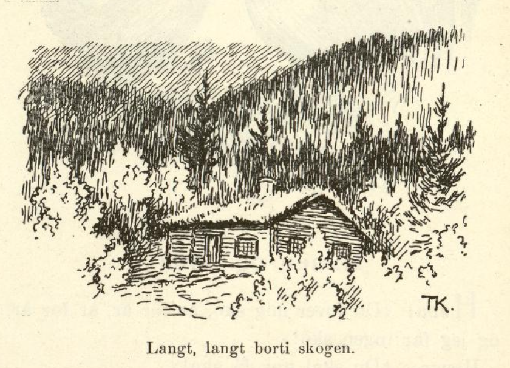
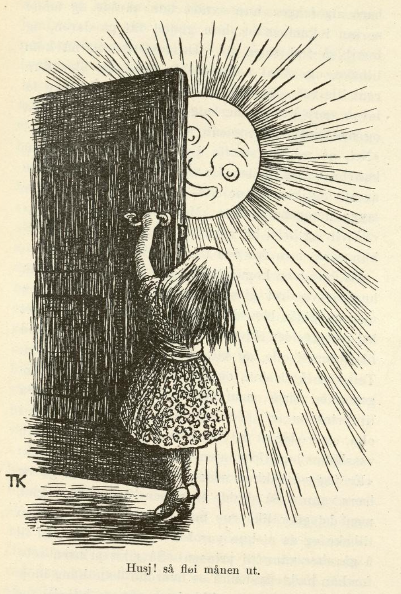

# Jomfru Maria som gudmor.

Langt, langt borti en stor skog bodde engang et par fattigfolk. Konen kom i barselseng og fødte et barn, en vakker datter. Men de var så fattige, at de visste ikke hvordan de skulde få barnet til dåpen. Mannen måtte da en dag ut for å se å få fadderer som selv kunde ofre; han gikk hele dagen både til den ene og til den andre; men alle sa de, at de nok vilde være fadder, men ingen syntes han hadde råd til å ofre selv.

Da han gikk hjem om kvelden, møtte han en vakker frue, som var så prektig klædd, og så så inderlig snild og god ut; hun bød seg til å skaffe barnet til dåpen; men siden vilde hun ha det. Mannen svarte at han først måtte spørre konen sin, hva hun vilde; men da han kom hjem og fortalte det, sa konen feent ut nei. Andre dagen gikk mannen ut igjen; men ingen vilde være fadder, når de skulde ofre selv, og alt han bad, så hjalp det ikke.

Da han gikk hjem igjen mot kvelden, møtte på nytt den vakre fruen, som så så blid ut, og hun gjorde det samme tilbudet igjen. Han fortalte konen det som hadde hendt ham, og hun sa da, at dersom han ikke næste dag kunde få fadderer til barnet, så fikk de vel la fruen få det, siden hun så så god og snild ut. Den tredje dagen mannen gikk ut, fikk han heller ingen fadderer, og da han møtte fruen igjen om kvelden, lovte han å la henne få barnet, når hun vilde skaffe det dåp og kristendom.

Om morgenen kom hun så dit mannen bodde, i følge med to mannfolk, tok barnet og reiste til kirken med det, og der blev det døpt. Så tok hun det hjem med seg, og der levde den vesle jenta hos henne i flere år, og fostermoren var alltid snild og god mot henne.

Da jenta var blitt så stor at hun lærte å skjønne, laget fostermoren seg til å reise bort. «Du kan få lov å gå hvor du vil,» sa hun til jenta, «bare ikke i de tre kammersene jeg nå viser deg.» Og så reiste hun. Men jentungen kunde likevel ikke la være å gløtte litt på den ene kammersdøren, og husj! så fløi det ut en stjerne. Da fostermoren kom tilbake, blev hun vond og truet fosterdatteren med å jage henne bort; men barnet gråt og bad for seg, og så fikk hun til slutt lov å bli.

Om en tid skulde fostermoren reise bort igjen, og så forbød hun jenta å gå inn i de to kammersene hun ikke hadde vært i. Hun lovte å ta seg i vare; men da hun hadde gått alene en stund og tenkt og grundet på hva som vel kunde være inne i det andre kammerset, kunde hun ikke holde seg fra å gløtte litt på døren og kikke inn, og husj! så fløi månen ut. Da fostermoren kom igjen, og så at månen hadde sloppet ut, blev hun sørgmodig, og sa at nå kunde hun slett ikke ha henne hos seg lenger, nå måtte hun bort. Men jenta gråt så hjertelig og bad så vakkert for seg, og så fikk hun da lov til å bli denne gangen også.

Om noen tid skulde fostermoren reise igjen — jenta var alt halvvoksen den gang — og da la hun henne alvorlig på hjerte, at hun slett ikke måtte prøve på å gå inn i eller se inn i det tredje kammerset. Men da fostermoren hadde vært borte en stund, og jenta hadde gått alene og kjedet seg i langsommelig tid, så tenkte hun: «Nei så morsomt det skulde være å se litt inn i det tredje kammerset!» Hun tenkte først at hun ikke vilde gjøre det like fullt, for fostermorens skyld; men da hun andre gangen kom på det, kunde hun ikke bare seg lenger, hun syntes hun skulde og måtte se inn i kammerset; hun gløttet litt på døren, og husj! så fløi solen ut.

Da fostermoren nå kom tilbake, og så at solen hadde fløiet ut, blev hun rent ille ved, og sa at nå kunde hun slett ikke få lov å være hos henne lenger. Fosterdatteren gråt og bad enda vakrere enn før, men det hjalp ikke. «Nei, nå må jeg straffe deg,» sa moren; «men du kan ha valget: enten du vil bli den aller vakreste av alle og ikke kunne tale, eller du vil bli den aller styggeste og kunne tale. Men bort fra meg må du.»

«Så vil jeg helst bli vakker,» sa jenta. Og det blev hun også, men fra den tid var hun målløs.

Da hun var kommet bort fra fostermoren, gikk hun og vandret gjennem en stor, stor skog; men alt hun gikk, blev det aldri ende på den. Da det led mot kvelden, kløv hun op i et høit tre som stod like over ei olle, og satte seg til å sove om natten. Tett ved lå et slott, og fra det kom tidlig om morgenen en terne, som skulde hente vann fra olla til prinsens te. Ternen så det vakre ansiktet i olla, og trodde at det var henne selv; så kastet hun vassbøtta, løp hjem igjen og slo på nakken og sa: «Er jeg så vakker, så er jeg for god til å gå og bære vann.» Så skulde en annen i vei efter vannet, men det gikk like ens med henne; hun kom også tilbake og sa at hun var for vakker og for god til å gå efter vann til prinsen. Så gikk prinsen selv, for han hadde lyst til å se hvordan dette hang ihop.

Da han kom til olla, fikk han også se billedet, og straks så han op; der blev han da var den vakre jomfruen som satt oppe i treet. Han lokket henne ned og tok henne hjem med seg, og vilde endelig ha henne til dronning, for det hun var så vakker. Men mor hans, som levde ennu, vilde ikke; «hun kan jo ikke tale,» sa hun, «og det kan gjerne være et troll-menneske.» Men prinsen gav seg ikke, før han fikk henne.

Da de hadde levd sammen en tid, blev hun med barn, og da hun skulde føde, lot prinsen sette sterk vakt omkring henne, men i fødselstimen sovnet allesammen, og da hun hadde født, kom fostermor hennes, skar barnet i veslefingeren og smurte dronningen om munnen og på fingrene med blodet, og sa til henne: «Nå skal du bli så sørgmodig, som jeg var, da du hadde sluppet ut stjernen»; og så blev hun borte med barnet. Da de våknet, de som var satt til vakt, trodde de at dronningen hadde ett sitt eget barn, og den gamle dronningen vilde ha henne brent, men prinsen holdt slik av henne, og til slutt fikk han bedt henne fri for straffen; men det var med nød og neppe.

Andre gangen den unge dronningen skulde i barselseng, blev det satt dobbelt så sterk vakt som forrige gang. Men det gikk nettop like ens, bare at fostermoren sa: «Nå skal du bli så sørgmodig, som jeg var, da du hadde sloppet ut månen.» Dronningen gråt og bad — for når fostermoren var der, kunde hun tale —, men det hjalp ikke. Nå vilde den gamle dronningen endelig ha henne brent; men prinsen fikk da bedt henne fri den gangen også.

Da dronningen skulde i den tredje barselsengen, blev det satt tredobbelt vakt omkring henne. Men det gikk like ens: Fostermoren kom mens vakten sov, tok barnet og skar det i veslefingeren og smurte dronningen om munnen med blodet; og så sa hun, at nå skulde dronningen bli så sørgmodig, som hun selv hadde vært, da solen var sloppet ut. Nå kunde ikke prinsen på noen måte få frelst henne; hun måtte og skulde brennes. Men nettop i det samme de leide henne op på bålet, fikk de se fostermoren, som kom med alle tre barnene; de to leide hun ved hånden, og det tredje bar hun på armen. Hun gikk bort til den unge dronningen og sa: «Her er barnene dine, nå skal du få dem igjen. Jeg er jomfru Maria, og så sorggiven som du nå har vært, var jeg, da du hadde sluppet ut solen, månen og stjernen. Nå har du lidd straff for det du gjorde, og fra nå av skal du igjen kunne tale.»

Så glad dronningen og prinsen blev, kan alle lett tenke seg, men ingen kan si det; siden var de lykkelige støtt, og prinsens mor holdt også av den unge dronningen fra den tid av.
