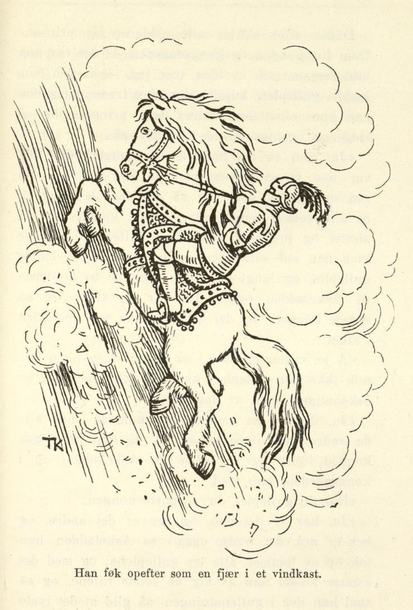

# Jomfruen på glassberget.

Det var engang en mann, han hadde en slåtteng som lå langt oppe i lia ensteds, og på den enga stod et høilade, han hadde å berge foret i. Men det hadde nok ikke vært stort i ladet de siste årene, skal jeg tro; for hver jonsoknatt, når gresset stod gildest og frodigst, blev slåttenga rent svartbeitet, som en hel drift skulde gått der og gnaget om natten. Det hendte én gang, og det hendte to ganger; men så blev mannen lei av det og sa til sønnene sine — han hadde tre, og den tredje var Askeladden, kan du vite, — at nå fikk en av dem ligge borti uteng-ladet om jonsoknatten, for det var for galt at gresset skulde bli ett op rubb og stubb igjen, likesom de to siste årene; og den som vilde i veien, måtte passe vel på, sa mannen.

Ja, så vilde da den eldste bort og gjete enga; han skulde nok passe gresset, mente han, og det så hverken folk eller fe eller fanden sjøl skulde få noe av det. Da det lei mot kvelden, gikk han bort i ladet og la seg til å sove; men litt ut på natten kom det slik en dur og slikt et jordskjelv, at vegger og tak ristet; og gutten op og til bens det forteste han hadde lært, han torde ikke se seg om engang, og høiet blev ett op den natten likesom de andre årene.

Næste jonsokkvelden sa mannen igjen, at det var for ille, de år efter år mistet alt gresset på utenga, nå fikk en av sønnene bort og passe på, og passe det vel også. Så vilde den næst eldste prøve seg den kvelden. Han gikk da bort i høiladet og la seg til å sove, likesom broren hadde gjort; men utpå natten kom det en dur og et jordskjelv, enda verre enn siste jonsoknatt; og da gutten hørte det, blev han redd, og tok på sprang så fort som han skulde hatt betaling for det.

Året efter skulde da Askeladden i veien; men da han laget seg til å gå, lo de andre to og gjorde narr av ham. «Ja du skal bli den rette til å passe høiet, du som ikke har lært annet enn sitte i oska og steike deg!» sa de. Men Askeladden brydde seg ikke om det de snakket; da det lei mot kvelden, ruslet han bortover til utenga han. Der gikk han inn i høiladet og la seg; men da det lei om en stund, tok det til å dure og brake, så det var fælt. «Å blir det ikke verre, får jeg vel herde på,» tenkte Askeladden. Om litt kom det et brak igjen, og et jordskjelv, så høistråene føk omkring gutten. «Å blir det ikke verre, får jeg vel herde på,» tenkte Askeladden. Men aller best det var, kom den tredje duren, og et jordskjelv, så gutten tenkte at vegger og tak ramlet sammen; men da det var over, blev det med ett kurende stilt om kring ham. «Skal tro det kommer igjen,» tenkte Askeladden. Men nei, det kom ikke igjen, det var stilt, og det blev stilt, og da han hadde ligget en liten stund, hørte han likesom en hest stod og tygget tett utenfor ladedøren. Han lurte seg bort i dørgløtten og skulde se hva det var; så stod det en hest og gnog, og så stor og feit og gild hest hadde Askeladden aldri sett før, og sal og bigsel lå det på den og full rustning til en ridder, og alt ihop var av kobber, og så blankt at det skinte i det. «Hå, hå! er det du som eter op høiet vårt,» tenkte gutten, «det skal jeg nok forby det.» Han skyndte seg og tok op ildstålet sitt og kastet over hesten, så hadde den ikke makt til å røre seg av flekken; den blev så tam, at gutten kunde gjøre med den hva han vilde. Han satte seg op på den og red bort til et sted ingen visste om; der hadde han den.

Da han kom hjem igjen, lo brødrene og spurte hvordan det hadde gått ham. «Du blev vel ikke lenge liggende i høiladet, om du ellers har vært så langt som borti utenga,» sa de.

«Jeg lå i høiladet til sola rant jeg, men jeg hverken hørte eller så noe,» sa gutten; «tro hva det var Dere blev så redde for!»

«Ja, vi får vel se efter hvordan du har passet enga,» svarte brødrene; men da de kom der bort, stod gresset der likeså langt og tykt som om kvelden.

Næste jonsoknatten gikk det like ens: Ingen av de to brødrene torde gå bort i utenga og passe slåtten, men Askeladden torde; og så hendte akkurat det samme som siste jonsoknatt: først kom det en dur og et jordskjelv, så om litt et til, og så enda et; men alle tre jordskjelvene var mye, mye sterkere denne gangen. Så blev det med én gang kurende stilt igjen, og gutten hørte noe tygge utenfor ladedøren; han stjal seg da bort i dørgløtten så sakte han kunde, — jo! der stod en hest igjen like ved veggen og tamset og gnog; og den var enda mye større og feitere enn den andre; og sal lå det på ryggen dens, og bigsel var det på den, og full rustning til en ridder — alt ihop av blankt sølv og så gromt som noen vilde se. «Hå, hå! er det du som eter op høiet vårt i natt,» tenkte gutten, «det skal jeg vel forby deg!» Han tok op ildstålet sitt og kastet over manen på hesten, så stod den der så spak som et lam. Ja, gutten red den hesten også bort til stedet, der han hadde den andre, og gikk så hjem igjen.

«Idag ser det vel vakkert ut borti slåttenga?» sa brødrene.

«Å, jamen!» sa Askeladden.

De skulde da bort igjen, og så stod gresset både tykt og langt likesom før; men de blev nå ikke blidere på Askeladden for det.

Da den tredje jonsoknatten kom, torde heller ingen av de to eldste brødrene ligge i utengladet og passe gresset, for de var blitt så hjerteskremt den natten de lå der, at de aldri glemte det mer; men Askeladden torde. Og så hendte nettop det samme som de to siste jonsoknettene; det kom tre jordskjelv, det ene fælere enn det andre, ved det siste danset gutten fra den ene ladeveggen til den andre; men så blev det med én gang kurende stilt. Da han så hadde ligget en liten stund, hørte han noget tygge utenfor ladedøren; han stiltret seg bort i dørgløtten igjen — så stod det en hest tett utenfor, mye, mye større og feitere enn de to andre han hadde fanget, og med både bigsel og sal og full rustning av rent, rødt gull. «Hå, hå! er det du som eter op høiet vårt denne gangen,» tenkte gutten; «det skal jeg vel forby deg;» han rev op ildstålet sitt og kastet over den, så stod den som den var naglet til marka, og gutten kunde gjøre med den hva han vilde. Han red bort til stedet, der han hadde de andre to, og så gikk han hjem igjen. Der gjorde de to brødrene narr av ham, likesom de andre gangene; den natten hadde han visst passet gresset i utenga godt, sa de, for han så da ut som han gikk og sov ennu. Men Askeladden brydde seg ikke om det, han bad dem bare gå bort og se; det gjorde de, så stod gresset like gildt og tykt denne gangen også.

Kongen der i landet hvor far til Askeladden bodde, hadde en datter som han ikke vilde gi til noen, uten den som kunde ri opover glassberget — for det var et høit, høit glassberg, blankt som en is, tett ved kongsgården. Øverst oppe på det skulde kongsdatteren sitte med tre gullepler i fanget, og den som kunde ri op og ta de tre gulleplene, skulde få henne og halve riket, det lot kongen lyse op på alle kirkebakker i hele landet og i mange andre kongeriker også. Kongsdatteren var så vakker, at alle som så henne, måtte bli borte i henne, enten de vilde eller ei — og så kan du nok vite at alle prinser og ridderer hadde lyst til å vinne henne og halve kongeriket med, og derfor kom de ridende fra alle verdens kanter, så gilde at det lyste av dem, og på slike hester, at de gikk bare på dans; og det var ingen uten han tenkte at han skulde vinne kongsdatteren.

Da dagen kom som kongen hadde satt, var det så tykt av ridderer og prinser ved glassberget at det yrte, og dit vilde nå hver som krype og gå kunde, og se hvem som vant kongsdatteren, og de to brødrene til Askeladden vilde da også i veien. Men han vilde de slett ikke ha med; for var de i følge med slik en bytting, så fæl og svart som han var, efter det han hadde ligget i oska og gravet, vilde folk bare gjøre narr av dem, sa de.

«Ja, jeg går likeså godt alene, som for meg sjøl jeg,» sa Askeladden.

Da de to brødrene kom til glassberget, holdt alle prinsene og ridderne på å ri, så det skummet av hestene deres; men det nyttet ikke stort, skal jeg tro, for bare hestene satte hoven på berget, så gled de, og det var ikke én som kom så mye som et par alen opefter. Det var heller ikke å undres på, for berget var glatt som en glassrute og bratt som en stuevegg. Men kongsdatteren og halve riket vilde alle gjerne ha, og de rei og de glei, og det blev aldri annet. Til sist var alle hestene så trette at de ikke orket mer, og så svette var de at skummet valt av dem, og så måtte ridderne gi seg. Kongen tenkte alt på, at han skulde lyse op at ridningen begynte på nytt næste dag, om det skulde gå bedre da; men med det samme kom det en ridder på en hest så gild at ingen hadde sett slik hest før, og kobberrustning og kobberbigsel hadde han, alt så blankt at det lyste i det. De andre ropte til ham, at han gjerne kunde spare seg for å prøve å ri opefter glassberget, for det nyttet så ikke likevel. Men han hørte ikke på det øret; han red like bort imot glassberget og opefter det som ingen ting, og det et godt stykke, det kunde vel være som en tredjepart; da han kom der, snudde han hesten og red ned igjen. Men så vakker en ridder syntes kongsdatteren hun aldri hadde sett før, og mens han red, satt hun og tenkte: «Gid han bare kom op!» og da hun så han snudde hesten, kastet hun det ene gulleplet, efter ham, og det trillet ned i skoen hans. Men vel han var kommet ned av berget, red han sin vei, og det så fort at ingen visste hvor det blev av ham. Den kvelden skulde alle prinsene og ridderne frem for kongen, så den som hadde ridd så langt opefter glassberget, kunde vise frem gulleplet kongsdatteren hadde kastet. Men det var ingen som hadde noe; den ene kom efter den andre, og ingen kunde vise eplet.

Om kvelden kom brødrene til Askeladden også hjem igjen, og fortalte både vidt og bredt om ridningen opefter glassberget, at først så var det slett ingen som orket komme så mye som et steg opover; «men så kom det én som hadde kobberrustning og kobberbigsel, så blankt at det lyste lang vei av ham,» sa de, «og det var gutt som kunde ri; han red over en tredjepart opefter glassberget, og han kunde nok ridd helt op, hadde han bare villet; men der snudde han, for han syntes vel det var nok for den gangen.»

«Å han skulde jeg riktig hatt moro av å se, jeg også,» sa Askeladden — han satt i grua og grov, som han brukte, han.

«Ja, du!» sa brødrene, «du ser ut som du kunde være mellem så høie herrer, ditt stygge beist, du sitter der!»

Næste dag vilde brødrene i veien igjen, og Askeladden bad denne gangen også, om han kunde få lov å være i følge med dem og se på dem som red; men nei, det fikk han slett ikke, det var han for stygg og for fæl til, sa de.

«Ja, ja, jeg går likeså gjerne alene, som for meg sjøl, også jeg,» sa Askeladden.

Da brødrene kom til glassberget, tok alle prinsene og ridderne på å ri igjen, og da kan det vel hende at de hadde skodd hestene sine. Men det hjalp ikke; de rei og de glei, likesom forrige dagen, og ingen kom så mye som et par alen opefter, og da de hadde maset ut hestene sine, så de ikke orket mere, måtte de holde op igjen allesammen. Så tenkte kongen, at han vel fikk lyse op at ridningen skulde gå for seg for siste gang dagen efter, om det kanskje skulde gå bedre da. Men så tenkte han om igjen: han fikk vel vente litt ennu, mente han, om han i kobberrustningen skulde komme igjen den dagen også. Han så de ikke noe til, men rett som det var, så kom det én på en hest. som var mye, mye gildere enn den, ridderen i kobberrustningen hadde hatt, og denne hadde sølvrustning og sølvsål og sølvbigsel, alt så blankt at det skinte og lyste i det lang lei. De andre ropte til ham igjen, og sa at han gjerne kunde la være å prøve ridningen opefter glassberget, for det nyttet så aldri likevel. Men ridderen hørte ikke efter det; han red like bort til glassberget og opefter det, enda lenger enn han i kobberrustningen; men da han hadde kommet så langt som to tredjeparter op, snudde han hesten og red ned igjen. Han likte kongsdatteren enda bedre, og hun satt og ønsket at han bare måtte komme op; men da hun så han snudde, kastet hun det andre eplet efter ham, og det trillet ned i skoen hans; og med det samme han kom ned av glassberget, red han av gårde så fort at ingen kunde se hvor det blev av ham.

Om kvelden, da alle skulde frem for kongen og kongsdatteren, så den som hadde gulleplet, kunde vise det frem, kom den ene efter den andre, men ingen hadde noe gulleple. Likesom forrige dagen kom de to brødrene hjem den kvelden også, og fortalte hvordan det hadde gått, at alle hadde ridd, og ingen kunde komme op. «Men langt om lenge kom det en i en sølvrustning, og sølvbigsel og sølvsål hadde han også,» sa de, «og faen kunde ri; han satte vel som to tredjeparter opefter, så snudde han igjen. Det var gutt det! Og til han kastet kongsdatteren det andre gulleplet,» sa brødrene.

«Å, han skulde jeg også hatt moro av å se,» sa Askeladden.

«Å ja, han var nå vel så blank som oska du sitter og graver i, ditt stygge svarte beist du er!» sa brødrene.

Tredje dagen gikk alt like ens som de andre dagene: Askeladden vilde være med og se på ridningen, og de to vilde ikke ha ham i følge med seg; og da de kom til glassberget, var det ingen som kom så langt som to alen opefter. Alle ventet nå på han i sølvrustningen; men han var hverken å høre eller se. Men langt om lenge kom det en på en hest så gild at ingen hadde sett maken; han hadde gullrustning og gullsål og gullbigsel, så blankt, så blankt, at det lyste og skinte lang vei av det. De andre ridderne og prinsene kom seg ikke engang til å rope til ham og si at det ikke nyttet prøve seg, så op i under blev de, da de så hvor gild han var. Han red like bort imot glassberget og føk opefter det som en fjær i et vindkast, så kongsdatteren ikke engang fikk stunder til å ønske at han måtte komme helt op, før han var der. Med det samme han hadde nådd op, tok han det tredje gulleplet av fanget på kongsdatteren, og så snudde han hesten og red ned igjen, men så var han også borte for øinene på dem, før de visste ordet av det.

Da de to brødrene kom hjem igjen om kvelden, fortalte de både vel og lenge om hvordan det hadde gått med ridningen den dagen, og til sist fortalte de også om ridderen i gullrustningen. «Det var vel gutt det! Så gild ridder fins ikke i verden,» sa brødrene.

«Å han skulde jeg hatt moro av å se, jeg også!» sa Askeladden.

«Ja, det glor nå ikke fullt så mye i kullhaugen du ligger og roter i, ditt stygge svarte beist!» sa brødrene.

Dagen efter skulde alle ridderne og prinsene frem for kongen og kongsdatteren — det var nok blitt for sent om kvelden, tror jeg, — så den som hadde gulleplet, kunde vise det frem; men den ene kom efter den andre, først prinsene og så ridderne, og ingen hadde noe gulleple.

«Ja, men én må ha det,» sa kongen, «for det var noe vi så allesammen, at det var en som red op og tok det»; og så gav han befaling til at alle som i landet var, skulde komme op på slottet og prøve å vise frem gulleplet. Ja, de kom den ene efter den andre, men ingen hadde gulleplet, og langt om lenge kom de to brødrene til Askeladden også. De var de siste, og så spurte kongen, om det da slett ikke var fler igjen i riket.

«Å jo, vi har en bror,» sa de to; «men han har nok ikke tatt gulleplet; han har ikke vært ute av oskehaugen noen av dagene.»

«Ja, det er det samme,» sa kongen, «har alle de andre vært oppe på slottet, så kan han også komme inn,» og så måtte da Askeladden op i kongsgården, han med.

«Har du gulleplet, du?» spurte kongen.

«Ja, her er det ene, og her er det andre, og her er nok det tredje også,» sa Askeladden, han tok op av lommen alle tre gulleplene; og med det samme kastet han av seg de sotete fillene, og så stod han der i gullrustningen, så gild at det lyste av ham.

«Ja, du skal ha datter mi og halve riket; du har vel fortjent både henne og det,» sa kongen.

Så blev det bryllup, og så fikk Askeladden kongsdatteren, og i det bryllupet blev det vel turet, kan hende; for ture kunde de alle, om de ikke kunde ri opefter glassberget, og har de ikke turet fra seg, så holder de på ennu.
