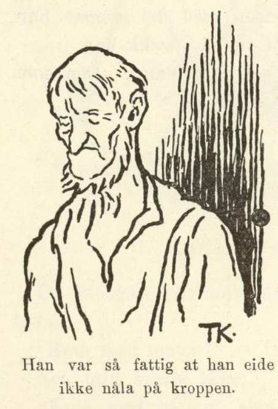
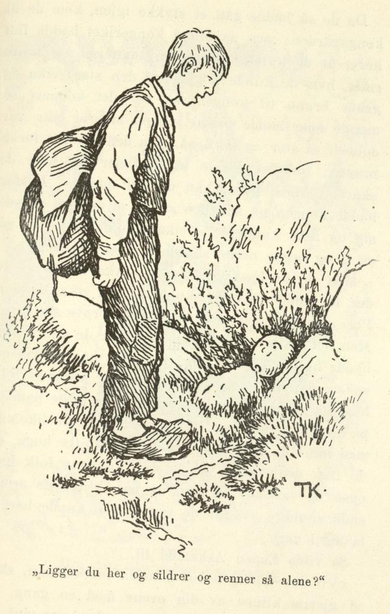
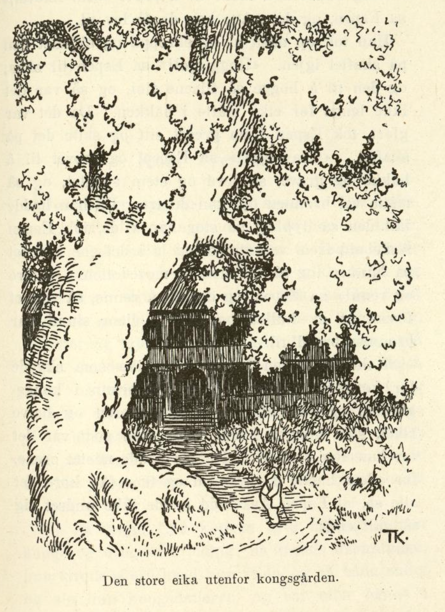

# Per og Pål og Espen Askeladd

Det var engang en mann som hadde tre sønner, Per og Pål og Espen Askeladd; men annet enn de tre sønnene hadde han ikke heller, for han var så fattig at han eide ikke nåla på kroppen, og derfor sa han titt og ofte til dem, at de fikk ut i verden og se å tjene sitt brød; hjemme hos han blev det så ikke annet enn svelt ihjel likevel.

Et godt stykke borte fra stua hans lå kongsgarden, og like utenfor vinduene til kongen hadde det vokset op en eik, som var så stor og diger at den skygde for lyset i kongsgården; kongen hadde lovt ut mange, mange penger til den som kunde hogge ned eika; men ingen var god for det, for så fort en skåret en flis av eikeleggen, vokste det to i steden. Så vilde kongen også ha gravd en brønn, som skulde holde vann hele året; for alle grannene hans hadde brønn, men han hadde ingen, og det syntes kongen var skam. Til den som kunde grave slik en brønn at den holdt vann hele året rundt, hadde kongen lovt ut både penger og annet. Men det var ingen som kunde få gjort det; for kongsgården lå høit, høit oppe på en bakke, aldri før hadde de gravd noen tommer, så kom de til harde berget. Men da nå kongen hadde fått i hodet at han vilde ha gjort disse arbeidene, så lot han lyse op på alle kirkebakker både vidt og bredt, at den som kunde hogge ned den store eika i kongsgarden og skaffe ham en slik brønn at den holdt vann hele året rundt, han skulde få kongsdatteren og halve riket.

Det var nok av dem som vilde prøve seg, kan du vel vite, men alt de knartet og hogg, og alt de rotet og grov, så hjalp det ikke, eika blev tykkere og tykkere for hvert hogg, og berget blev ikke bløtere det heller. Om en stund så vilde de tre brødrene i veien og prøve seg også, og det var faren vel nøgd med, for vant de ikke kongsdatteren og halve riket, så kunde det da hende, de fikk tjeneste ensteds hos en bra mann, tenkte faren, og mer ønsket ikke han; og da brødrene slo på det at de vilde til kongsgarden, sa faren ja på flekken, og så la Per og Pål og Espen Askeladd av gårde.

Da de nå hadde gått et stykke, kom de til en Granli, og like op for den var en bratt hei; så hørte de noget som hogg og hogg oppe i heia.

«Jeg undres hva det er som hogger oppe i heia, jeg?» sa Espen Askeladd.

«Du er nå støtt så klok med undringene dine du,» sa han Per og han Pål; «det er da noe å undre seg over også, at det står en vedhugger og knarter oppi heia!»

«Jeg har nok moro av å se hva det er likevel jeg,» sa Espen Askeladd, og dermed gikk han.

«Å ja, er du slikt et barn, har du godt av å lære å gå med!» ropte brødrene hans efter ham, men han brydde seg ikke om det, han Espen; han la avsted opover bakkene, dit han hørte det hogg, og da han kom der, så han det var en øks som stod og hogg og hogg på en furulegg.

«God dag!» sa Espen Askeladd; «står du her og hogger?»

«Ja nå har jeg stått her og hogget i mange lange tider og ventet på deg,» svarte øksa.

«Ja ja, her er jeg,» sa Espen, han tok øksa og slo den av skaftet og stappet både øks og skaft i skreppa.

Da han kom ned igjen til brødrene sine, gav de seg til å le og gjøre narr av ham. «Hva var det for noe rart du fikk se oppi heia da?» sa de.

«Å det var bare ei øks vi hørte,» sa Espen.

Da de så hadde gått en stund igjen, kom de under en berghammer; oppi den hørte de noe hakket og grov.

«Jeg undres hva det er som hakker og graver opunder denne berghammeren, jeg?» sa Espen Askeladd.

«Du er nå så klok til å undre deg du,» sa han Per og han Pål igjen; «har du aldri hørt fuglene hakke og pikke på trærne før?»

«Ja, men jeg har nok moro av å se hva det er, likevel jeg,» sa Espen, og alt de lo og gjorde narr av ham, så brydde han seg ikke om det, han la avsted op imot berghammeren, og da han kom opunder, så han det var et grev som stod og hakket og grov.

«God dag!» sa Espen Askeladd; «står du her og hakker og graver- så alene?»

«Ja, jeg gjør det,» sa grevet; «nå har jeg stått her og hakket og gravet i mange lange tider og ventet på deg,» sa det.

«Ja ja, her er jeg,» sa Espen igjen, han tok grevet og slo det av skaftet og gjemte det i skreppa si, og så nedover til brødrene sine igjen.

«Det var vel noget fælt rart du så der opunder berghammeren?» sa han Per og han Pål.

«Å, det var ikke noe videre, det var bare et grev vi hørte,» sa Espen.

Så gikk de et godt stykke sammen igjen, til de kom til en bekk; tørste var de nå alle tre, efter det de hadde gått så langt, og så la de seg ned ved bekken og skulde drikke.

«Jeg undres riktig på hvor dette vannet kommer ifra?» sa Espen Askeladd.

«Jeg undres om du er riktig i skallen, jeg,» sa han Per og han Pål. «Er du ikke galen, så undrer du deg visst galen med det aller første. Hvor bekken kommer ifra? Har du aldri sett vannet renne op av ei olle i jorden da?»

«Ja, men jeg har nok lyst til å se hvor det kommer fra likevel jeg,» sa Espen; han avsted opmed bekken, og alt brødrene ropte på ham og lo av ham, så hjalp det ikke; han gikk sin gang.

Da han kom langt opmed, blev bekken mindre og mindre, og da han kom enda et stykke frem, fikk han se en stor valnøtt; fra den sildret vannet ut.

«God dag!» sa Espen igjen; «ligger du her og sildrer og renner så alene?»

«Ja, jeg gjør det,» sa valnøtta; «her har jeg ligget og sildret og rent i mange lange tider og ventet på deg.»

«Ja ja, her er jeg,» sa Espen; han tok en mosedott og dyttet i hullet, så vannet ikke kunde komme ut, og så la han valnøtta i skreppa og satte nedefter til brødrene sine igjen.

«Nå har du vel sett hvor vannet kommer fra? Det så vel fælt rart ut, kan jeg tenke?» gjønte han Per og han Pål.

«Å, det var bare et hull det rant ut av,» sa Espen, og så lo de andre to og gjorde narr av ham igjen, men Espen Askeladd brydde seg ikke om det; «jeg hadde nå moro av å se det likevel,» sa han.

Da de så hadde gått et stykke igjen, kom de til kongsgården; men da alle i kongeriket hadde fått høre, at de kunde vinne kongsdatteren og halve riket, hvis de kunde hogge ned den store eika og grave brønn til kongen, så var det kommet så mange som hadde prøvd lykken sin, at eika var dobbelt så stor og tykk nå, som den var fra førstningen; for det vokste ut to fliser for hver de skåret ut med øksa, kan du vel minns. Derfor hadde kongen nå satt den straff, at de som prøvde seg og ikke kunde felle eika, skulde settes ut på en ø og begge ørene skulde klippes av dem.

Men de to brødrene lot seg ikke skremme av det, de trodde nok de skulde få ned eika, og han Per, som eldst var, skulde nå til å prøve seg først. Men det gikk med han som med alle de andre som hadde hogget på eika; for hver flis han skåret ut, vokste det ut to i steden, og så tok kongens folk ham og klipte av ham begge ørene og satte ham ut på øen. Nå vilde han Pål til, men det gikk like ens med han; da han hadde hogget en to-tre hogg, så de fikk se at eika vokste, tok kongens folk han også og satte ut på øen, og han klipte de ørene enda snauere av, for de syntes han kunde lært å ta seg i vare.

Så vilde Espen Askeladd til.

«Vil du endelig se ut som en merket sau, skal vi gjerne klippe av deg ørene med en gang, så slipper du å bry deg,» sa kongen, han var sint på ham for brødrenes skyld.

«Jeg hadde nok moro av å prøve først likevel,» sa Espen, og det måtte han da få lov til.

Han tok op øksa si av skreppa og skjeftet den på skaftet igjen. «Hogg sjøl!» sa Espen til øksa, og den til å hogge så flisene fløi, og så var det ikke lenge før eika måtte i bakken. Da det var gjort, tok Espen frem grevet sitt og satte det på skaftet. «Grav sjøl!» sa Espen, og grevet til å hakke og grave, så jord og stein sprutet, og så måtte vel brønnen op, kan du tro. Da han hadde fått den så dyp og så stor han vilde, tok Espen Askeladd frem valnøtta si og la i det ene hjørnet på bunnen, og så tok han ut mosedotten. «Sildre og renn!» sa Espen, og den til å renne, så vannet fosset ut av hullet, og om en liten stund var brønnen breddfull.

Så hadde Espen hogget ned eika som skygde for kongens vinduer, og skaffet brønn i kongsgården, og så fikk han kongsdatteren og halve riket, som kongen hadde sagt; men godt var det for han Per og han Pål at de hadde mistet ørene, for ellers hadde de hver tid og time fått høre det alle sa, at Espen Askeladd hadde ikke undret seg så galt enda.
