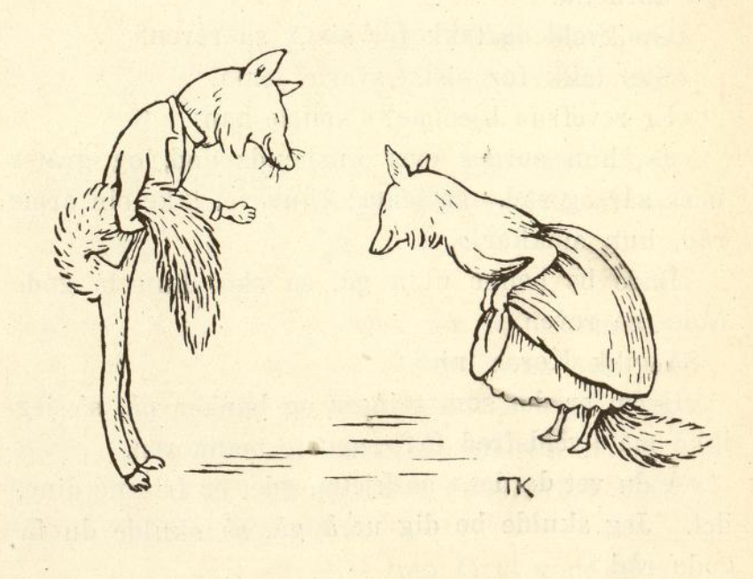

# Reve-enka.

Det var engang en rev og en revefrue, som bodde langt inne i skogen i revehuset. De var venner og vel forlikt, og levde så godt ihop, som parfolk kan gjøre. Men så var det en dag reven hadde vært i hønsehuset til bonden, og der åt han rubb og stubb, og det var vel mye for ham. Så blev han syk og døde; og alt det revemor sørget og gråt, så hjalp det ikke, han var død og blev død.

Men da han var kommet godt i jorden, og gravølet vel var over, så tok det på å komme friere til enka. Om lørdagskvelden banket det tre slag i døren til revehuset. «Å gå ut, du Korse, og se hva det er,» sa reve-enka; hun hadde ei kjette til tjenestjente, og hun hette Korse. Da jenta kom ut, så stod det en bjørn på tråkka.

«Godkveld,» hilste bjørnen.

«Godkveld igjen,» sa Korse.

«Er reveenka hjemme i kveld?» spurte han.

«Hun sitter inne,» svarte jenta.

«Hva tar hun seg til i kveld,
låter hun ille eller vel?»
spurte bjørnen.

«Hun sørger over husbonds død
og gråter nesa sår og rød —
hun vet ikke sin arme råd hun,» sa kjetta.

«Be henne ut å gå,
skal hun få et godt råd!»
sa bjørnen.

Da kjetta kom inn, spurte matmoren:

«Hvem er det som tasser og banker på,
så jeg ikke må kveldsfred få?»

«Det er frierne dine,» svarte kjetta; «jeg skulde be deg ut å gå, skulde du få et godt råd.»

«Hva lett har kufta?» spurte revefruen.

«Ven vakker brun,» sa jenta; «svær kar og kvast syn,» sa hun.

«La'n gå, la'n gå!
Jeg trenger ikke hans råd.»

Korse gikk bort og gløttet på døren og sa:

«Hun ber deg hjematt gå,
hun vil ikke ha noe råd.»

Ja, så var det ikke annet for, bamsen måtte snu og fare sin vei, dit han kom fra.

Næste lørdagskvelden banket det på igjen. Den gangen stod en ulv utenfor.

«Godkveld,» sa ulven, «er reveenka hjemme?»

Jo, hun var da det.

«Hva gjør hun i kveld, låter hun ille eller vel?» spurte han.

«Å, hun vet ikke sin arme råd,» svarte jenta; «hun gråter nesa sår og rød, hun sørger over husbonds død.»

«Be henne ut å gå, skal hun få et godt råd,» sa gråbeinen.

«Hvem er det som flyer og banker på, så jeg ikke må kveldsfred få?» spurte reveenka.

«Å det er frierer, vet jeg,» sa kjetta. «Jeg skulde be deg ut å gå, skulde du få et godt råd,» sa hun.

Nei, først vilde revefruen vite hva slags lett kufta hadde.

«Ven vakker grå; lang kropp og lite på,» svarte Korse.

«La'n gå, la'n gå, jeg trenger ikke hans råd!» sa enka; og da gråtassen fikk det budet, måtte han gjøre vendereise, han med.

Tredje lørdagskvelden gikk det like ens. Det banket tre slag på døren, og kjetta reiste ut og skulde se efter. Så var det en hare.

«Godkveld,» sa han.

«Godkveld igjen,» svarte hun; «er det fremmedfolk ute og farer, så sent på kvelden?» sa hun.

Ja, det var da det, og så spurte han også, om reveenka var hjemme og hva hun tok seg til.

«Hun gråter nesa sår og rød, hun sørger over husbonds død,» svarte jenta.

«Å be henne ut å gå, skal hun få et godt råd,» sa haren.

«Hvem er det som tripper og banker på, så jeg ikke må kveldsro få?» sa matmoren til Korse.

«Det er nok friere det, mor!» svarte jenta.

Ja, så vilde hun vite hva lett kufta hadde denne gangen.

«Ven vakker hvit, tett vadmel og uten slit,» sa kjetta.

Men det blev ikke bedre, det: «La'n gå, la'n gå, jeg trenger ikke hans råd,» svarte reveenka.

Så var det den fjerde lørdagskvelden. Best det var, kom det tre slag i døren til revehuset igjen.

«Gå ut og se hva som er på ferde du,» sa enka til tjenestjenta. Da kjetta kom ut, stod det en rev på dørhella.

«Godkveld og takk for sist,» sa reven.

«Sjøl takk for sist,» svarte jenta.

«Er revefrua hjemme?» spurte han.

«Ja, hun sørger over husbonds død, og gråter nesa sår og rød,» sa jenta; «hun vet ikke sin arme råd, hun stakkar!»

«Bare be henne ut å gå, så skal hun få gode råd,» sa reven.

Så gikk Korse inn.

«Hvem er det som svinser og banker på, så jeg ikke må kveldsfred få?» spurte matmoren.

«A du vet da det,» sa kjetta, «det er frierne dine, det. Jeg skulde be deg ut å gå, så skulde du få gode råd.»

«Hva lett har kufta?» spurte reveenka.

«Ven vakker rød, — just som hans, er død,» svarte kjetta.

«Kjære, be ham inn å sjå, han har gode råd!» sa enka.

«Send meg hit mine sokker små, jeg vil gjerne med ham gå; send meg hit mine sko å knappe, jeg vil gjerne med ham lakke.»

Han vilde hun ha, og så blev det bedt lag og bryllup hos reveenka med det samme. Og dersom han ikke har vært i hønsegården, han også, så lever de i revehuset den dag idag.

