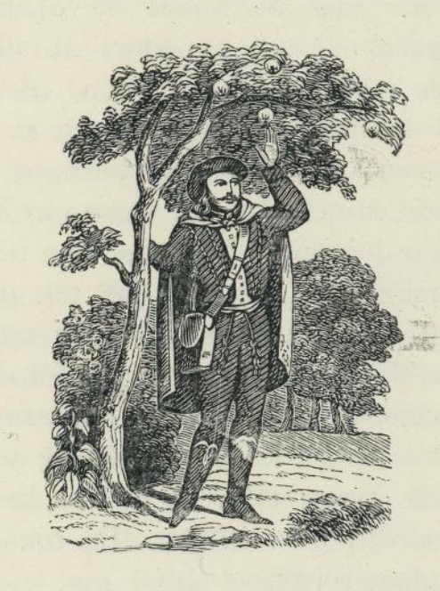

# De forvandlede barn

Det var engang en konge. En kveld kjente han slik en vidunderlig deilig eplelukt at han sa til tjeneren sin: «Skaff meg øyeblikkelig noen av de eplene som det lukter så godt av, ellers blir du hengt, og det før du får sukk for deg.» Tjeneren satte seg straks på en hest og red gjennom syv land og enda flere, ettersom eplelukten drev ham. Endelig kom han til den hagen hvor de deilige eplene vokste. Der bandt han hesten sin og sprang over gjerdet. Men han hadde ikke plukket et par engang, før der kom en gammel stygg mann som tok ham og ville binde ham. Tjeneren sa han bare ville ha et par epler til kongen, for ellers ble han hengt. Da sa den gamle mannen: «Kom og bli med meg inn til den gamle konen. Jeg vil først spørre henne om jeg skal gi deg et par eller ei.» De gikk da inn. Tjeneren ble stående ute i svalen; men mannen gikk inn og fortalte alt sammen til konen, og hun skjente så det var ikke måte med det. Mannen hadde tre døtre. Den eldste sa: «Far, hvorfor kan du ikke gi ham et par epler? Kanskje kongen ville ta meg til kone. Hvis han ville det, så skulle jeg veve et telt til ham av en snelle hampegarn, og det skulle være så stort at alle soldatene hans fikk plass under det.» Den mellomste datteren sa: «Dersom han tok meg, skulle jeg bake en kake til ham av et hvetekorn. Den skulle alle soldatene hans kunne spise seg mette av.» Den yngste sa: «Og tok han meg, skulle han få et par deilige tvillinger med gullhår, og den ene skulle ha en stjerne på hodet og den andre en sol, og begge to skulle de ha en gullring om armen.» Alt dette hørte tjeneren, og han skrev det opp alt sammen. Den gamle mannen ga ham et par epler og sendte ham avgårde igjen. Tjeneren satte seg straks på hesten og red hjem. Da han kom hjem, ga han kongen eplene. Han spiste dem ikke, han bare bet i dem, og med det samme lo han høyt. Da han hadde gjort det, stakk han dem i lommen, og så gikk han på jakt. På veien luktet det så deilig av eplene at han ikke kunne la være å bite i dem, og så måtte han le igjen. Nå syntes tjeneren det var best han viste kongen det han hadde skrevet opp mens han stod ute i svalen. Kongen leste det med én gang, og lot på øyeblikket hestene spenne for vognen sin og reiste til den gamle mannen. Da han var kommet frem, sa han til den eldste datteren: «Er det sant at du har sagt du kunne veve et telt av en snelle hampegarn, og det så stort at alle mennene mine fikk plass i det?» «Ja,» sa hun, «det er sant.» Så sa han til den andre: «Er det sant at du har sagt du kunne bake en kake av et hvetekorn, og det så stor at alle mennene mine kunne bli mette av den?» «Ja,» sa hun, «det har jeg sagt.» Til slutt sa han til den tredje: «Har du virkelig sagt at hvis jeg tok deg til kone, skulle jeg få et par deilige tvillinger med gullhår, og den ene skulle ha en stjerne på hodet og den andre en sol og begge to en gullring om armen?» «Ja,» svarte hun. Da kysset kongen henne og tok henne til kone. Men ikke lenge etter at de var kommet hjem, måtte kongen dra ut i krigen. De tok avskjed med hverandre, og han reiste.

Ved kongens hof var der en gammel kone som også hadde en datter, og hun ville gjerne at kongen skulle tatt henne til kone. Nå innbilte hun dronningen at det var skikk og bruk at dronningene der skulle legge seg på loftet når de skulle ha et barn. Så bar de dronningen opp på loftet, og der fikk hun tvillinger med gullhår. Den gamle konen tok begge barna og drepte dem og begravde dem på hver sin side av slottporten. Men i sengen til dronningen la hun et par hundehvalper, som en gammel jakthund nede i stalden hadde fått. Så skrev hun til kongen at dronningen hadde fått et par hundehvalper. Kongen reiste hjem i en fart, og han var så sint at han både skjente på henne og slo henne; men dronningen ba så pent for seg at han holdt opp. En dag stod hun i porten hvor begge sønnene hennes lå begravet. Så sukket hun dypt av hjertens grunn, og med det samme ble hun til en saltstøtte. Nå ble datteren til den gamle konen dronning, og med henne fikk kongen også to barn.

En gang da kongen stod og så ut av vinduet, fikk han se at der stod to gullpæretrær i porten. Han undret seg svært over det; men ingen kunne si ham hvor de var kommet fra. Men med det samme den gamle konen så dem, visste hun at det var tvillingene med gullhåret. Trærne vokste og ble så høye at en kunne se dem fra naboriket, og nå tenkte hun bare på hvordan hun skulle få hugget dem ned. Så skulle datteren late som hun var syk og si til kongen at hun ikke kunne bli frisk igjen hvis hun ikke fikk ligge i en seng som var laget av de pæretrærne. Da kongen skjønte at konen hans var dødssyk, spurte han hva det var som feilte henne; men hun kunne ikke svare. Mens kongen stod og så på henne, fór hun opp og sa: «Nå drømte jeg at hvis du lot de to gullpæretrærne hugge ned, og du laget en seng av dem, og lot meg ligge i den, så kanskje jeg ble frisk.» Kongen svarte: «Nei, det gjør jeg ikke for alt i verden. Jeg er altfor glad i de to trærne.» Den neste dagen gikk kongen på jakt. Han var ikke før ute av gården før den gamle konen hugget ned det ene treet, gjorde en seng av det, og lot datteren legge seg i den. Da ble kongen meget bedrøvet, og i sin store sorg lot han også det andre pæretreet hugge ned, og av det gjorde han en seng til seg selv. Om kvelden la de seg og sov rolig til i grålysmigen om morgenen. Da begynte den sengen som dronningen lå i med én gang å snakke og sa til den andre sengen: «Hvordan har du det, kjære bror?» Den andre svarte: «Jeg har det godt, det er akkurat som jeg nettopp var kommet til verden.» Det var fordi hans far sov i sengen. Men så spurte den andre: «Hvordan har du det?» Den sengen som dronningen lå i svarte: «Å, jeg har det dårlig. Hvis jeg enda lenger skal bære på datteren til den som har drept meg, holder jeg ikke ut.» Den gamle sov ikke og hørte alt hva de sa. Så snart kongen var gått på jakt, hugget hun sengene opp i småpinder og kastet dem på varmen. Det spraket dyktig, og en glo fór ut av ovnen og ut på gården. Der kom en gammel geit og slukte den. En stund etter kom den inn på kjøkkenet, og der fikk den et par unger med gullragg. Kongen ble så glad i disse to smådyrene at han måtte ha dem i en stue ved siden av sin egen. Men den gamle konen hadde ikke ro på seg. Aldri så snart var kongen dratt på jakt, så gikk hun inn i stuen og slo i hjel begge geitekidene med gullragget. Nå var der to piker som skulle skylle innvoldene i den bekken som rant gjennom hagen, og de la ikke merke til at der ble liggende igjen et stykke. Det fant en gammel kråke. Hun tok det i nebbet og fløy med det til den syv og syttiende ø langt ute i verdens havet. Der gjorde den seg et rede og la to gullegg i det. Da eggene sprakk, ble den vel forundret; for der lå to barn med gullhår i dem. Den ene hadde en stjerne på hodet, den andre en sol, og begge to hadde en gullring om armen. Kråken lot dem gå på skolen i syv år hos en gammel mann der på øya. Da de syv årene var forbi, sa kråken til guttene: «Nå kan ikke jeg fø dere lenger, gå nå til far deres; han er en stor konge. Der får dere det bedre enn hos meg.» Hun fortalte nå hvordan alt var gått for seg, så fløy hun foran og småguttene etter til de kom til farens slott. Kråken sa hvordan de skulle bære seg ad, og så fløy hun hjem igjen.

Begge guttene gikk nå til kongen. Han spurte dem hva de ville, og de fortalte ham alt hva kråken hadde sagt, at den gamle konen hadde gravd dem ned, og at de var vokset opp som to pæretrær. De gikk og så ut i porten og snakket med saltstøtten, og den svarte på alt det kongen spurte om. Da ble kongen så sint at han lot den gamle konen binde fast til halen av en vill hest, som fór avsted og slerpte henne med seg til hun døde. Men begge sønnene fikk det både godt og vel hos ham og levde i glede og lykke, og er de ikke døde, så gjør de vel det enda.
