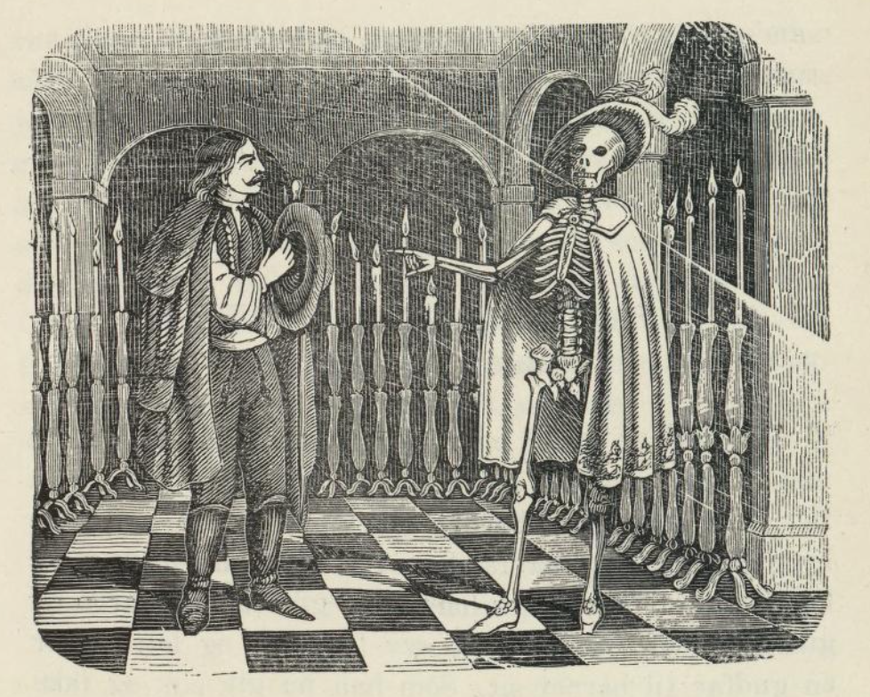

# Fattigmanden og døden

_(Maygarisk eventyr)_

Der var en gang en fattig mann. Han hadde så mange barn som det er hull i et soll, ja kanskje enda flere. Da det siste barnet ble født, visste han ikke hvor han skulle få faddere fra; for alle mennesker hadde vært fadder hos ham. Så gikk han avgårde og gikk gjennom syv land, og syv land til, og lette etter en gudfar til barnet sitt. Som han nå gikk slik og ikke hadde noen ro på seg, møtte han Vorherre, og han spurte: «Hvor skal du hen, stakkars mann?» «Jeg leter etter en gudfar til barnet mitt,» svarte han. «Ja, da behøver du ikke lete lenger,» sa Vorherre, «jeg vil være gudfar til det.» «Hvem er du da?» sa mannen. «Jeg er Vorherre.» «Nei,» sa mannen, «deg er jeg ikke tjent med, det må være et godt menneske du skal bli glad i.» Så gikk han videre avsted, og så møtte han døden. Døden sa: «Hvor skal du hen, stakkars mann?» «Jeg leter etter en gudfar til gutten min,» sa han. «Ja, da behøver du ikke lete lenge; for jeg vil stå fadder til gutten din,» sa døden. «Hvem er du da?» spurte mannen. «Jeg er døden.» «Ja, det er godt,» sa mannen, «deg vil jeg ha til fadder; for du gjør ikke forskjell på gode og onde mennesker.» «Kom og bli med meg hjem litt først,» sa døden. «Jeg vil bare hjem og ta på meg statsklærne, ellers kjenner alle folk meg.»

Fattigmannen gikk med døden; men da han kom inn i huset, ble han rent redd; for det brente slik en mengde store og små lys der. «Hva er alle de der for noen lys?» spurte han. «Det er livslys,» sa døden, «hvert menneske har sitt lys, og ingen kan leve lenger enn lyset brenner.» «Å var så snill å vis meg mitt, da!» sa fattigmannen. Døden viste ham et som var nesten nedbrent, så det bare var en liten stubb igjen. «Å kjære deg gudfar,» sa fattigmannen, «sett en liten stubb til på lyset mitt, ellers brenner det jo ut straks.» «Nei, det tør jeg ikke for Oppstandelsen,» sa døden, «hvis jeg gjør lysene lenger, så finner den ingen å vekke opp, og da blir den sint.» Men fattigmannen ba og takket så lenge til døden satte en liten stubb på lyset hans. Så gikk døden hjem med mannen og han holdt en barnedåp og et gjestebud så gildt så døden ble så lystig og glad at han ga mannen makt til å gjøre alle syke friske igjen, selv om de lå på det siste. Han skulle bare røre ved sengen; men han måtte ikke si verken Fader vår eller Amen; gjorde han det, måtte han dø selv på timen. Fattigmannen ble snart navngjeten for den store makt han hadde; han ble hentet både til konger og storfolk for å gjøre dem friske, så han ble rik også.

Da døden sa farvel til mannen, sa han at han endelig måtte komme og besøke ham. Nå var det gått et par år; men enda hadde han ikke vært hos døden. Så tenkte han han riktig skulle gjøre det en gang og spente de prektige grå hestene for glassvognen — for nå var han storkar — og så kjørte han så fort han kunne til døden. Da han var like ved huset, møtte han et lite barn som gikk på gata og gråt. Han tok det inn i vognen til seg og spurte hvorfor det gråt så. «Å,» sa barnet, «det var et ord i bønnen jeg ikke kunne komme på, og så slo far meg, og derfor gråter jeg.» «Hva var det for et ord da?» spurte mannen, «var det Fader vår?» «Nei, det var det ikke,» sa barnet. Mannen leste hele Fader vår; men ordet fant han ikke. Til slutt sa han: «Kanskje det var Amen?» «Ja, det var det,» sa døden; for det var ham som var barnet. Så var mannen død med det samme; men sønnene delte den store rikdommen som var etter ham, og er de ikke døde, så lever de enda.
