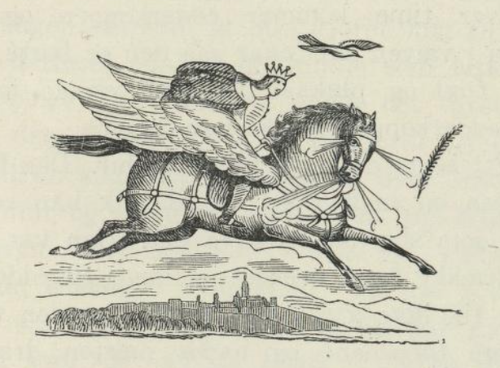
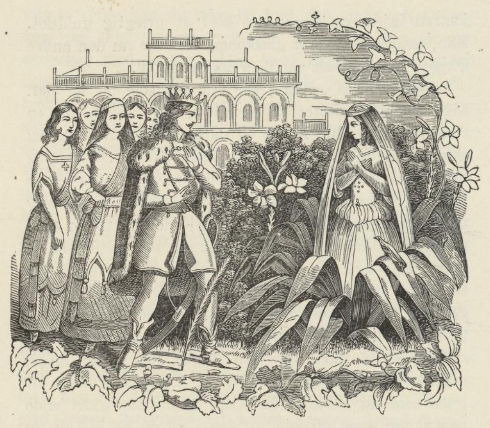

# Liljejomfruen

Det var en gang en konge som var så snill og god at alle folk i landet, både høye og lave, elsket ham, og de kunne gjerne ha gitt sitt liv for ham. Han hadde ingen kone, og folkene hans ba ham endelig å gifte seg, så de kunne få en like så god konge som ham selv etter ham. Kongen tenkte svært på hvordan han skulle få tak i en kone som riktig passet for ham.

Han hadde en gammel venn, som han var svært glad i. Ham spurte han gjerne til råds når det var noe på ferde. Han var jeger i kongens skog, og han kunne ha hatt det meget gildere; for kongen hadde gjerne delt alt med ham; men han trengte ikke noe, derfor levde han i en hytte ute i skogen som andre fattige folk. Da nå kongen hørte hva hans folk ønsket, gikk han til den gamle jegeren og ba ham om et råd. Han ga ham en rosmarinkvist og sa: «Den som kvisten bøyer seg for, hun er bestemt for deg.»

Nå befalte kongen at alle jomfruer skulle komme opp på slottet, så mange som kunne komme inn, og ved siden av hver jomfru skulle det stå en soldat og legge navnet hennes i perler på et bord. Perlene skulle den få som kvisten bøyde seg for; men hvis den ikke bøyde seg for noen, skulle hver jomfru få de perlene navnet hennes var lagt med. Da de nå allesammen satt på rad, kom kongen med rosmarinkvisten i hånden. Så gikk han forbi alle jomfruene, fra den første til den siste; men den bøyde seg ikke for noen av dem. Den neste dagen ble det sendt bud etter andre jomfruer, og den ene var deiligere enn den andre; men rosmarinkvisten bøyde seg ikke for noen. «Hva skal jeg nå gjøre,» tenkte han. «Hvor skal jeg få meg en kone fra?»

Mens han lå og tenkte på dette om natten, hørte han noe komme smuttende inn gjennom vinduet, sette seg på rosmarinkvisten og begynne å snakke ganske lavt med den. Det var en liten gullfugl, og den sa: «Jeg ville så gjerne gjøre kongen noe godt igjen; for han har frelst meg fra falkekloen to ganger. Jeg kan vise ham den jomfruen du bøyer deg for; hun er i trollhaven, og derfor kommer jeg for å si deg at du skal gi deg på veien med kongen i morgen. Jeg skal fly over dere, så dere kan bare se etter meg.»

Kongen hørte alt sammen; for han sov slett ikke, så tankefull var han. Aldri så snart ble det morgen, så la han i vei. Rosmarinen fór foran, og gullfuglen fløy over dem.

Som de nå reiste slik alle tre, møtte de en halt trollhest, som stønnet og bar seg så ille. «Hva feiler det deg, siden du bærer deg slik?» spurte kongen. «Å, jeg har fått en pil i den venstre siden,» svarte hesten, «og den har jeg gått med et helt år nå, og ikke finner jeg et eneste menneske som vil dra den ut for meg. Det er en gammel trollkjerring som har skutt meg for å gjøre min herre vondt.» «Jeg skal trekke den ut for deg, jeg,» sa kongen, han grep fatt i sølvpilen og trakk den ut av den venstre bogen på hesten. Med det samme reiste hesten seg på bakbenene og ble til den deiligste hingst kongen hadde sett i sitt liv. «Takk fordi du var så snill mot meg,» sa hesten, «jeg vet nok hvem det er du leter etter. Hun er langt borte herfra. Men nå kan du sette deg på ryggen min, så skal jeg føre deg dit hvor du kan finne henne.» Kongen steg opp på hesten, og den fløy avsted gjennom luften med ham som et lyn. Rosmarinkvisten fór foran, og den lille gullfuglen fløy over dem.

De fløy lenge over berg og dal; til slutt kom de til et glassslott. Der hørte de at det var noen som skrek og tutet så det var ikke måte på det. «Ham må vi frelse, hvem det så er,» sa kongen og gikk inn i slottet. Og hva fikk han se der? En stor glassmann så han, og rundt omkring i magen hans surret og surret en humle, og den ville bryte ham i stykker. «Hvem er du, og hva vil du?» spurte glassmannen. «Jeg er en fremmed konge, og jeg skal til trollslottet og finne meg en kone; men hvem er du?» sa kongen. «Jeg er kongen i slottet her.» «Men hva er det som feiler deg, og hvorfor bærer du deg så ille?» spurte den fremmede kongen. «Å, denne humlen vil bryte i stykker magen på meg.» «Men kan du ikke bli kvitt den, da?» «Nei, det kan jeg ikke, så lenge moren lever, og hun er en edderkop med to klør. Den lever evig; for det biter ikke stål på den. En gang hadde jeg riktignok en trollhest som kunne makte henne; men den har hun skutt i hjel,» svarte glasskongen. «Kunne ikke jeg få se den rare edderkoppen?» sa kongen. «Jo, du kan straks få se den. Se bort i glasssofaen der. Der sitter den stakkars konen min. Hun er kledd i bare rosenklær. Hver time kommer edderkoppen og spinner henne inn i veven sin; når så den er borte, kommer en liten fugl og plukker i stykker veven igjen. Nå kommer edderkoppen straks på timen.»

Med ett hørte de en forferdelig dur. Den fremmede kongen så opp imot taket, og da fikk han se en fæl edderkop som slapp seg ned fra det. Han var ikke sen med å trekke frem sverdet og hogg til edderkoppen; men han fikk ikke gjort den noe; for den tok igjen med begge forbenene og hadde nesten drept ham. Da kom trollhesten fykende inn i glasssalen, så glasstrinene brast under den, og så fór den like på edderkoppen. Da humlen så at moren var i fare, ville den fly ut av glasskongen og hjelpe henne. Trollhesten skjønte hva den ville og ropte til glasskongen at han måtte lukke munnen godt igjen og ikke slippe ut humlen; men kongen kunne ikke, så gjerne han ville; han måtte slippe ut humlen. Da sparket trollhesten slik med begge forbenene at han drepte både edderkoppen og humlen på en gang. Med det samme ble glasskongen til en stor staut mann, hvis make ikke fantes her i verden, og glassdronningen ble en vakker kone med rosenklær. Den lille gullfuglen ble til en deilig jomfru igjen, og glassslottet ble et prektig gullslott.

Han som hadde vært glasskonge, fortalte nå den andre kongen hvordan alt sammen var gått til. «Slottet her,» sa han, «er mitt slik som du ser det. Like nedenfor slottet er en hytte. Der bodde det en trollkjerring. Hun hadde en datter som hun ville jeg skulle gifte meg med; men jeg ville ikke ha henne. Jeg tok en fra trollslottet, det er henne du ser her, og henne ville jeg ikke bytte bort for alt i verden. Derfor ble trollkjerringen så sint at hun gjorde meg til en glassmann og datteren sin til en humle som alltid skulle gnage og plage meg i magen. Hadde det vart en uke til, hadde den gnaget seg ut. Selv gjorde trollkjerringen seg til en edderkop som spant over rosenklærne til konen min, og stuepiken ble til en fugl som rev itu spindelveven. Men før hun kunne få riktig makt, måtte hun ødelegge trollhesten. Du har trukket ut pilen som satt i bogen på den, og du har gjort ende på all vår sorg. Si meg nå, hva vil du ha for alt du har gjort for oss?» «Ingenting,» sa kongen, «bare si meg om det er langt herfra og til trollslottet. Dit skal jeg og hente meg en kone.» «Nei,» sa den andre kongen, «det er ikke langt dit, trollhesten fører deg dit i et øyeblikk.»

Så satte han seg på ryggen av trollhesten, og om en halv time var han der. Rosmarinen fór foran, og gullfuglen fløy over dem. Da de kom dit, var hele trollslottet i sorg. «Hvorfor sørger dere så?» spurte kongen. De svarte: «Den deiligste jomfruen her, vår dronnings søster, har sørget slik over glassdronningen at hun er blitt til en hvit lilje, derfor sørger vi.» Kongen ba dem om å få se den hvite liljen. Ja, det skulle han få lov til. Rosmarinen fór foran ham, den hadde slikt hastverk, og da den kom til den hvite liljen, ble den stående og bukket til jorden, og gullfuglen satte seg på bladene. Da ristet den hvite liljen seg og ble en jomfru så deilig at der ikke fantes hennes make i syv land. Kongen spurte henne om hun ville være dronningen hans. Det ville hun, og de skulle være hverandre tro til døden, sa de. På hjemveien så de innom slottet hvor søsteren bodde; men så stanset de ikke før de kom hjem. Der ble de tatt imot med stor stas og prakt. De holdt et stort bryllup, og er de ikke døde, så lever de enda.
