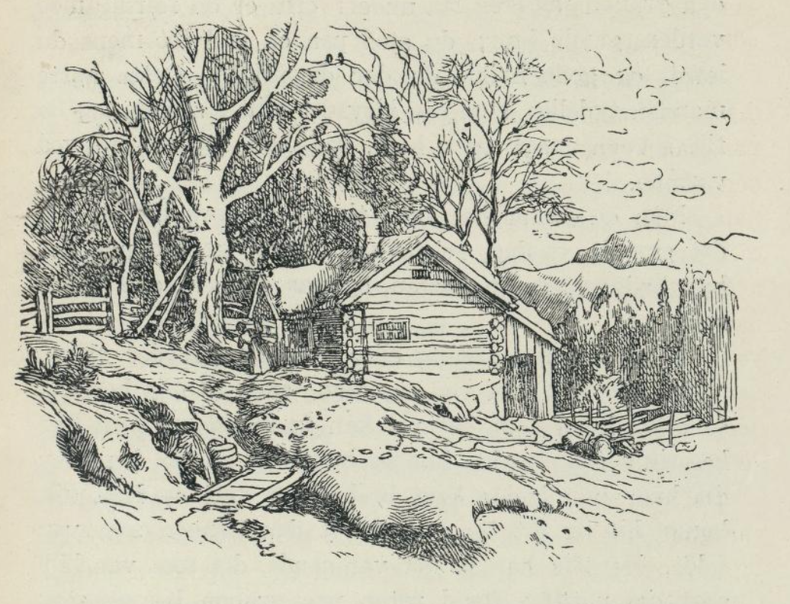
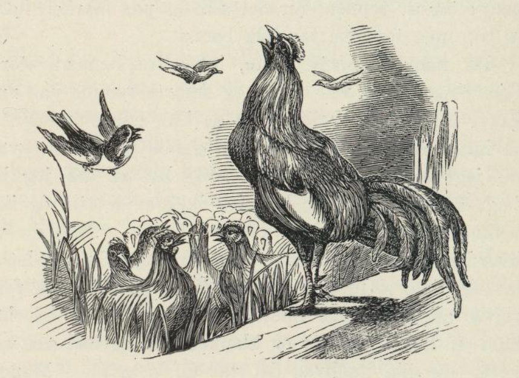

# Mannen som skjønte alleslags språk

Det var en gang en jeger. Han gikk til skogs og jaget hele dagen med de to hundene sine. Mens han jaget, var han kommet så langt bort at det tok til å mørkne før han kunne komme på hjemveien; derfor syntes han det var bedre å ligge i skogen om natten og gå hjemover når det tok til å lysne av dag. Så gjorde han opp varme ved foten av en høy gran og la seg til ro ved roten av den. Der var det både lunt og godt, og det varte ikke lenge før søvnen kom på ham; men rett som han skulle til å blunde, var det noen som snakket til ham. Oppe i treet som mannen hadde gjort varme under, var det en stor orm, og den streved nå med å komme ned av treet, og den ba mannen hjelpe seg, den var redd for varmen og turte ikke gi seg ned på marken alene. Jegeren syntes nok det var artig at en orm kunne snakke som et menneske; men han svarte allikevel og sa: «Jeg kan ikke slippe deg ned av grana; for du kunne spise meg opp.» «Nei, nei, jeg skal ikke ete deg, min kjære venn,» sa ormen og ba nokså vakkert; «men hvis du vil hjelpe meg ned, så skal jeg lære deg alle språk, fuglenes, trærnes og alle dyrenes tungemål.»

«Nå, hvorledes skal jeg bære meg ad med å hjelpe deg?» sa mannen. «Hogg ned en gran mot den jeg er på, så kryper jeg ned etter den,» sa ormen. — Mannen syntes det var god lønn ormen lovet, og så sa han han skulle gjøre det. Så hogg han ned et stort tre mot grana og frelste ormen. Da ormen var kommet ned på marken, forklarte den mannen all verdens språk, både fuglenes, dyrenes og plantenes og alle som til var. Men det sa den at han ikke måtte snakke om det til noe menneske; han måtte ikke si et ord om det til konen sin engang. Gjorde han det, måtte han dø på timen.

Da mannen hadde lært alle språkene, og ormen vel var gått sin vei, gikk han bort til varmen og ville roe seg. Men rett som det var, hørte han det snakket igjen. Hundene hadde lagt seg på vakt ved benene hans, og den ene snudde seg til den andre og sa: «Bli her hos husbond, du, og våk over ham, og det både godt og vel, ellers kommer ulvene og spiser ham opp mat. Jeg må gå hjem og passe huset; for ellers kommer tyvene dit, hvis de ikke hører hundebjegg.»

«Ja, gå du,» sa den andre, «bare gå du og pass gården; jeg skal nok bli her og våke over husbond.» Mannen forstod godt hva hundene sa; for han hadde jo lært alle språk. Så tenkte han ved seg selv: «Dere har nok mer forstand enn noen tror.» Så lot han den ene hunden gå hjem og passe gården, som den ville. Så snudde han seg over på det andre øret for å få sove, trett som han var. Øynene hans begynte å falle sammen, og nå tenkte han: «Nå får du en blund,» og det skulle han også ha fått; det var ingen ting i veien for det; men ørene hans var blitt så finhørte i skolen hos ormen at hver lyd nådde dem. Det begynte å mumle så artig i skogen, og han kunne tydelig skjelne at en gran suste i vinden, og sa til den grana han lå ved roten av: «Å, søskendbarnet mitt, kom hit til meg, jeg dør snart. Kom og vis meg den siste ære.» — «Jeg kan ikke, du må tilgi meg det,» svarte den andre; «men jeg har en som ligger natten over ved roten min.» «Kom nå, å kom endelig!» ropte grana igjen; men den andre gikk ikke til den allikevel. Men da grana hadde ropt tredje gangen, falt den med et brak så det dundret i hele skogen, og siden var det ikke noe å høre. Da grana var falt, sa den grana jegeren lå under: «Nå er du ferdig med verden, gamle bror; du stod på en god fot mens du levde, og godt hviler du der du falt.» Dette hørte mannen tydelig; men så ble det stille i skogen, og da fikk søvnen makt over ham så han sovnet inn ved varmen.

Men en jeger har ikke tid til å sove lenge. Da det grydde av dag, reiste han seg og tenkte på det han hadde hørt om natten, og på det granene hadde sagt. «Skal tro jeg drømte eller hvordan har det vært mon?» tenkte han ved seg selv; «jeg vil gå bort og se etter hva godt det vel kan være den grana har hos seg.» Slik tenkte han og begynte å gå bortover dit hvor han hadde hørt braket om natten. Han gikk lenge hit og dit før han fant den grana som var falt. Her fikk han se det var sant, det som var blitt sagt om natten; for i roten på grana lå en stor skatt, og under toppen lå en svart rev så gild at det skinte av den. Mannen tok både skatten og reven og gikk hjem med, og nå ble han en rik mann. — «Nå har jeg nok å leve av,» tenkte han, «nå kunne en kjerring ikke være av veien.» Han hadde lyst til å gifte seg, og han tok en jente som var så pen og vakker at der ikke fantes hennes make. De levde både godt og vel sammen; det manglet dem ingenting, og de hadde overflod av alt. Det eneste var at tiden begynte å bli nokså lang for mannen; for han hadde ikke det Guds skapte grand å gjøre; han satt bare med hendene overkors som den rike mann. Så hendte det en morgen, som han heller ikke hadde noe å gjøre, at han satte seg ved stuevinduet og ga seg til å glane ned i gården og på været hvor fint og vakkert det var. Vidt og bredt lå åkrene og engene hans og like under vinduene var en prektig linåker. Der fløy småfuglene og flakset og plukket. Blant alle de andre var det en spurv der med ungeflokken sin og ville ete linfrø; men ungene kunne ikke fly noe videre enda og slo seg ned på marken. Moren lærte dem og sa: «Et ikke av det som ligger på marken, mine barn; men et av toppen; for det som er på marken hører oss til; men toppene tar folk bort.»

Da mannen hørte dette, begynte han å storlre. Kjerringen stod ved ovnen og smurte rømme på rugkaker hun skulle bake; men da hun hørte mannen le, sa hun: «Hva ler du av, din gamle gapetrost, synes du jeg ser så artig ut?» «Jeg ler av det jeg ler, jeg,» sa mannen, «deg kan jeg ikke si det til, og ikke kommer det deg ved heller,» sa han. — Men du vet hvordan kvindfolkene er. — De gir seg ikke så lett og lar seg ikke si med én gang. Nå begynte hun først riktig å overhenge mannen sin, og til slutt tok hun ham om halsen, kjælte og klappet ham og ba så vakkert: «Si meg nå hva det var du lo av!» — Mannen kunne ikke si nei lenger og til slutt sa han: «Hent først en ren skjorte og rene klær til meg, så skal jeg si det.» Ja, kjerringen hentet rene klær til mannen, og han byttet, og da han hadde fått på seg, la han seg på benken og strakte seg ut, slik som det er skikk å strekke lik. Nå var der femti høner på gården og én hane, og så sa mannen til kjerringen: «Slipp ut hønene, mor, så jeg får se dem en gang til før vi skilles.» — For mannen ville virkelig si hva det var han hadde ledd av, og han visste at han måtte dø når han hadde sagt det, men konen trodde det var noe han fant på; for han var alltid så full av moro. Hun gjorde som mannen sa og slapp ut alle hønene og tok dem inn i stua. Men du skulle sett happen! Da han slapp ut med hønseflokken i stua, så brystet han seg, sparket omkring og kikk på hønene sine, og så skrek han: «Ky-ke-li-ky! se på meg! Jeg har femti koner, og jeg holder styr på dem alle og husbond har bare én; men enda er han ikke kar for å klare henne engang, og derfor legger den knehøna seg nå til å dø.» — Mannen som forstod alle språk, skjønte godt hva hanen sa, og han skjønte også han holdt på å gjøre noe riktig dumt. «Det kan alltids være tid nok å legge seg til å dø når den tiden kommer,» tenkte han. Og så sprang han opp fra benken på begge benene, og skrek til kjerringen: «Står du der enda, ditt dovne dra! Du skulle jo sette kaker i ovnen! Marsj bort og gjør gagn kjerring, ellers kommer jeg i tottene på deg!» I det samme rakk han neven ut akkurat som han ville ta kjerringen i luggen; men hun smatt fort ut i gården og inn i fjøset, og siden sa ikke mannen et ord om det, og han lever den dag i dag. — Og kjerringen spurte aldri om det som ikke kom henne ved; men hun gjorde alltid hva han sa, og de levde all sin tid både godt og vel og var aldri uvenner.

