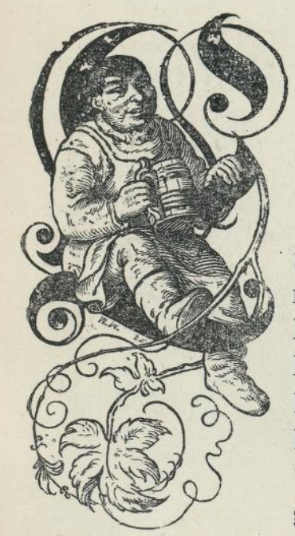

# Sterke Dummas

_(Engelsk eventyr)_

En gang var det en fattig arbeidsmann som het Tom Dummas. Han bodde i Cambridge i England, og han var så sterk at han kunne arbeide for to. Han hadde en eneste sønn, og han hette Tom likesom faren. Nå ville han gjerne at sønnen skulle være flittig og lære noe; men det hadde Tom ingen lyst til, og da faren var død, måtte moren skaffe ham mat og klær, og hun måtte slite og arbeide; for hun var altfor øm mot gutten. Det var ikke greit; for selv ville han ikke gjøre annet enn sitte bak ovnen, og da han var ti år, spiste og drakk han like mye som fire eller fem andre og var over to og en halv alen lang og halvannen alen bred. Når han knytte neven, så den mer ut som en kjøttklubbe enn som en barnehånd, og forøvrig så han også ut som et troll; men det var ingen som visste ennå, hvor sterk han var. Det fikk de først se siden.

En dag sa moren til ham at han skulle gå og hente noe sengehalm som naboen hennes hadde lovet henne. Tom sa at hun først måtte skaffe ham et riktig langt rep; men han ville ikke si hva han skulle med det, og moren, som var glad hun fikk ham til å gå, gav ham et dyktig langt et. Tom tok repet på nakken og gikk til naboen som stod på låven med treskerne, og han bad om å få den halmen han hadde lovet dem. Han kunne ta så meget han kunne bære med seg, sa bonden. Tom tok ham på ordet, og han gjorde seg en bør så stor som et vognlass. Treskerne gjorde narr av ham, fordi han kunne falle på å bære bort slik en haug og spurte om repet han hadde var langt nok. Men Tom tok halmen på nakken og gikk av gårde så lett, som om han ingenting hadde å bære, så at bonden og folkene hans både ble forundret og sinte.

Etter den tid fikk ikke Tom lov til å gå og drive; for nå ville alle folk ha ham til tjenestegutt, og der fortelles mange historier om hvor sterk han var. En gang skulle han få så meget ved han kunne bære. Da tok han et av de største trær i skogen og bar hjem. Han likte også godt allslags moro, og ingen kunne måle seg med ham i å slåss og kaste med hammer. Det var ingen sak for ham å slenge stor hammeren en hel mil bort, og mange slike ting gjorde han, så folk sa om ham at han hadde forskrevet seg til den onde.

Tom Dummas gjaldt nå for å være en riktig uvøren kar, og i hele prestegjeldet var det ikke mange som turde si et vrangt ord til ham, og gjorde de det, fikk de dyrt undgjelde for det; for han var mester over alle kameratene sine. Men fordi han var så sterk, ville alltid de som manglet arbeidsfolk ha tak i ham, og tilslutt var det en brygger som leide ham til å kjøre øl omkring til nabobyene; men han måtte tinge lenge med ham og love ham en hel ny drakt og så meget mat og drikke som han ville ha. Hver dag måtte han kjøre over tre mil med øllet. Midt over myrene gikk der nok en kortere vei; men der turde ingen komme for en rise som bodde der, og den som han fikk fatt på, måtte enten tjene hos ham eller miste livet. Men Tom ble snart kjed av omveien og uten å si et ord om det, foresatte han seg å kjøre over risens grunn; det fikk gå som det ville. Det var jo et vågestykke; men en uvøren kar hadde Tom vært før, og han var blitt enda mer uvøren siden han kom til bryggeren og drakk øl og levde godt; nå var han ikke redd for hva det skulle være. Han lot hestene gå likeframm den korteste veien, og da han kom til grinden som stengte for risens grunn, slo han den opp på vid vegg, som om han riktig ville vise hva han turde gjøre. Da risen fikk se ham, kan en vite han ble sint; men han tenkte ved seg selv, at nå skulle både Tom og øllet bli hans.

«Din slamp!» skrek trollet. «Hvem har gitt deg lov til å kjøre denne veien? Vet du ikke at alle folk er redd for å kjøre her, og så tør du — og lar grinden stå oppe etter deg også! Jeg skal lære deg! Du skal komme til å bøte med livet for det du har gjort! Du ser nok der henger mange tusen hoder omkring på trærne her; men ditt hode skal komme til å henge høyere enn alle de andres!» Men Tom var ikke redd, han svarte: «Se her har du en skurefille; den kan du tørke tårene dine med; for du skal snart få se du aldri har hatt slik kar foran deg før.» Men da ble risen riktig rasende. «Du må være en stor narr,» skrek han, «når du tør komme her og gi deg i kast med meg. Du har jo ikke engang noe å slå fra deg med.»

«Å jo,» svarte Tom. «Jeg har noe her som skal vise deg hva for en skryter du er.»

Nå rente risen inn i hulen sin for å hente en klubbe. Med den ville han slå hodet i stykker på Tom. Tom hadde ikke tenkt på det, at han måtte ha noe å holde risen fra seg med, og nå visste han ikke riktig hva han skulle gjøre. Svepen kunne ikke nytte stort mot et troll som var seks alen langt og tre alen tykt. Det var jo riktignok ikke så meget for et troll; men det var alltid nok til å gjøre en annen mann redd. Men Tom visste snart å hjelpe seg. Han veltet kjærren og trakk ut akselen, den brukte han som en øks, et av hjulene brakk han av og tok det på armen som et skjold, og nå syntes han han var godt rustet.

Da risen kom tilbake med klubben, syntes han det var artige våpen Tom hadde fått fatt på og ropte og skrek til ham at han bare kunne komme, og han slo etter ham med klubben, så Tom hadde nok å gjøre med å verge seg. Endelig så Tom sitt snitt til å gi risen en stjernesmell i hodet, så han var nær ved å stupe. «Ei da,» skrek Tom, «er øllet alt gått i hodet på deg!» Risen ble nå ikke mildere for det, men slo så ofte og så hardt, at Tom hadde nok å gjøre med å verge seg. Men tilslutt ble risen trett; for det gjorde ikke Tom noe alt det han hamret og slo, og med ett spurte han om han ikke kunne få noe å drikke, så kunne de jo slåss siden igjen. «Nei takk,» sa Tom, «slik fantefullhet har ikke mor min lært meg; jeg er ingen tosk.» Og endelig slo han risen overende og hugget hodet av ham, alt det han tigget og bad om nåde. Nå gikk Tom inn i risens hule, og den var full av sølv og gull.

Da det ble kjent at Tom hadde slått ihjel risen, ble der stor glede; for risen hadde vært et skremsel for alle folk, og de visste ikke hvor stor ære de skulle gjøre på Tom som hadde frelst dem for ham.

Nå eide Tom alt det som fantes etter risen, både jord og penger. En del av jorden gav han til de fattige, og selv beholdt han så meget som han og hans gamle mor trengte. Men så mange penger var der, at han kunne bygge seg et prektig hus, holde mange tjenere og innrette en dyrehave. Han bygget også en kirke og kaldte den St. Jakobs kirke; fordi det var på denne helgens navnedag han slo ihjel risen. Etter den dag kaldte ikke folk ham lenger Tom Dummas, men Tom Herremand, så fornem var han blitt.

Men det gikk Tom som det pleier å gå folk, når de brått kommer til stor velstand, han visste ikke hva han skulle gjøre med så mange penger. Han var aldri riktig tilfreds, enda han var på all den morro som fantes i mange kirkesogn, knuste mangen skalle med sin oksepeis, gikk på bjørnejakt og var med på alle de fornøyelser en herremand i den tid kunne ha. I ballspill ville folk nødig ha ham med; for et eneste spark av foten hans fikk ballen til å fly så langt bort over trær og bakker at ingen så den mer.

En aften kom han mellom fire røvere; men de visste nok ikke hva for en kar de tok fatt på. To av dem gjorde han straks kål på, og de to andre måtte gi seg på nåde og unåde, og dessuten måtte de gi fra seg en stor pose med penger som de hadde stjålet i forveien; det var ikke mindre enn tusen daler. Tom var jo riktignok rik nok før; men mor hans syntes det var godt å ta med. Det var lenge før Tom fant noen som kunne måle seg med ham i styrke; men en dag han var ute i skogen, møtte han en lystig knappestøper. Han hadde en stor stokk i hånden, og en sterk hund etter seg som trakk skreppen og verktøyet hans på en liten kjerre. Tom hadde alltid vært nokså frekk, og derfor var han grov nok til å spørre knappestøperen om han drev en ærlig håndtering.

Men knappestøperen var ikke den mann som tålte slikt, og han svarte likeså grovt: «Hva kommer det deg ved? En narr skal ha nesa si i alt.» Så begynte de straks å slåss, de for slik inn på hverandre med hugg og slag, at det hørtes over hele skogen. Det varte lenge, før en kunne vite hvem som skulle vinne; men knappestøperen var så god til å slåss, at Tom tilslutt måtte gi seg. Nå gikk de hjem sammen og var venner og vel forlikte, og det viste seg siden at dette var en stor lykke for Tom.

Der var mange folk rundt omkring i sognet, ti tusen og kanskje fler, som var sinte, fordi de mente de hadde mistet sin frihet og sine gamle rettigheter, og nå samlet de seg og ville ta dem igjen med makt. Nå kom øvrighet og borgere i stor fare, og tilslutt måtte fogden om natten gå til Dummas Herremand, for om dagen turde han ikke våge seg ut, og fortalte ham, hvorledes det hang sammen og bad ham om hjelp. Tom og knappestøperen var straks ferdige, og om morgenen, med det samme solen var stått opp, drog de av sted med klubbene på nakken. Fogden viste dem veien, og så snart de var kommet dit, hvor de som gjorde opstand var, gikk Tom og knappestøperen mot dem som var styrere for det hele og spurte dem hva de klaget over, og hva de ville. Nå skrek de i munnen på hverandre: «Vi vil ha vår egen vilje, ingen skal ha noe å si over oss!» «Ja, når så er,» sa Tom, «så skal dere få smake klubben.» Og dermed for han og hans kamerat inn på dem med klubbene, drev hele mengden foran seg og slo slik til, at tyve eller tredve falt for hvert slag. Knappestøperen slo en lang fant over nakken, så hodet fløy tyve alen, og slo til en annen så han lå død på flekken. Tom var likeså flink. Da han hadde drept mange hundre og slått klubben i stykker, tok han en lang mager møller i benene og slo om seg med ham, til der ikke var en eneste mann igjen på plassen.

Da kongen fikk høre det som var hendt, måtte begge de to kameratene komme opp på slottet. Det ble gjort stort gjestebud til ære for dem, og de satt til bords med kongen og alle de fornemste herremenn i riket. Kongen drakk deres skål og takket dem; fordi de hadde skaffet ro og orden i riket. Til lønn skulle Tom bli ridder, og knappestøperen skulle få hundre daler om året så lenge han levde. Da gjestebudet var over, gikk Tom og knappestøperen hjem, og hofffolkene fulgte dem et langt stykke på veien. Mens Tom hadde vært borte, var hans mor død, og nå syntes han det var så rart å være alene i det store tomme huset. Han tenkte derfor på om det ikke var best å få seg en kone, og da han hørte snakke om en ung, rik enke som bodde ikke langt fra Cambridge, reiste han straks bort og fridde til henne.

Første gang han var der, var hun nokså mild; men da han kom igjen, var det en gildere frier som lå på knærne for henne, og som det lot til hun syntes bedre om. Den unge fyren var riktig grov mot Tom og kaldte ham en bryggesjåer, som ikke kunne oppføre seg i dameselskap. Men Tom lot ikke slikt gå. Han tok fyren med seg ut på kirkegården, og der gav han ham et spark, så han for over kirketårnet og ned i en dam, hvor han sikkert var blitt, hvis ikke en stakkar som kom gående, hadde fisket ham opp med krokkjeppen sin.

Frieren tenkte nå på hvorledes han kunne hevne seg på Tom. Han tinget to slagsbrødre til å legge seg på lur etter ham og overfalle ham; men Tom klinket dem sammen og knuste dem som et par kålhoder. Da han gikk til kirken med bruden, ble han overfalt av 21 røvere; men en av brudefølget lånte ham en sabel, og den brukte han så godt, at der fløy en arm eller et ben av for hvert hugg; for han ville ikke drepe noen på en slik dag. Både bruden og følget syntes det var godt gjort og roste ham meget. Riktig nok hadde han selv fått et sår; men han trøstet seg med at hver dråpe blod var betalt med et lem.

Bryllupet gikk nå for seg i ro og fred, og til ære for sin salige mor, gjorde Tom et stort gjestebud for alle de enker som fantes i sognet. Det varte i fire dager til minne om at han fire ganger i den siste tid hadde stått seg tappert.

I dette gjestebudet hendte det at et sølvbeger ble stjålet; men det ble funnet igjen hos en gammel kjærring som hette Slampampe. De andre ble så sinte på henne, at de øyeblikkelig ville ha henne hengt; men Tom lot henne straffe på en annen måte. Hun ble kjørt på en trillebår gjennom alle byens gater med en stor plakat i hånden, og på den stod der: «Her er den stygge Slampampe som stjal sølvbegeret.»

Kongen fikk snart høre om Toms giftemål, og da han ikke hadde glemt den store tjeneste Tom hadde gjort ham, ble både han og kona hans budt til hoffet, og meget nådig mottatt. Mens de var der, kom der bud om en stor ulykke som var kommet over grevskapet Kent. En fæl rise som red på en drage, og som hadde en hel mengde bjørner og løver i følge med seg, var kommet i land der og holdt et forferdelig hus. Kongen var nesten vettskrømt, og det kunne være rimelig nok; men han hjalp seg på den måten, at han gjorde Tom til statholder, så han måtte verge dem alle sammen.

Midt i landet stod et høyt slott; derfra kunne en se mange mil til alle kanter, og der bodde statholderen. Det varte ikke lenge før Tom fikk se risen; han red på en drage, hadde jernklubbe på nakken og midt i pannen et øye som lyste som ild, et ansikt hadde han så bistert og ildrødt at det var fælt å se på, håret hang om hodet hans som lange slanger, og skjegget så ut som rusten jerntråd. Tom syntes risen var fæl å se på da han kom flyvende på dragen. Han stirret en stund på slottet med det ene øyet sitt, derpå bandt han dragen til et tre, og så rente han mot murene, som om han ville kaste dem overende med én gang. Men hvorledes det gikk til eller ikke, så gled han og falt overende og kunne ikke hjelpe seg opp igjen, og nå var Tom straks ferdig med sverdet sitt, hugget hodet av risen med ett hugg og av dragen med fire hugg, lesset dem så på en vogn og sendte dem til kongen.

Så snart knappestøperen fikk høre hva for en stor og ny ære Tom igjen hadde høstet, fikk han også lyst til å være med og skyndte seg opp på slottet til ham. Tom fortalte ham at nå tenkte han på å gjøre ende på alle de ville dyr som ødela landet, og så gikk de av sted begge to, Tom med sitt sverd og knappestøperen med sitt lange spyd.

Da de hadde gått noen timer, hadde de lykken med seg og traff hele flokken, og det var ikke mindre enn fjorten ville beist, seks bjørner og åtte løver. Tom og knappestøperen stilte seg med ryggen mot et tre, og da dyrene var nær nok, hugget de hodene av dem og drepte dem alle så nær som en løve som i en håndvending kom inn på knappestøperen og gjorde det av med ham, før Tom fikk sett seg om; men nå var han ikke sen med å gjøre ende på den også.

Nå hadde Tom slått ihjel risen, dragen og løvene og holdt styr på opprørerne; allikevel kunne han ikke være glad. Han var rent utrøstelig, fordi han hadde mistet sin beste venn. Da han var kommet hjem igjen, holdt han et stort og gildt gjestebud og lovet alle dem som var der, at han skulle verge dem og hele landet mot all nød og fare så lenge han levde.
