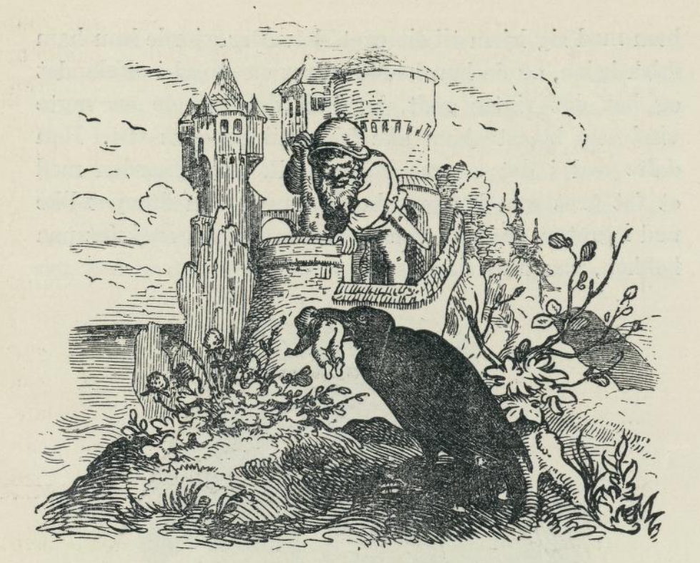

# Tommelitens liv og hendelser i England

_(Engelsk eventyr)_

I kong Arthurs tid levde der i England en mektig trollmann som het Merlin. En gang han var ute og reiste, kom han til en bondegård. Han banket på og ba om å få noe å drikke. Bondekonen tok godt imot ham og ga ham både melk og brød. Det smakte godt, for han var sulten etter den lange reisen og tørst i varmen. Mens han spiste, satt han og så seg om, og han skjønte straks at det måtte være noe i veien med mannen og konen; for de så så bedrøvet ut begge to, enda de hadde det så pent og ordentlig hos seg. Han spurte dem hva de sørget over, og de sa at det var fordi de ikke hadde noen barn. «Jeg skulle være så glad,» sa konen, «hvis jeg hadde en sønn, selv om han ikke var større enn tommelfingeren til far.» Merlin syntes det var et snurrig innfall av konen å ønske seg en sønn som ikke var større enn tommelfingeren til mannen; men da han alltid pleide å ta folk på ordet, så lovet han henne at hun skulle få det hun ønsket oppfylt. Med det samme han kom hjem, sendte han bud etter alfedronningen, og da hun kom, fortalte han henne om konen som var så bedrøvet fordi hun ingen barn hadde. Alfedronningen syntes synd på henne og mente det var best hun fikk det hun ønsket seg.

Det varte ikke lenge, så fikk bondekonen en sønn, og han var akkurat så lang og så bred som farens tommelfinger. Konen satt nettopp i senga og så på gutten hun var så glad i, da alfedronningen kom inn, kysset gutten og kalte ham Tommeliten. Etter henne kom en masse andre alfer og feer; de tok og kledde på gutten. De ga ham hatt av et løvblad, skjorte av spindelvev, bukser og trøye av myrdun, strømper av et rødt epleskall, og dem bant de fast med to hår av morens øyenbryn; sko fikk han også, og de var av museskinn med hårene inn, for at de skulle være bløte å gå på.

Tommeliten ble aldri større enn farens tommelfinger; men klok og slu og full av skøyerstreker var han da han ble eldre, så moren hadde sin store nød med ham mang en gang. Når han og de andre guttene spilte om kirsebærsteiner, og han hadde tapt alle sine, så krøp han ned i lomma til de andre. Der tok han så mange han orket bære og så begynte han å spille igjen. Men en gang gikk det ham galt. Da hadde han krøpet ned i en pose med kirsebærsteiner, og den gutten som eide dem fikk se ham. «Stjeler du, Tommeliten,» sa gutten, «så skal det gå deg galt.» Så trakk han båndet sammen om halsen på ham, så bare hodet stakk frem av posen, og så ristet han posen slik at Tommeliten fikk hele kroppen og benene slått og klemt av kirsebærsteinene, så han måtte tigge og be om å få slippe, og si han aldri skulle gjøre det mer.

Men den neste dagen fikk guttene det igjen. Da tok han alle ølglassene til mor sin og hang dem opp på en solstråle, og da de andre guttene så det, mente de at det kunne de også gjøre. Men de hadde ikke fått noen alfegave, og derfor slo de i stykker alle glassene og fikk juling av foreldrene. Tommeliten lo seg nesten fordervede over dette, og de store guttene ble så sinte på ham så moren ikke turte la ham være sammen med dem lenger, men tok ham med seg hjem. Nå skulle han hjelpe henne i huset med alt han ikke var for liten til å gjøre.

En dag stod hun og rørte en deig til en pudding, og Tommeliten var krøpet opp på kanten av krukka for å se hva hun gjorde. Da hun snudde seg et øyeblikk, falt han ned i krukka, og hun så det ikke, men rørte ham inn i deigen, og så satte hun puddingen over varmen. Da Tommeliten merket det ble varmt, ga han seg til å danse omkring i puddingen, så den fór rundt i gryta. Moren trodde det var noe galt med puddingen, og da hun med det samme fikk se en knappestøper som gikk forbi, ga hun ham puddingen og var glad til at hun ble kvitt den. Knappestøperen gikk med puddingen og var glad over den gode maten han skulle få, det var lenge siden han hadde spist pudding. Som han gikk, kom han til et gjerde han måtte over; men med det samme måtte han nyse, og så skrek Tommeliten himmelhøyt: «Hjelp Gud!» Knappestøperen ble så redd så han kastet puddingen langt fra seg og løp det forteste han kunne. Men Tommeliten krøp ut av puddingen som var gått i mange stykker, og så sprang han hjem til moren sin. Hun skjønte ikke hvor det var blitt av ham og hadde lett etter ham både høyt og lavt.

En dag tok hun Tommeliten med seg ut på marken da hun skulle melke kuene, og da det blåste nokså mye, tok hun en tråd og bant ham fast til en tistel, for at han ikke skulle blåse bort. En av kuene fikk se hatten hans, den var av et eikeblad, og så tok den både ham og tistelen i én bit. Tommeliten ble så redd for de store tennene til kua at han skrek av alle krefter på moren. «Hvor er du hen, sønn min?» spurte hun. «Her er jeg jo, i munnen på den røde kua,» svarte han. Moren visste ikke hva hun skulle gjøre, hun både gråt og bar seg; men kua ble så redd over alt det levenet Tommeliten gjorde i halsen på den så den gapte høyt og lot ham falle ut. Så tok moren ham i forkleet sitt og gikk hjem med ham.

En annen gang var faren ute på åkeren og pløyde og hadde Tommeliten med seg. Han hadde fått tak i et byggaks, og det gikk han og slo på hestene med; men med ett falt han ned i en åkerfure og ble borte. Med det samme kom en ravn flyvende. Den tok Tommeliten i nebbet og fløy over sjøen med ham til et stort fjell. Der stod det et slott som en rise eide, og der slapp ravnen Tommeliten like ned i gapet på risen, som nettopp stod og så etter hva det var som kom flyvende. Da han var kommet ned i magen på risen, holdt han slikt leven at risen var glad over å bli kvitt ham igjen og spyttet ham tre mil ut i sjøen.

Der kom det en stor fisk og slukte ham; men fisken ble trukket opp av en fattig fisker, og han gikk opp på slottet til kong Arthur og solgte den. Da kokken skar opp fisken, fant han Tommeliten, og alle som var på slottet forundret seg over ham, og de ble glad i den lille fyren. Kongen ville bestandig ha ham hos seg; for han var alltid så flink til å finne på allslags leven og moro som de allesammen måtte le av. Når kongen var ute og red, satt Tommeliten på hånden hans, og når det regnet, krøp han ned i vestelomma til kongen, og der la han seg til å sove til det ble godvær igjen.

En dag spurte kongen ham om foreldrene hans, og da han hørte de var fattige, sa han at Tommeliten kunne gå inn i skatkammeret og ta så mange penger han orket bære og gå hjem til foreldrene med. Tommeliten fikk seg en liten pose, i den puttet han en sølvskilling, tok den på ryggen, så tung den var, og så gikk han i to fulle døgn før han kom hjem. Moren stod i døra da han kom, og hun og faren ble ikke lite glade da de fikk se ham, og han hadde så mange penger med seg. De ba ham sette seg ned ved peisen i et valnøtteskall, og de ga ham så mye å spise så han på tre dager hadde spist opp en hel nøttekjerne; men det ble han syk av; for en nøttekjerne varte ellers en hel måned for ham. Da han var blitt frisk igjen, skulle han reise; men han kunne ikke; fordi det hadde regnet. Men moren visste råd. Hun satte ham på hånden sin og blåste ham tilbake til slottet. Nå strevde Tommeliten slik med å more kongen og dronningen og ridderne at han ble syk av det. Da kom alfedronningen i en vogn med flaggermus foran og tok ham med seg hjem til sitt eget slott. Der gjorde hun ham frisk igjen, og da han hadde vært en stund i alfelandet og hatt det riktig godt, lot hun det komme en sakta vind som blåste ham like hjem til kongens slott. Han dalte ned i det samme kokken gikk over gården med et fat grøt som kongen skulle ha, og han dumpet like ned i grøten, så den varme grøten skvatt i ansiktet på kokken så hun slapp fatet.

Kokken ble rasende sint og sa Tommeliten hadde gjort det av bare ondskap, og kongen som ikke fikk noen grøt, sa at Tommeliten skulle halshogges. Det var mange folk som stod og hørte på dette. Blant dem var også en møller; han stod og glante og gapte, og da Tommeliten hørte han skulle halshogges, tok han et dyktig tilspring og hoppet like ned i halsen på mølleren, så ingen visste hvor det var blitt av ham, ja, mølleren visste det ikke selv engang.

Da Tommeliten var borte, gikk folkene hjem og mølleren også. Men han fikk ikke ro; for Tommeliten ga seg til å stå på hodet og tumle og velte seg i magen på ham, så han trodde det måtte være selve den onde som var kommet i magen på ham, og så sendte han bud etter doktoren. Da han kom, sang og danset Tommeliten i magen på mølleren, så doktoren ble enda reddere og sendte bud etter fem andre doktorer og tyve prester. De snakket og de manet alle sammen det beste de kunne, og mølleren satt og hørte på det til han ble så søvnig at han gapte som en hvalfisk, og med det samme gjorde Tommeliten et hopp og stod midt på bordet. Mølleren ble så sint da han så det var Tommeliten som hadde vært i magen på ham så han ble aldeles fra seg, tok ham i hårtoppen og slang ham ut gjennom vinduet og ned i vannet hvor det kom en stor fisk og slukte ham. Den ble snart trukket opp og solgt til kongens kjøkken, og da det var en stor prektig fisk, ville kongen at den skulle kokes med det samme. Da kokken skar opp fisken, fant han Tommeliten og gikk inn til kongen med ham. Men kongen hadde det så travelt den dagen at han ikke ville se ham, derfor satte han ham i en musefelle så han ikke skulle bli borte for dem igjen, og der satt han en hel uke og hadde ikke noe annet å gjøre enn å kikke ut gjennom sprinklene. Til slutt sendte kongen bud etter ham og sa at nå hadde han glemt grøten, nå skulle Tommeliten få nye klær og bli ridder.

Så tok de vingene av en sommerfugl og laget skjorte til ham, støvler fikk han av kyllingskinn, trøye og bukser av solsikkeblader, en synål til å verge seg med og en mus til å ri på. Nå kunne han være med kongen på jakt, og det gjorde han også, men en dag de red forbi en bondehytte, kom en katt og ville ta den musa Tommeliten red på. Tommeliten verget seg nok med nåla; men da kongen og de som var med ham kom og skulle hjelpe ham, var han så oppkloret at de måtte bære ham hjem og legge ham i en liten dunseng som stod i et elfenbensværelse. Nå kom alfedronningen igjen, og hun tok ham med seg til alfelandet. Der var han i mange år; men på kong Dunstans tid kom han igjen, og da hadde han prektige grønne klær på seg. Folk kom fra alle kanter for å se på ham, og han ble ført frem for kongen som spurte hvem han var, og hvor han kom fra. Tommeliten syntes det var rart at de ikke hadde hørt snakke om ham før og fortalte han kom fra alfelandet, og at han godt kjente kong Arthur som hadde gjort stor stas av ham og slått ham til ridder. Tommeliten fikk lov til å sitte ved kongens eget bord, og kongen bygde et gullslott til ham og ga ham en vogn med seks mus foran. Men det ble dronningen sint for; for kongen hadde aldri gitt henne noen ny vogn. Hun løy for kongen og sa Tommeliten hadde vært slem mot henne. Nå skulle Tommeliten straffes; men han krøp inn i et sneglehus, og der satt han til han nesten sultet i hjel. Så kikket han ut av sneglehuset og så en sommerfugl som satt stille. Da var han ikke sen. Han sprang ut og satte seg skrevs over sommerfuglen, og den fløy avsted med ham på ryggen til den kom til kongens slott. Kongen, dronningen og hoffolkene så sommerfuglen og ville fange den. De jaget den så Tommeliten ikke kunne klare det lenger, så gled han ned i en bøtte med vann, og da de trakk ham opp, var han nesten druknet. Dronningen ville han skulle halshogges allikevel; men først stakk de ham inn i en musefelle. Katten så at noe rørte seg deringe og trodde det var en mus. Den drog og tumlet så lenge med fella at den gikk i stykker, og Tommeliten krøp ut. Så kom en edderkop. Den trodde at Tommeliten var en flue og stakk ham, så han falt så lang han var, og edderkoppen sog alt blodet ut av ham. Tommeliten ble lagt under en rosenbusk, og på graven satte kong Dunstan en støtte med navnet hans og fortellingen om hvorledes han levde og døde.

