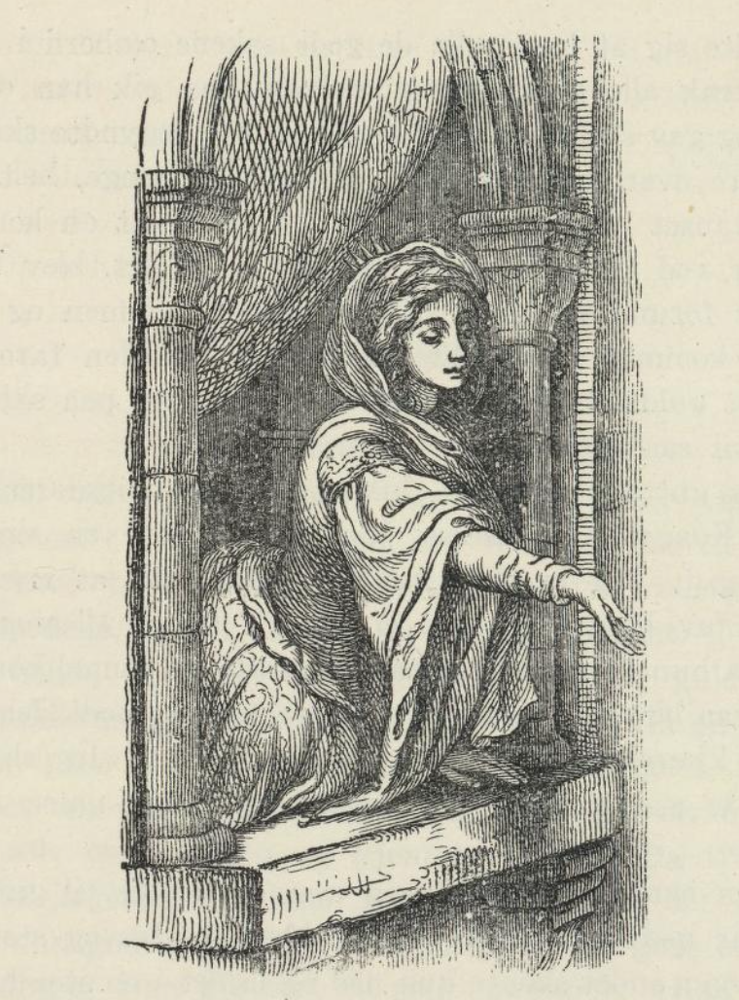
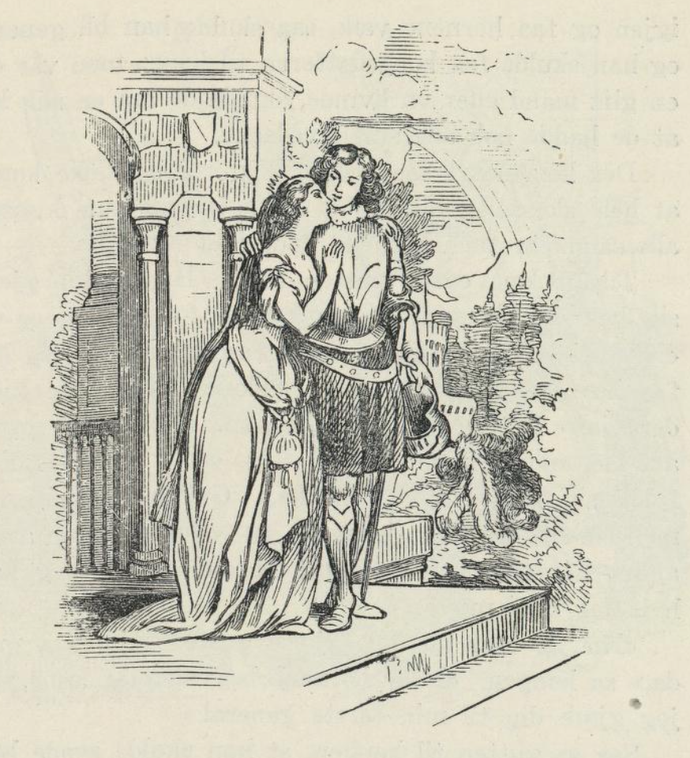

# Trollskipet

_(finsk eventyr)_

Det var engang en finsk jeger. Han vandret lenge om i skogen med buen sin. Så kom han til fjellet hvor trollene bodde. Foreldrene til trollene var nettopp døde, og nå var alle arvingene kommet. I fjellet hadde de massevis av gods og rikdom, gullskjeer og gullkrus og mye annet. Hver av dem fikk en gullvogn; men gullskipet skulle de alle ha en del i. Dette skipet var slik at når noen gikk inn i det, for det av seg selv over jorden og gjennom lufta. Da trollene fikk se jegeren med buen på nakken, ropte de: «Kom hit, min gode mann, og del mellom oss for gode ord og betaling.» Han gikk bort til dem og spurte: «Kan disse gullvognene og gullskipet gå av seg selv?» «Ja, når du bare trer på dem og gir dem et spark,» svarte de.

Da gutten hadde fått vite hvordan det gikk for seg, spente han buen og skjøt ut en pil og ropte: «Let nå etter pila som fløy fra buen min. Den som først finner den skal ha gullvogna og gullskipet!»

Trollene rente alt de orket etter pila, og de løp så langt at han verken hørte eller så dem. Men gutten tenkte: «De kommer vel snart igjen etter sakene sine, og da er det ikke sikkert her.» Han skyndte seg å kaste alle de gode sakene ombord i skipet, trakk alle gullvognene ombord, så gikk han opp i selv og ga skipet et dyktig spark. Nå begynte skipet å fare over land og vann, og det for lenge, helt til det stanset utenfor en kongsgård. Der satt en kongsdatter ved vinduet, og da hun fikk se skipet, ble hun svært forundret. Hun slo hendene sammen og sa: «Der kommer jo den største keiseren i verden farende på et gullskip. Kjære keiser, ta meg med på skipet. Jeg vil så gjerne være kjæresten din.»

Da gutten hørte det, lukket han opp skipsdøra og sa: «Kongelige prinsesse, jeg er nok bare en simpel bondegutt. Jeg er ikke engang verdig til å trekke skoen av Dem. De kan jo få en konge til mann.» Enda hun hørte det, at han bare var en simpel bondegutt, så ble hun ved å si: «Bare ta meg med! Jeg vil være kjæresten din!» Men gutten svarte: «Jeg skjønner De gjør nar av meg. Bare en konge passer for Dem.»

Så hentet kongsdatteren mat og drikke til gutten og bar ned på skipet. Vakre klær, hatter og støvler og mye annet sleppte hun ned og la det i en stor haug på dekket; men gutten turde ikke røre det. Imellomtiden gikk prinsessen frem og tilbake ved skipet, og bedrøvet og i dårlig lune var hun og vred hendene sine, fordi gutten ikke ville ha henne til kjæreste. Slik gikk det en ukes tid, og gutten skjønte, at kongsdatteren nok hadde stor lyst til å gifte seg. Til slutt sa han: «Når De nå endelig vil gjøre Dem så simpel at De vil ha en bondegutt, så kom da ombord på skipet.»

Det lot ikke prinsessen seg si to ganger. Da hun kom ombord, falt gutten på kne for henne og sa: «Hvor skal vi nå reise hen, kjære prinsesse?» Prinsessen svarte: «La oss reise midt ut på havet, der ligger en øy som er ti fjerdinger lang, og den er full av de deiligste bær og frukter.» Så lot gutten skipet gå. Det for midt opp på øya, og der stanset det. Nå gikk gutten ut for å plukke bær. Men da han hadde smakt på bærene, sovnet han og falt i en tung søvn. Kongsdatteren ventet og ventet, til hun ble kjed av ventinga, og sint ble hun også. Så tenkte hun: «Du kan dø her på øya, din bondeslamp! Jeg skal vende skipet og reise hjem igjen.» Det gjorde hun også. Hun vendte skipet og reiste hjem, og gutten ble liggende der og snorke. Da han til slutt våknet, var skipet verken å se eller høre. Borte var alle trollgavene også; det eneste han hadde igjen av hele herligheten var en pengepung. Han var så sulten at det gnog i tarmene; men han hadde ingenting å spise.

Så gikk han bort til en gammel bærbusk og plukket full den venstre lomma si og smakte på et par bær. Men det var farlige bær; for da han hadde spist dem, vokste der opp et par svære horn på hodet hans. De var så svære at nakken hans nesten ikke var god for å bære dem. Nå ble det riktig ille for ham. «Det gikk da enda an med sulten,» tenkte han. «Men nå når jeg har fått disse hornene å dra på, blir det rent ille. Kommer der sjøfolk hit til øya, så skyter dem meg vel ned som et vildt dyr.» Mens han gikk slik og snakket med seg selv, kom han til en annen bærbusk. Han puttet den høyre lomma si full av bær, og så puttet han et par i munnen for å leske seg. Men det var nok andre bær; for da han hadde spist dem, falt hornene av hodet hans igjen, og der var ikke så mye som et arr etter dem engang. Men ikke nok med det, han ble så vakker at der ikke var noen i hele riket som kunne måle seg med ham.

Han gikk nå og ventet på at der skulle komme noen sjøfolk; for han kunne jo ikke komme bort fra en øy som lå midt ute i store havet, og da der endelig kom et skip reisende mot øya, ropte han: «Redd meg, redd meg fra døden på denne øya, gjør det for penger og gode ord, vis meg kongens slott og følg meg dit!» De tok ham med seg i land og viste ham veien til slottet.

Nå gikk gutten inn i gården. Der hadde kongen en brønn med det klareste vannet, og der var lokk på brønnen. Han satte seg på lokket og begynte å mudre opp vannet med de skitne bena sine. Nå kom overkokken på slottet bort til brønnen. Hvis han hadde vært en bråsint fyr, så hadde han sikkert begynt å skjelle og kalle og rope: «Hvorfor har du, din fant, mudret opp drikkevannet og gjort det tykt? Det er vondt nok for oss å drikke det stygge vannet; men enda verre er det for kongen og dronningen.» Og hvis kongen hadde hørt det, hadde han latt hodet hugge av gutten.

Men kokken var ikke slik, han var en godsinnet mann, og han sa: «Å, du stakkars menneske, som har mudret vannet slik opp for oss! Det er kjedelig for oss; men enda kjedeliger er det for kongen, dronningen og den kongelige familie. Når kongen får vite det, lar han hodet hugge av deg; det kunne forresten jeg også gjøre.» Og kokken hadde makta til det.

Men gutten sa: «Kjære, ikke si noe, så skal jeg gjøre deg like så vakker som jeg er selv.»

«Ja, kan du gjøre det,» sa kokken, «så skal jeg ikke si noe.»

Gutten ga ham så et bær, og da han hadde svelget det, ble han så vakker, at der ikke fantes hans like i hele kongeriket. Men bondegutten ble gjemt bort, så ingen så ham. Kokken laget nå maten til kongen. De åt og drakk og var lystige, og da de hadde spist, gikk prinsessen like bort til kokken og spurte hvem det var som hadde gjort ham så vakker. «Jo,» sa overkokken, «det var en fremmed mann her i går kveld. Han kunne gjøre hvem han ville så vakker.»

«Ja,» sa prinsessen — det var henne som hadde reist hjem med skipet — «ville han gjøre meg så vakker, skulle jeg gjerne være kona hans.» «Jeg tror han alt er reist sin vei,» sa kokken, «han ville ikke at noen skulle se ham; for han var redd de skulle drepe ham i byen.» Prinsessen sa han måtte sende bud etter gutten og si, han ikke skulle være redd for noe ting, og han skulle leie seg inn i et fremmed hus. Hun skulle nok betale for ham. Gutten tok inn i et hus som lå avsides for seg selv, og dit bar prinsessen mat og drikke og alt det som godt var, og mens han holdt på å spise, gikk hun til ham, snakket med ham og sa: «Hvis du kan gjøre meg like så vakker som kokken, så vil jeg bli kona din.» Gutten var sint på henne; fordi hun hadde latt ham bli igjen på øya; men han spiste både fort og godt allikevel og sa: «En bondeslamp som jeg, kjære prinsesse, er ikke noe for Dem. De kan få konger.»

«Vil du ikke tro meg,» sa prinsessen; for hun kjente ikke gutten igjen og visste ikke at det var ham hun hadde satt igjen midt ute i havet, «så skal jeg gi deg vakre klær og penger og gull og et gullkrus; for alt det har jeg, og jeg har et gullskip også og gullvogner, og alt det vil jeg gi deg, hvis du vil gjøre meg vakker.»

«Ja,» tenkte gutten ved seg selv, «alle de tingene er nå mine før.» Men han sa ikke noe, og prinsessen ga seg ikke, men sa: «Jeg slipper deg ikke, før du har gjort meg vakker.» Nå laget gutten seg i stand til å gjøre henne vakker; men han, den skjøyeren! han tok bær av den venstre lomma si og lot prinsessen spise de vonde bærene, og så gikk han og gjemte seg og spiste og drakk.

Da prinsessen hadde svelget bærene, vokste der to svære horn ut på hodet hennes. Da kongen så at datteren hans hadde fått horn på hodet, prøvde han å få saget dem av; men saga bet ikke på dem. Så befalte han at to sterke soldater skulle gå etter henne og støtte hornene for at den stakkars prinsessen ikke skulle gå og slepe på de tunge hornene alene. Til slutt kunngjorde kongen over hele riket, at hvis der fantes en ungkar som kunne gjøre kongsdatteren god igjen og få hornene vekk, så skulle han bli general, og han skulle få kongsdatteren til kone; men var det en gift mann eller en kvinne, skulle de få en slik lønn at de hadde nok alle sine levedager.

Der kom snart så mange doktorer og kloke koner, at hele slottssalen ble full, og de prøvde sine kunster alle sammen; men hornene ville ikke av.

Til slutt kom også gutten frem. Han hadde gjemt seg bak alle de andre. Han knelte for kongen og sa: «Nådigste konge, la meg også få forsøke om jeg kan få hornene av prinsessen.» «Skulle du kunne gjøre det kjære gutten min?» sa kongen. «De har jo prøvd alle de andre; men de har ikke gjort annet enn å fylle seg med mat og drikke.» Gutten gikk sin vei; men om litt kom han igjen og sa: «Det er ingen av de andre her som kan få bort hornene; men jeg kan, hvis jeg får prøve.»

«Nå ja, tror du det, kjære gutten min, så prøv da,» sa kongen. «Når hornene begynner å løsne, skal jeg gjøre deg til min første general.»

Så sa gutten til kongen, at han skulle sende bort alle de andre, og la krigsfolkene holde seg ferdige til å skyte og rope hurra, når han hadde gjort prinsessen god igjen. Den befalinga ga kongen straks. Alle de andre ble sendt bort, og soldatene stod oppstilt. Gutten ble alene og skulle stelle med prinsessen, og tjenerne fikk befaling til å hjelpe henne. Så sa gutten til tjenestejenta: «Gå av sted og hent bjørkeved og fyr i badstueovnen, så det blir riktig hett.» Og til tjeneren sa han: «Gå til skogs, du gutten min, og hent tre tynne kvistfrie hasselkjepper, så jeg kan få løsnet hornene.» Hasselkjeppene ble gjort myke, og det ble bjørkerisene også, og der ble bragt inn varmt vann og svamp og alt det som hørte badstua til. Så førte han prinsessen inn, skikket jenta ut og lukket døra. Imellomtiden holdt alle soldatene på å stille seg opp. Så hengte gutten prinsessen opp etter hornene på hjellen mellom tverrbjelkene og tok til å denge henne med hasselkjeppene og sa: «Vil du én gang til stryke av sted med godset mitt! Det er meg som er kjæresten din; nå skal du ikke narre meg mer!»

Prinsessen lå både vel og vakkert: «Slå meg ikke mer, kjære mann, jeg skal aldri mer gjøre deg imot så lenge jeg lever.» Så ga gutten henne en av de gode bærene han hadde i den høyre lomma si, og da løsnet hornene og falt av, og det var ikke et arr etter dem engang, og nå ble hun så deilig, at der ikke var noen i hele riket som var så vakre som de to. Så gikk de til slottet og spiste og drakk, levde vel og danset og moret seg, og gutten ble den fornemste generalen og fikk prinsessen. Og så er eventyret ute.
