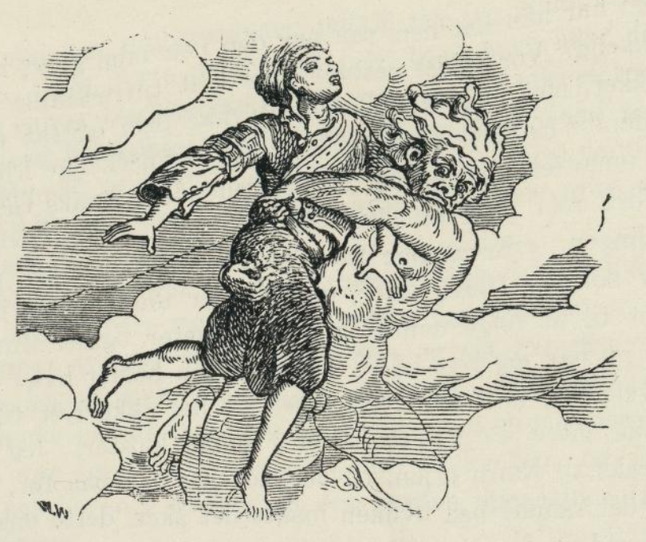
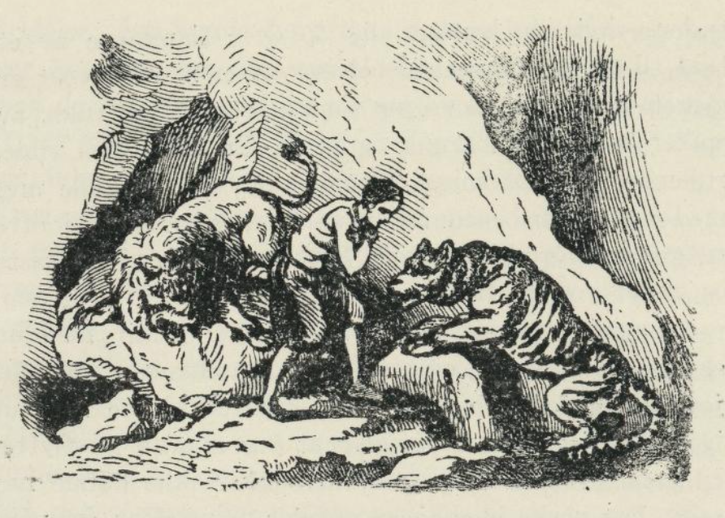
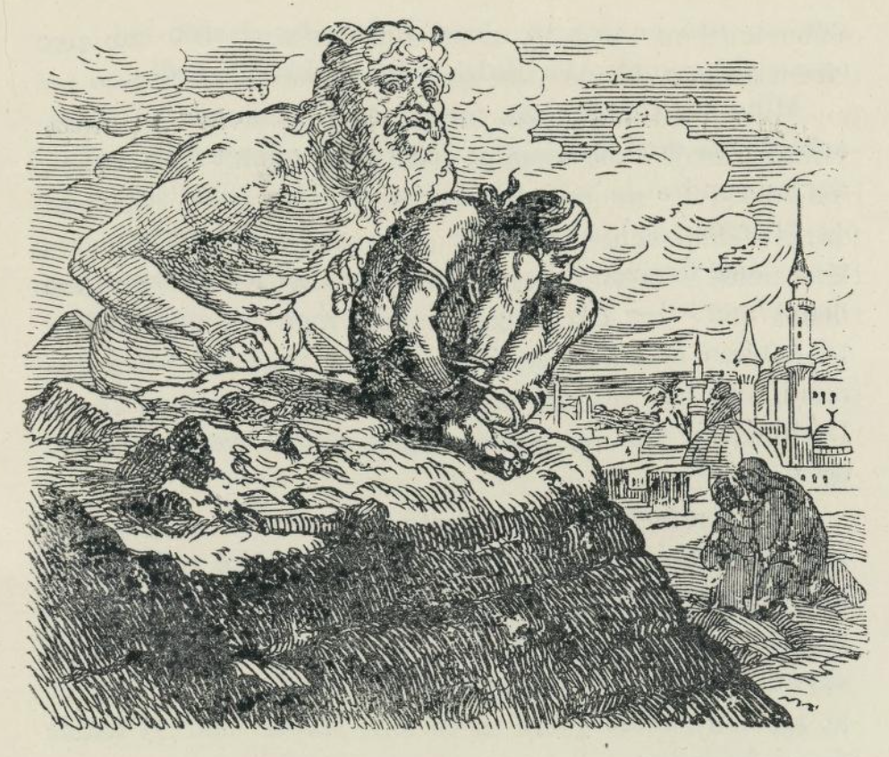

# Trylleringen

_(ægyptisk eventyr)_

Jeg skulle begynne med det samme arbeidet. Men det var skjebnens vilje at jeg uten arbeid skulle få tak i en stor skatt, men den ble også årsaken til den ulykke som har fulgt meg gjennom hele livet.

Da jeg var så liten at jeg ikke kunne følge min far på de lange vandringene hans, lekte jeg med de andre barna i landsbyen. Det var like ved en stor innsjø med åser og store løvtrær omkring. I denne skogen var vår kjæreste lekeplass, her var vi hele dagen, badet oss i sjøen og øvde oss i å svømme.

En dag da jeg sprang ut i sjøen, støtte jeg på noe hardt som jeg ufrivillig grep etter. Jeg skyndte meg opp på stranden med det og begynte å gni av sjøgresset som satt tykt på det, og så så jeg at det var en ring. Den var av bronse, og der var en sortaktig sten i den som så ut som et signet. Stenen var upolert, men på overflaten var der skåret ut noen skrifttegn. Jeg var svært glad over at jeg hadde funnet denne ringen, og jeg stakk den inn på fingeren og begynte å leke som ellers.

Nå var jeg snart seksten år, og da syntes far jeg var så gammel at jeg kunne begynne å hjelpe ham med arbeidet hans, men han ville at jeg først skulle reise til Kairo og besøke en onkel som jeg aldri hadde sett før. Denne onkelen het Achmed og var stallgutt hos den rikeste bey i Kairo som også var guvernør over en av de største provinsene, og far tenkte at det kanskje kunne bli til nytte for meg siden, hvis min onkel kom til å like meg.

Dengang var jeg ung, frisk og kraftig, hadde regelmessige, pene trekk, og et velbygget legeme. Jeg var ikke pukkelrygget, døv og innhul i brystet som jeg er nå, jeg stammet ikke og jeg hadde ikke det sabelhugg som flenger ansiktet mitt nesten tvers over. Gid Allah og profetene må fordømme han som har gjort det i all evighet!

Min onkel likte meg, og han spurte min far om jeg kunne få være der en stund. Min far sa ja, og jeg var aldeles vill av glede over at jeg skulle få bytte den elendige hytta vår og det tunge arbeidet med det prektige slottet og ingenting å gjøre. Jeg hadde ikke annet å gjøre enn å hjelpe min onkel litt, han tenkte å lære meg opp, så jeg siden kunne overta hans stilling. Men det stod skrevet i stjernene at jeg verken skulle bli skattegraver som min far Fath Allah, eller stallgutt hos en bey som min onkel, Achmed, nei, isteden skulle jeg bli døv, trangbrystet, stam, pukkelrygget og komme i Moristan som gal.

En dag var alle husets tjenere og slaver samlet til gjestebud, for det var en stor festdag. Jeg var også budt, for alle på slottet likte meg. En skriver som førte regnskap for beyen var også der. Han het Mallem Abyfanyus; han fikk se ringen som jeg alltid gikk med på fingeren, og han ba om å få se nærmere på den. Jeg tok den ikke av, men holdt hånden like bort til ham, og han så lenge og nøye på den. «Disse skrifttegnene,» sa han, «er merkelige. De er uttrykt i fugleform, det vil si dette landets gamle billedskrift. Jeg kan ikke lese dem, og der er bare en eneste mann i hele Egypt som kan gjøre det. Det er en olding som bor i et kloster i ørkenen Behar Belamah (den vannløse elvs dal). Nå skal jeg snart ut på reise og kreve inn skatten for beyen, og da kommer jeg forbi det stedet hvor den oldingen bor. Hvis du vil betro meg ringen, så skal jeg ta den med tilbake, og du skal samtidig få greie på hva inskriften betyr.

Jeg vet ikke om det var en hemmelighetsfull makt som bandt meg til ringen, eller om det var nysgjerrighet som gjorde at jeg bestemte meg til å foreta denne reisen, som jeg trodde jeg skulle få så stor fornøyelse av. Jeg sa at jeg ikke kunne få ringen av, for fingeren var blitt så mye tykkere siden jeg satte den på, men at jeg gjerne ville følge ham på reisen, hvis jeg fikk lov av min onkel. Jeg fikk straks lov, og munter og glad begav jeg meg på veien med skriveren.

Veien var storartet vakker så lenge den gikk langs Nilen. Skriveren red på et kraftig esel, noen ryttere fulgte oss, men jeg og noen tjenere og slaver gikk til fots. Nå tok vi av til venstre og kom inn i ørkenen, og da gikk det langsomt fremover. Ret som det var sank vi så dypt ned i sanden at vi hadde vondt for å komme opp igjen. Vi trådte på skarpe steiner, og den glødende sol brente, men der var ikke et sted hvor vi kunne ta inn og hvile oss.

Da vi hadde gått en hel dag og en hel natt, kom vi endelig til en høyde. Fra den kunne vi se dalen Behar Belamah. På den andre siden av dalen stod det munkekloster som vi skulle til, og vi begynte da å gå hen imot det. Vi fikk lov til å komme inn, men det var på en merkelig måte de slapp oss inn. Vi måtte sette oss i en stor kurv som hang i en heiseinnretning, og så ble vi heist opp og inn gjennom et vindu.

Det var alt så sent at jeg ikke kunne få snakke med oldingen før om morgenen, men jeg ble overlatt til et par skitne og fillede munker. Rimeligvis ble der sørget bedre for skriveren som var kristen enn for meg som var muhamedaner, i alle fall så jeg ikke mer til ham. Først førte de meg ut i en liten have hvor der stod et par bladløse trær. Så satte de for meg et trefat med halvkokte erter og bønner og noe vann som smakte salt og bittert. Da jeg hadde spist, førte de meg inn til et mørkt og fuktig rom hvor jeg skulle være om natten.

Enda så trøtt jeg var, kunne jeg ikke lukke et øye. Jeg lå på bare steingulvet, for seng fantes ikke, store svermer av myg stakk meg til blods, og ret som det var følte jeg at ekle slanger for over meg. Det var ikke å tenke på å få hvile, og da jeg stod opp om morgenen, var jeg enda trøttere enn om kvelden, og jeg var så hoven i ansiktet at jeg nesten ikke kunne få opp øynene.

De kom med frokosten, det var de samme rettene som om kvelden, og så ble jeg da ført til den høyærverdige munk, som het Makarius.

Makarius måtte en gang ha vært svært høy, nå var han aldeles krumbøyd av alderdom. Han var aldeles skaldet, og det hvite skjegget nådde ham til livet. Øynene som blinket frem fra de store, hvite brynene, viste at han ikke hadde mistet noe av sin åndskraft.

Han så nøye på ringen og ble svært forbauset da han hadde lest inskriften. «Min sønn,» sa han, «disse skrifttegnene er eldre enn alle de menneskeverkene vi kjenner. Dette er meningen med dem: 'Hva ønsker Murad?' Bare du sier eller tenker de ordene: Murad ønsker det, så skjer alt hva Murad ønsker. Du vet,» tilføyde han, «at navnet Murad betyr 'ønske', ringens forrige eier har rimeligvis hett så. Om han har hatt den makten som inskriften sier, vet jeg ikke, men har han hatt den, så har den nok ikke gjort ham lykkelig. Vår lykke består ikke i å tilfredsstille alle ønsker, men i å kunne undertrykke dem og få dem innenfor de rette grensene. For det menneskelige hjerte er umettelig, et oppfylt ønske fremkaller straks tusen andre som gjør oss ulykkeige.»

Jeg avbrøt oldingen. «Ærverdige far,» sa jeg, «slike tanker passer nok for Deres alder, men jeg er ung og har ikke lyst til å følge denne læren. Jeg heter også Murad, og nå har jeg lyst til å se om ringen holder hva den lover. Jeg er trøtt etter reisen og har ikke lyst til å nyte mer av gjestfriheten i dette klosteret. Jeg vil straks til Kairo igjen, til det slottet jeg var på før, det er det samme på hvilken måte det skjer, dette ønsker Murad og jeg...»

Jeg fikk ikke sagt mer, jeg ble plutselig løftet opp og styrtet ned på et stort bord som jeg veltet med alt som stod på det. Jeg fikk nesten ikke tid til å se at jeg var i beyens slott i en sal hvor alle satt og spiste, før de allesammen falt over meg med pryl og slag, fordi jeg forstyrret dem mens de spiste. Min onkel var den første som kjente meg igjen, og han ba de andre holde opp å slå meg, så han kunne få vite hva jeg hadde å si til min unnskyldning. Jeg fortalte alt som var hendt meg, men ingen ville tro hva jeg sa. Nå kom der inn mat og drikke, og jeg satte meg og spiste med de andre. De sa alle at det jeg hadde fortalt var noe jeg hadde funnet på, men nå begynte de å fortelle alle slags merkelige tildragelser fra kalifen av Bagdads, Harun al-Raschids tid, da var der så mye snakk om ånder, feer og troll, og de fortalte om den store prakten ved kalifens hof. Slik gikk dagen, maten smakte godt etter den elendige føden jeg hadde fått i klosteret, og da jeg gikk og la meg, håpet jeg at jeg skulle få sove bedre enn jeg hadde gjort natten før.

Jeg sovnet med en gang, men jeg drømte ustanselig om det jeg hadde hørt om kvelden. Skjønne bilder viste seg for meg, det ene vakrere enn det andre. Plutselig reiste jeg meg opp, men jeg var ikke riktig ved samling, jeg syntes at det som hadde hendt meg i det siste måtte være en drøm. Kalifens praktfulle slott, som jeg hadde sett i drømme, stod enda for meg, og nesten uten å vite av det, ropte jeg høyt: «Å gid jeg var der, gid jeg var i den store byen Bagdad!»

Jeg hadde ikke før sagt ordene, før jeg kjente at jeg ble løftet i været av en usynlig arm. Plutselig slapp den meg, og jeg styrtet ned i en elv, hvor jeg sank like til bunns, men jeg kom opp igjen i en fart og svømte til lands. Jeg var virkelig falt ned i Tigris, og nå var jeg i Bagdad, men jeg fikk snart høre at det ikke var noen kalif der lenger, men at byen ble regiert av en tyrkisk pascha. Hele dagen gikk jeg omkring i byen uten mat, for jeg eide ikke en skilling. Da kvelden kom, satte jeg meg, trøtt og sulten som jeg var, under noen trær som stod på en haug, derfra kunne jeg se like ned i paschaens slott. Det var en stor bygning, rundt omkring var der vakre haver, der skinte lys ut fra alle vinduer, deilig musikk lød derfra, og tjenere løp frem og tilbake. Da jeg så dette, ble jeg enda mer fortvilet over hvor vondt jeg selv hadde det. «Her sitter jeg sulten og i mørke,» tenkte jeg ved meg selv, «mens paschaen har alt hva han kan ønske seg. Å om jeg også kunne få litt av all den herligheten.»

Med det samme kom en lang rekke slaver ut fra paschaens slott, de hadde fakler i hendene, etter dem kom noen andre slaver som bar gullfat og porselensfat med de deiligste retter, og etter dem igjen kom musikere og sangere som spilte de deiligste melodiene. Hele toget gjorde en ring om meg, og jeg skulle nettopp til å spise av maten, da der kom en ny skare ut fra slottet. Det var paschaens soldater og dørvaktere. Da de så at de andre slavene forlot slottet, kom de og tvang dem tilbake igjen med slag og pryl. Nå kastet de seg over meg, og da jeg naturligvis ikke kunne forsvare meg mot dem, var det jo ganske rimelig at jeg ønsket å være på et sted hvor de ikke kunne nå meg.

Jeg hadde ikke før tenkt ønsket, før det gikk i oppfyllelse. Jeg kunne først ikke oppdage hvor det var jeg var kommet, for det var aldeles mørkt omkring meg, men da jeg hørte sukk og klirring av lenker, skjønte jeg at jeg var i et fengsel, og at jeg ikke var alene. Jeg sov ikke hele natten, det var jeg altfor bedrøvet til. Neste morgen forstod jeg av fangenes snakk at jeg var i et fengsel i Bagdad; alle de som var der, var blitt grepet kvelden før, da de holdt på å gjøre opprør mot paschaen, og de var alt dømt til døden. Gjennom et trangt lufthull så jeg hvordan alt ble gjort istand til henrettelsen. Jeg hørte alt soldatene komme, og de ville sikkert føre meg bort med de skyldige, for jeg kunne jo ikke forklare hvorledes jeg var kommet dit. Med det samme fengselsdøren åpnet seg, ropte jeg: «Hvem du så er du som har ført meg hit, bring den ulykkelige Murad herfra igjen og så langt bort som mulig.»

Med det samme forsvant fengselet, og jeg satt på en sivmatte utenfor et fakir-tempel ved Kinas grense. Der var en masse fakirer som nettopp holdt på med sin vemmelige avgudsdyrkelse. De hadde en mengde guder hugget i stein, det var en blanding av dyr og mennesker. Med det samme fakirene så meg, trengte de seg omkring meg og skrek: «Himmelens guder være lovet som har sendt deg hit for å gjøre bot. Hvilken pine velger du, for offeret må være frivillig.»

Jeg svarte naturligvis ikke noe på dette, men de lot meg ikke være i fred. De ville jeg skulle være med på de botsøvelsene som de selv holdt på med. «Kom min bror,» sa en, «kom og slå pannen mot denne spisse steinen til du får et like stort sår som jeg har.» «Det er mye bedre for din sjels salighet,» sa en annen, «hvis du henger deg opp over flammene av et bål til du er halvstekt.» «Nei,» sa en tredje, «det er mye bedre om han gjør som meg og slår fullt av spiker og kroker i armer og ben.» En fakir med ville, rullende øyne tok meg i hånden og ville trekke meg med seg. «Kom med meg,» sa han, «så skal vi ofre til gudenes gud, den store Dschakarnathi, vi vil kaste oss under vognen hans og la oss sønderknuse.» Jeg åpnet munnen for å svare, da kom en fakir med en skuffe glødende kull og stakk inn i munnen på meg, før jeg kunne forhindre det. Jeg spyttet glørne fort ut igjen, og jeg ønsket oppriktig at jeg måtte bli flyttet til et sted, hvor disse gale menneskene ikke kunne nå meg. Det ønsket ble også oppfylt, men etter det ufrivillige brennofferet til de indiske gudene var min tunge så forbrent at jeg stammer fra den stund, som dere nok har lagt merke til.

Den verste djevel av fakirene ville nok ikke hatt mot til å følge meg dit hvor jeg nå kom. Jeg var i en dyp avgrunn blant fjellene på øya Ceylon.

På den ene siden lå en uhyre løve, og på den andre lurte en veldig tiger, og begge var de ferdige til å kaste seg over meg. Jeg ble aldeles stiv av skrekk, og jeg hadde jo ikke annet å ønske enn at disse fryktelige dyrene måtte bli ødelagt. Med det samme styrtet de mot hverandre uten å bry seg om meg mer. De slos og brølte så det gav gjenlyd i klippene og rev hverandre i hjel med klør og tenner. Blodet strømmet, og til slutt falt de begge steindøde ned for mine føtter.

Nå var jeg kvitt disse fryktelige fiendene, men min stilling var allikevel forferdelig. Bratte klippevegger omgav meg på alle kanter, så det var umulig å komme vekk, og sulten plaget meg skrekkelig.

Med en gang fikk jeg se et stort tre hvor der var fullt av frukter i toppen. Det var svært høyt, og stammen var glatt uten en eneste gren, så det var ikke lett å komme opp. Men jeg greide det til slutt, jeg grep etter fruktene, da kom et fryktelig slangehode mot meg. Jeg slapp taket, og med en rasende fart gled jeg ned over stammen, så det var merkelig jeg ikke brakk både armer og ben.

Det var en forferdelig dag og natt. Jeg satt på en stein og fikk ikke sove, for sulten holdt meg våken. Dessuten var jeg redd for slangen som satt oppe i treet og kunne falle ned over meg hvert øyeblikk. Fra de døde dyrene steg det opp en gresselig lukt som nesten holdt på å kvele meg, og det var da ganske naturlig at jeg ønsket meg bort både fra slangen og dyrene.

Jeg hadde ikke før tenkt det, før de skrekkeligste hyl gjenlød i klippene, det var en masse glenner, ørner, høker og ravner som skrek etter bytte, og en hel hær av sjakaler og hyener kom styrtende ned over klippene. Rovfuglene kastet seg over slangen og rev den istykker, og de firbente kastet seg over de døde dyrene. Det så ut som de ikke brydde seg om meg, men jeg var sikker på at de ville ta fatt på meg bare de var ferdige med de andre.

«Store Gud,» ropte jeg, «redd meg. Jag disse skrekkelige dyrene langt bort og før meg til et sted hvor der er mennesker.» Med det samme brøt det løs et tordenveir så skrekkelig at jeg trodde klippene skulle falle ned over meg. De ville dyrene flyktet, og da jeg kom til meg selv igjen, lå jeg på en eng i høyt, bløtt gress. Der gikk folk og arbeidet på marken, og jeg skjønte jeg var kommet til et fruktbart land.

Jeg var altså reddet, men de forferdelige tordenbrakene hadde gjort meg døv, og det er jeg enda. Jeg gikk bort til noen bønder og ba om mat og drikke, det fikk jeg, og jeg levde nå godt og lykkelig hos dem en tid. Jeg måtte arbeide hardt, men jeg hadde alt hva jeg trengte. Men det var min egen skyld at jeg mistet det altsammen igjen.

En dag lå jeg i hytta mi og hvilte i den sterke middagsheten. Tankene mine for over hele jorden, men mest tenkte jeg på hvor forskjellig menneskenes skjebne er. Jeg tenkte på de rike som kan få alt hva de ønsker seg uten å arbeide, og jeg selv måtte slite så hardt. «Hvor godt slike har det,» tenkte jeg, «bare de gir ut litt gull hver dag, så har de alt hva de ønsker seg, å, hadde jeg bare gull, mye gull!» Jeg snakket høyt, men stemmen sviktet meg plutselig, for jeg kunne ikke trekke veiret. Det lå noe tungt over meg, så jeg følte det som et helt fjell. Jeg lå begravet under et fjell av gullstykker, brystet mitt var flattrykt, hoftene mine var skjeve, og fra den tid er jeg slik i brystet.

«Ak,» tenkte jeg, «denne skatten blir min død, jeg burde ha ønsket meg makt som gir både ære og berømmelse. Konge vil jeg være.»

Med det samme forsvant alt gullet, og jeg var midt inne i Tatariet. Jeg red på en prektig hest, hadde deilige klær og var omringet av en stor hær. Jeg var konge av Samarkand og Bochara, og jeg hadde blitt det i en uheldig stund. Der var et stort opprør mot meg, på en slette møttes min hær og opprørerne, der ble et blodig slag, og min hær ble overvunnet. Jeg var omringet av fiender, og en løftet alt sverdet mot mitt hode. Ønsket om å unngå faren fløy som et lyn gjennom hodet mitt, men først traff hugget meg, og merket bærer jeg den dag i dag.

Idet jeg ønsket å bli reddet, for der også en masse andre tanker gjennom mitt sinn. Jeg ergret meg over at jeg var blitt konge i en så uheldig stund, hvorfor kunne jeg ikke fått nyte de godene som følger med en slik stilling. Jeg ønsket å komme langt bort fra krigen, men jeg ønsket å få det slik at jeg ikke behøvde gjøre noe, men at jeg hadde et praktfullt slott og alle gode ting. Disse tankene visste jeg nesten ikke om selv, men for ringens usynlige ånd var de ikke skjult.

Plutselig stod jeg i en prektig pavillion med marmorsøyler, en deilig duft fylte luften, og den deiligste musikk lød gjennom værelset. Midt i værelset var der et stort basseng, fire vakre kvinner stod ved det, de skulle rimeligvis til å gå i bad, men da de fikk se en mann dekket med blod og støv, gav de seg til å skrike høyt. Med det samme styrtet fire sorte mennesker med flammende øyne og dolker i hendene inn på meg. Jeg fant det best ikke å gi meg av med de elendige slavene som altså ikke visste at jeg var deres herre, og så tok jeg igjen min tilflukt til ånden.

«O mektige ånd,» ropte jeg, «redd meg fra morderdolkene.»

Slavene, kvinnene og det hele forsvant med en gang, og jeg var alene i en ørken på en øy i det Sydlige hav. Jeg gikk lenge omkring og lette etter noe jeg kunne spise. Om kvelden kom jeg til en skog, der fant jeg noen frukter som jeg spiste grådig.

Jeg la meg i en klippehule, og jeg falt i en dyp søvn. Med det samme jeg sovnet, kom jeg til å tenke på min underlige stilling. Jeg visste jo at jeg kunne komme bort bare jeg ønsket det. Men jeg var kjed av å ta imot hjelp av den som bare gjorde meg vondt, og jeg tenkte at fra nå av var det best ikke å ha noen ønsker. Først bestemte jeg meg da til å bli hvor jeg var, det så ut til at landet var fruktbarere når man kom lenger innover, jeg så ingen ville dyr, men jeg syntes nok det skulle være hyggelig å se mennesker. Da jeg våknet var jeg omringet av en flokk heslige nakne ville. De hadde malt kroppen sin med alle slags farger, og de hadde våpen de truet meg med, så jeg kunne ikke tenke på å gjøre motstand. De tok klærne av meg og surret meg med sterke rep, så jeg ikke kunne røre meg. De bandt hendene og bena mine og trykket hodet ned mellom knærne, så jeg lignet mer en pakke enn et menneske. De løftet meg opp og bar meg bort til et åpent sted i skogen hvor noen andre ville ventet på dem. Da de så kameratene kom med meg, satte de i et hyl som gjorde meg syk av skrekk. De la meg ned ved siden av et stort bål, og jeg studerte på om jeg skulle ofres til ære for avgudene, eller om de hadde tenkt å spise meg. De knelte for ilden, og jeg skjønte da at de var ildtilbedere.

Under fele hyl som skulle være lovsanger til ære for deres gud, grep de meg og ville kaste meg opp på bålet. Da ropte jeg nesten uten at jeg selv visste om det: «Ånd, frels meg fra ilden og før meg tilbake til mitt fedreland.»

Ånden ventet ikke lenge med å gjøre hva jeg ba den om, jeg var straks i mitt fedreland, og på et sted hvor jeg var sikker for ilden. Jeg var fire hundre alen under jorden i den dypeste brønnen i Kairos citadell. Jeg hadde glemt å be ham fri meg fra repene jeg var bundet med, og med sin sedvanlige ondskap gjorde han ikke mer enn akkurat hva jeg ba om. Jeg var nesten naken, og jeg kunne ikke røre et lem, det iskolde vannet gjorde meg nesten gal, jeg tenkte ikke på redning lenger, men da jeg holdt på å drukne, sukket jeg: «Ak, gid jeg var like så høyt over jorden som jeg nå er under den.»

I samme øyeblikk var jeg på toppen av den høyeste pyramiden i Giza. Enda så forferdelig det var, gledet jeg meg over å se himmelen og kjenne at jeg kunne puste fritt. Med stor møye slapp jeg meg så langt ut jeg kunne. Ved det løsnet noen av repene, så jeg kunne stikke hodet frem over kanten og se ned på jorden.

På sandsletten like under pyramiden stod to bønder og grov i jorden. Den ene løftet hodet, og jeg så det var min far. «Å far,» ropte jeg, «gid jeg var dernede hos deg.» Med det samme følte jeg at jeg styrtet ned fra pyramidens topp og rullet som en kule fra stein til stein, til jeg nådde jorden. Da falt jeg som en livløs masse ned i den graven som min far og hans kamerat nettopp hadde gravd i sanden. Min far ble ganske skrekslagen da han kjente meg igjen. Han skyndte seg å løse repene og tok meg med seg til Kairo hvor legene behandlet meg. Først trodde de at jeg var død, men en lærd lege som ble tilkalt, oppdaget livstegn hos meg, men etter det fryktelige fallet ble jeg pukkelrygget, og det er jeg den dag i dag, og derfor har jeg også økenavnet Abu Kaleb (den pukkelryggede).

Mine slektninger så nå at jeg ikke dugde til noe arbeid, de trodde også at jeg hadde mistet forstanden, derfor sendte de meg til Moristan. Her lever jeg rolig og tilfreds, og jeg tenker ikke på å forlate dette stedet. Jeg fordrer ikke noen lykke, og jeg ønsker ikke noe mer. Jeg har ringen enda, men jeg går aldri til ånden med en bønn mer, og han må vel være den ånden som har minst å gjøre av alle dem som forlot Dschinistan for å blande seg i denne verdens strid og møye.

Her endte Murad sin fortelling som vi hadde hørt på med største forundring. Vi tvilte ikke på at det han hadde fortalt oss var sant når vi så merkene på kroppen hans. Vi fikk også se ringen, men vi skyndte oss å gi ham den igjen, for vi var redde for at ånden skulle gjøre oss til sine slaver når vi hadde den i hånden.

Med det samme Murad stakk den på fingeren igjen, hørte vi en støy. En flokk gale hadde nærmet seg uten at vi hadde lagt merke til det, og de hadde hørt på fortellinga om den vidunderlige ringen, hvis eiermannnen kunne få alt hva han ønsket.

Nå kom de med skrik og skrål ut fra det stedet de hadde gjemt seg, og de kastet seg over Murad og ville ta fra ham ringen. Da han så han ikke kunne verge seg for dem, sleppte han seg bort til en stor brønn som var ute i gården og kastet ringen ned i den. De gale ble nå aldeles rasende og styrtet seg ned i brønnen, den ene ovenpå den andre, og de sleppte Murad med seg, og de hadde ganske sikkert druknet allesammen hvis der ikke var kommet hjelp, så de var blitt trukket opp. Den siste som kom opp var Murad, men det var umulig å få liv i ham igjen. Han var død.

Vi gikk bort fra det uhyggelige stedet i dype tanker over skjebnens merkelige tilskikkelser, og vi passet oss godt for å fortelle noen om den vidunderlige ringen som ligger på bunnen av den dype brønnen i Moristan.
