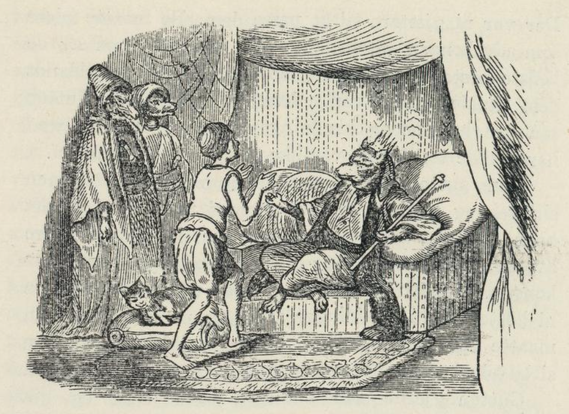
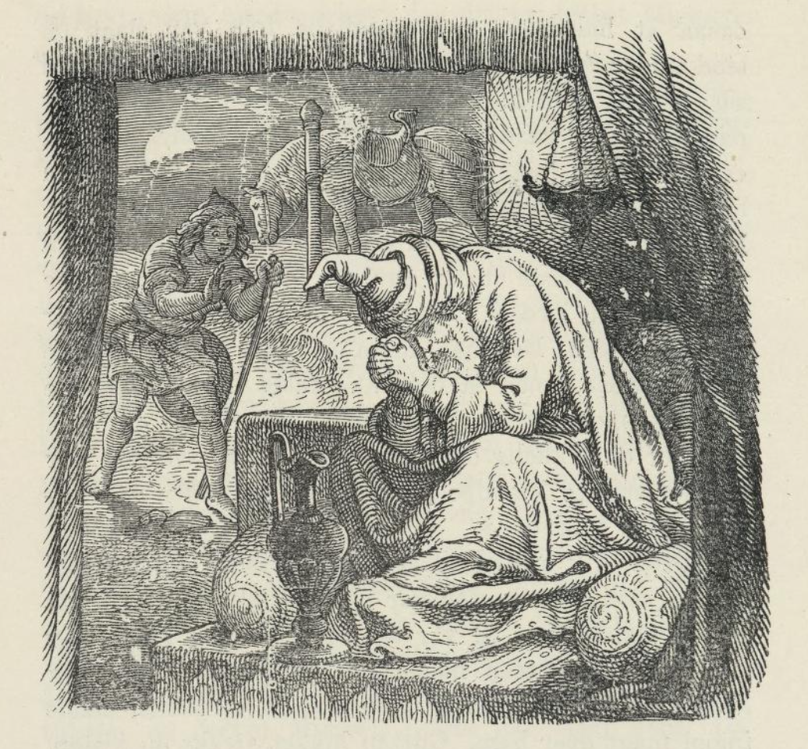

# Ulvekhanens datter

I en gammel strå-tekt otak[^1] levde en gutt på åtte år. Han var meget fattig og dårlig kledd. Han var både far- og morløs og bodde alene i sin hytte. Han eide ikke annet enn en hest som var tre år gammel, og han hadde ikke annet å gjøre enn å fore og passe den og kjæle for den. For å mette sin egen mave, satte han opp feller og snarer for harer og annet vildt. Annen føde hadde han ikke. Hesten, som gutten hadde, kunne spise så mye som en hel tabun.[^2] I ett døgn kunne den spise gresset av en hel steppe. En kveld da hesten hadde gresset fra seg, bandt han den til et tre og gikk selv inn i hytta. Der la han seg til å sove, og om morgenen med det samme sola var stått opp, gikk han ut igjen for å se til hesten, men han fant bare hodet, bena, halen og manen av den, det andre hadde ulven ett.

Da gutten fikk se dette, ble han riktig bedrøvet og gav seg til å gråte. Om litt trøstet han seg igjen og sa til seg selv: «Jeg kan lide sult og tåle sorg.» Så bandt han en snare ved det som var igjen av hesten, ba til gudene og sa: «Har ulven spist hesten, så la ulven falle i snaren, og har Aina[^3] spist hesten, så la Aina falle i den.» Så gikk han til hytta si igjen. På veien så han etter alle fellene og snarene, og da han kom hjem, spiste han sin aftenmat og la seg; men han kunne ikke sove for sorg over hesten som var oppett. Om morgenen stod han tidlig opp og gikk av sted; for han ville enda en gang se det som var igjen av hesten, han var så glad i. Mens han gikk bortover fjellet, så han noe skinne som en sol borte i snaren han hadde stilt opp. Det var en hvit ulv med gullhår, og den var ni alen lang. Den var ikke død enda; men den sprant i snaren. Gutten gikk bort til ulven, tok fatt i halen på den og slo den over ryggen med pisken sin, så hårene gikk av skinnet. Nå tok ulven til å be for seg og sa: «Vil du la være å slå meg, så skal jeg gjøre alt hva du ber meg om.» Gutten svarte: «Hvem har sett ulven gjøre noe godt? Hesten har du ett opp for meg, derfor vil jeg slå deg så lenge der er liv i deg.» Men ulven holdt ikke opp å be: «Jeg er Ulvekhan, seks hundre ulver lyder meg, og en av khanene på jorden, og dessuten sytti andre underkhaner står under meg. Jeg kan gjøre meg både til ulv og menneske. Lar du være å slå meg, så lover jeg deg ved Gud at du skal få så mange hester av mine tabuner, som du vil ha.» Gutten visste først ikke riktig om han skulle la ulvekhanen slippe; men da han hadde lovet ved Gud, løste han ham av snaren og fulgte like etter ham.

Da de hadde gått et stykke, kom de til en steppe som var full av hester; og alle var de ulvekongens. Der var ni gjetere til å passe dem. De måtte gjøre som ulvekongen sa, bringe frem for gutten ni av de beste hestene og ni av de deiligste klædningene, blant dem skulle gutten velge hva han ville ha. Gutten så på hestene og klædningene, og visste ikke hva han skulle ta; for de var like prektige allesammen. Mens gutten stod og tenkte seg om, gikk ulvekongen sin vei, og nå kom det en gammel mann med grått hår, som gav ham det rådet at han ikke skulle røre verken ved hestene eller klædningene, men følge ulvekongen. Mannen sa til ham at siden ville han igjen få ni hester og ni klædninger å velge mellom; men han måtte ikke ta imot dem, og heller ikke måtte han si til ulvekongen hvem som hadde gitt ham det rådet.

Gutten gjorde som mannen hadde sagt og gikk samme vei som ulvekongen hadde gått. Det varte ikke lenge, så kom han til en steppe full av hester, det var også ulvekongens, og der var ni gjetere til å gjete dem. De kom med ni av de aller beste hestene og ni av de deiligste klædningene, som gutten skulle velge mellom, og de var så vakre, at han glemte hva den gamle mannen hadde sagt og skulle nettopp til å søke ut den, han syntes best om da gamlingen kom igjen og ba ham ikke røre det som hørte ulvekongen til. Gutten lot det da være og ble ved å gå etter ulvekongen. Så kom han til den tredje steppen full av hester. Her kom også ni gjetere imot ham med ni hester og ni klædninger og bukket for ham og ba ham ta ut en hest og en klædning. Gutten holdt på å glemme seg igjen og ville ta en hest og en klædning. Da kom den gamle mannen og ba ham bare bli ved å gå i de klærne han hadde. Nå kom han snart til ulvekongen, sa gamlingen, og han ville gi ham halvdelen av alt det han eide; men han måtte ikke ta imot det; han skulle bare be om en katt som var i ulvekongens telt. I det samme var mannen borte, og gutten gav seg på vei til ulvekongen. Da han hadde gått et stykke bortover et fjell, så han fra høyden ulvekongens telter ved Det hvite hav. Gutten skyndte seg ned over og gikk like inn i teltet til ulvekongen. Han lå på en benk med en gullstav i hånden; men så snart gutten kom inn, reiste han seg og ba ham sette seg ned ved siden av ham. Så lot han ham ta på seg en prektig klædning, satte mat frem for ham og gjorde ære på ham, som om han var en konge. I tre døgn var gutten hos ulvekongen; det fjerde førte ulvekongen ham utenfor teltet, lot tjenerne jage frem alle hestene og hele buskapen og bød gutten halvdelen av dem. Gutten ba ham la det være for det første, tok ham i hånden og førte ham inn i teltet igjen. Der viste ulvekongen ham alle sine klær og alt han ellers eide og ble ved å by gutten halvparten av det altsammen. Nå sa gutten: «Hva skal jeg med din buskap og din eiendom? Jeg har jo verken kone eller tjenere som kan passe slike store skatter. Det er bedre du gir meg katten din; for den kan jeg råde med uten kone og uten tjenere.» Ulvekongen storgranted på gutten og fikk tårer i øynene. Men da han kom til å tenke på hva han hadde lovet ved Gud, måtte han gjøre som gutten ba ham og gi ham katten; men han hadde heller gitt ham halvdelen av det han eide. Gutten bandt katten med et rep, tok de gamle klærne sine på seg, stakk katten inn på brystet og ba farvel med ulvekongen.

Da gutten gikk av sted, fulgte ulvekongen ham til det nærmeste fjellet, og mens han snakket, hadde han øynene stivt festet på brystet til gutten. Da de nå til slutt tok farvel med hverandre, sa ulvekongen: «Når du kommer hjem, så glem ikke katten, men se vel etter at den verken kommer til å sulte eller fryse. La den få samme mat som du spiser, og bred over den de samme klærne som du selv bruker.» Dermed gikk ulvekongen til teltet sitt igjen, og gutten videre frem.

Han kom godt og vel hjem til hytta si. Her fant han frem noe tørret hare- og tiurkjøtt, kokte det og satte seg straks til å spise. Katten måtte spise med ham. Hver bit han selv tok, delte han med katten, og av hver kopp suppe han drakk, fikk den sin del. Da han la seg til å sove, bandt han katten til en staur i hytta og bredte sine egne klær over den. Når gutten sov, sov katten også, og når gutten våknet om natten, våknet katten også. Gutten undret seg over katten; for han syntes den var like så klok som et menneske. Om morgenen stod gutten opp og gikk ut for å fange harer og tiur. Katten lot han bli bundet i hytta. Da han hadde fanget så mye han ville ha, gikk han hjem igjen. På veien hørte han noen synge, og det lød så vakkert, at både fugler og andre dyr satt stille og hørte på det. Han syntes det kom fra hytta; men da han kom inn, var der ingen der unntagen katten, som satt stille ved stauren.

Nå kokte gutten middagsmat og gav katten med seg, slik som ulvekongen hadde bedt ham. Da han hadde spist, la han seg til å hvile; men han ble snart vekket igjen av en støy som var rundt omkring ham. Da han så seg om, lå han i et telt, maken til ulvekongens, og rundtom var steppen full av tjenere, hester og annen buskap. Katten var borte; men isteden for den så han en jomfru med mange hårfletter som hun løste opp og flettet sammen igjen i to fletter. Det var tegn på at nå var hun guttens kone. Det var datteren til ulvekongen som var omskapt til katt, da gutten kom dit; men nå var hun blitt menneske igjen. Da gutten var gått, hadde ulvekongen sendt etter ham halvdelen av alt han eide; det var medgiften datteren skulle ha. En som skulle styre og passe det altsammen sendte han også med. Han het Alten Mirgæn.

På den tiden da dette hendte, var der på jorden en stor konge som het Jedaikhan; han hadde en sønn som het Jeebet Mirgæn, og de var begge to store kjemper. Jeebet Mirgæn hadde lenge fridd til Alten Byrtjyk, det het ulvekongens datter; men da han nå fikk høre at gutten hadde fått henne, ble han så sint, så han bare tenkte på hvorledes han skulle få hevnet seg på ham. Faren ville gjerne få ham fra det; for han tenkte at sønnen kunne vel få seg en annen kone; men han tigget og ba faren både sent og tidlig om å få lov å reise av sted og hevne seg på gutten og ta Alten Byrtjyk fra ham; han var ikke verd å ha slik kone; for han var både fattig og av simpel slekt. Så nødig som Jedaikhan ville, måtte han til slutt gi ham lov, og Jeebet Mirgæn gav seg på veien.

Da han kom til guttens telt, bandt han hesten sin ved gullstolpen og gikk inn i teltet. Han satte seg på sengen, og Alten Byrtjyk bar mat og drikke frem til ham; men gutten satt stille og sa ikke et ord. Først ville Jeebet Mirgæn ikke drikke noe vin; men alt det Alten Byrtjyk skjenket for ham, helte han ned på brystet sitt. Dette så Alten Byrtjyk og tok seg i vare. Alt det Jeebet Mirgæn ba henne drikke, satte hun bare skålen til munnen, vinen helte hun i ermet. Men gutten drakk alt det han orket. Da han var blitt litt full, sa Jeebet Mirgæn: «Skal vi gjøre et veddemål? Nå skal vi gjemme oss, og den ene skal lete opp den andre. Finner du meg, så får du alt jeg eier, og jeg blir din tjener; men finner jeg deg, så tar jeg deg, din kone og alt det du eier.» Gutten sa ja til dette. Jeebet Mirgæn gikk hjemover, og gutten gjorde seg ferdig til å følge ham. Men først gav Alten Byrtjyk ham et råd. «Når du kommer til Jeebet Mirgæns telt,» sa hun, «så får du se en bue og en pil ligge på en kiste. Da skal du ta buen og pilen og slenge og bryte dem alt du orker; for det er Jeebet Mirgæn som har skapt seg om til bue og pil.»

Dermed gikk gutten av sted. Da Jeebet Mirgæn kom hjem til sitt telt, tok Jedaikhan imot ham med sorg og klage. «Det nytter deg ikke å kjempe mot Alten Byrtjyk,» sa han; «det kommer til å ende med at vi begge setter livet til. Nå levde vi med syv Kudai (guder) og var forlikte med dem. Syv Aina (onde ånder) under jorden og sytti konger i verden stod under oss og måtte lyde oss. Alt dette mister vi; fordi du har gjort deg til uven med Alten Byrtjyk, og hun gjør oss til stein, hvis du ikke forliker deg med henne.» I det samme kom gutten inn i teltet, og da han så en bue og en pil ligge på en kiste, begynte han å bryte dem av all makt og trampe på dem. Nå var Jeebet Mirgæn ille ute, og han ba gutten ikke fare så hardt frem med ham. Jedaikhan trådte nå frem, bukket for gutten og ba ham forlike seg med Jeebet Mirgæn. Gutten ville ikke vite av noe forlik; men sa at nå kunne Jeebet Mirgæn lete ham opp. Nå gikk gutten samme vei tilbake, og Jeebet Mirgæn fulgte like etter ham. Da gutten kom inn i teltet, stod alt Jeebet Mirgæn på den nærmeste høyden. Gutten stod nå og tenkte på, hvordan han best skulle gjemme seg; men da gjorde Alten Byrtjyk ham til en nål, og den stakk hun i ermet.

Så snart Jeebet Mirgæn kom inn i teltet, gav han seg til å lete etter gutten både høyt og lavt, men kunne ikke finne ham. Han lette hele dagen; men da sola gikk ned, ble både Jeebet Mirgæn og hesten hans til stein. Nå sa Alten Byrtjyk til gutten at Jedaikhan også var blitt til stein og ba ham gå og hente alt det Jedaikhan eide; det skulle nå tilhøre ham. Hun visste også at halvdelen av Jedaikhans folk var slått og stod under Aina. Dem skulle han ikke føre hjem med seg, men la dem bo et annet sted. Alten Byrtjyk gav ham enda et råd. «I teltet hos Jedaikhan,» sa hun, «finner du en kiste som står vel gjemt; i den kisten har Jedaikhan gjemt ånden av den hesten du mistet. Han har hentet den fra en annen verden og tatt den til seg; for han visste at den som eier hesten er den største kjempen på jorden. Når du lukker opp kisten, får du se et sverd. Det må du ta og bære hjem med dine egne hender; men la det ikke falle ut av hendene på deg, mens du er på veien; det vil bli din død. Kommer du lykkelig og vel her hjem med sverdet, blir du den største kjempen på jorden, og døden får aldri makt over deg.»

Gutten gikk av sted til Jedaikhans telt. Utenfor ved stolpen stod hesten; den var blitt til stein, og inne i teltet satt Jedaikhan selv og var av stein. De syv Kudai var glad over at gutten hadde hatt lykken med seg; for Jedaikhan var halvveis av Ainas slekt, og Kudai hadde ingen makt over ham. Gutten lukket straks opp kisten. Han fant sverdet, og det lyste som ild. Han tok sverdet, og satte en mann til å føre hjem folket og godset; men de som var slått skulle bo ved stranden, en dags reise fra hans eget telt. Gutten kom lykkelig og vel hjem med sverdet, og nå spurte Alten Byrtjyk hvor han hadde gjort av hodet, manen, halen og bena til hesten, som ulven hadde spist. Gutten hadde gjemt det i hytta si, og der var det enda. Alten Byrtjyk tok nå altsammen til seg og sa til gutten han kunne gå og legge seg.

Da han våknet om morgenen og kom utenfor teltet, så han en hest med gullhår. Den stod bundet til stolpen og hadde sal, og der lå bue, pil og hel rustning for en kjempe på den. Han kalte hesten «Gullhest» og selv kalte han seg Alten Køøk (Gullgjøk). Nå gjorde han alt i stand til et stort bryllup og ba ulvekongen og mange andre folk komme til bryllupet. Mens de holdt på å feste, sa ulvekongen at han ikke lenger ville bo alene; men nå ville han være sammen med datteren og svigersønnen. Deretter lot han alle hestene sine og hele buskapen sin drive til Alten Køøk, og hele stranden ble full av alt det som hørte Alten Køøk til. Nå sa Alten Byrtjyk til Alten Køøk: «Hos Jedaikhan bor der sytti bojarer og syv hundre andre folk under jorden. Om tre døgn kommer de og vil føre krig med deg, og enten må du slå dem i hjel, eller også gjør de ende på deg og ditt folk.» Alten Køøk ville ikke vente til de kom til ham; men han satte seg på «Gullhest» og reiste imot dem. Før han reiste, lovet han å komme igjen om tre år, hvis han var i live. Så red han sin vei, og han ble borte helt til Alten Byrtjyk hadde fått en sønn. Gutten var av kjempeslekt; derfor lærte han fort å snakke og gå og lekte ute på marken.

En kveld hendte det seg, at gutten ikke var til å finne noe sted. Han var gått ned til stranden, hvor Jedaikhans folk bodde. Der så han syv menn, og den ene het Tasol (Steinhode); og alle stod de under et fjell. De var sterke kjemper, og de lekte en kjempelek som var slik at de kastet svære steiner i sjøen. Men hver stein som de kastet i sjøen om morgenen, den fløt opp på stranden igjen ved middagstid. De seks kjempene snakket seg imellom om, at de ville slå i hjel gutten; men den syvende rådet dem fra å gjøre det. Så tok de seks kjemperne både Tasol og gutten, bandt dem med et rep og kastet dem langt ut i sjøen. Alten Byrtjyk gikk og lette etter gutten i mange dager. Til slutt kom hun også dit hvor de seks kjempene stod under fjellet og lekte. Da Alten Byrtjyk så hvordan de lekte, skjønte hun at det var dem som hadde ødelagt sønnen hennes. Hun gikk hjem igjen til teltet og sørget over barnet hun hadde mistet. Hele dagen gråt hun og sovnet ikke før langt på natt. Da hun våknet, så hun et stort slott på den andre siden av sjøen. Alle folk undret seg på hva det kunne være. Dagen gikk, og alle la seg igjen til å sove. Men da de våknet om morgenen, var halvdelen av folkene og buskapen ført over sjøen til det store slottet. Nå tenkte Alten Byrtjyk ved seg selv at det vist var de seks kjempene som stod og lekte under fjellet, som hadde gjort dette. Da det led mot kvelden, gjorde Alten Byrtjyk seg til en jernsvale og fløy bortover sjøen til slottet. Det kom en falk fra slottet og møtte henne. Alten Byrtjyk ble redd for falken og ville flyve bort; men falken ba henne bli, han ville bare gjøre vel mot henne. Alten Byrtjyk ble, og falken kom til henne og hadde et fyrtøy i nebbet og en gulleske i klørne. Falken ba Alten Byrtjyk om å følge ham, fløy så over sjøen og satte seg på et høyt fjell. Nå ble falken til en mann, og det var den samme Tasol, som de seks kjemperne hadde kastet i sjøen sammen med gutten. Som de satt på fjellet, sa Tasol til Alten Byrtjyk: «Dette fyrtøyet har før tilhørt Jedaikhan, de seks kjemperne, som stod og lekte under klippen, hadde stjålet det. Det var fyrtøyet som gav Jedaikhan makt over alle folk; for hver gang en slår på det, kommer der hundre kjemper til verden. Den som har det kan gjøre alt hva han vil, bygge broer over sjøen, bryte fjell og mye annet. Jeg har tatt fyrtøyet igjen fra de seks kjemperne, og nå er det ute med deres makt. I esken er din sønns ånd gjemt. Det er de seks kjempene som har gjemt den der, og esken har også jeg tatt fra dem.»

Nå tok Tasol fyrtøyet, slo to ganger på det, og straks stod to hundre kjemper der. Tasol sa til dem, at de straks skulle slå i hjel og brenne opp de seks kjemperne og føre folk og buskap over sjøen igjen. Med én gang dette var gjort, kom Alten Køøk opp av jorden og hjem igjen til sin kone og sitt folk. Til slutt tok Tasol guttens ånd ut av esken og gjorde ham til menneske igjen. Tasol og Alten Køøk ble nå venner og levde sammen med hverandre i fred og ro.

[^1]: En liten tatarisk hytte som brukes istedenfor telt.

[^2]: En hjord på 30-40 hopper som følges av en hingst.

[^3]: En ond ånd.
