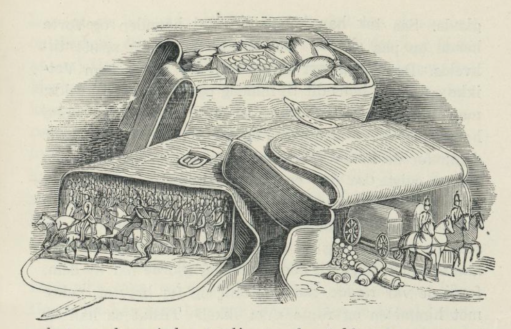

# Vetikke

I skythernes land, der hvor ungarerne er fra, var der engang en konge. Hans kone fikk en sønn, og sønnen ble kalt Dani. Den samme natten, samme time, ja samme minutt fikk en hoppe i stalden en følunge, og derfor ga kongen den føllen til Dani. Da gutten var begynt å gå på skolen, var han riktig flittig til å lese og skrive; men han hadde den vanen at han alltid, før han gikk på skolen og med det samme han kom hjem igjen, måtte ned i stalden og se til føllen sin og klappe den.

En gang som kongen skulle i krig, satte han en marskalk til å passe på konen og barnet sitt. Men nå var marskallen og dronningen glad i hverandre. Dronningen var redd for Dani; fordi han var så klok, og derfor syntes hun og marskallen det var best å gjøre ende på gutten. Marskallen spurte nå dronningen: «Hva skal vi gjøre for å bli kvitt gutten?» Hun svarte: «Jeg er moren hans, og jeg vet hvorledes han gjerne vil ha det. Jeg stikker en spiss kniv ned ved sengekanten hans. Når han legger seg, kjæler og klapper jeg ham; men det liker han ikke, derfor snur han på seg og stikker seg i hjel.»

Da kongssønnen kom ned for å se til føllen sin den dagen, merket han at den var stur. «Hva er det som feiler deg, da, føllen min?» sa han. Men føllen ville ikke si noe da; for kusken stod der; derfor hang den bare med hodet og tenkte ved seg selv: «Når han har vært på skolen, så kommer han inn til meg igjen.» Så snart Dani var kommet hjem fra skolen, løp han ned i stalden til føllen, og nå var der ingen andre der. Han begynte å klappe føllen og sa: «Hva er det som feiler deg, føllen min?» Med det samme begynte føllen å snakke og sa: «Det feiler meg ingenting.» Dani ble rent redd. «Hva for noe, kan du snakke også?» sa han. — «Å, ja, det kan jeg nok. Men hør nå her, skal du få vite hvorfor jeg er så lei meg. Mor din er glad i marskallen og vil drepe deg.» Og så sa føllen hvordan gutten skulle gjøre til natten. Han gjorde som føllen sa; han kledde ikke av seg, men la seg på benken og ble liggende der til om morgenen. Dronningen og marskallen undret seg svært over at gutten bar seg slik ad. Nå begynte de å snakke om hva de så skulle finne på. Dronningen visste at Dani var glad i det som var søtt, derfor ga hun ham mange slags sukkerkaker, og på de beste strødde hun gift.

Den neste dagen, da Dani skulle på skolen, gikk han først ned til føllen sin. Den sa: «De fikk ikke gjort ende på deg i går; men du må passe deg i dag også.» Så ba føllen Dani så vakkert at han ikke måtte spise sukkerkaker. Med det samme Dani kom fra skolen, løp han inn til føllen igjen, og den ba ham igjen om å passe seg. Han gjorde som føllen hadde sagt. Ved bordet spiste han litt suppe og stek; men da sukkerkakene kom, takket han for maten, reiste seg fra bordet og gikk sin vei. Da sa marskallen til dronningen: «Vet du hva du nå må gjøre? Nå kommer snart kongen hjem. Da må du late som du er syk og si til ham at du ikke kan bli frisk igjen før du får spise leveren av føllen til Dani. Det er den som er skyld i alt sammen. Det er ikke Dani som er så klok. Følg nå bare mitt råd, så skal du se det går.»

Ikke før var kongen kommet hjem, før dronningen begynte å klage over at hun var så syk, og at ikke noe annet kunne gjøre henne frisk enn leveren av Danis føll. «Ja, når du endelig vil ha den, så skal jeg la den slakte straks. Bare vent litt til Dani kommer hjem, så han kan få se den én gang til,» sa han. Dani kom hjem med det samme, og kongen sa til ham: «Vi må slakte føllen for din mors skyld.» «Ja, kjære far,» svarte Dani, «bare vent litt, til jeg får på meg ridestøvlene.» Nå sprang Dani så fort han kunne ned til føllen. Den var svært sorgfull og sa at Dani skulle be sin far om å få lov til for siste gang å ri tre ganger rundt om gården. Så skulle han be om et beger vin, først skulle han drikke sin fars skål, og så sin mors og marskallens og ønske dem til lykke; fordi de ikke hadde fått gjort det vonde de hadde funnet på. Dani gjorde som føllen sa. Da han hadde fått på seg ridestøvlene, falt han på kne for faren, og han ga ham lov til det han ba om. Nå red han gården rundt tre ganger, så tok han begeret med vin og sa: «Først skåler jeg for min far, og så for mor og marskallen; fordi de ikke har fått tatt livet av meg, som de gjerne ville.»

Med det samme Dani hadde sagt det, fór hesten avsted med ham ut av slottet og bort gjennom syv ganger syv land.

Da kongen hørte det Dani sa, lot han marskallen drepe, og dronningen ble satt i fangetårnet. Men Dani kom ikke igjen for det. Og da kongen var svært glad i dronningen, tok han henne ut av fangetårnet og tilga henne.

Men føllen bar kongssønnen Dani til London. Der satte han ham av på en eng og sa: «Min kjære herre, jeg førte deg hit til England, for at du kan bli konge her en gang, hvis du vil følge mitt råd.» Det lovet Dani. Da sa føllen: «Hvem det er som spør deg, og hva de så spør deg om, skal du aldri svare annet enn: 'Vet ikke.'»

Så gikk Dani inn i byen, og straks var der noen folk som spurte ham: «Hva er du for en?» «Vet ikke,» svarte han. «Hvor kommer du fra?» — «Vet ikke.» Aldri svarte han noe annet, og da han hadde vært et par dager i byen, fikk kongen vite at der var kommet en ung, vakker gutt dit, som ikke svarte annet enn «vet ikke» til alt han ble spurt om. «Det er godt,» sa kongen, «la ham komme hit til meg, han skal være kjøkkengutt.» Kongen likte ham med det samme han så ham og spurte: «Hva heter du?» «Vet ikke,» svarte gutten. Kongen lot ham gå ned i kjøkkenet og sa til overkokken at han aldri måtte slå gutten, hva han så gjorde. Nå var det den skikken der i kjøkkenet at én måtte være hjemme om søndagen og passe varmen, mens de andre gikk i kirken. Da det ble guttens tur til å være hjemme, sa de andre til ham at han måtte legge på varmen, sette kjøttet på og passe på at det kokte. Det gjorde han også; men han strødde fullt av aske på kjøttet. Da så de andre kom hjem og så hvordan han hadde stelt med kjøttet, ble de sinte på ham. Men de turte ikke slå ham, og om de skjente på ham, var han likegyldig, og hvis de spurte: «Hvorfor har du gjort det?» så svarte han bare: «Vet ikke.» De måtte kaste kjøttet og sette på nytt. Men siden fikk gutten navnet Vetikke.

Vetikke gjorde så mange skøyerstreker på kjøkkenet at overkokken til slutt ba kongen sette ham til noe annet. Nå skulle gartneren ha noen til å passe hagen når han selv hadde noe annet å gjøre. En søndag var gartneren gått i kirken som han pleide, og der var ingen andre hjemme enn Vetikke og en av prinsessene som hadde vondt i hodet. Da kom føllen til ham og spurte om han var frisk, og hva han bestilte. Vetikke fortalte alt det som var hendt ham. Da ga føllen ham et bissel og sa: «Hvis du trenger meg, så trekk bare i bisselet, så kommer jeg til deg på øyeblikket. Trekk nå i bisselet!» Det gjorde han, og straks stod der en vakker rød hest, og en kobberrustning var der også. Den tok Dani på seg og red i galopp gjennom hagen. Alt dette så prinsessen gjennom vinduet; men hun snakket ikke om det til noen. Da gutten var ferdig med å ri, ristet føllen seg litt, så ble den som den hadde vært før igjen og gikk sin vei; men gutten gjemte seg bak en kiste som stod i stalden, og bisselet gjemte han også så ingen kunne finne det.

Da gartneren kom hjem fra kirken og så hvordan det så ut i hagen, skrek han: «Hva er det på ferde her? Vetikke, hvor har du gjort av deg? Ja, jeg skal lære deg å passe hagen!» Men kongsdatteren ropte til ham fra vinduet at han ikke måtte slå gutten. Han ropte da bare på ham, og da han så benene på ham som stakk frem fra kisten, sa han: «Kom frem Vetikke! Hvorfor har du ikke passet bedre på?» «Vet ikke,» sa gutten. «Hvis du ødelegger blomstene slik en gang til, så skal du få!» «Vet ikke,» svarte gutten igjen. De måtte arbeide en hel uke før de kunne få hagen slik som den hadde vært før. Kongen hadde også fått vite hva der var gått for seg mens han var i kirken, og Vetikke hadde passet på. «Å ja,» sa han bare, «se til å få det i orden igjen.»

Den neste søndagen gikk de i kirken igjen, og Vetikke og kongsdatteren var igjen hjemme. Hun gjorde seg syk; for hun trodde hun skulle få se ham ri igjen. Og slik gikk det også. Med det samme de andre var borte, trakk Vetikke i bisselet. Straks kom det en deilig sølvhvit hest. Han satte seg på den og trampet ned alt som var i hagen, enda verre enn første gangen. Kongsdatteren så ut av vinduet, og hjertet hoppet i henne da hun så hvor vakker Dani var i sølvrustningen på den prektige hesten. Da Dani hadde ridd fra seg, ristet hesten seg igjen, og gutten gikk og gjemte seg. Men da gartneren kom hjem og fikk se hagen, gikk han nesten fra sans og samling. «Din skøyer!» sa han til Vetikke, «jeg skal lære deg å passe hagen.» Han sa bare som han pleide: «Vet ikke.» Det tok lang tid, og det var mye bry med å få hagen i orden igjen. Den tredje søndagen var også alle gått i kirken, og Vetikke var alene hjemme. Kongsdatteren lot som hun var syk da også; for hun tenkte den vakre gutten kanskje kom igjen. Så snart de andre var gått, ristet Vetikke bisselet, og straks stod der en gyllen hest der, selv tok han på seg en klædning utsydd med gull, og nå satte han seg på hesten og red i full galopp rundt i hagen, helt til der ikke fantes en flekk som ikke var trampet ned. Men denne gangen lot ikke kongsdatteren vinduet være igjen; men hun lukket det opp, og støttet hodet i hånden mens hun så på Vetikke. Det la Vetikke straks merke til, han sprang ned av hesten og bort til henne og kysset henne på hånden; men han sa ikke et ord. Da sa kongsdatteren til ham: «Si nå et ord. Jeg vet du kan snakke når du bare vil.» Men han red avsted igjen, gikk av ved stalden, hesten ble borte med én gang, og selv ga han seg til å gå opp og ned i gården. Kongsdatteren skjønte godt at Vetikke var av fornem slekt; men at han var bedrøvet over noe han ikke ville snakke om, og nå ble hun også bedrøvet. Da de andre kom hjem fra kirken og så at hele hagen var trampet ned, spurte de Vetikke: «Hvem har gjort det?» «Vet ikke.» «Hvorfor har du ikke passet på?» «Vet ikke.» Først ville de ta og jule ham opp; men da han aldri svarte annet enn «vet ikke», så tenkte de han ikke var riktig klok, og så lot de ham gå. En gang sa kongen til døtrene sine: «Nå må vi riktig se til å skaffe dere en mann, ellers kan dere komme til å gå her og bli gamle jomfruer.» Kongen ba da til seg alle de kongssønnene som fantes i de nærmeste kongerikene, og alle unge folk av fornem slekt, for at døtrene hans kunne velge den de syntes best om, hvem det så var. De to eldste prinsessene tok hver sin kongssønn; men den yngste fant ingen hun likte. Hun sa: «Min far har jo gitt oss lov til å ta hvem vi vil enten han er fattig eller rik, derfor ber jeg ham at han vil la alle dem som bor her i kongsgården, komme sammen.» Nå kom de da frem alle sammen; men hun ville ikke ha noen av dem, men spurte: «Er det ikke flere her i gården, da?» «Å, jo,» svarte de; «men det er én som du nok ikke kan få, det er Vetikke.» «La ham bare komme,» sa hun. Da han kom inn i salen, spurte hun: «Hva heter du?» «Vet ikke.» Da sa kongsdatteren: «Nå er jeg din, og du er min.» Alle undret seg over dette; men det var ingenting å gjøre ved det. Faren ville ikke ta sitt ord tilbake, og så ble alle de tre parene viet.

Mens de andre var lystige og glade i bryllupet, sa Vetikke ikke et eneste ord, men gikk inn i værelset sitt. Da de andre så han var borte, sendte de bud etter ham og sa han måtte komme igjen; men han sa bare: «Vet ikke.» Da bryllupet var over, sa de andre til kongen at Vetikke kom til å gjøre altfor stor skam på dem; derfor måtte kongen sette opp et plankehus utenfor slottet; der kunne han bo med konen sin. Og det gjorde kongen også. En gang gikk de to kongssønnene, som hadde giftet seg med de to eldste kongsdøtrene på jakt, og de ba Vetikke om å bli med. Men han sa bare: «Vet ikke.» «Ja, men vi vet det, din tosk,» sa de andre og gikk. Men Vetikke trakk i bisselet så ingen så det, og straks kom den røde hesten med kobberrustningen, og så red han langt forbi dem og møtte dem igjen, akkurat som om han alt kom tilbake fra jakten. Da de så ham, sa de til hverandre: «Hva kan det være for en kongssønn? Han må være fra et fremmed land, hele rustningen hans er av bare kobber. Hvor kommer Deres høyhet fra? Vil De ikke jage med oss?» «Jeg er alt ferdig med jakten,» sa han og viste dem en gullånd han hadde med seg. Da så de på hverandre og sa: «Den skulle det være godt å ha, bare han vil gi oss den. Med den kan vi vinne stor ære.» Så spurte de ham hva han ville ha for anden. «Den får dere ikke for penger,» sa han, «men kan jeg få festeringene deres, skal dere få den.» De tenkte seg litt om; men så sa de: «Vi kan godt la ham få dem. Vi kan la gullsmedene lage oss noen nye.» Så fikk han dem, og de spurte igjen hvem han var. «Jeg er kongen av Plankenborgs sønn,» sa han. De sa farvel til ham og red fornøyd hjem; men Vetikke red foran dem, tok andre klær på, og da de kom, stod han i døra. De sa: «Nå, svoger Vetikke, hvorfor gikk du ikke med oss? Se, hva vi har fått på jakten?» «Vet ikke.» «Ja, men vi vet det, din tosk.» Kongen ble svært glad over gullanden; for slikt vilt var aldri sett i hans land før.

Neste dag drog de igjen avsted på jakt og ropte til Vetikke: «Kom og bli med, svoger!» «Vet ikke.» «Å, la den tosken være i fred,» sa den ene. «Vet ikke.» De red videre; men Vetikke kom foran dem på en sølvhvit hest, og sølvrustning hadde han. Da de fikk øye på ham, sa den ene: «Der er den kongssønnen vi møtte i går.» «Nei,» sa den andre, «han hadde jo kobberrustning.» De hilste på ham og spurte om han ikke ville jage med dem. «Nei takk,» sa han, «jeg har alt jaget.» Og så viste han dem en gullhjort. Den syntes de nå svært godt om og spurte hva han ville ha for den. «Dere får den ikke for penger,» sa han; «men hvis dere vil la dere brenne på pannen med denne gullringen her, så skal dere få den.» De så på hverandre. «Å ja, det gjør jo litt vondt,» sa den ene; «men under håret er det ingen som ser det.» Så lot de seg brennemerke. Det gjorde forferdelig vondt; men de var så glade at de ikke kjente stort til det. De spurte nå hvem de hadde den ære å tale med, og han svarte: «Jeg er kongen av Plankenborgs sønn.» De sa farvel og red hjem; men Vetikke kom først, og han stod i porten i hverdagsklærne sine da de kom. De gjorde nar av ham og sa: «Se hva vi har fått på jakten!» «Vet ikke.» «Nei, for du er altfor dum,» sa de. «Vet ikke,» sa han. Kongen var mange, mange ganger gladere over hjorten enn over anden.

Tredje gangen de skulle på jakt, ropte de også på svogeren. Han svarte bare: «Vet ikke;» men så red han foran dem på sin gyldne hest og i gullrustningen. Da de så ham, sa de: «Der er kongen av Plankenborgs sønn.» Da de kom nærmere, kjente de ham tydelig og spurte ham hvor han kom fra. «Fra jakten,» sa han. «Hva har De skutt?» «En prektig gullgås.» Da de så den, ble de rent fra seg av glede og ville endelig ha den. «Ja,» sa han, «dere skal få den; men da vil jeg brenne en galge på ryggen deres.» Vondt gjør det; men det er jo ingen som kan se det, og så lot de ham brennemerke dem som han ville. Så red de hjem med den prektige gullgåsen som de så dyrt hadde betalt. Så gjorde de seg riktig til for kongen, og han syntes dette var det aller beste de hadde fått på jakten. Nå ga føllen Vetikke tre skrepper og sa: «Din svigerfar får snart krig med kong Markus Mais, og når du merker det blir ille for ham, skal du trekke i bisselet, så kommer jeg, og så skal vi hjelpe ham, uten at han kjenner oss.» Den ene skreppen var full av soldater som kom frem når en ville ha dem, i den andre var alt som behøves til å skyte med, og i den tredje var der fullt opp av mat og drikke.

Da Vetikke hadde snakket med føllen, tok han hverdagsklærne på og gikk hjem. De hadde lett etter ham overalt, og derfor spurte konen og svogrene hans med én gang: «Hvor har du vært hen Vetikke. Nå ser det ille ut; for nå har vi fått krig.» «Vet ikke,» svarte han. Neste dagen kom der bud at slaget skulle stå om morgenen. Alle folk måtte gjøre seg ferdige, og tidlig om morgenen red også kongen ut med de to svigersønnene sine. Markus Mais vant og jaget kongens folk ut av landet. Da kongen kom hjem, var hele hoffet i sorg, især konen til Vetikke; for hun tenkte: «Hva skal jeg nå gjøre med den stakkars mann min, snakke kan han ikke, og noe annet kan han heller ikke.» Til Vetikke sa hun: «Kjære deg, hva skal vi gjøre nå når far min mister landet sitt? Hva skal vi leve av?» «Vet ikke,» sa Vetikke og hoppet høyt av glede. Så tok han konen sin ved hånden og førte henne opp på slottet. Der satt de nettopp og spiste til kvelds. De ble svært forundret; for aldri kom Vetikke og konen hans dit til middag og slett ikke til kvelds; men Vetikke gjorde tegn til dem at han og konen hans ville spise med dem, og de tok med glede imot dem; for de hadde aldri sett ham så lystig. Mens de satt og spiste, sa den ene av svogrene: «Jeg skjønner ikke at Vetikke kan være så glad, han burde heller være bedrøvet.» Men da sprang Vetikke opp, tok en stokk og ropte lystig og glad: «Vet ikke!» Så svinget han stokken, hogg til alle kanter og gjorde nar av dem fordi de var redde, så slo han seg for brystet, pekte mot himmelen og ropte «Vet ikke.» Til slutt sa han og konen hans farvel og gikk hjem. Alle de andre forundret seg over at Vetikke var så glad. Den neste morgen stod alle soldatene ferdig opstilt i gatene, begge svogrene red i galopp fra slottet midt mellom rekkene, like bort til Vetikke og sa: «Kom nå svoger, og vær med i krigen! I går hogg du dyktig fra deg.» Men han lot som han var svært bedrøvet og sa: «Vet ikke.» Da de andre var langt borte, trakk han i bisselet, og straks stod føllen der. «Kjære herre,» sa den, «nå er du fri. Du har holdt ditt ord. Fra nå av kan du snakke.» Du kan ikke tro hvor glad Vetikke ble. Han førte føllen inn i gården, sprang bort til konen sin og sa til henne: «Nå kjære, søte konen min, vær ikke redd og ikke bedrøvet, alt skal ende godt.» Konen hans ble svært glad over det han sa; men han sa hun ikke måtte fortelle sin far at han kunne snakke, og ikke at han gikk med i krigen. Så tok han en panserskjorte på, kysset henne og red bort. Med det samme han kom ut av byporten, lukket han opp den ene skreppen, og da kom der så mange soldater ut at det var fælt å se. Han drog frem med dem og kom akkurat da Markus Mais slo hans svigerfar. Da kongen så der kom en stor hær i ryggen på ham også, ble han rent ute av seg; men Vetikke sendte en mann med en hvit fane for å vise han var en venn som ville hjelpe ham. Kongen kunne ikke skjønne hvordan dette hang sammen og fortsatte å flykte; men Vetikke ropte til ham: «Jeg er kongen av Plankenborgs sønn! Vi må snakke mer med hverandre!»

Nå lot Vetikke de trette soldatene hvile seg og førte frem sine egne, og da de hadde holdt på å slåss i to timer, lot han som han var såret. Han stakk hull i den ene ridestøvlen sin på mange steder og helte blod i den, og så lot han som han ikke så det. Så red han tilbake og sa: «Vær ikke redd! Seieren er vår!» Med det samme sa kongen: «Men prins av Plankenborg, De er jo såret!» «Hvor?» spurte han. «I foten, blodet flyter jo ut av støvlen.» «Ja, nå ser jeg det. Å, vær så snill å gi meg halvdelen av halstørkleet Deres, så jeg kan binde det om såret.» «Ja, gjerne det,» sa kongen, «om De så ba meg om skjorten jeg bar på meg, skulle De få den.» Så fór Vetikke tilbake til krigen og drev kong Markus Mais helt ut av landet.

Nå var krigen endt, og kongen ba prinsen av Plankenborg følge med seg, så han bedre kunne få takke ham for den store tjeneste han hadde vist ham. Men han ville ikke, han skulle nok komme en annen gang. Da de skiltes, satte han seg ned, akkurat som han ville la soldatene sine hvile godt ut; men da de andre var langt borte, puttet han dem inn i skreppen igjen, gikk så hjem og fortalte konen sin at nå var krigen lykkelig over. Så ba han henne ikke si noe, hun kunne gjerne le og holde leven; men hun måtte ikke fortelle noe. Han sa også at hun godt kunne snakke om at Vetikke hadde pekt mot himmelen og vært glad. Det hadde nok ikke vært for ingenting; for nå var jo sorgen blitt til glede. Men især skulle hun spørre svogrene om hva for slags heltegjernmger de hadde gjort i krigen, og hvorfor de ikke hadde tatt Vetikke med, så kunne han da lært å snakke i alle fall. Nå hørte de musikk utenfor. Da gikk Vetikke utenfor døra og så svært bedrøvet ut. Begge svogrene kom og ropte til ham: «Din dovenlars, hvorfor lever du i verden når du ikke vil annet enn dovne deg? Nå har vi vært ute og frelst land og rike; men hva har du gjort?» «Vet ikke,» sa Vetikke.

Om kvelden var der stort gjestebud på slottet; men Vetikke snek seg vekk og gikk hjem og stilte soldater rundt om huset med kanoner og skiltvakter. Men konen hans ble igjen, og hun begynte å spørre svogrene om det Vetikke hadde bedt henne om. Men de bare roste seg selv. Da hun så spurte hvorfor de ikke hadde tatt med seg Vetikke, slo de opp en høy latter og sa: «Ta med en slik tosk! Jo, det skulle riktig være noe!» Da de ikke så Vetikke i salen, sendte de en mann etter ham; men da han fikk se alle soldatene, løp han tilbake og sa: «Det går ikke an å sende bud til ham. Jeg skjønner ikke hva der er på ferde.» Så tok han et par soldater med seg, gikk mot Vetikke og ropte: «Kongen befaler at De skal komme.» Han svarte: «Da han er min svigerfar, fortjener jeg ikke at han behandler meg slik, og jeg kommer ikke til ham før han kommer til meg.» Kongen gikk da ned til ham; men da kongen kom, var alle soldatene borte og Vetikke falt på kne for kongen og sa: «Jeg takker for den store nåde.» Så reiste han seg og ba kongen vise ham frem for de andre, slik som han var nå, kledd i fløyel og rød kongekappe. Alle forundret seg over hvor fin han var blitt, og at han kunne snakke så godt.

De begynte nå å snakke om kongen av Plankenborgs sønn, og om at de alle hadde vært ulykkelige uten ham. Da sa Vetikke: «Kjenner dere dette halstørkleet?» Ja, de gjorde da det. «Ja, så behøver dere ikke lete langt etter ham. Jeg kalte meg slik; fordi jeg bodde i et plankehus.» Så viste han frem begge ringene, om noen skulle kjennes ved dem. Kongssønnene sa begge med én gang: «Det er min.» «Ja,» sa han, «ringene har svogrene mine gitt meg for en gullånd, og hvis dere ikke tror det, kan dere se brennemerket på pannene deres, ja, de skammet seg ikke en gang over å la brenne en galge på ryggen sin for en gullgås.» Straks ble det sett etter om det var sant, og det viste det seg jo at det var. Nå var der ingen i hele verden som kunne lignes med Dani, kongssønnen, også kalt Vetikke. Kongen ga ham sitt rike og lot ham krone i London. Ingen brydde seg mer om svogrene; men Dani levde lykkelig med konen sin og var snill mot føllen sin så lenge han levde.
