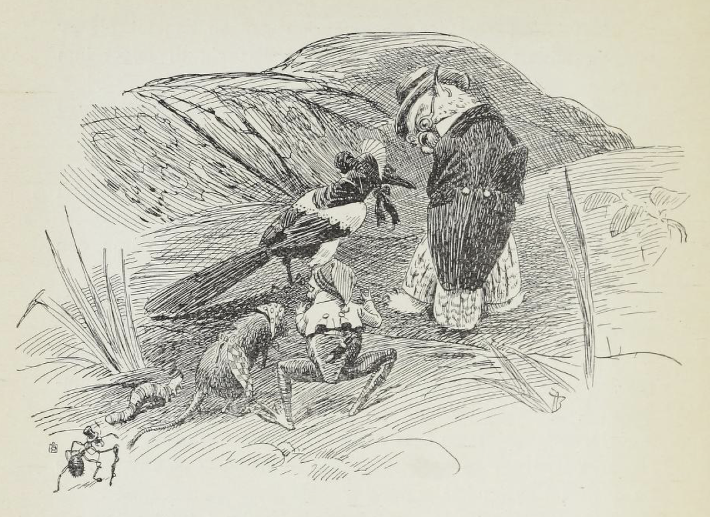

# Da bjørnen for til jords

Det var stor sorg i skogen. For bjørnen var død, og det er ikke greit, må vite, å miste landets fader. Og skogen strødde granbar, og kråker og korp kledde seg i svart, i trærne suste det, i ur og fjellkløvter ulte det sårt; for i dag var gravølets dag.

Større likferd enn det som nå var ute, hadde de ikke sett i manns minne i skogen. Og grevlingen, han som graven grov, mente på det, at gildere lik var det nå heller ikke faret i jorden i hans tid, og han hadde gravet ned mange.

Fra Kivdalen drog de ut, der sørgehuset var, og til stormyra skulle de, der skogen hadde sin store kirkegård.

Og så lang var ferden, at da snuten på elgen som drog liket, kom frem på stormyra, så bjørnebinnen som satt igjen i Kivdalen og gråt, den siste muserumpe bli borte nede i Kivdalsvingen, der skogens kirkevei gikk.

Det var dødens stillhet da ferden drog frem. Etter liket kom reven, for han var prest i skogen. Etter reven kom ulven og gråt og bar seg, for han var av nærmeste slekten og skulle arve. Etter ulven kom jerven. Han hadde faret over alle fjell for å hedre slekten sin.

Og bakover i følget kom alle skogens dyr, mindre og mindre, og alle hadde de slik sorg og bedrøvelse, fordi bjørnen var død.

«Det er tungt at de beste skal vandre,» sa reven.

«Den som lærte ham å kjenne, glemmer ham aldri,» sa elgen.

«Mø! Aldri skal jeg glemme den gangen han tok seg av meg og mine,» sa kua — hun hadde slått seg til følget hun også.

«Nehehei —» sa bukken, han gikk der med langt skjegg og halen ende til værs av skjære bedrøvelsen.

«Og slik familieforsørger som han var,» sa ulven.

«Det er sant!» skrek en høk, den fløy og stilte og slo lavt over trærne der følget drog.

«Jeg skjønner ikke hvordan det skal gå, jeg,» sa haren, den skvatt hit og dit og var rent som forstyrret av sorg.

«Slik støtte han var for oss småfolk — ih ih ih,» sa hakkespetten.

«Og så rent som han holdt det i skogen! Det var grei skuring det,» sa grisen — den måtte støtte seg opp mot en granlegg i bare bevegelse.

«Ja, det var et tap,» sa skjæren.

«Å barna! Å barna!» sa kråken — den satt på en grantopp og strakte hals og bar seg.

«Uhuhu! Jeg kjente det på meg! Uhuhu!» tutet uglen.

«Å ja — å ja, den veien skal vi alle dra!» sa kålmarken — den var med i gravølet, for den hadde tatt mål av kisten.

Men bakerst i følget krabbet en maur. Den var liten og eitrende sint og sa ikke et ord, men tenke gjorde den så det forslo.

Og da bjørnen vel var kommet i jorden, og da reven hadde gjort hva den skulle ved graven, snudde følget nesen hjemover, og så kom mauren først.

Men som de gikk og gikk og ikke sa et ord, tok sinnet mauren.

«Gudskjelov!» sa den.

«Hva for slag?» spurte musen, hun gikk baketter.

«Ingenting,» sa mauren, den var så sur som syre.

«Ja det samme sier jeg,» sa musen.

«En skal ikke si alt en vet,» svarte mauren.

«Jeg vet en historie, jeg,» sier muldvarpen.

«Hoho!» lo gjøken — den gjemte nebbet.

«Hysj!» hysjet århanen — den ble rød i toppen av bare undseelse. «O ho ho ho ho—ho!» lo den.

«Ha ha ha!» lo skjæren, men tok seg i det.

«Å, en kan nå si hva en vil, så var han en bra kar,» knurret skogduen.

«E — mø!» sa kua og vrengte med øynene. «Meg stjal han en kalv fra — e mø!» rauted hun.

«Å for en røver!» sukket reven.

«Uh for et ubest!» hylte ulven.

«Huff, jeg er så glad han er død!» hutret haren og skvatt hit og dit.

«Åh! Åh! Åh! Åh!» føset grisen og satte avsted i kåte byks hit og dit innover.

Og elgen gjorde et hopp, himmelhøyt, og la på sprang så vasspruten stod, og ulvene hylte, revene skrattet, og kråkene skrek, og musene knistret, og det var en jubel i skogen, så alt stod i røk, fordi bjørnen var faret til jords.

Men langveis fra syd kom en flokk grågås farende, og da de fikk se og fikk høre alt det syndige leven i skogen, ble de livende redde — allting gikk i stykker for dem, og de kaklet og kaklet:

«Å du! Nei, nå har jeg aldri hørt maken! Nei maken har jeg aldri hørt! Har du hørt maken? Nei maken —! Og du!»

Og slik kaklet de, så lenge en kunne høre dem nordover.

«Hi, hi, hi!» lo mauren, han satt igjen alene nede i seterveien og frydet seg så inderlig at eiteret sprutet av ham.

Men høyt oppe i luften steg en ørn i svære ringer for å få se hva det var for en uro i skogen. Og da den var kommet høyt nok opp, ble den stående stille på en flekk av bare forundring. For den syntes den så en maur nede på veien. Og så steg den høyere og høyere for å se bedre.

«Hva er det?» skrek den. «Hva er det?»

Mauren skvatt til, satte seg opp og lyttet.

«Jeg følger ikke,» sa den.
