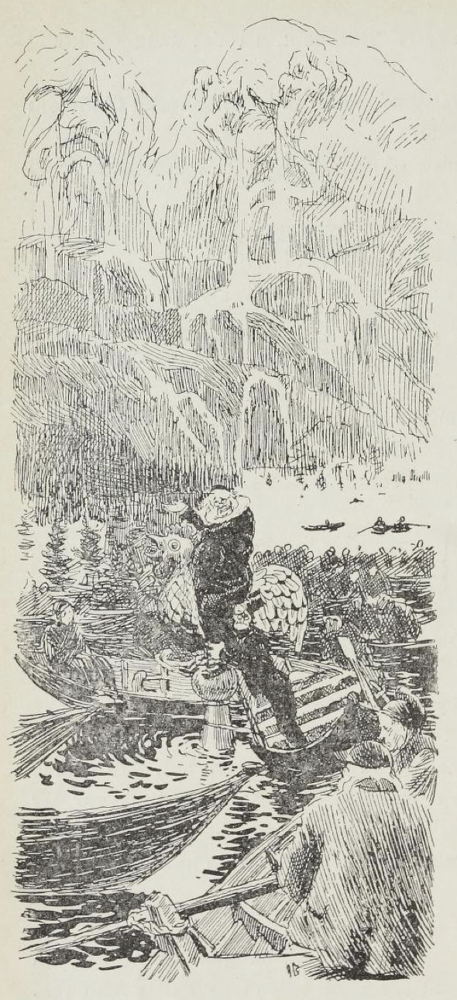
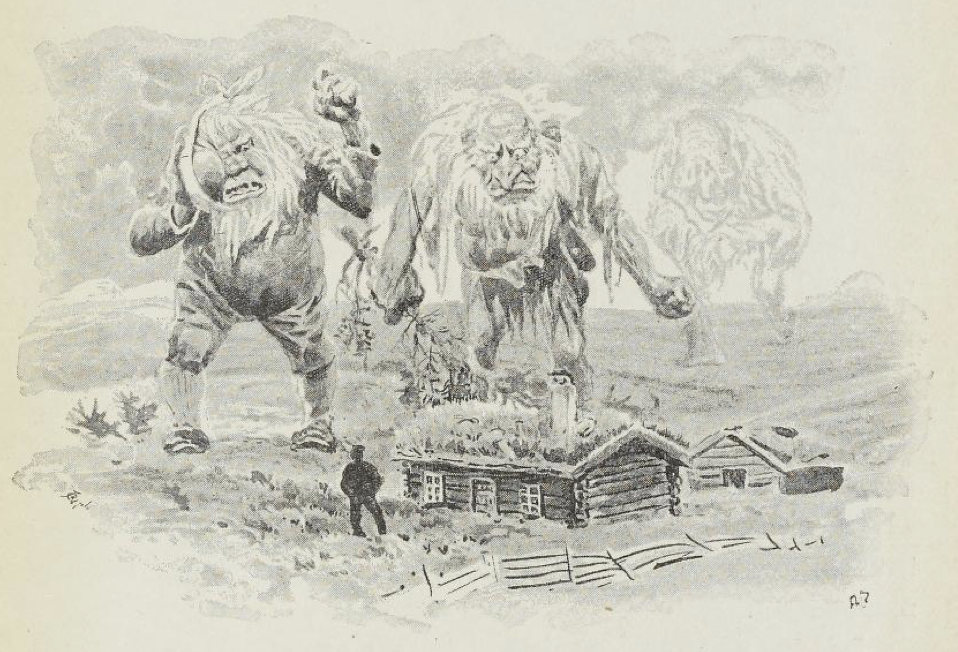
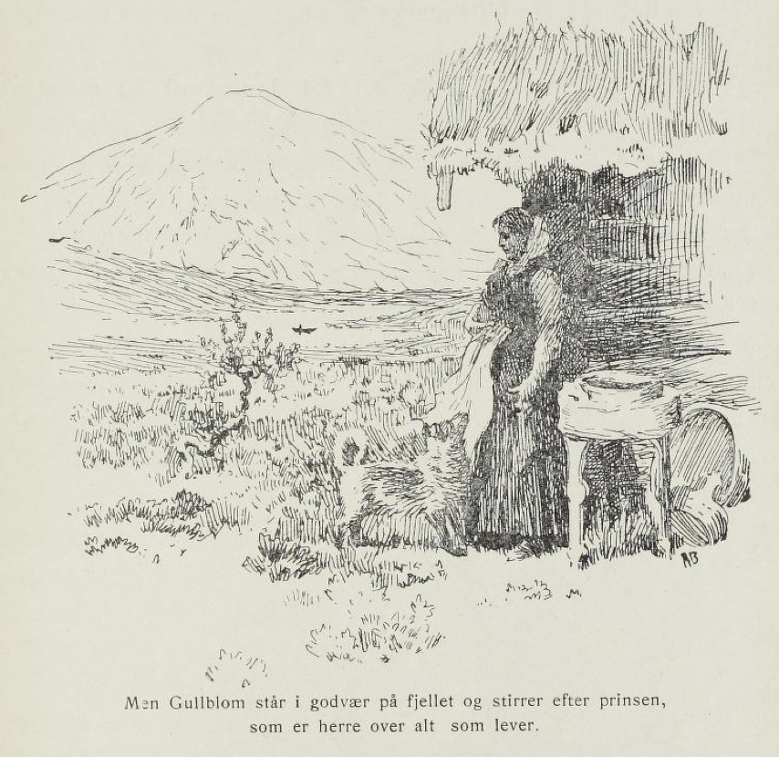
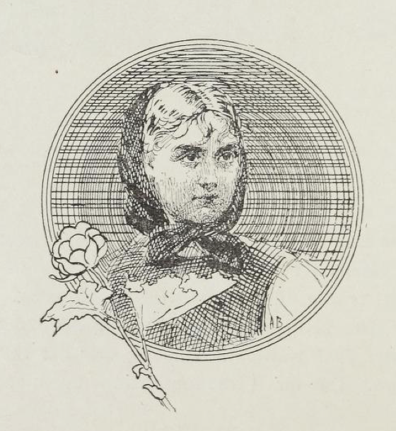

# Gullblom

I tyve år levde Trolljo og konen hans på fjellet i herlighet og glede. Og barnet deres vokste opp og ble til den vakreste jente du skulle se. Gullblom kalte de henne; for når solen skjen på håret hennes, var det som gull så blankt; men om kvelden, når varmen lekte, var det som kobber så rødt, og øyne hadde hun som svarte natten. Troll hadde hun aldri sett og ikke stort til mennesker heller, andre enn far sin og mor si; for det er vondt om folk på fjell, må vite.

Så var det en dag Gullblom satt i den åpne budøren med brodingen sin. Rett som hun satt, hørte hun det rope i øst:

«Gullblom, vil du ha meg, svar nei eller ja!»

«Vil ingen ha!» svarte Gullblom så det sang over viddene.

«Ha, ha, ha!» svarte det i Sølenfjell, og duren fra Nekfallet hørtes innimellom.

Så satte hun seg til å brode på livet sitt igjen. Men ikke før hadde hun fått brodingstikken full, så ropte det i nord:

«Gullblom, Gullblom, vil du ha meg, du?»

«Har en annen i huet!» svarte Gullblom, så det klang over viddene.

«Hu, hu, hu!» svarte det som gråt og sorg i Trondfjell langt mot nord.

Så satte hun seg til å brode på livet sitt igjen. Men ikke før hadde hun fått brodingstikken full, så ropte det i vest:

«Gullblom, vil du ha meg, du trollfagre mø?»

«Før vil jeg dø,» svarte Gullblom, så det sang og klang over viddene.

«Dø —» svarte det fra Rondane langt borte. Så gikk Gullblom inn og fortalte far sin dette.

«Meget rart kan hende på fjellet,» sa han, han skjønte hva frierskap han hadde fått.

Så går han midt ut på fjellet og roper:

«Trollpakk, trollpakk, kom selv, vil dere fri!»

«Har ikke tid,» svarte det i øst. Det var Sølentrollet, som satt under Nekfallet med jekselens sin.

«Har ikke tid,» svarte det i nord. Det var Trondtrollet som satt og blødde neseblod enda.

«Har ikke tid,» tordnet det i stillheten langt, langt borte. Det var Rondetrollet, som satt med den ene foten i Atnesjøen og den andre i Savalen og ventet på at solen skulle gå opp i vest og gå ned i øst.

«Da får dere aldri datter mi,» svarte Trolljo, han gikk inn i bua igjen.

En fjorten dagers tid etter at dette var hendt, ble der en flom over alle daler, så stor at slikt hadde ingen sett i manns minne, og til slutt ble den så overlags, at når presten skulle preke, måtte han stå på kirkespiret, og når klokkeren skulle si amen, måtte han krype opp på skuldrene til presten.

Og rundt om satt folk i båtene med salmebøker og hørte på.

Og folket i dalene sendte bud til kongen sin, han som skulle være herre over alt som lever, og spurte, hva dette var for slag. Men kongen skjønte det ikke. Og så sendte han prinsen sin bare opp på ville fjellet for å spørre Trolljo hva det skulle være for slag.

«Skal se etter,» sa Trolljo.

Så gikk han midt opp på høyeste åshaugen. Å jo, da fikk han nok se hva det var som var skyld i den ustygge flommen. For der satt Sølentrollet og Trondtrollet og Rondetrollet hver på sin haug og gråt, så det silte over alle fjell.

«Hva rømmer dere for?» skrek Trolljo.

«Datter di vil ikke ha oss,» svarte trollene og drev på og gråt.

«Er det noe å rømme for, det da, lange og voksne som dere er,» sier Trolljo. Så går han ned av fjellet igjen og forteller prinsen at derfor er det flom, fordi trollene ikke kan få datter hans.

«Nei, før skal hele syndens flod gå over verden en gang til og det både i år og dag, før trollene skal få datter di,» sa prinsen, han så blidt på Gullblom. Dermed drog han til dals igjen. Men hun ble både rød og blek for det stakk til i hjertet hennes med noe hun aldri hadde kjent før. Og hun ble sittende og stirre bort over fjellet etter prinsen hele halve dagen.

Fjorten dager etter at dette var hendt, kom der et forferdelig tordenvær. Trolljo og kvinnfolkene hans satt inne i bua og bøttet fiskegarn.

Rett som det var kom der et blink så berget brast, og et brak så jorden mest kunne forgå. Og ned gjennom låveåpningen stakk tre digre troll nesene sine inn.

«Hvem er det nå igjen da?» spurte Trolljo.

«Friere til datter di,» tordnet det der ute.

«Kunne mest tenke det,» sa Trolljo, han tok på seg helgetrøya sin og gikk ut.

Men ute stod de alle tre, Sølentrollet med et kjaketorlede og en tannverk så diger som halve Kverninghøgda, Trondtrollet så fillete og fæl at klærne laset og slang om ryggbenene på ham, og Rondetrollet så gammel og skjelven at en ikke kunne skjelne riktig hvor han stod.

Da begynte Trolljo å le, så han stod både i kors och i krok bortover.

«Er det høvelige friere slikt?» sa han; han så opp etter dem og ned etter dem og var svare så stor på det.

Men da kan du tro de ble arge, trollene.

«Jeg skal bergta datter di!» sier Sølentrollet. Det er så sint at fjell skjelver.

«Det kan du ikke,» svarer Trolljo; «for henne har Gud signet.»

«Au!» skrek trollet — tannverken tok det, så det ble både grått og blått over hele ansiktet.

«Ja, så tar jeg konen din!» roper Trondtrollet, det er så eitrende sint at haugene begynner å gå som bølger i storm.

«Det tør du ikke, for henne har jeg kastet stål over,» svarer Trolljo.

«Au!» skrek Trondtrollet, bukserne datt av det.

«Så slår jeg deg ihjel!» skriker Rondetrollet, det skjelver slik av sinne at en mest ikke kan se det.

Trolljo til å skygge med hånden over øynene og stirre både i øst og vest.

«Det skulle vel ingen ha sett noe likt til Rondanetrollet heromkring?» sa han. «De sier han skal være her; men jeg kan ikke se noen feler etter ham.»

«Au!» skrek Rondetrollet, det datt ende ned så det sang i bakken, og der ble det liggende og frese med den tannløse munnen sin.

Da stakk Trolljo hendene i bukselommen, skrev ut med benene og spyttet langt bortover fjellet:

«Slik er det, når en vil slåss med den som husbond er,» sa han.

Da ble trollene så myke og spake og ga seg til å jamre og bære seg, og det var slik sorg på dem fordi Gullblom ikke ville ha dem, at de lå som en diger svart klump borte på fjellvidden.

For det er så, må vite, at om menneskene ikke vil ha trollene lengere, så er det snart slutt med alt det slag som troll heter.

Og så spurte de Trolljo så vakkert, hva de skulle gjøre for å få datter hans.

«Få menneskesinn og menneskesans,» svarer Trolljo.

«Ja, den som det hadde,» sa trollene; «for det er svært vondt for det slaget i den siste tid,» sier de.

«Ja, nå skal dere få et godt råd,» sa Trolljo, «og det skal bli det siste, og det skal dere følge!»

«Nevn det!» ropte alle tre trollene på en gang.

«Jo,» sier Jo. «Nå skal dere gå hjem og sette dere, hver på sitt fjell, og der skal dere sitte til vind og vær har slitt trollskabelonen av dere. Da får dere menneskesinn og menneskesans,» sier han.

«Takk for godt råd; det skal vi melde grannene våre,» sa alle trollene og drog som forferdelige uvær inn over viddene.

Men sent om kvelden hørte Trolljo et stort gny og dunder fra fjellene både nær og fjern. Det var trollene i hele Norges land, som satte seg hver på sin haug.

Og da det vel var blitt mørkt og stilt, ropte det fra Sølenfjell:

«Vente!» ropte det.

«Vente! Vente!» svarte det fra Trondfjell og Rondane.

«Vente!» tordnet det i stillheten langt borte. Der satt trollene og ventet på å få menneskesinn og menneskesans, så folk kunne forstå dem. Og der kan du se dem enda.

Av somme en arm, av somme et ansikt, av nogen bare en bred rygg og en skalle igjen. Alle sitter de og venter på at vind og vær skal slite trollskabildet av dem.

Men Gullblom står i godvær på fjellet og stirrer etter prinsen som er herre over alt som lever. Og en gang kommer han, vær trygg på det.

Mer er ikke å fortelle om Trolljo og Gullblom, dattera hans.

