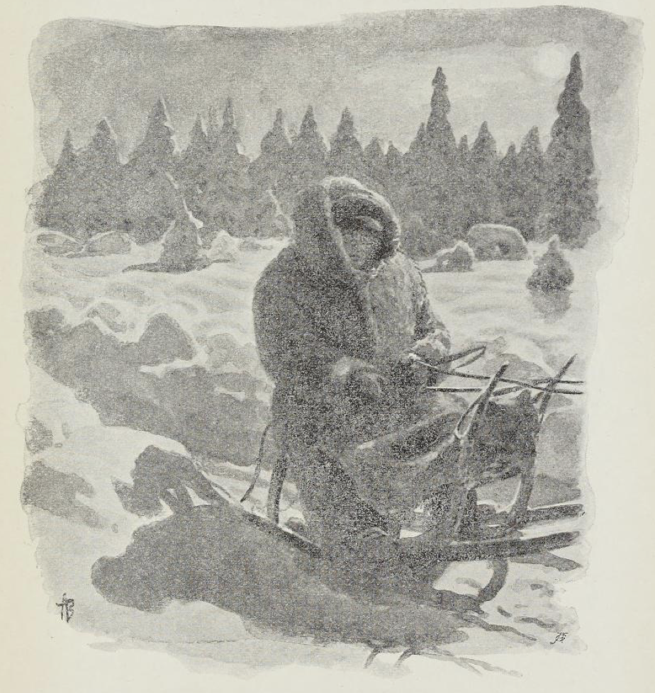

# Julsrudnissen

Oppe på Julsrud hadde det vært nisse så lenge folk kunne minnes. Og det var det underlige, at flytte ville han ikke, enda gården ble solgt både til prest og skriver og nytt bygget der det gamle falt ned.

Den første som ble var ham der på Julsrud, var han som åtte gården før gammelpresten kom. Den mannen het Ola, og han var så nidsk at han laget selepute til hesten sin av en gammel utslitt skinnbrok. Men selve hesten var så mager at den så ut som en skinnfeld på en skigard må vite.

Så var det en juledags morgen han Ola Julsrud skulle til kirke, men alt han lette og alt han spurte, så kunne han ikke finne helgebroka si.

«Å, det er vel kjerringa som har gjemt den,» tenkte han. For han hadde en kjering som var likeså nidsk som han selv, kan tenke.

Så tok han på seg hverdagsbrok og drog ned i stallen for å sele på hesten.

Men da han kom dit stod hesten fullt påselet i spiltauet. Kirkeselen hadde den på og den gildeste selepute som noen kunne drømme om; men da han så bedre etter, så var den laget av helgebroka hans, og av selve broka lå fillene igjen framved hestebenene.

«Å din rakkar,» ropte mannen, han skjønte hvem som hadde vært på ferde.

«Å din stakkar,» sa det borti kroken, og han fikk se øynene og værhårene på en nisse som satt og lo.

Julsrudnissen fikk tak i hestestriglen og hev den innover; med det samme sprakk stallruta, og borte var det alt i hop.

Men den dag måtte Julsruden kjøre til kirken i hverdagsbrok.

Da han kom hjem om kvelden, var det alt blitt skymt, og da han kom bort til stallen med hesten sin, satt der noe grått framved stalldøra.

Julsruden tenkte det kunne være han Passop, finnehunden hans, og så sa han:

«Ja, er det du da, bisken!» Og så knepset han med fingeren og gjorde seg så inderlig blid i røsten.

«Ja, er det du da, nidsken!» fres det til og borte var det.

Så var det utpå våren en dag, Julsrudkjerringa drev på i fjøset og melket.

Rett som hun satt, fikk hun høre det mjauet og bar seg så sårt innunder fjøsgulvet, og da hun tok opp fjøslemmen fikk hun se et helt rede med lodne nisseunger, som lå og veltet om hverandre borti en krok, og bakom lå selve nissemoren og murret og mol.

Kjerringa tok og ville legge lemmen for, men med det samme kom der en tom melk-ask og en lodden labb opp bent framfor benene på henne.

Julsrudkjerringa tok drægrukua og slo opp i asken; men ikke var det melk hun ga. Borte ble det alt i hop. Men rett som hun stod der og gapskrattet fikk hun en skvett bent i synet, og ikke var det melk som skvatt.

Da hun vel hadde flytt seg og båret opp melka, ga hun seg til å kjerne, for hun skulle ha smør til helgen. Rett som hun stod der og dro framved kjernen, begynte den vesle reiveungen hennes, som hang og slang i en vugge bak i koven, å skrike mest som en katt skrek.

Kjerringa slapp kjernen og dro inn i koven, men der lå ungen og sov så stille som svarte natten.

Da kjerringa kom ut til kjernen igjen, var den dørende full av det som kua gir, men rømme var det ikke.

«Å, ditt nissetroll!» skrek hun; hun skjønte det var ham som hadde vært framme.

«Å ditt nidske troll!» svarte det uti koven.

Kjerringa tok glotanga og dro etter, men hun fikk bare se en grå rumpestubb som smatt ned gjennom kjellerlemmen.

Året etter døde Ola Julsrud. Og kjerringa hans, så nidsk hun var, så ville hun ha en gild jordferd, må vite. Og så bud sendte hun alle dem som var ved god makt i bygden, og det ble et følge så stort at det var rent stygt å se.

Og kjerringa og presten kjørte først i følget.

Men ikke var de vel farne utom kursledet så kom der ut av stabburet den underligste ferd du skulle se for dine levende øyne. Alt det som halt og skakt var, alt det som fælt og fant var, og sist gikk en stubbrumpet, gråtufset nisse og mjauet og bar seg.

Dette følge slo seg med i likferden og fulgte hele veien. Og hver gang de i likferden snudde seg for å se hvem det var som mjauet, var det borte; men når de vendte nesen rette veien var det der igjen.

Slik drev det på like til følget kom innom kirkeplanken. Da ropte det:

«Ola Julsrud! Du har heder av likferden din!»

Og da så alle som i følget var for et ufyse der hadde fulgt Julsruden til jorda; men med det samme begynte det å ringe og borte var det.

Hele den vinteren var det ikke fred å få på Julsrud. Fe ville ikke trives og folk ville ikke stå. Fjøsjenta flyttet i utid, for støtt var nissen etter henne om kvelden når hun ga nattforet, og hunden ble så redd at den smøy i hus når natten kom.

Dette ble for hardt for Julsrudkjerringa og så solgte hun gården til selve gammelpresten. Da mente alle, at nå skulle der bli stille på Julsrud. Og det mente presten med, for han så så vellært og streng ut som Vårherre selv, og så nådig at en stakkar mest kunne kreke i jorda når han kom bortåt. Men en prestefrue hadde han, som var så snild som dagen er lang.

Så var det en lørdagskveld presten satt på kontoret og leste over i den store spørsmålsboka si. Og rett som han satt ble han så inderlig børg og nådig, og så slo han med knyttneven i selve bibelen og mente på det, at nå måtte dommedag komme over hver og en der i bygden, slik bedrøvelig syndens trelldom folk drev med dag og natt både på allmannveien og bortover gårdene.

Men da han snudde seg, fikk han se en nisse sitte i prekestolen så børg og gild, og svartboka hadde han i fanget, og rett som det var slo han i selve svartboka med den lodne labben sin, bare så støvet føk. Og han var så modig at du skulle vel aldri ha sett slikt.

Da slo presten kors framfor seg, både ett og to.

«I all verdens rike, hva er du for en?» sa han.

«I all verdens rike, hva er du for en?» svarte det, og borte var det alt i hop.

Men da presten satte seg i stolen igjen, kjente han seg så underlig myk og rar, og ikke syntes han han kjente seg selv igjen, så han visste hva han var for en. Og så ga han seg til å lete i bibelboka både høyt og lavt for å se etter hva han var for en og da han det vel hadde funnet, stod kaldsvetten i pannen på ham, og han var ikke likere enn at han seg i kne framved prekestolen og ga seg til å tigge og be, at han som høyere var, ville hjelpe ham på rette føtter igjen. Men da han syntes han hadde bedt både lenge og vel, snudde han seg, og da fikk han se den vesle nissen ligge på kne bortved ovnskroken og bære seg ille og jamre seg, han akkurat som presten gjorde.

Men da ble presten harm. Han spratt ende opp og trampe i foten så det sang i stua.

«Får jeg fred!» sa han.

«Får jeg fred!» svarte det så mykt og sårt, som når barn gråter. Og presten så ikke annet enn et par glødende øyne som stirret på ham borte fra mørkeste kroken.

Samme kveld skulle presten kjøre i sognebud til en gammel krok som var ferdig. Det var enda månelyst og brennkulde. Rett som presten kjørte, kjente han han ble så kald, enda han hadde ulveskinnspels og grepvotter. Og da han kom til å se bortpå skyggen som drev og fulgte framved veien, fikk han se en liten stubbrumpet nisse, som satt bak på hundsvotten. Men da han snudde seg for å se etter, var det ingen ting. Men rett som han gløtter bort på skyggen igjen, så satt han der, denne nissen. Og slik varte og rakk det helt til han kom hjem om natten.

Men det syntes presten ble verre enn verst; slikt måtte kverkes med makt.

Dagen etter, da det var blitt nissemørkt om kvelden, tok han bibelboka, gikk bent ned i stallen og satte seg til å lese på spreng. Da han var kommet til kong David, stod hesten i spiltauet skumsvett og skalv, og alle ruter var våte. Men presten selv han var like tørr.

«Farvel med kong David,» sa presten. Så ga han seg til å lese videre igjen, bare så duren stod.

Da han vel var kommet til kong Salomon, sprakk stallruta.

«Farvel med kong Salomon,» sa presten. Så ga han seg til å lese videre igjen, bare så duren stod. Men hver gang han stanset for å bla om, kom en lodden liten labb frem og hjalp ham, og hver gang han snudde seg rundt for å se, var det ingen verdens ting.

Da presten hadde lest hele det gamle testamente, sprang stalldøra opp med ett. Inn stod en underlig gufs så kald, og store stjerner tindret.

Da skjønte presten at nå kom det verste, for i alle kroker så han glødende øyne. Så la han i vei med det nye testamente, om det skulle bite bedre.

Men underligere skulle du vel aldri ha hørt! For rett som han leste så svetten rant, hørte han hundre som leste med, og som han snudde seg og så, satt stallen full av nisser, som åjet og bar seg med labbene ihoplagt og ba så andektig.

Da ble presten kald og slo korsets tegn.

«Vik fra meg, fordømte trollpakk!» ropte han — han holdt bibelen framfor seg.

Da ble nissene borte, alle som en, inn og inn i de mørkeste kroker.

«Å-å-å-å-å—h!» sang det så sårt og langt.

Og presten så ikke annet enn hundre glødende øyne, som stirret som stjerner i mørket.

Men da han gikk opp fra stallen, skalv han som et løv og var hvit som snø.

«I Guds navn, hva stygt har du sett?» spurte frua hans — hun foldet hendene sine.

«Det har jeg sett,» sa presten, «at de trenger nok prest under jorda også.»

Dagen etter fikk han sott, og tredje natten døde han.

Så fikk de prest under jorda også.
