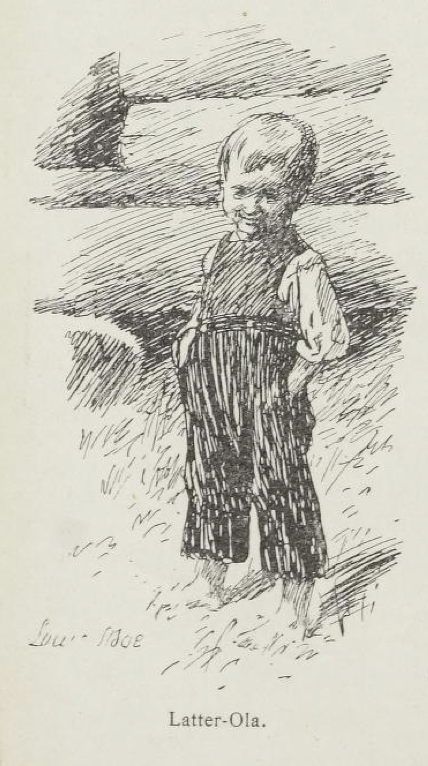

# Latter-Ola

Det var en gang et par folk, som bodde for seg selv i en liten hytte ved allmannveien.

Disse folk hadde en liten gutt, og den gutten hette Ola.

Nå er det en gang så, at alle folk synes at verden er så full av sorg og elendighet, og det syntes folkene i hytta også. Men Ola, gutten deres, han syntes at alt var bare moro, han. Aldri gråt han, og lo gjorde han av allting.

Derfor kalte de ham også for Latter-Ola.

Men foreldrene hans var så rent ille ved, fordi de hadde fått en slik bytting til gutt.

Så var det en dag mor hans stod og kokte grøt. Døra stod åpen, og hun glante og glodde etter dem som gikk forbi.

Rett som det var, veltet hun grøtgryten og svidde hendene sine.

"Prh! K, k, k, k, k!" sa gutten og satte i å le.

"Hva er det du ler av, din bytting?" spurte moren, tok tvaren og ville til å denge gutten med den.

"Jeg ler av det," sa Latter-Ola, "at hadde ikke grøten svidd fingrene til mor, så hadde mor svidd grøten til far," sa han.

Da vendte mor seg unna og ristet på hodet. "Nei du Ola, du Ola," sa hun, hun kunne ikke bære seg for å smile, hun heller.

Om en stund kom far hans inn med noen økseskaftemner han skulle lage til.

Han satte seg borte ved åren, ga gutten et emne med, og så ga de seg til å spikke og telje alt de orket.

Rett som det var, skar faren en diger flenge i hånda si, så blodspruten stod.

Da moren fikk se dette, ble hun rent som fra sans og samling.

"Å, Gud trøste oss. Nå renner alt blodet av ham!" ropte hun og rente både høyt og lavt.

"Prh! K, k, k, k, k!" sa gutten og satte i å le.

"Ler du av det, din bytting!" sa faren og ville til å denge gutten, enda blodet rant så det silte.

"Jeg ler av det," sa Latter-Ola, "at å mor renner omkring, for det at blodet renner av deg, og så er det blodet som renner av deg, for det at å mor renner omkring," sa han.

Da måtte faren smile han også, og så fant moren frem en fille og bandt om såret så blodet stanset.

Men da det vel var gjort, tok hun en diger påk og begynte å denge gutten.

"Jeg skal lære deg å le av mor di jeg," sa hun.

"Prh, k, k, k — ha ha ha," sa gutten og lo så det sang i stua.

"Ler du av det du får bank, din bytting?" sa faren mens moren holdt på å denge.

"Jeg ler av det," sa Latter-Ola, "at jeg skal lære å le av mor mi, og så var det mor mi, som skulle lære å le av meg," sa han.

Da slapp moren ham.

Rett som det var, kom futen inn i stua, alvorlig som en prest, og skulle ta alt det som fantes.

Og faren stod mørk og så ned, og moren satt ved bordet og gråt.

"Jeg gjør bare det som rett er, jeg," sa futen og skrev opp.

"Prh! K, k, k, k! Ha ha ha ha!" sa gutten og lo så det svarte i kopper og kar rundt veggene.

"Hva er det du ler av, din bytting?" spurte futen og satte øynene kvast i ham.

"Jeg ler av det," sa Latter-Ola, "at retten har rett til å ta retten fra den som ingen har," sa han.

Da gikk futen.

Men moren og faren satt hele halvtimen enda og jamret og bar seg over hvor sørgelig det var i denne elendige verden.

"Det er ikke verdt å streve," sa faren.

"Det er ikke verdt å leve," sa moren.

"Prh! K, k, k, k! Ha ha ha ha!" sa gutten og lo så stua ble høyere.

"Hva ler du av, din bytting?" spurte faren og hyttet til gutten.

"Jeg ler av det," sa Latter-Ola, "at dere sørger for det at verden er så sørgelig, og så er det verden som er så sørgelig for det at dere sørger," sa han.

Da så faren på moren, og så gikk de hver til sitt arbeid, gladere enn før.

En tid etter ble Latter-Ola syk, så syk, at han måtte dø. Og faren gikk etter doktoren, og moren satt ved senga og var så tung til sinns.

Og doktoren kom inn og kjente på gutten, og han ristet på hodet og gikk igjen.

Da ga moren seg til å gråte og bære seg.

"Å, at han skal dø!" sa hun.

"Og så gild, som han var," sa faren.

"Prh! K, k, k, k, k!" sa gutten og begynte å le der han lå.

"Hva ler du av, søte, vesle sukkerklumpen vår?" spurte moren.

"Jeg ler av det," sa Latter-Ola, "at det er synd, at jeg skal dø som var så gild, og så er jeg blitt så gild nå jeg skal dø," sa han, han kunne nesten ikke holde oppe øyelokkene sine.

"Å din vesle bytting," sa moren så lindt og strøk ham og gråt.

Gutten lå en stund stille; men rett som det var, begynte det å klukke i ham igjen.

"Hva ler du av nå igjen da, vesle trøsten vår?" spurte faren.

Da løftet gutten på øyelokkene sine og var så blek, og så på far sin og mor si.

"Jeg ler av det," sa han, "at dere tror, at en er død når en er død; men det er en ikke," sa han — og så sluknet han.
