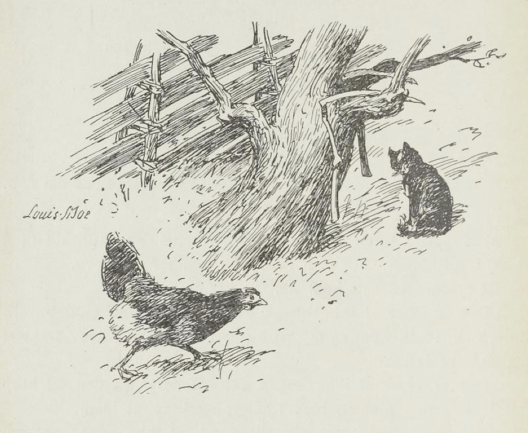
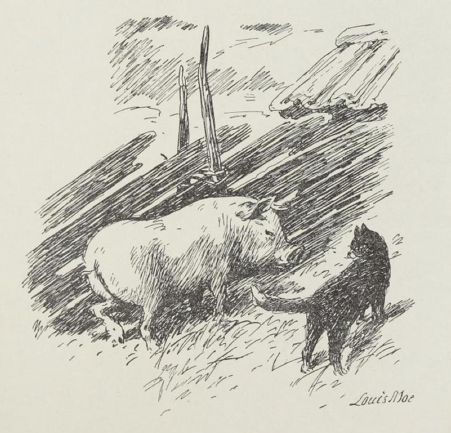

# Mons fra Mi-au

Det var engang en gård som het Mi-au og på den gården stod der et hus, og ved det huset lå der en have, og i den haven vokste et tre, og under det treet satt der en katt.

Og den satt så sur og så stille og så stur, knep øynene sammen mot solen og gren, for den hadde så tungt for å leve.

"Kvorr! Kvorr! Hva sorger du for?" spurte en spurv, den satt høyt oppe på mønet og kjente seg sikker.

> "Miau!  
> Det er slemt å ha gård,  
> når det er så dårlige år!  
> Miau!"

svarte katten.

"Pitt! pitt! Du har hus fritt!" sa spurven.

> "Miau!  
> Men det er slemt å ha hus,  
> når det er så vondt for mus!  
> Miau!"

svarte katten.

> "Du har hage med tre;  
> det er ikke alle som har det,"

sa spurven.

> "Miau!  
> Men det er slemt å ha hage,  
> når alle skal ligge og gnage,  
> og det er vondt å ha tre,  
> når en aldri får ha det i fred.  
> Miau!"

svarte katten.

> "Kvorr! kvorr!  
> Det er slemt å være katt,  
> når en aldri får noen fatt!  
> God natt!"

sa spurven og så fløy den.

Men katten knep øynene sammen igjen og satte seg til å sture i solskinnet. For den hadde så vondt for å leve.

Rett som den satt kom der en humle surrende.

"Det er synd at ikke noen vet om det; men Gud bevare min munn!" sa humlen og krøp inn i en blomst, blev traktert og gikk ut igjen.

"Det er synd at ikke noen vet om det!" sa den og krøp inn i en annen blomst, blev traktert og krøp ut igjen.

"Det er synd, er stor ubotelig synd, at ikke noen vet om det! Men Gud bevare min munn!"

Slik fløy den fra blomst til blomst og fortalte og blev traktert overalt, før den gikk.

"Aa den sladderen, den sladderen!" mol Mons fra Mi-au, han satt og spisset ørene og var så sur fordi han ingenting fikk høre.

Men da humlen kom like borttil slo den labben i den som et lyn.

"Vil du la meg være, vil du la meg være?" sirret humlen under labben på katten og så stakk den.

"Miau!" skrek katten og slapp som den hadde brent seg.

"Det var det verste! Det skal jeg fare langt bort og fortelle," sa humlen; den seilte avsted som en sort prikk, høyt over trærne, opp i luften og blev borte.

> "Au, au!  
> Klore går nok an, men stikke!  
> Isj da!  
> slikt nå gjør jeg ikke!  
> Au!"

sa katten, den satt og livet og løftet på den hovne labben sin.

Rett som den satt, kom der en høne snikende gjennom en åpning i gjerdet. Den strakte halsen hit - og trakk den i seg igjen, strakte den dit og trakk den i seg igjen.

> "Humlen er slem til å stikke og lyve,  
> men det verste av alt hva jeg vet, det er tyve.  
> Miau!"

tenkte katten, men den satt huggende stille og så på hønen.

Hønen satte først én fot forsiktig frem, så den andre, plukket et frø, la hodet på skakke og smakte:

"Godt!" sa den.

Men så fikk den se katten.

"Gakk!" sa hønen.

"Gakk selv!" svarte katten. "Du kunne gjøre som jeg og la andre i fred," sa den.

"Å - å jeg vet ikke hva jeg skal si om det," svarte hønen.

Katten reiste på seg. "Kom hit og sitt," sa den.

"Takk, takk, takk - nei mange tusen takk," sa hønen og fløy opp på skigarden.

Katten var etter den.

"Å du store verden, så folk er troløse," skrek hønen og fløy og flakset fra skigarden og like ned til fjøset.

"Miau!" sa katten. Den satt på skigarden og så etter hønen.

Så hoppet den ned igjen, gikk langsomt bort under treet og løftet og strakte forsiktig på hver labb for ikke å skitne seg til.

> "Feil har jeg nok av, folk kan så si;  
> men rapse og stjele,  
> den feil er jeg fri!  
> Miau!"

sa katten.

Dermed lukket den øynene, ristet på hodet og tenkte på hønen, som var så troløs, at den ville stjele på Mi-au. Og så syntes den den hadde så tungt for å leve.

Rett som det var, fikk den se en mus sitte og knapre og gnage på et potetskall borte ved husmuren.

"M! Synd på den som liten er!" sa katten. Og musen kom svinsende hit og svansende dit og tenkte bare på potet.

Og katten satt stille og knep øynene sammen; for det var så søtt å være i fristelse.

Men da musen kom ganske nær, slo den kloen i.

> "Du har en skrott og jeg har en mage;  
> da får en tro, det er så laga,"

sa katten.

"Bi! bi! bi! bi! bi!" pep musen.

"Miau da! Gjerne det," sa katten. Den var så god av seg.

Og så slapp den musen.

Men da den vel hadde sloppet, syntes den det var så synd på den skamferte musen at den skulle leve, og så slo den kloen i den igjen.

"Spar! spar!" skrek musen.

> "Miau!  
> Jeg sparer flere jeg enn mangen!  
> Jeg dreper bare en om gangen!"

svarte katten, og så åt den musen.

Men da sa ikke musen mere.

Og så gikk katten bortunder treet igjen og satte seg og syntes det var så tungt å leve. For det var så mange små mus som hadde det vondt i verden. Og den slikket seg om munnen for å holde seg ren; for ren må en holde seg - det er en grunnregel for alle rovdyr.

Men utenfor skigarden stod der en grisenoe, og ved siden av den stod en fet gris og tenkte.

"Hm!" sa grisen.

"Miau! Du tenker nok på det samme som jeg, du," sa katten.

"Jah!" sa grisen.

"Vet du hva jeg tenker da?" spurte katten.

"Hm - nei!" sa grisen.

"Mjo-oh!" sa katten. "Hvem er det folk plager, så de mest kan forgås?"

"Oss!" sa grisen og skrubbet og skuret seg mot skigarden.

"Miau!" sa katten. "Men når andre gjør galt, hvem er det som får li?"

"O-ui!" sa grisen.

"Ja-ah! Er det ikke for galt. Hva skal enden bli!" skrek katten og begynte å gå og gå frem og tilbake som om den hadde fått tannverk.

> "Nåh, nåh, nåh, nåh, nåh! Rolig! rolig!" sa grisen.

> "Miau!"

sa katten.

Og så satte den seg til å murre og male og syntes det var bedre å leve; for nå hadde den funnet en venn på Mi-au.

