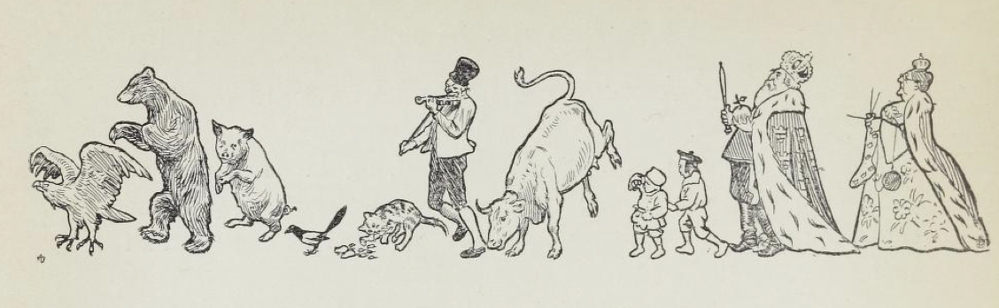
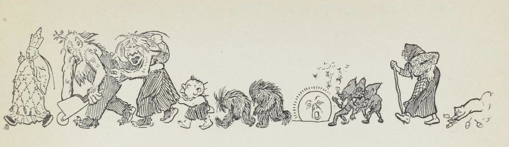

# Sankthansdans

Først kom en ørn  
som hoppet på to,  
så kom en bjørn  
som valset og lo  
så kom en so!

Så kom en skjære  
med stjerten i være',  
så kom to mus  
med hele sitt hus  
så kom en pus!

Så kom Per spillemann  
så kom e' ku;  
så kommer lillemann,  
så kommer du!

Så kommer kongen,  
så kommer dronningen,  
så kommer paven fra Asias land,  
alle så svanser de,  
alle så danser de  
alt hva de kan.

Så kommer trollene  
frem over vollene,  
så kommer tussene  
frem mellom blussene.  
Solen går ned.

Så danser myggene  
rundt om i skyggene,  
så kommer alle små nisser i flokk;  
så kommer halte mor Åse med stokk  
— finner deg nok!

Baketter kommer en enøyet katt;  
det tasler og tusler i skog og i kratt;  
alle små mus tar benene fatt  
god natt!
