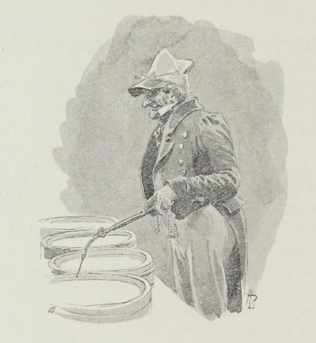
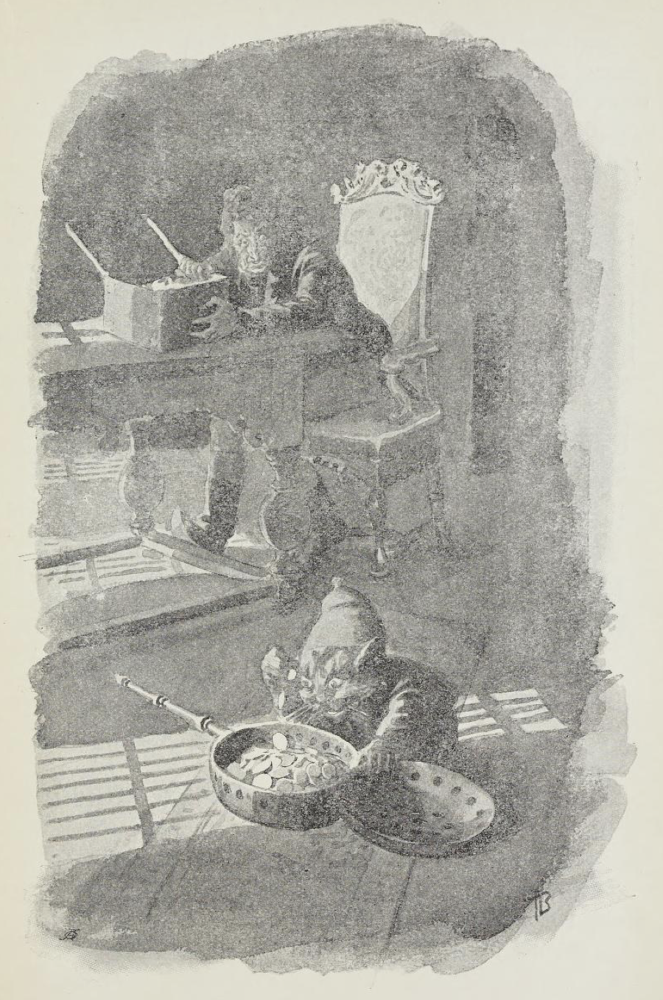
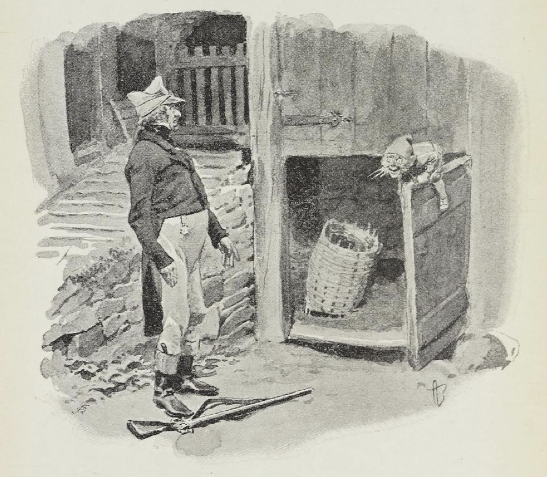

# Skriveren og Tassengrå

Skriveren som kjøpte Julsrudgården da gammelpresten døde var en mann av dem Gammel-Erik hadde bitt merke i.

For han hadde vært prokurator før han blev skriver må vite.

Og sa du til ham at øks hadde skaft, så sa han hent nei; for det var skaftet som hadde øks, og rett skal være rett enten det er rett eller ikke.

Så var det en morgen at skriveren skulle bort på stabburet for å telle smørformene sine.

«En,» sa skriveren og pekte med den fange merskumspipen sin.

«To,» sa det oppunder slinden.

«To,» sa skriveren.

«Fire,» sa det oppunder.

«Fem,» sa skriveren - han kom av.

«Slem,» sa det oppunder slinden.

«Syv,» sa skriveren - han visste hverken ut eller inn.

«Kjyv,» sa det oppunder.

Da blev skriveren sint.

«Ti,» sa han, han gjorde seg morsk, må vite.

«Ti selv,» svarte det oppunder slinden.

Så begynte skriveren å telle om igjen, men like galt blev det.

Alt han strevde og alt han skrek, så fikk han ikke tall på smørformene sine.

Da han gikk igjen og skulle til å stenge stabburet, var burnøklen borte.

«Nøklehullet har jeg,» sa skriveren, «men nøklen har fanden tatt.»

«Nøklen har jeg, men nøklehullet har fanden tatt,» sa det oppe i matklokketårnet, og da skriveren skulle se til, så hang nøklen og slang i et rep nedover burveggen.

Han til å hoppe og hugge etter nøklen med neven; men det mer han hoppet, det høyere kom nøklen, og tilslutt blev skriveren sittende på stabburtrappen og pese, så det hørtes lang vei, og gråte gjorde han, bare så det silte av ham.

Rett som han satt der og bar seg fikk han høre, at stabburdøren smalt igjen så det klang, og da han skulle se etter, satt nøklen i nøklehullet; men repet hang og slang nedover burveggen.

Skriveren i vei og tok ut nøklen av burdøren og med det samme han gikk nedover stabburtrappen glante han opp mot repet, som hang der og slang enda.

«Du kan gjerne henge for meg,» sa han.

«Du kan gjerne henge for meg,» sa det oppe i klokketårnet.

En annen gang drev han inne i kammerset sitt og talte penger av et digert pengeskrin han hadde stående der.

Rett som han satt der og var glad, kjente han seg så underlig nummen over hele kroppen.

«Uff, her må være katt inne,» sa han og snudde seg for å se.

Men da satt der en diger nisse midt på gulvet og reknet blanke sølvet av et kullfat.

«Det er jeg som eier sølvet!» skrek skriveren og reiste seg brått.

«Det er sølvet som eier deg,» sa nissen, og borte var han.

Men da skriveren kom bort til kullfatet, var det fullt av bare jord og småstein.

Etter den dag lurte skriveren med børse på nissen om kveldene.

En kveld fikk han se ham - han satt innunder stallgulvet og åt på et sildehode. Skriveren smelte på, bare så røken gjøv, og da han skulle se til, lå der en grå, stubbrumpet katt så dau som en sild. Og så gammel var den, at den hadde værhår over hele kroppen.

Skriveren var både børg og gild da han gikk opp igjen fremme ved husene den dagen; for det er ikke hver dag en får livet av en nisse, må vite.

Men da han kom frem til stalldøren så satt nissen der like god, den, og lo og freste av skriveren.

«Nei, nå vet jeg ikke forskjell på rett og vrangt lenger,» sa skriveren, han slapp børsen og blev stående og glane.

«Det har du aldri gjort,» sa nissen.
