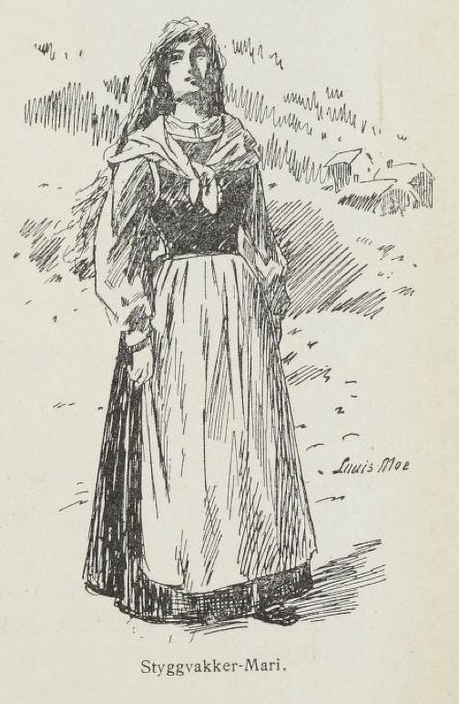
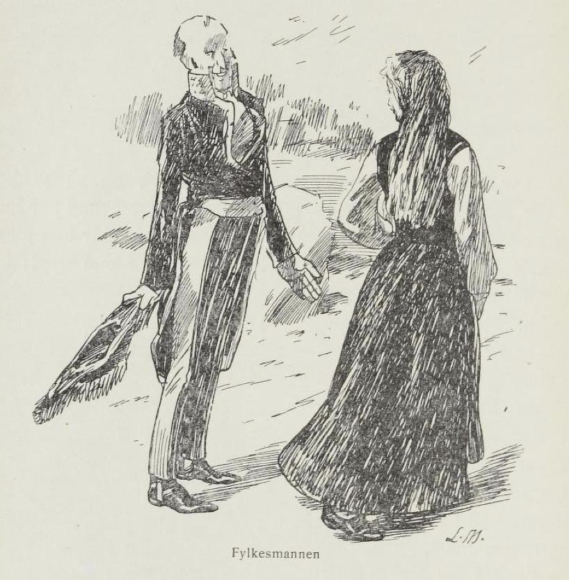
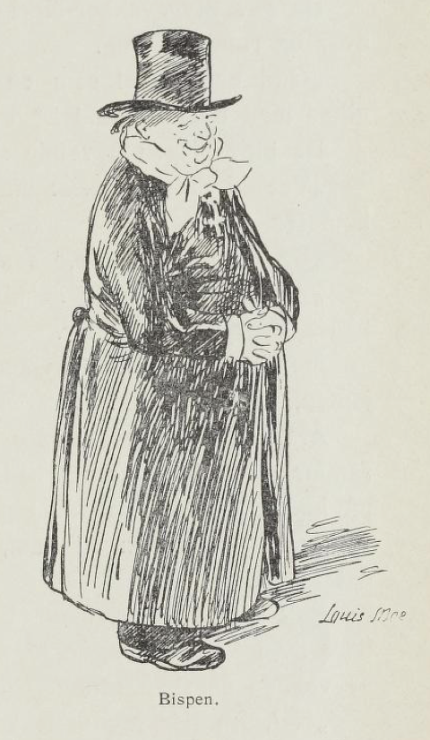
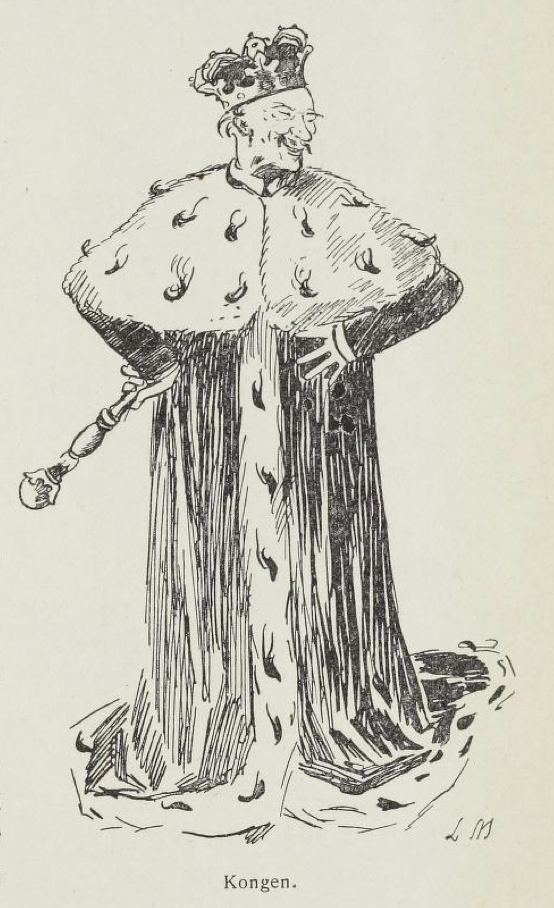
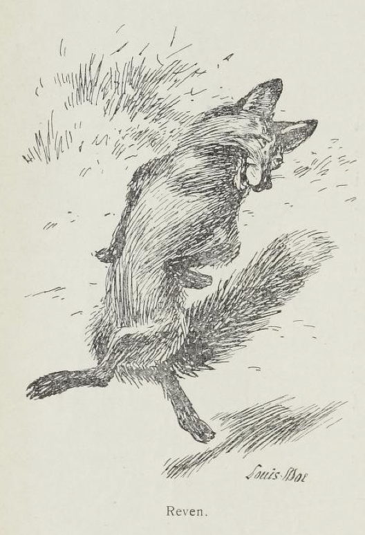
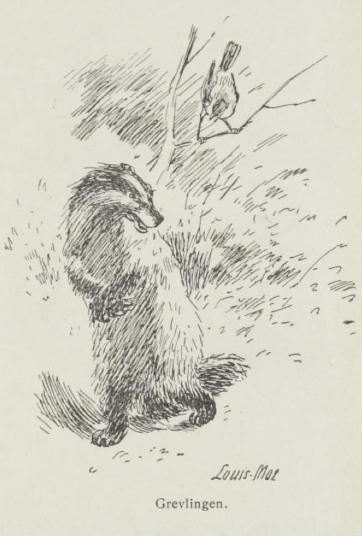
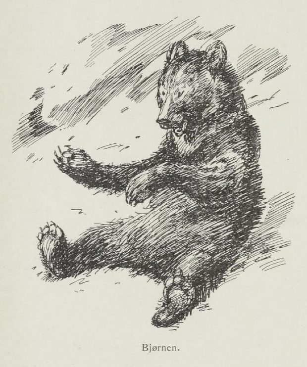
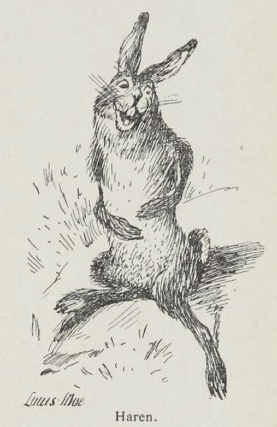
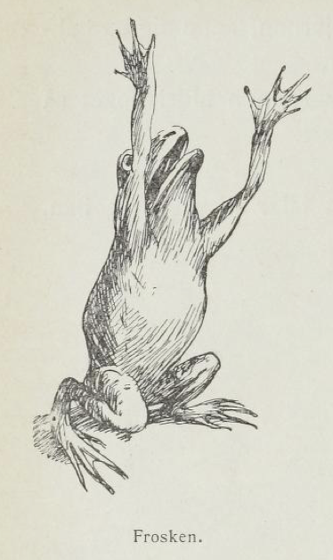
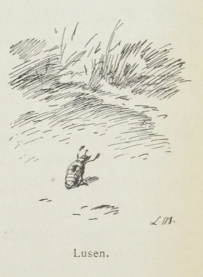

# Styggvakker-Mari

Det var en gang en jente som hette Mari, og så vakker var hun, at alle som satt, måtte reise seg for henne når hun kom, og alle som stod, måtte snu seg etter henne når hun gikk.

Men selv syntes hun at alt hun så var styggere enn stygt; for hun var av bergtagen ætt må vite.

Friere hadde hun nok av, som rimelig kunne være; men alle ga hun nei; for hun gikk der og ventet på ham som var vakrest på hele jorden, og han kom aldri. Dermed så fikk hun navnet Styggvakker-Mari.

Så hendte det seg et år, at fylkesmannen kom kjørende oppover dalen der denne jenten bodde. To hester hadde han for vognen, og i gullbukser satt han og var så gild at det lavet av ham. Og ikke så han etter folk hverken på venstre siden eller på høyre siden, men kjørte bare rakt frem etter nesen, der brede kongeveien gikk.

Rett som han drev og kjørte, møtte han Styggvakker-Mari. Og hadde det ikke vært liv i ham før, så blev det da nå. Han spratt ende opp i vognen der han satt, og bråstanset hestene sine.

«Nei, nå har jeg vært fylkesmann i tyve år, men vakrere jente har jeg aldri sett,» sa han og var blid som godt vær i ansiktet.

«Gud sign,» sa Styggvakker-Mari og ville forbi.

«Nei, kjære deg, vent!» sa fylkesmannen, han gjorde seg så inderlig lekker.

«Kunne du ikke likeså godt bli konen min med det samme?» spurte han.

Da ga Styggvakker-Mari seg til å se på fylkesmannen både oppover og nedover.

«Blank er du foran og blank er du bak, men giftes med en gardstav er så sin sak,» svarte Styggvakker-Mari.

Da blev fylkesmannen sint. «Vet du ikke, at nest etter kongen er jeg den gildeste i hele landet?» sa han.

«Da er kongen gildere,» svarte Styggvakker-Mari og gikk.

«Gud bevare kongen,» sa fylkesmannen, han snudde seg etter jenten. Og så kjørte han bent frem etter nesen igjen, og ikke så han etter folk hverken på høyre siden eller på venstre siden.

Året etter hendte det seg at selv bispen kom kjørende samme vei. Fire hester hadde han for vognen og gullkors på brystet og var så fin og andektig at det lyste av ham. Og ikke så han til høyre og ikke til venstre, men bare ende opp, dit nesen pekte.

Rett som han drev og kjørte, møtte han Styggvakker-Mari. Og var det ikke liv i bispen før, så blev det da nå.

Han spratt ende opp av vognen der han satt, og hestene hans bråstanset av seg selv.

«Nei, nå har jeg vært bisp i tredve år, men vakrere jente har jeg aldri sett,» sa han og var så blid som smør i ansiktet.

«Gud sign,» svarte Styggvakker-Mari og ville forbi.

«Nei, kjære vene, vent et lite blink da,» sa bispen, han gjorde seg så inderlig lekker.

«Kunne du ikke likeså godt bli bispekonen min nå her på flekken?» spurte han.

Da ga Styggvakker-Mari seg til å se på bispen både tvers over og rundtomkring.

«Gild er du vel som en brudesengsfelt; men ikke kan jeg giftes med en høysekk lei,» svarte hun.

Da blev bispen flyvende sint.

«Vet du ikke, at nest etter paven er jeg den fineste i hele landet?» spurte han.

«Da er paven finere,» svarte Styggvakker-Mari og gikk.

«Ære være paven,» sa bispen, han slo på hestene sine og kjørte bent frem som før.

Men jammen måtte han snu seg både en og to ganger etter jenten, der hun gikk.

Året etter hendte det seg at selveste kongen kom kjørende samme vei. Åtte hester hadde han for vognen og gullkrone på hodet, og han snudde seg til høyre og han snudde seg til venstre og alle som så ham, sank ende i jorden, slik skinte det av ham.

Rett som det var, møtte han Styggvakker-Mari. Og var det ikke liv i kongen før, så blev det da nå. Han hoppet ende ut av vognen der han satt, og gikk like bort til jenten.

«Nei, nå har jeg vært konge i firti år, men aldri har jeg sett vakrere jente,» sa han og var blid som smeltet smør.

«Gud sign,» sa Styggvakker-Mari og ville forbi.

«Nei, kjæreste, vakreste, veneste deg da, vent et ørende lite blink,» sa kongen og gjorde seg så gruelig lekker.

«Kunne du ikke likeså gjerne bli dronningen min på røde rappet?» spurte han.

Da ga Styggvakker-Mari seg til å se på ham fra roten til toppen.

«Bill deg aldri inn at du blir brudgommen min; ikke vil jeg giftes med et purkeskinn,» sa hun.

Da blev kongen sprutende sint. «Vet du ikke, at nest etter Vårherre er jeg den likeste på hele vide jorden?» spurte han, satte kronen på skakke og hendene i siden og niglante på jenten.

«Da er Vårherre likere,» sa Styggvakker-Mari.

Men da ropte kongen på alle soldatene sine, at de skulle ta Styggvakker-Mari og jage henne ut i ville skogen. Og budstikken sendte han rundt med den beskjed, at hver og en som hadde noe med Styggvakker-Mari etter den dag, han skulle miste både fot og hånd; for så stor synd var aldri gjort i hele kongens land som den, at en jente ikke ville gifte seg med selveste kongen.

Og alle folk i bygden mente som kongen mente, og gikk og åndet og bar seg over jenten, som ikke ville som kongen ville.

Men dypt inne i skogen gikk Styggvakker-Mari med matløp i hånd og tørklæ på og blinkende belte om livet. Og så vakker var hun, at kongen og alle soldatene hans som hadde jaget henne ut i ville skogen, snudde på hodene sine alle i hop og så etter henne, så lenge til hun blev borte for dem.

Og blomstene som lå og sov i solsteken, reiste seg der hun kom, og trærne som stod og svettet kvae i varmen, bøyde kvistene sine etter henne der hun gikk. Men Styggvakker-Mari gikk ende fram, og ikke hørte hun og ikke så hun, for hun drømte om ham som var vakrest i verden.

Rett som hun gikk, møtte hun en rev.

«Hæ, hæ, hæ, hæ god dag!» sa reven.

«God dag,» sa Styggvakker-Mari og ville forbi.

«Nei, kjæreste, søteste deg da, vent litt!» sa reven.

Og så reiste han seg opp og satte den røde svansen sin ende til værs, og så danset han rundt og bruste seg ut og blunket og nikket til jenten.

«Kunne du ikke likeså godt bli revekonen min nå med det samme da?» spurte han.

«Stygt så jeg før i nord og sør, men aldri en brudgom med så lange klør,» svarte Styggvakker-Mari.

Da satte reven seg ende ned og var så sint, at det freste av ham.

«Du vet nok ikke hvem du taler til, du,» sa han. «Det er meg som står for lov og rett her i verden; for jeg er prokurator i skogen, og større rev enn meg finner du aldri. Og skulle du være gift før og ville gifte deg igjen nå, så skal du ikke komme i noen uleilighet for det, for jeg kjenner lovens ord og bokstav, jeg,» sa reven og gjorde seg til for jenten.

Men da kom der en skjære flyvende, satte seg i et tre over reven og ropte:

«Hei du! Hei du! Er du ute med skøyerstrekenene dine nå igjen? Er du ute med skøyerstrekenene dine nå igjen? Jeg kjenner deg, jeg! Jeg kjenner deg!» sa skjæren.

Men da satte reven halen ende ut og skjøt seg avsted i kors og krok bort mellom buskene, og vekk var den. Og solen gikk ned og skyggene falt, og fuglene satt så stilt og så varmt og bad kveldsbønn på kvistene sine. Men jenten gikk ensomt lenger inn etter ham som var vakrest på jorden.

Rett som hun gikk, møtte hun en grevling.

«Næh, næh, næh god kveld,» sa grevlingen.

«God kveld,» svarte Styggvakker-Mari og ville forbi.

«Nei, kjæreste, søteste, veneste deg, vent et lite blink da,» sa grevlingen. Og så satte han seg opp på bakbenene sine, la fremføttene i kors over brystet og smilte og smisket for jenten. «Kunne du ikke likeså godt bli grevlingkonen min med det samme da?» spurte han.

«Det nytter nok lite at du gjør deg fin; en rev er en rev, og et svin er et svin,» svarte Styggvakker-Mari.

Men da blev grevlingen så sint at han mest sprakk.

«Du vet nok ikke hvem det er du taler til, du,» sa grevlingen. «For jeg er bisp her i skogen, jeg. Og såpass skjønner jeg at det står dårlig til med sjelen din. For jorden er en jammerdal, det er sikkert og visst.»

«Å ja, å ja!» sa kråkene, de satt andektige i trærne rundt omkring med hodet på skakke og hørte på.

«Men under jorden er det bra,» sa grevlingen. «Og vil du bli grevlingkonen min og følge meg i det som tykt er og det som tynt er, så skal du få det både lunt og godt. Men jorden er en jammerdal,» sa han, «og livet her oppe i skogen er et syndig liv,» sa han.

«Ljugar! Ljugar! Vil du tie, vil du tie! Tvi, tvi!» sa måltrosten, den satt ende opp og hadde hørt hvert ord.

Da krøp grevlingen inn under en trerot og borte blev den. Men jammen var den så from at den måtte slå benene både i kors og i krok, da den gikk.

Og skogen stod svart og trett mot den milde himmel, og skogknarren surret, snart høyt, snart lavt, og blomstene sov i de kjølige skygger; men Styggvakker-Mari hun sov ikke, hun, for hun tenkte på ham som var vakrest på jorden; så gikk hun og gikk hun langt inn i villeste, svarteste skogen.

Rett som det var møtte hun en bjørn.

«God kveld! Vil du ha meg?» sa bjørnen, satte seg på bakbenene og fiktet med labbene til jenten.

«Meget har jeg sett, det sier jeg trygt; men aldri noe så ustyggelig stygt!» svarte Styggvakker-Mari.

Da blev bjørnen tordnende sint.

«Du vet nok ikke hvem det er du taler til, du,» sa han. «For jeg er konge i skogen; og ring har jeg om halsen og blod under neglene, og ikke fins der dyr, hverken stort eller smått, som jeg ikke skal være kar for å gjøre ende på,» sa den.

«Allting har en ende, men bjørnen har ingen. Gjør ende på deg selv, du, så gir jeg deg ringen,» sa Styggvakker-Mari.

«Ho ho ho ho ho ho!» hukret haren og lo oppe i fjellbåndet, og med det samme rann solen. Da tasset bjørnen skamfull inn i tykkskogen, og borte blev den.

Og solen den skjen og duggen den skalv, og myrene duftet av glede. Men Styggvakker-Mari så intet av alt; for hun tenkte på ham som var vakrest på jorden.

Rett som hun gikk fremved en myr, møtte hun en frosk som lå i veien og glante.

«Elsk meg!» sa frosken, han rakk armene frem.

«Huff, det var stygt så du lignet på folk; deg slår jeg ihjel med en enersvolk,» svarte Styggvakker-Mari, hun slo til frosken med staven sin.

«Kvekk!» sa frosken, og vekk var den.

Men førenn Styggvakker-Mari visste ordet av, stod hun på ville fjellet.

«Pip pip pip!» sa lemenene, og borte var de.

«Tit,» sa snespurven og skjøt seg i lange skvett unda og nedover. Og vidden lå øde omkring, styggere enn det styggeste stygge.

Og Styggvakker-Mari gikk og gikk, sorgfull i sinn, for intet var vakkert uten hun selv, og borte var han som var vakrest i verden.

Rett som hun gikk, kom hun til en liten steinbu. Der inne lå en lus i en krok og varmet seg.

«Uh!» sa lusen. «Det er så kaldt,» sa hun med den armen. «Kjære, søte, veneste dig, vent et lite blink,» sa lusen. «Kunne du ikke likeså gjerne bli lusekonen min med det samme da?» spurte den.

«Stort og småt og styg og skrap og herk, fandes aldri verre verk,» svarte Styggvakker-Mari.

Da blev lusen rent grå av sinne.

«Du vet nok ikke hva det er for en du snakker til, du,» sa den. «Ikke er jeg en lus som folk er flest; for her lå en prins i fjor sommer på jakten, og av hans blod er jeg.»

Men Styggvakker-Mari satte bare neglen sin på den hun, vendte hodet bort og klemte til.

«Akk,» sa lusen, og så knakk den.

Men da Styggvakker-Mari kom ut på fjellet igjen, var der så stille, så stille. Og hun blev så livende redd, enda der ikke fantes liv å bli redd for. Hun ropte på folk, og hun skrek etter dyr; men intet ga svar. Bare fjellsvarte sjøer og blånende fjell og skygger som falt, og sol som gikk ned og blev borte.

Da la Styggvakker-Mari seg ned og begynte å gråte. For hun skjønte at nå måtte hun dø om han ikke kom, han, som var vakrest på jorden.

Rett som hun lå, fikk hun høre en ensom tone, som dirret utover det trette fjell. Og da hun skulle se etter, satt der en liten grå fugl på en stein og sørget. «Puh —ih! Puh —ih!» sa den, og det var så megen sorg, men bare en eneste tone.

Da blev Styggvakker-Mari så glad, så glad at hjertet hennes slo, så det hørtes høyt.

«Å Gud velsigne deg, så deilig du er!» sa hun til fjellloen og ville borttil den.

Men da hun skulle se etter, var den blitt borte, fjellloen, og foran henne stod den deiligste prins og så på henne med varme gode øyne.

Og han tok henne i armene sine og kysset hennes øyne, og hun kjente sitt hjerte bli så varmt av kjærlighet.

«Din vil jeg være,» sa hun og bøyde hodet tilbake, så han kunne få kysse henne på munnen også.

«Ja, om du finner meg igjen,» svarte prinsen så usigelig stilt og blev borte som en lysning over fjellet.

«Hvor skal jeg finne deg,» ropte Styggvakker-Mari og strakte armen ut etter ham.

«I alt som lever,» svarte det som sang i luften.
