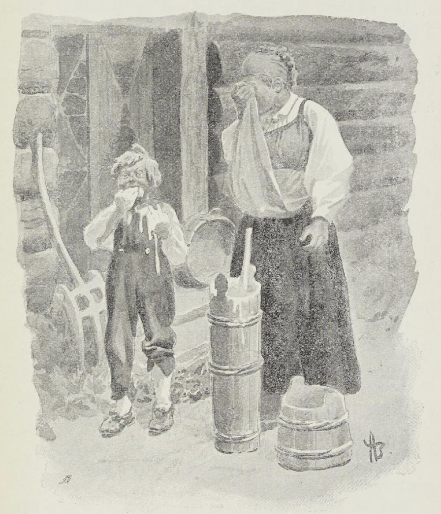

# Vriomvrang

Det var en gang et par folk som bodde på en gård midt i brede bygden. De hadde fullt opp av alt, både buskap på bås, sau i skjul, hest på stall, høne og hund og gris og alt det som godt er. Men noe skal det alltid være, og disse folkene hadde en sønn som rent blev et ordsprog i bygden.

Bad de ham om ett, så gjorde han noe annet, sa noen ett, fikk han snudd det til noe annet; verre blev han, jo mere han voks, og til slutt var gutten så vederstyggelig vrang at de kalte ham for Vriom-vrang i bygden. Faren og moren gjorde alt som stod i menneskes makt for å få gutten rett som skikkelig folk, men alt var fåfengt, og verre og verre blev han.

Så var det en dag moren holdt på å kjerne smør, og rømmen var nettop som frakest.

«Få jeg lite da,» sa Vriom-vrang - han stakk hele hånden nedi kjernen og slikket så det suste.

«Vil du la bli, din villstyring, ellers så skal jeg gi deg,» sa moren.

«Ja, gi meg da - ellers så kan jeg ikke la bli,» sa Vriom-vrang - han holdt begge hendene frem.

«Nei, nå går det over seg,» skrek moren.

«Nei, nå går det over seg,» sa gutten, han kjørte begge hendene ned i kjernen, så rømmen skvatt.

«Å Gud bedre meg!» sa moren og begynte å gråte.

«Ja, om han enda det gjorde,» svarte Vriom-vrang. Dermed veltet han rømmekjernen og gikk sin vei.

Så var det en gang i våronnen gutten stod og så på at far hans kjørte gjødsel.

«Stå ikke der og kop,» sa faren. «Gakk sta og spenn for en hest og kjør gjødsel du som jeg, en lyt legge seg i, den som bonde skal bli,» sa han.

Ja, gutten gikk.

Om en stund fikk faren se en hest og gjødsellass komme dragende bortover jordet, men han så ingen kar som kjørte.

«I all verden, hva er detta for slag?» sa han og ruslet bortover til lasset for å se. Men da han så vel etter, lå gutten på lasset midt i blanke gjødselen og plystret og stirret opp i luften.

«Men du store under, hva er det du gjør?» skrek faren.

«En får legge seg i, den som bonde skal bli,» sa gutten.

Men da begynte faren å jamre og bære seg.

«Hvordan skal det bli folk av deg?» spurte han.

«Ja, når ikke du vet det, så vet ikke jeg det,» svarte Vriom-vrang.

«Å, du kunne bare gjøre som far din, du, så blev det nok folk av deg,» sa moren.

Dagen etter skulle faren stikke en gris, og moren skulle holde blodtrauet.

Da de vel hadde stukket grisen, fikk de høre det skrek så ilt borti grishuset.

De i vei ut for å se hva som var på ferd, og da de kom til grishuset fikk de se sønnen, som nettop hadde stukket den andre grisen.

«Men kors i all verdens navn, hva er det du gjør, du da?» sa faren.

«Jeg bare gjør som far min, jeg - så blir det nok folk av meg,» svarte Vriom-vrang.

Men da skjønte både faren og moren, at denne gutten måtte både til doktor og prest, om han skulle bli som annet folk; men først ville de nå prøve med skolemesteren.

Ja, så ga de seg i vei en dag til skolestuen, der skolemesteren bodde og spurte om han hadde råd for en vrien gutt.

Jo, det mente skolemesteren han nok hadde, når han bare fikk boken frem og brillene på.

«Hvem var våre første foreldre?» spurte han og så kvast på gutten.

«De siste,» svarte Vriom-vrang.

«Hvorav vet du det?» spurte skolemesteren; han visste hverken ut eller inn.

«Jo, de siste skal bli de første og de første de siste,» sa Vriom-vrang.

«Det er rett, så galt det er,» sa skolemesteren.

«Nei, det er galt så rett det er,» sa Vriom-vrang.

Men da skjønte foreldrene, at her måtte der doktor til om gutten skulle bli rett som annet folk.

Ja, så ga de seg da i vei en dag til doktoren, og spurte om han hadde råd for en vrien gutt.

Jo, det mente doktoren han nok hadde, når han bare fikk god betaling.

«Hvor har du det verst henne?» spurte han gutten.

«Hjemme,» svarte Vriom-vrang.

«Er det hodet som er vondt?» spurte doktoren.

«Nei, det er ikke verst,» svarte gutten.

«Ja, det er det samme,» sa doktoren. «Her skal du få noe å ta inn; av det skal du ta tre skjeer om dagen, like til du har tatt det ut.»

«Jeg synes doktoren sa jeg skulle ta det inn, jeg,» sa Vriom-vrang.

«Du skal ta skjeene inn, men medisinen ut,» sa doktoren, han var kokende harm.

«Nei, jeg skal ta medisinen inn og skjeene ut,» svarte Vriom-vrang.

«Det er rett, enda så galt det er,» sa doktoren.

«Nei, det er galt enda så rett det er,» sa Vriom-vrang.

Dermed så ga faren doktoren en daler for medisinen, og han og moren gikk hjem igjen med gutten.

Fjorten dager etter kom doktoren kjørende innom gården for å se til gutten.

«Hvor er medisinen?» spurte doktoren.

«Her,» sa Vriom-vrang; han drog hele flasken frem fra skapet.

«Men du skulle jo ta den inn,» sa doktoren.

«Ja, er den ikke inne nå da?» spurte gutten.

«Hit med en skje,» skrek doktoren til moren.

Moren rundt og rundt; men hun fant ingen skje.

«Doktoren sa jeg skulle ta skjeene ut,» sa Vriom-vrang.

Men da skjønte foreldrene, at her måtte der prest til om gutten skulle bli rett som annet folk.

Så drog de da i vei nordover til prestegården der presten bodde, og spurte om han hadde råd for en vrien gutt.

Jo, det mente presten han nok hadde, når han bare fikk formane gutten.

«Du er på gale veier, gutten min,» sa han og hyttet alvorlig til gutten med pekefingeren.

«Ja, var det ikke det jeg sa?» sa Vriom-vrang.

«Du går like lukt i fordervelsen,» sa presten; sinnet tok ham.

«Nei, kjære er det her?» ropte gutten; han så på foreldrene sine.

«Vend om, mens det enda er tid,» skrek presten; han var sprutende rød i ansiktet.

Da snudde gutten og sprang.

Men det skjønte foreldrene hans, at der skulle noe annet enn både doktor og prest til, skulle gutten bli rett som annet folk.

Så drog de da i vei til lensmannen og spurte om han ikke skulle ha råd for en vrien gutt.

Jo, det mente lensmannen han nok hadde, når han bare fikk satt på ham håndjernene sine.

«Kjenner du loven?» spurte lensmannen; han satte øynene kvast i gutten.

«Ja, både låven og stalltrevet,» svarte Vriom-vrang.

Da blev lensmannen sint.

«Hit med hendene!» skrek han og holdt håndjernene frem.

Gutten fikk tak i hendene til mor sin og holdt dem frem for lensmannen.

«Nei, det var dine hender jeg ville ha,» skrek lensmannen.

«Jeg synes du har dine hender før jeg,» svarte Vriom-vrang. «Mine vil jeg selv ha,» sa han.

«Dine hender er mine det, gutten min,» sa lensmannen; han var så sint at det sprutet av ham.

«Ja, er mine hender dine, så har du dem jo før da,» svarte Vriom-vrang.

«Vet du ikke at det er meg som setter deg fast?» skrek lensmannen; han gikk rent fra sansen, så sint var han.

«Jeg synes det er jeg som setter lensmannen fast, jeg,» svarte Vriom-vrang.

«Det er rett, enda så galt det er,» sa lensmannen.

«Det er galt, enda så rett det er,» svarte Vriom-vrang.

Men da skjønte foreldrene at det nok skulle noe annet til enn både doktor og prest og lensmann, skulle gutten deres bli rett som annet skikkelig folk.

Så drog de til mestermann og spurte om han trodde han visste noen levendes råd for en vrien gutt.

Jo, det mente mestermann han nok skulle greie, når han bare fikk bakbundet ham og vist ham øksen sin.

«Hendene på ryggen!» sa mestermann og satte øynene kvast i gutten.

«Jeg trodde hendene satt på armene, jeg,» sa Vriom-vrang.

Da blev mestermann flyvende sint.

«Nå er din siste time kommet,» skrek han og drog frem øksen sin.

«Ja, er den kommet, så kommer den ikke da,» svarte Vriom-vrang.

«Vet du ikke det, at når jeg hugger hodet av deg, så er du død?» skrek mestermann; han var så sint at han var blå i ansiktet.

«Ja, det blir ikke nå da, for nå er jeg levende,» sa Vriom-vrang.

«Det er rett, enda så galt det er,» sa mestermann.

«Det er galt, så rett det er,» svarte gutten.

Da blev mestermann fra seg selv.

«Nå er du ferdig du også,» skrek han og løftet øksen mot gutten.

«Ja, er jeg ferdig, så går jeg da,» sa gutten, og så gikk han.

Men det skjønte foreldrene hans, at der skulle noe annet til enn både doktor og prest og lensmann og mestermann skulle gutten deres bli rett som annet skikkelig folk.

Rett som de gikk hjemover fra mestermannen med gutten og ikke visste sin arme råd, møtte de en jente på veien.

«God kveld,» sa jenten; hun skottet bort på gutten der hun stod. Og så spurte hun hva de for i for ærend.

Jo, foreldrene fortalte at de hadde slik en vrien gutt som som aldri ville si som annet folk sa, og aldri gjøre det annet folk gjorde, og så spurte de jenten om hun visste noen som hadde råd for slikt. For nå hadde de vært både hos skolemester og doktor og prest og lensmann og mestermann med; men det blev verre og ikke likere med gutten.

Jo, jenten mente hun nok visste råd, når hun bare fikk gjøre som hun ville.

«Er det du som er vill?» spurte hun; hun la armen kringom halsen på gutten.

«Det er ikke jeg som er vill; det er jeg som vil,» svarte Vriom-vrang - han kjente seg så underlig vek og begynte så smått å skjelve.

«Hva er det du vil?» spurte jenten; hun la kinnet sitt inn til guttens kinn.

«Det du vil,» svarte gutten - han sa det samme som jenten. Og så tok han henne lint kring livet.

«Du er nok gutten sin, du,» lo jenten; hun forsøkte å fri seg.

«Nei, jeg er ikke gutten sin, men gutten din,» sa Vriom-vrang; han slo armene tett omkring og kysset henne bent på munnen.

«Da vil du det som jeg vil,» sa jenten.

«Nei, da vil du det som jeg vil,» svarte Vriom-vrang; han sa det samme som jenten annen gang.

Men da skjønte foreldrene hans at nå blev det snart folk av Vriom-vrang; for nå sa han det samme som annet folk sa, og gjorde det samme som annet folk gjorde.

Så giftet de gutten med jenten.
