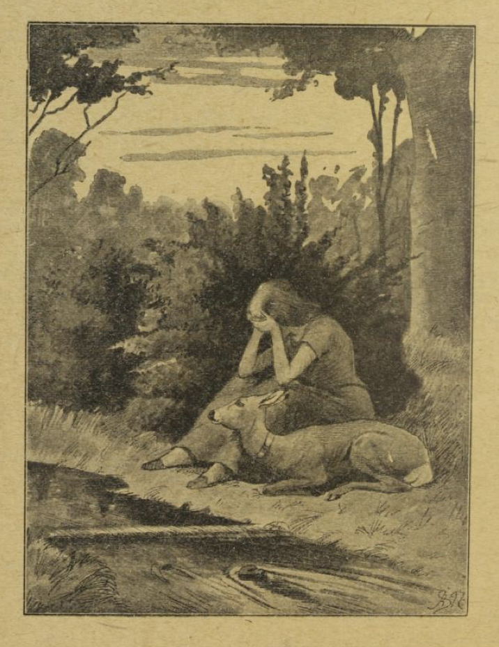
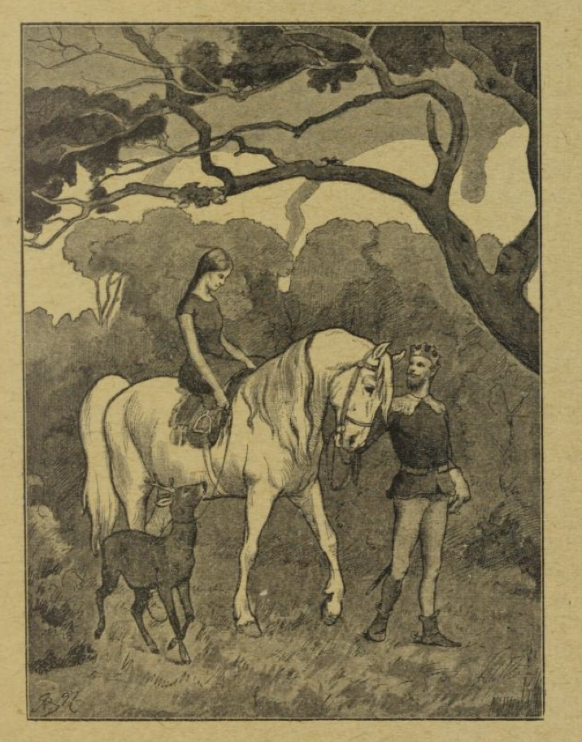

# Bror og søster

Lille bror tok lille søster ved hånden og sa: «Siden mor døde, har vi aldri hatt en glad time. Vår stemor banker oss hver dag, og kommer vi bort til henne, sparker hun oss fra seg. Vi må nøye oss med noen harde brødskorper som de andre ikke vil ha; den lille hunden under bordet har det bedre enn vi, for til den kaster hun da av og til en godhete. Å, det skulle vår rette mor vite! Kom la oss gå sammen ut i den vide verden!»

De gikk hele dagen, over mark og eng, over humper og stein, og når det regnet, sa lille søster: «Gud i himmelen og hjertene i oss de gråter sammen.» Om kvelden kom de til en stor skog, og da var de så trøtte av sult og sorg og den lange veien, så de krøp inn i et hult tre og satte seg til å sove der. Morgenen etter, da de våknet, stod solen alt høyt på himmelen og skinte varmt inn i treet. Da sa den lille broren: «Jeg er så tørst, lille søster! Bare jeg visste av en bekk, så jeg kunne få drikke! Men hys! Jeg synes jeg hører noe sildre!» Så stod lille bror opp og tok søsteren i hånden, for nå ville de lete opp bekken.

Men den onde stemoren var en heks, og hun hadde sett barna gå sin vei; lønnlig og fint, som det er heksenes vis, hadde hun lurt seg etter dem, og hadde forgjort alle bekkene i skogen med sin trolldom. Da nå barna fant en som sprang så blinkende frisk over steinene, så ville den lille broren drikke; men søsteren hørte hvordan det sildre og sang i bekkesurret: «Den som drikker av meg blir til en tiger.» Da ropte hun: «La være, lille bror! Du må ikke drikke av den bekken, for så blir du til et vildt dyr og river meg i hjel.» Da lot lille bror være å drikke, enda han var så gruelig tørst. «Jeg skal vente til vi kommer til den neste,» sa han. Da de nå kom til en annen bekk, så hørte lille søster hvordan det surret og sang i den også: «Den som drikker av meg blir til en ulv.» Derfor ropte hun igjen: «Kjære lille bror! Du må ikke drikke av den bekken heller, for så blir du til en ulv og eter meg opp.» Så lot han være å drikke og sa: «Jeg skal vente til vi kommer til den neste; men da må jeg drikke, hva du så sier, for nå er jeg så gruelig tørst.» Da de så kom til den tredje bekken, hørte lille søster at det surret og sang i vannet: «Den som drikker av meg blir til et rådyr.» Derfor sa hun til broren: «Du må ikke drikke av den bekken, lille bror! for gjør du det, så blir du til et rådyr og løper bort fra meg.» Men han hadde alt lagt seg på kne ved bekken, bøyde seg ut over vannet og drukket av det, og i det samme han fikk de første dråpene i munnen, lå han der som en liten råkalv.

Da gråt lille søster over sin stakkars forheksede bror, og råkalven gråt med og så sorgmodig på henne. Endelig sa hun: «Vær rolig, kjære råkalv! Jeg skal aldri noen gang forlate deg.» Så løste hun sitt gullstrømpebånd og bandt det om halsen på råkalven, og hun sanket siv, som hun flettet et bløtt rep av, til å leie dyret med, og så gikk de videre, og kom lenger og lenger inn i skogen. Da de hadde gått en lang, lang stund, fikk de se et lite hus. Søsteren kikket inn, og da hun så det var tomt, så tenkte hun: «Her kan vi bo.» Hun bar sammen løv og mose og gjorde i stand en bløt seng til den lille råkalven, og hver morgen gikk hun ut og sanket røtter og bær og nøtter, og til råkalven rosket hun fint gress; det spiste den av hånden hennes, var glad og fornøyd, og sprang rundt omkring henne og lekte seg. Om kvelden, når søsteren var trøtt og hadde bedt sin aftenbønn, la hun sitt hode på ryggen til råkalven; det var puta hennes, og på den sovnet hun søtt. Og hadde bare lille bror hatt sin menneskelige skikkelse, så hadde det vært et herlig liv.

Lang tid levde de nå slik alene i villmarka. Men så hendte det at kongen i landet holdt en stor jakt der i skogen. Da klang jegernes horn og lystige rop og hundenes vov-vov mellom trærne; råbukken hørte det også og fikk lyst til å være med. «Å,» sa han til søsteren, «la meg få være med på jakta; jeg holder ikke ut å ligge her og høre på alt det lystige livet.» Og så lenge bad den, til hun endelig ga den lov. «Men du må komme hjem til kvelden,» sa hun. «De ville jegerne lukker jeg ikke inn, og for at jeg kan vite hvem det er, så skal du banke på døra og si: 'Lukk opp, lille søster!' Hører jeg ikke det, så lukker jeg ikke opp.» Råbukken sprang ut, og glad og lystig var den i den frie, friske lufta. Kongen og hans jegere så det vakre dyret, og satte etter det, men kunne ikke nå det igjen; hver gang de mente at nå skulle de få fatt på det, sprang det over busk og bekk og var borte. Da det ble mørkt, løp det hjem til huset, banket på og sa: «Lukk opp, lille søster!» Så lukket søsteren opp døra, råbukken sprang inn og hvilte seg godt ut hele natten på sitt myke leie. Neste morgen var jakta atter i full gang, og da råbukken hørte hornene skralle og jegerne rope, hadde den ingen ro på seg. «Å, lukk opp, lille søster!» sa den. «Jeg må ut og være med.» Så lukket søsteren opp døra for den og sa: «Til kvelden må du komme igjen, og husk deg vel på det du skal si!» Da kongen og jegerne atter fikk se råbukken med gullhalsebåndet, satte de alle etter den; men den var dem for rask og lett på foten. Hele dagen for de etter den, og endelig ut på kvelden fikk de omringet den; en av jegerne såret den i foten, så den haltet og måtte sakte sitt løp. Da lurte jegeren seg etter den til det lille huset, og hørte at den ropte: «Lukk opp, lille søster!» Han så også at døra ble åpnet og straks igjen lukket. Alt dette merket han seg, gikk til kongen og fortalte ham det han hadde sett og hørt. Da sa kongen: «I morgen går vi på jakt igjen.»

Søsteren ble rent forskrekket, da hun så at råbukken var såret. Hun vasket blodet av den, la legedomsurter på såret og sa: «Legg deg nå, kjære råbukk! så du kan bli frisk igjen snart.» Såret var ikke farlig og morgenen etter kjente råbukken ikke mer til det. Og da den atter hørte gny av jakta ute i skogen, sa den: «Jeg kan ikke holde ut å ikke være med; det skal nok ikke gå galt.»

Søsteren gråt og sa: «Nå dreper de deg, og jeg er alene i skogen og forlatt av alle i verden. Jeg kan ikke lukke deg ut.»

«Så dør jeg her av sorg,» svarte råbukken; «når jeg hører hornet, synes jeg benene vil springe under meg.»

Da kunne ikke søsteren annet; med et tungt hjerte låste hun opp døra, og råbukken sprang glad og frisk ut i skogen. Da kongen så den, sa han til sine jegere: «Nå skal dere jage den hele dagen, til det blir mørkt; men pass på at ingen gjør den skade.»

Da sola var gått ned, sa kongen til jegeren: «Kom nå og vis meg det lille skogshuset.» Og da han kom til døra, banket han på og sa: «Lukk opp, lille søster!» Da åpnet døra seg, og kongen gikk inn, og der stod den vakreste pika han noen gang hadde sett. Jomfrua ble forskrekket, da hun så det ikke var hennes råbukk, men en mann som kom inn med en gullkrone på hodet. Men han var vennlig og venlig; han rakte henne hånden og sa: «Vil du følge med meg til mitt slott og bli min kjære hustru?»

«Å ja,» svarte jomfrua, «men råbukken må følge med; jeg forlater den aldri.»

Kongen sa: «Den skal bli hos deg alle dine levedager, og den skal ikke mangle noe.» I det samme sprang råbukken inn; søsteren bandt sivrepet om den, tok det i sin egen hånd og gikk med det fra det lille skogshuset.

Kongen satte den fagre jomfrua opp på sin hest og førte henne til sitt slott, hvor bryllupet ble holdt med stor prakt. Nå var hun dronning, og de levde lykkeligere sammen. Råbukken hadde det også godt på sin måte; det ble stelt vel med den, og den sprang fritt omkring i slottshagen.

Men den onde stemoren, som var skyld i at barna hadde måttet dra ut i den vide verden, hun visste ikke annet enn at lille søster for lenge siden var revet i hjel av villdyrene i skogen, og at lille bror, som var blitt råkalv, var blitt drept av jegerne. Da hun fikk høre at de var i live og hadde det godt, ble hennes hjerte så fullt av hat og avindsyke at hun ikke hadde en rolig time, men bare tenkte på hvordan hun atter skulle føre dem begge i ulykke. Hennes egen datter, som bare hadde ett øye og var stygg som pesten, brukte munnsvær og sa til henne: «Jeg skulle heller vært dronning; slik en lykke hadde nettopp passet for meg.» «Ja, vent bare!» sa kjerringen og snakket vel med henne; «jeg skal nok nytte leiligheten, når den kommer.» Da noen måneder var gått, og dronningen hadde født en liten vakker gutt til verden, og kongen nettopp var ute på jakt, skiftet heksa ham og tok på seg kammerfruas skikkelse. Hun gikk straks inn i dronningens sovekammer og sa til henne: «Kom, badet er ferdig: det gjør godt og gir friske krefter; men snar må dere være, ellers blir det kaldt.» Datteren hadde hun med seg, og så tok de den svake dronningen, bar henne ut i badstua og la henne i karret; så stengte de døra og løp sin vei. Men i badstua hadde de gjort det så hett at den unge, vakre dronningen snart måtte late sitt liv.

Da dette var gjort, ga heksa datteren en kappe på hodet og la henne i senga i stedet for dronningen. Hun ga henne også dronningens skikkelse; men det ene øyet var og ble borte; det kunne mora ikke gi henne. Men for at kongen ikke skulle merke noe, lot hun datteren legge seg på den sida som hun ikke hadde noe øye. Om kvelden, da kongen kom hjem og hørte at det var født ham en liten sønn, ble han hjertens glad og ville straks inn til sin kjære hustru, for å se hvordan det stod til med henne. Men da ropte kjerringen hastig: «For alt i verden, dra omhenget for! Dronningen tåler ikke lyset enda. Hun må bare ha ro!» Så gikk kongen igjen, uten å vite at det var en falsk dronning som lå i senga.

Ved midnattstid, da alle sov, så amma, som satt i barnestua ved vugga, og var den eneste som enda våket, at døra gikk opp, og den rette dronningen kom inn. Hun tok barnet opp av vugga, la det til brystet og ga det å drikke. Så ristet hun med vugga, la barnet ned igjen og bredte over det. Råbukken glemte hun heller ikke, men gikk bort i krokene til den og klappet den. Så gikk hun bort igjen, uten å si et ord. Morgenen etter spurte amma vaktmennene om de hadde sett noen gå inn i slottet om natten; men de hadde ingenting sett. Slik kom dronningen igjen flere netter, men aldri talte hun et ord. Amma så henne hver gang, men kunne ikke tale om det til noen.

Men da noen tid var gått, tok dronningen en natt til å tale; hun sa:

> «Hvordan går det mitt barn?
> Hvordan går det min rå?
> Bare to ganger til har jeg lov å gå.»

Amma svarte ikke; men da dronningen var borte, gikk hun til kongen og fortalte ham alt. Kongen sa: «Store Gud! kan det være mulig? Jeg vil selv våke hos barnet neste natt.» Om kvelden gikk han inn i barnestua, og da det ble midnatt, kom dronningen atter til syne, og da sa hun:

> «Hvordan går det mitt barn?
> Hvordan går det min rå?
> Bare én gang til har jeg lov å gå.»

Så stelte hun med barnet, som hun pleide, før hun ble borte. Kongen turde ikke tale til henne; men natten etter våket han atter i barnestua. Da viste dronningen seg igjen, og nå sa hun:

> «Hvordan går det mitt barn?
> Hvordan går det min rå?
> Det er siste gang jeg har lov å gå.»

Da kunne kongen ikke bære seg lenger, men sprang bort til henne og ropte: «Du kan ikke være noen annen enn min egen kjære hustru!» Og i samme øyeblikk kom hun ved Guds nåde atter til live, ble rød og hvit og vakker, som før, og helt frisk og rask. Hun fortalte da kongen om all den ondskapen som heksa og hennes datter hadde gjort mot henne. Kongen lot dem begge føre for retten, og de fikk sin dom. Datteren ble jaget ut i skogen, og der gjorde villdyrene det snart av med henne; men heksa ble kastet på bål og måtte ynkelig brenne opp. Og da hun var brent til aske, så var det ute med all hennes trolldom, og råbukken fikk sin menneskeskikkelse igjen. Siden levde bror og søster lykkelig sammen til sin død.

