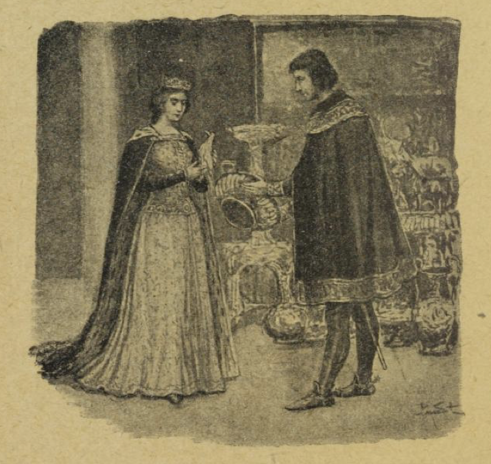
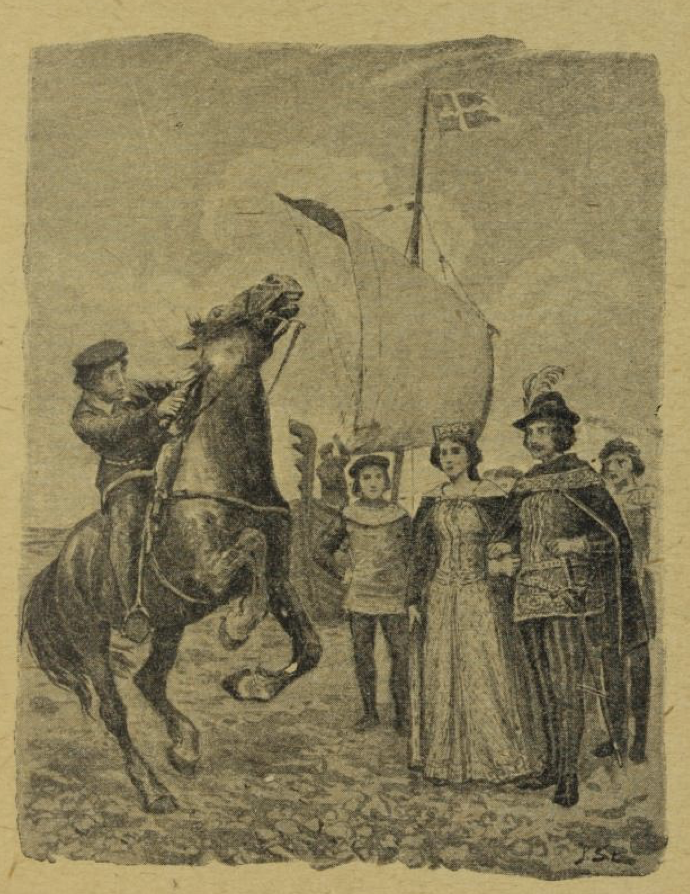

# Den tro Johannes

Det var engang en gammel konge; han ble syk, og skjønte han lå på sin dødsseng. Så sa han: «La den tro Johannes komme til meg.»

Den tro Johannes var hans kjæreste tjener, og ble kalt så, fordi han alle sine dager hadde vært så tro mot kongen. Da han var kommet inn og stod ved sengen, sa kongen til ham:

«Kjære Johannes, nå lider det mot slutten med meg, og jeg har en sorg som tynger så på meg, og det er for min sønn. Han er ung av år og har ikke alltid så godt for å greie seg, og derfor må du love meg at du vil lære ham alt som han trenger til å vite, og at du vil være som en far for ham i ett og alt; ellers kan jeg ikke dø rolig.»

Da svarte den tro Johannes: «Jeg skal aldri forlate ham, men tjene ham med troskap, om det så skal koste mitt liv.»

Da den gamle kongen hørte det, sa han: «Så kan jeg lukke mine øyne i fred. Og når nå jeg er død, skal du vise ham hele slottet, alle kamrene og salene og kjelderrommene, og alle skattene som der er gjemt. Men ett kammer må du ikke vise ham, og det er det som ligger ved enden av den lange gangen, der er det jeg har gjemt billedet av kongsdatteren fra det gyldne tak. Får han se det, blir han grepet av slik kjærlighet til henne, at han faller i uvet og kommer i stor fare for hennes skyld, og dette må du berge ham fra.»

Den tro Johannes gav nå atter kongen sitt løfte, og tok ham i hånden på det, og så ble kongen rolig, la hodet ned på puten og døde.

Da den gamle kongen var båret til graven, fortalte Johannes den unge kongen det han hadde lovet hans far på dødsleiet. «Og det kan du stole på,» sa han, «at jeg skal være like så tro mot deg, som jeg har vært mot ham, om det så skal koste mitt liv.»

Da sørgetiden var til ende, sa den tro Johannes til kongen: «Nå er det på tide at du tar arven din i øyesyn. Kom nå, så skal jeg vise deg hele slottet.»

Så førte han ham omkring alle steder, både høyt og lavt, og lot ham se all rikdommen på slottet og alle de fine rommene; bare ett kammer lukket han ikke opp: det som det farlige billedet var gjemt i. Men billedet var satt opp slik, at straks døren gikk opp, måtte en se bent imot det, og så mesterlig var det gjort at en kunne tro det hadde liv og sjel, og at ingenting i verden kunne måle seg med det i fagerhet og ynde. Men den unge kongen la merke til at Johannes lot være å åpne én av dørene.

«Hvorfor lukker du aldri opp denne?» spurte han.

«Fordi derinde er noe som du må reddes for,» svarte den tro Johannes.

«Har jeg sett hele slottet,» sa kongen, «så vil jeg vite hva som er derinde og så,» og dermed ville han åpne døren med makt.

Da holdt den tro Johannes ham tilbake og sa: «Jeg har lovet din far, før han døde, at du ikke skal få se det som er gjemt i dette kammer; det kunne føre både deg og meg i stor ulykke.»

«Større ulykke blir det,» svarte kongen, «om jeg ikke får komme inn der; da blir det ikke fred og ro å finne for meg, verken dag eller natt, før jeg har sett denne løndommen med mine egne øyne. Nå rører jeg meg ikke av flekken før du har lukket opp.»

Da skjønte den tro Johannes at det ikke var annet å gjøre, og med tungt hjerte og tunge sukk lette han frem nøkkelen i det store knippet. Da han hadde lukket opp døren, gikk han selv inn først; for han tenkte å stille seg slik, at kongen ikke fikk se billedet. Men hva nyttet det? Kongen reiste seg på tå og kikket over akselen hans. Og da han fikk se billedet av kongsdatteren fra det gyldne tak, syntes hun ham det herligste hans øyne hadde møtt, og da tok kjærligheten til henne ham så sterkt og kom så brått på ham, så han mistet samlingen og falt overende på gulvet.

Den tro Johannes løftet ham opp og bar ham inn på sengen hans, og tenkte med angst: «Nå er ulykken hendt! Hvordan skal dette gå?» Han gav ham en styrkende drikk, så han atter kom til seg selv, og det første kongen sa var: «Hvem er hun, den herlige som er malt derinde på billedet?»

«Det er kongsdatteren fra det gyldne tak,» svarte den tro Johannes.

Da tok kongen atter til orde og sa: «Så stor en kjærlighet bærer jeg til henne, at om alle bladene på trærne var tunger, kunne de ikke utsi det. Hun må og skal bli min brud; det vil jeg sette livet inn på, og så sant som du er min tro Johannes, må du hjælpe meg til å vinne henne.»

Johannes grundet lenge på hva de nå skulle gjøre; det var vanskelig nok, mente han, bare å stedes for kongsdatterens åsyn. Til slutt trodde han å ha funnet på råd.

«Alt som kongsdatteren har omkring seg,» sa han til kongen, «er av gull: skåler og begre, bord og stoler, og mange andre slags løsøre. Du har i skatkamret fem tønner gull; en av dem skal du la alle gullsmedene i ditt rike gjøre fine og kostelige ting av: kopper og kar, fugler og underlige dyr. Det kommer hun til å like. Så drager vi avsted med det og prøver vår lykke hos kongsdatteren.»

Kongen bød nå alle gullsmedene komme sammen, og de arbeidet dag og natt, og omsider fikk de ferdig all den vakre gullstasen. Alt sammen lot Johannes føre ombord på et skip, og så kledde han seg ut som kjøpmann, og det samme måtte kongen også gjøre, for at ingen skulle kjenne dem. De satte nå seil opp og for ut på storhavet, og de seilte både langt og lenge, til de kom til den byen hvor kongsdatteren fra det gyldne tak bodde.

Den tro Johannes bad kongen bli igjen på skipet og vente på ham. «Kanskje jeg får kongsdatteren med meg,» sa han, «og derfor må du holde alt i fin stand, sette frem all gullstasen og pynte vakkert opp på skipet.»

Jo, det skulle nok kongen gjøre, og så valgte Johannes ut noen av gullsakene, som han gjemte i forkleet sitt, gikk i land og bent opp til slottet. Da han kom inn i kongsgården, stod det ved brønnen en vakker jente, som hadde to gullspann i hånden; hun skulle nettopp til å bære inn vann. I det samme hun vendte seg, fikk hun se den fremmede mannen, og spurte hvem han var.

«Jeg er en mann som handler med gullstas,» sa han, og så viste han henne det han hadde i forkleet.

«Å nei, hvor vakkert det er!» ropte hun, og måtte sette spannene fra seg for å se på det alt sammen. «Dette må prinsessen endelig få se,» sa hun, «for hun er så glad i alt slikt, og kommer visst til å kjøpe det hele.»

Dermed bad hun ham følge med inn i slottet; for hun var kammerjomfruen til prinsessen. Da kongsdatteren fikk se gullsakene, likte hun dem så godt at hun sa: «Dette er det vakreste gullsmedarbeide jeg har sett, og jeg vil kjøpe det av deg altsammen.»

Men den tro Johannes svarte: «Jeg er bare tjener hos den rike kjøpmannen som eier dette. Dette her er bare småting mot alt det som min herre har nede på skipet; for det er det fineste og kosteligste som kan gjøres av gull.»

Da ville hun ha det hele opp til seg på slottet; men han sa: «Nei, det måtte ta mange dager, slik en mengde som der er, og ikke tror jeg det er plass i alle salene her på slottet, om alt skulle stilles opp.»

Da ble kongsdatteren så rent nysgjerrig, og fikk slik lyst til å se all denne herligheten, at hun sa: «La meg komme ut på skipet, så jeg kan få se din herres skatter med mine egne øyne.»

Så førte den tro Johannes henne ned til skipet, og da kongen fikk se henne, syntes han hun var enda vakrere enn på billedet, og det var som hjertet skulle sprenges i brystet på ham. Nå steg hun ombord, og kongen selv ledet henne inn; men den tro Johannes ble igjen ute hos styrmannen, og bød at skipet skulle legge fra land.

«Opp med seilene!» sa han. «La nå skipet fly som fugl i luften!»

Imidlertid viste kongen prinsessen alle gullsakene, stykke for stykke: skåler og kar og begre, gullfuglene og alle de underlige dyrene. Dette tok flere timer, og så glad var hun, mens hun så på alt sammen, at hun ikke merket at skipet dro avsted for fulle seil. Da hun hadde sett det siste stykket, takket hun kjøpmannen, og ville hjem igjen; men da hun kom opp på dekket, så hun at skipet var langt fra land og stevnet frem på åpne havet.

«Å,» ropte hun, full av redsel, «jeg er narret og bortført; men heller vil jeg dø enn gi meg i en ussel kjøpmanns vold.»

Da grep kongen hennes hånd og sa: «Jeg er ikke kjøpmann; jeg er en konge og ikke mindre høybåren enn du selv, og når jeg har bortført deg med list, så kommer det alene av den store kjærlighet jeg bærer til deg. Første gang jeg så ditt bilde, tok det meg så sterkt at jeg mistet sans og samling.»

Da kongsdatteren fra det gyldne tak hørte dette, trøstet hun seg, og hennes hjerte droges alt til ham, så hun gjerne gikk inn på å bli hans dronning.

Men så hendte det seg, mens de seilte der ute på åpne havet, og den tro Johannes satt fremme i stavnen og spilte på fele, at han så tre ravner komme flyvende, og de fulgte med skipet. Da holdt han opp med spillet og lyttet etter det de talte med hverandre; for han skjønte fuglenes mål.

Den ene ropte: «Se, der fører han kongsdatteren fra det gyldne tak hjem med seg.»

«Å ja,» svarte den andre, «men han eier henne ikke ennå.»

Den tredje sa: «Hun sitter jo hos ham på skipet.»

«Det hjelper nok ikke stort,» tok den første atter til orde; «for straks de legger til land, kommer en rød hest springende mot ham, og den vil han sette seg opp på; men gjør han det, så farer den avsted med ham gjennom luften, så han aldri mer får se jomfruen igjen.»

«Er det ingen råd for det?» spurte den andre.

«Jo,» lød svaret, «hvis en annen får sprunget opp på hesten og griper pistolen som sitter i sadelhylsteret, og sikter hesten ihjel, så er den unge kongen frelst. Men hvem kan vite det! Og den som vet det og sier det til ham, han blir til stein fra fotsålene og opp til knærne.»

Da sa den andre: «Jeg vet ennå mer: Om så hesten blir drept, får nok ikke kongen prinsessen til brud likevel. For når de kommer sammen inn i slottet, så ligger der en ferdigsydd brudgomsskjorte på et fat, og den ser så gild ut som den var vevd av gull og sølv; men det er ikke annet enn svovel og bek, og når han tar den på seg, så brenner den ham opp like til marv og ben.»

«Finnes det ingen råd for det?» spurte den tredje.

«Å jo,» svarte den andre, «dersom en får grepet skjorten, med hansker på hendene, og kaster den på varmen, så den brenner opp, da er den unge kongen frelst. Men hva nytter det! Den som vet det og sier det til ham, blir til stein fra knærne opp til hjertet.»

Da sa den tredje: «Jeg vet ennå mer: om så brudgomsskjorten blir opbrent, får nok ikke kongen sin brud for det. Når han skal til å danse med henne i bryllupet, blir hun så blek med én gang og faller ned som død; og dersom da ikke noen løfter henne opp og suger tre blodsdråper av det høyre brystet hennes og spytter dem ut igjen, så dør hun. Men om noen vet det og sier det, så blir han til stein fra topp til tå.»

Da ravnene hadde talt sådan med hverandre, fløy de sin vei igjen; men den tro Johannes hadde hørt det alt sammen og skjønt hvert ord. Fra den stund var han få mælt og tung til sinns; for tidde han med det han hadde hørt, så måtte kongen bli ulykkelig, og sa han det til ham, så kostet det ham selv livet. Men til slutt ble han enig med seg selv.

«Jeg vil frelse min herre,» tenkte han, «om jeg så selv må sette livet til på det.»

Da de nå kom til lands, gikk det som ravnene hadde spådd; en vakker rød hest kom springende.

«Den kommer i rette tid,» sa kongen; «den skal bære meg opp til slottet!»

Han skulle alt til å sette seg opp på den; men den tro Johannes var snar i vendingen; han sprang opp på hesteryggen, dro pistolen frem av sadelhylsteret og skjøt hesten. Da ropte kongens andre tjenere, som var avindsyke på den tro Johannes, at det var skammelig gjort å drepe det vakre dyret som skulle båret kongen hjem til slottet.

Men kongen sa: «Ti stille og la ham være i fred! Han er min tro Johannes. Hvem vet hva det kan være godt for?»

Så gikk de opp til slottet og inn i salen, og der stod et fat med den ferdigsydde brudgomsskjorten på, og den så ut som den var bare gull og sølv. Den unge kongen gikk bort og skulle til å ta den; men den tro Johannes skjøv ham til side, grep skjorten, med hansker på hendene, bar den hastig bort og kastet den på varmen, så den brente opp.

De andre tjenerne tok atter til å mukke. «Tenk, han brenner opp kongens brudgomsskjorte!» sa de.

Men den unge kongen sa: «Hvem vet hva det kan være godt for? La min tro Johannes være i fred!»

Så ble det holdt bryllup og de skulle til å danse, bruden også; men den tro Johannes lot ikke sine øyne vike fra hennes åsyn. Med én gang bleknet hun og falt ned som død. Straks sprang Johannes bort til henne, løftet henne opp og bar henne inn i et kammer; der la han henne ned, falt på kne ved siden av henne, sugde tre blodsdråper av hennes høyre bryst og spyttet dem så ut igjen. Straks kom hun atter til live igjen; men den unge kongen hadde sett alt dette, og skjønte ikke hvorfor Johannes hadde båret seg slik ad; han ble sint og ropte: «Kast ham i fengsel!»

Morgenen etter ble den tro Johannes dømt til døden og ført til galgen. Men da han stod der oppe og skulle rettes, sa han: «Etter gammel skikk og bruk får den som skal lide døden lov til å tale, om han har noe på hjerte. Får jeg lov til det?»

«Ja,» sa kongen, det skulle han få lov til.

Da sa Johannes: «Jeg er dømt med urette, og har alltid vært deg tro.» Og så fortalte han om samtalen han hadde hørt mellom ravnene ute på havet; det var bare for å frelse sin herre, at han hadde båret seg ad som han hadde gjort.

Da kongen fikk vite dette, ropte han: «Å, min tro Johannes! Nåde! Nåde! — Før ham ned straks!»

Men ikke før hadde Johannes sagt det han hadde å si, så falt han død ned; nå var han blitt til stein fra topp til tå.

Kongen og dronningen sørget sårt over dette, og kongen sa: «Å, hvor ille jeg har lønnet så stor en troskap!» Han lot steinbildet bære inn i sitt sovekammer og stille opp ved siden av sengen sin, og hver gang han så på det, gråt han bitre tårer og sa: «Å, kunne jeg bare gjøre deg levende igjen, min tro Johannes!»

Da en tid var gått, fødte dronningen tvillinger til verden, to små sønner, som vokste opp til stor glede for sine foreldre. En dag som dronningen var i kirken, og begge barna satt og lekte hos sin far, så kongen atter bort på steinbildet og sukket, med tårer i øynene: «Å kunne jeg så sant gjøre deg levende igjen, min tro Johannes!»

Da tok steinbildet til å tale og svarte ham: «Ja, du kan gjøre meg levende igjen, dersom du vil ofre det kjæreste du eier.»

Da ropte kongen: «Alt det jeg eier i verden vil jeg gi for deg!»

Atter tok billedstøtten til orde: «Dersom du med egen hånd vil hugge hodet av begge barna dine og stryke blodet på meg, så kommer jeg atter til live.»

Kongen ble forfærdet, da han hørte at han selv skulle drepe sine kjære små barn; men så tenkte han på all den troskap Johannes hadde vist ham, og at han hadde ofret sitt liv for hans skyld, og da dro kongen sitt sverd, hugg med egen hånd hodet av begge barna og strøk blodet på billedstøtten. Da kom det liv i den igjen, og den tro Johannes stod der atter, lys levende og like frisk og rask som før.

Han sa til kongen: «Din troskap skal ikke bli ulønnet.» Dermed tok han de små hodene og satte dem på sin plass, og strøk blod over sårene; straks ble barna atter levende og sprang omkring og tok fatt på sin lek igjen, som intet var hendt.

Nå ble kongen hjertens glad, og da han så dronningen komme i det samme, så lot han den tro Johannes og begge barna gjemme seg i et stort skap. Da hun kom inn, spurte han henne: «Har du bedt i kirken?»

«Ja,» svarte hun, «men hele tiden måtte jeg tenke på den tro Johannes, som det skulle gå så ille for vår skyld.»

Da sa kongen: «Min kjære hustru, vi kan gjøre det godt igjen og atter gi ham livet; men det kommer til å koste oss begge våre barn; dem må vi ofre.»

Dronningen ble blek av redsel; men allikevel svarte hun: «Vi skylder ham dette for hans store troskap.»

Da gledet kongen seg, fordi hun tenkte på samme måte som han selv, gikk bort og lukket opp skapet, hentet frem barna og den tro Johannes, og sa: «Gud være lovet, han er frelst, og småguttene våre har vi også fått igjen.»

Og så fortalte han henne hvordan det hele var gått til. Siden levde de sammen lykkelig og vel alle sine dager.
