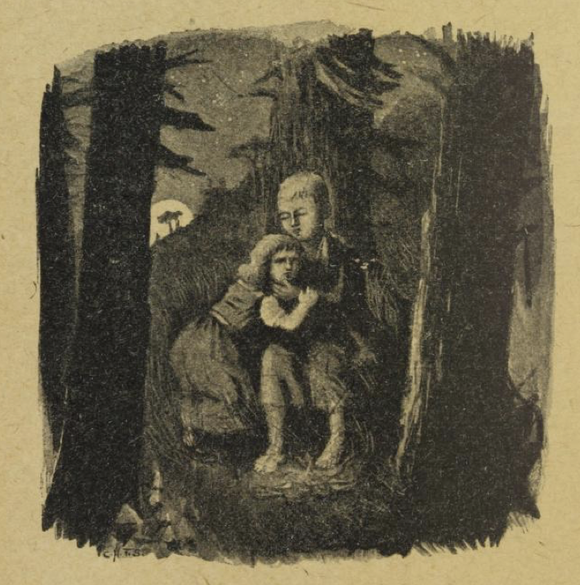

# Hans og Grete

Tett utenfor en stor skog bodde en fattig vedhugger med sin kone og sine to barn. Gutten kalte de Hans og jenta Grete. Lite hadde de både å bite og brenne, og da det kom dyrtid i landet, hadde mannen ikke lenger det daglige brød til seg og sine.

Mens han nu en kveld lå i senga og ikke kunne falle i søvn for sine tunge tanker og mange sorger, sukket han og sa til sin hustru: «Hva skal det bli av oss? Hvorledes skal vi kunne sørge for våre stakkars barn, når vi ikke har noe til oss selv?»

«Hør nu her, mann,» sa kona; «i morgen tidlig tar vi barna med oss ut i skogen, hvor den er tettest, gjør opp en varme til dem og gir hver av dem et stykke brød, og så går vi til vårt arbeid og lar dem være alene. De finner aldri veien hjem igjen, og så er vi av med dem.»

«Nei kone,» sa mannen, «jeg har ikke hjerte til å la mine stakkars barn bli alene i skogen; da blir de nok snart revet ihjel av ville dyr.»

«Å din nar!» sa hun. «Vil du enda at vi alle fire skal sulte ihjel, så kan du likeså godt ta på å høvle bord til likkistene våre med det samme,» sa hun, og hun gav seg ikke før han samtykket. «Men jeg synes så synd i de stakkars barna,» sa mannen.

De to barna hadde heller ikke kunnet falle i søvn for sult, og hadde hørt det stedmora hadde sagt til faren. Grete, stakkar, gråt sine bitre tårer, og sa til den lille broren sin: «Nu er det ute med oss.» Men han trøstet henne, og sa hun skulle ikke gråte. «Jeg skal nok finne på råd.» Da foreldrene var sovnet, stod han opp og tok på seg trøya, lukket opp underdøra og lurte seg ut. Det var klart måneskinn, og alle de hvite flintestenene utenfor huset glimret som bare sølvskillinger. Hans bøyde seg ned og sanket så mange som han kunne få plass til i trøyelomma sin. Så gikk han inn igjen, og sa til søsteren: «Du skal ikke være redd, lille Grete. Bare sov du! Vorherre vil nok ikke forlate oss.» Og dermed la han seg atter ned i senga sin.

Straks det lysnet av dag, før sola enda var oppe, kom kona og vekket barna. «Stå nu opp, dovninger!» sa hun, «vi skal ut i skogen og hente brende.» Så gav hun hver av dem et lite stykke brød, og sa: «Dette skal dere ha til middagsmat; men sluk nu ikke alt på én gang, for mer får dere ikke.» Grete tok brødet til seg og gjemte det; for Hans hadde si lomme full av sten. Så gav de seg alle på vei ut til skogen. Da de hadde gått et stykke, snudde Hans seg om og kikket etter huset, og det gjorde han flere ganger.

«Hva er du går slik og kikker etter, Hans?» spurte faren. «Nu må du se at få beina med deg.»

«Jeg ser bare etter den hvite katten min,» svarte Hans; «den sitter oppe på taket og vil si farvel til meg.»

«Tøv!» sa mora. «Det er jo ikke katten; det er morgensola som skinner på den hvite skorsteinspipen.»

Men Hans var ikke ute etter katten; han kastet en hvit flintesten på veien hver gang han snudde seg.

Da de var kommet langt inn i skogen, sa faren: «Nu, barn, sank dere ved og finn tørt kvist; jeg skal gjøre opp en varme til dere, så dere ikke skal fryse.» Hans og Grete sanket kvist sammen og gjorde en liten haug av det. Varmen blev tent, og da luen slo høyt op, sa kona: «Nu skal dere legge dere ved ilden, barn, og hvile dere; vi går inn i skogen og hugger ved. Når vi er ferdige, kommer vi igjen og henter dere.»

Hans og Grete satt ved ilden, og da det blev middag, spiste hver sitt stykke brød. De hørte øksehug, og trodde det var faren som hugget. Men det var ikke øksa; det var en gren som han hadde bundet ved et visnet tre, og som vinden slo til og fra. Da de hadde sittet lenge, blev øynene deres tunge av søvn, og de faldt i dyp søvn.

Da de våknet, var det mørk natt. Grete begynte å gråte og sa: «Hvorledes skal vi nu finne ut av skogen?» Men Hans trøstet henne: «Vent bare, lille Grete, til månen kommer opp, så skal vi nok finne veien.» Og da fullmånen var kommet opp, tok Hans sin lille søster i hånda, og fulgte flintestenene som glimret som nyslåtte sølvskillinger og viste dem veien. De gikk hele natta, og da det lysnet av dag, kom de til farens hus.

De banket på døra, og da kona lukket opp og så at det var Hans og Grete, sa hun: «Dere leie unger! Hvorfor har dere ligget og sovet så lenge i skogen? Vi trodde dere slett ikke ville komme hjem igjen.» Men faren var glad; for han hadde i sitt hjerte angret at han hadde latt dem bli alene igjen.

Noen dager senere var det atter nød i huset, og barna hørte at mora sa til faren, da de var kommet i seng: «Nu er vi like nær igjen; vi har bare et halvt brød, og når det er slutt med det, så er visa ute. Barna må bort; vi må føre dem dypere inn i skogen, så de ikke kan finne veien hjem igjen; ellers er det ute med oss.» Dette falt mannen tungt på hjerte, og han mente det var bedre å dele den siste matsmulen med barna. Men kona ville ikke høre på slikt, og kom bare med skjenn og spitord. Hadde han gitt etter første gangen, fikk han gjøre det andre gangen med, sa hun.

Barna hadde ligget våkne og hørt samtalen. Da foreldrene var sovnet, stod Hans opp og ville ut og sanke flintesten; men kona hadde stengt døra, så han kunne ingen vei komme ut. Allikevel trøstet han sin søster og sa: «Du skal ikke være redd, lille Grete. Bare sov du! Vorherre vil nok ikke forlate oss.»

Tidlig neste morgen kom kona og drog barna opp av senga. De fikk hver sitt stykke brød; men det var enda mindre nu enn forrige gang. På veien til skogen smuldret Hans sitt brødstykke i lomma, stanset alt i ett og kastet smulene på marka.

«Hva er det du står og kikker etter, Hans?» spurte faren. «Se nu til at du rapper deg!»

«Jeg bare ser etter den vesle dua mi,» svarte Hans; «den sitter på taket og vil si farvel til meg.»

«Tøv!» sa kona. «Det er jo morgensola som skinner på skorsteinspipen.» Men Hans kastet efterhvert alle smulene på veien.

Kona førte barna lenger og lenger inn i skogen; aldri i sine levedager hadde de vært så langt hjemmefra. Det blev atter gjort opp et stort bål, og mora sa til barna: «Nu skal dere bli sittende her, og er dere trette, så kan dere sove; vi går inn i skogen og hugger brende, og når vi er ferdige, og det lider mot kvelden, så kommer vi og henter dere.»

Da det blev middag, delte lille Grete sitt brødstykke med broren, som hadde smuldret opp sitt og strødd det på veien. Så falt de i søvn, og det blev kveld; men ingen kom for å hente barna. Da de våknet, var det mørk natt, og Hans trøstet sin søster og sa: «Vent bare, Grete, til månen kommer opp, så kan vi se brødsmulene som jeg har strødd ut; de skal nok vise oss veien hjem.»

Da månen kom opp, gikk de avsted; men ingen brødsmuler var å finne nu; for de tusener av småfugl som flyver om i skog og mark, hadde pillet dem opp alle sammen. «Vi skal nok finne veien allikevel,» sa Hans; men de fant den ikke. De gikk hele natta og neste dag med, fra morgen til kveld, uten å komme ut av skogen, og så var de så sultne; for de hadde ikke annet til mat enn noen bær som de fant her og der på marka. Tilslutt blev de så trette at beina ikke lenger ville bære dem, og så la de seg under et tre og falt i søvn.

Nu var det den tredje morgenen, siden de var gått hjemmefra. De våknet og gav seg atter avsted, men kom bare lenger inn i skogen, og fikk de ikke snart hjelp, måtte de dø av sult og tretthet. Ved middagstid så de en liten snehvit, vakker fugl, som sat på en gren og sang, og det lød så vakkert at de blev stående og lytte på den. Så lettet den på vingene og fløy forut, og de fulgte etter, og så kom de til et lite hus; der satte fuglen seg på taket. Da de kom nærmere, så de at huset var bygget av brød, taket var gjort av kake, og vindusrutene av det klareste sukker.

«Nu skal vi sette til,» sa Hans, «og holde et velsignet måltid. Jeg vil spise av taket, og du, Grete, kan spise av vinduet; det er søtt.» Hans strakte seg opp og brøt et stykke av taket for å prøve hvorledes det smakte, og Grete stilte seg til vinduet og gnavet på rutene. Da hørte de en fin røst rope inde fra stua:

> «Knirk, knark, knar!  
> Hvem gnager på mitt hus så hardt?»

Barna svarte:

> «Det er vinden, det himmelske barn,  
> som blåser så sterkt om ditt garn.»

Og de lot seg ikke forstyrre, men fortsatte å spise. Hans, som syntes taket smakte så godt, rev ned et stort stykke av det, og Grete støtte ut en hel rund vindusrute, satt seg ned og koste seg med den.

Da gikk plutselig døra opp, og en eldgammel kone, som støttet seg på en krykke, kom krøpende ut. Hans og Grete ble så redde at de slapp det de hadde i hendene. Men den gamle nikket med hodet og sa: «Å, kjære barn, hvem har ført dere hit? Kom bare inn og bli hos meg, dere skal ikke lide noen skade.» Hun tok dem begge ved hånda og førte dem inn i sitt lille hus. Der blev det satt fram god mat for dem, melk og pannekaker med sukker, epler og nøtter. Etterpå blev det redt to vakre hvite små senger til dem, og Hans og Grete la seg i dem, og trodde rent de var kommet i himmelen.

Men den gamle kona hadde bare gjort seg så blid for å lokke dem til seg; hun var en ond heks, som var på lur etter småbarn, og hadde bygget sitt brødhus bare for å få dem i sin vold. Når hun fikk fatt på et barn, så drepte hun det, kokte det og åt det opp, og det var en ren festdag for henne. Hun hadde sett Hans og Grete, straks de nærmet seg huset, og da satte hun i en ondskapsfuld latter og grin og glittet seg. «Dem har jeg,» mente hun; «de skal ikke slippe fra meg.»

Tidlig om morgenen, før barna var våknet, stod hun opp, og da hun så dem ligge der og sove så søtt, med røde, runde kinder, så mumlet hun ved seg selv: «Dette skal bli god stek.» Så grep hun lille Hans med sine knoklede hender, og bar ham ned i en liten stall. Det nyttet ham ikke noe å skrike; hun stengte ham inne bak et treleverk, og der måtte han holde til som i et bur. Så gikk hun inn til Grete, rusket henne våken og ropte: «Opp med deg nu, din dovne unge! Du skal hente vann og koke god mat til broren din; han står på stallen og skal bli fet, og når han er blitt riktig fet og god, så skal jeg steke ham og ete ham opp.»

Grete, stakkar, gav seg til å gråte rent ynkelig; men det hjalp ingenting; hun måtte gjøre som den onde heksa bød henne. Så blev det kokt riktig god mat til Hans; men Grete fikk ikke annet enn krabbeskall. Hver morgen kom kjærringa luskende ned til stallen og ropte: «Stikk ut fingeren din, Hans, så jeg kan kjenne om du snart er fett.» Men Hans stakk et avgnaget ben ut mellom tralene, og heksa var så nærsynt at hun ikke merket det; hun trodde det var fingeren til Hans, og undret seg på at det gikk så sent med å få ham fet.

Da fire uker var gått, og Hans enda var like mager, var det slutt med hennes tålmod, og hun ville ikke vente lenger. «Hei da Grete!» ropte hun. «Skynd deg og hent vann! Enten Hans er fet eller mager, så skal han bli slaktet og kokt i morgen.» Den stakkars lille søstera sørget og sukket, så det var en ren ynk, og tårene rant nedover kindene på henne, mens hun gikk og bar vann. «Kjære Gud, hjelp oss!» ropte hun. «Hadde bare villdyra ett oss ute i skogen, så hadde vi i alle fall fått dø sammen!»

«Du kan spare deg alt skrål og skrik!» sa heksa. «Det hjelper deg aldri et grand.»

Tidlig neste morgen måtte Grete henge opp den store vannkjelen og tenne på varmen under. «Først skal vi bake,» sa heksa; «jeg har alt hetet bakerovnen og eltet deigen.» Hun støtte den stakkars Grete bort til ovnen, som lyse luen alt slo ut av. «Kryp nu inn,» sa kjærringa, «og kjenn etter om det er riktig hett derinde, så vi kan skyte inn brødet.» Men straks Grete var kommet inn, ville heksa til å smelle igjen ovnsdøra; Grete skulle også bli stekt, for henne ville hun også ete.

Men Grete skjønte hva hun tenkte på, og så sa hun til heksa: «Jeg vet ikke hvorledes jeg skal bære meg ad. Hvorledes skal jeg komme helt inn?»

«Din dumme gås!» sa kjærringa. «Åpninga er jo så stor at jeg selv kan krype inn,» og dermed krabbet hun selv bort og stakk hodet inn i bakerovnen. Men i det samme gav Grete henne et støt, så hun røk helt inn i ovnen, smeldte jerndøra igjen og skjøt slåen for. Hu! da begynte kjærringa å hyle så forferdelig; men Grete sprang sin vei, og den ugudelige heksa blev brent til døde.

Grete løp rett til Hans, åpnet den lille stallen og ropte: «Hans! Nu er vi frelst, den gamle heksa er død.» Da sprang Hans ut som en fugl av buret. Hvor de var glade og sprang omkring hverandre og kysset hverandre! Og nu de ikke hadde mer å være redde for, gikk de inn i heksas hus og så seg om i alle kriker og kroker. Der stod kister fulle av perler og edelsteiner.

«De er enda bedre enn flintestenene,» sa Hans, og stappet alle lommene fulle, og Grete sa: «Jeg vil også ha noe med hjem,» og fylte forkleet sitt.

«Og nu må vi avsted,» sa Hans, «så vi kan komme ut av den fordømte trollskogen.»

Da de hadde gått et par timers tid, kom de til et stort vann. «Hvorledes skal vi komme over?» sa Hans. «Her er hverken klopp eller bro.»

«Og heller ingen båt,» svarte Grete. «Men se, der kommer en hvit and svømmende. Kanskje den vil hjelpe oss over, når vi ber den vakkert.» Og så ropte hun:

> «And, and, lille and,  
> her står Hans og Grete på land.  
> Hverken klopp eller bro  
> kan vi her på stedet se.  
> Sett oss på din hvite rygg,  
> så vi kommer trygt og skyndig!»

Anda kom da til dem, og Hans satte seg på ryggen, og ba søstera sette seg hos ham. «Nei,» svarte Grete, «det blir for tungt for den vesle anda; den skal ta oss over én om gangen.» Det gjorde den gode fuglen, og da de var kommet vel over og hadde gått en liten stund, syntes skogen dem mer og mer kjent, og tilslutt så de farens hus i det fjerne. Da begynte de å løpe, sprang inn i stua og falt faren om halsen. Mannen hadde ikke hatt en glad time siden han hadde latt barna være igjen i skogen; men kona var død.

Grete ristet forkleet sitt, så perlene og edelsteinene hopet seg utover hele golvet, og Hans tok opp etter opp av lommene. Da var det slutt med all nød og sorg, og de levde i glede alle sine dager.

Snipp snapp snute, nu er eventyret ute.
