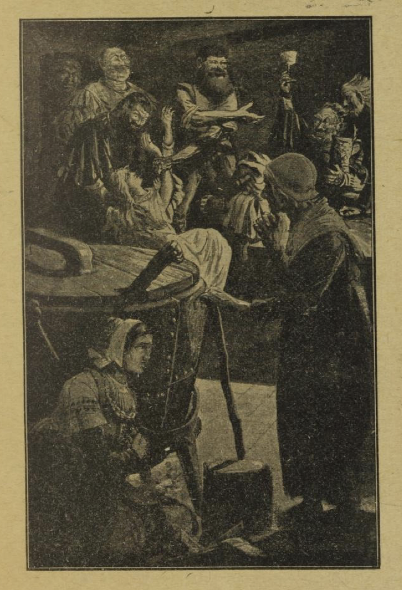

# Røverbrudgommen

Det var en gang en møller, som hadde en vakker datter, og da hun var blitt voksen pike, ville han gjerne ha henne vel forsørget og godt gift; derfor sa han til henne: «Kommer her bare en høvelig frier og vil ha deg, så skal jeg ikke vise ham bort.»

Det varte ikke lenge, før det kom en frier som lot til å være svært rik, og da mølleren slett ikke visste noe å utsette på ham, så lovet han ham at han skulle få datteren. Men piken selv likte ham slett ikke og hadde ingen riktig tro på ham. Bare hun så ham eller tenkte på ham, fyldtes hennes hjerte med gru og redsel.

En dag sa han til henne: «Du er min brud, som du jo vet, og nå er det på tide at du kommer og ser til meg.»

Piken svarte da: «Jeg vet ikke hvor du bor.»

«Mitt hus ligger ute i skogen,» svarte han.

Hun søkte påskudd til å la være å komme, og sa at hun ikke kunne finne veien. Da sa brudgommen: «Nå på søndag må du komme. Jeg har alt bedt gjester, og for at du kan finne frem gjennom skogen, skal jeg strø aske der du skal gå.»

Søndagen kom, og piken måtte da avsted; men hun var så redd, enda hun ikke selv visste hva hun var redd for, og for å merke seg veien, fylte hun begge lommene sine med gryn og erter. Da hun kom til skogen, så hun asken som var strødd der, og den fulgte hun; men allikevel kastet hun, rett som det var, et par erter langs veien, snart til høyre og snart til venstre. Hun gikk nesten hele dagen, til hun kom inn i tette skogen, hvor den var mørkest, og her fikk hun øye på et enslig hus; det så skummelt og uhyggelig ut. Allikevel gikk hun inn, men fant ikke et menneske, og i førstningen hørte hun ikke en lyd; men så hørte hun en røst som ropte:

> «Vend om, du brud så fager og god!
> Denne morderhule krever ditt blod.»

Hun så seg om, og merket at stemmen kom fra en fugl, som satt i et bur i vinduet. Enda en gang ropte den:

> «Vend om, du brud så fager og god!
> Denne morderhule krever ditt blod.»

Hun gikk nå videre fra rom til rom; men ikke et liv var å se. Til slutt kom hun ned i kjelleren. Der satt en eldgammel kone og vagget med hodet.

«Kan du si meg om det ikke er her brudgommen min bor?» spurte piken.

«Å ditt stakkars barn!» sa kjerringen, «hvordan er du kommet hit? Dette er en fæl morderhule. Du mener nok du er brud, og at du snart skal holde bryllup, men det blir med døden til brudgom. Se her har jeg måttet sette på en stor kjele med vann; når de har deg i sin vold, hugger de deg i stykker uten nåde og koker og eter deg; for du må vite det er menneskeætere du er kommet til her, og døden er deg viss, hvis ikke jeg synes synd i deg og frelser deg.»

Så tok kjerringen henne i hånden og førte henne bak et stort kar, hvor ingen kunne se henne. «Sitt nå så stille som en mus,» sa hun, «og rør deg ikke av flekken, ellers er det ute med deg! I natt, når røverne ligger og sover, skal vi fly sammen; jeg har lenge ventet på en leilighet.»

Straks etter at piken var kommet i skjul, gikk døren opp, og røverne kom inn. De slapp med seg en ung pike, og fulle var de, så ingen brydde seg om at hun gråt og bar seg ille. De gav henne vin å drikke, tre glass: ett med hvit, ett med rød, og ett med gul vin, og da brast hjertet på henne. Så rev de av henne de fine klærne hennes, la henne opp på et bord, skar hennes fagre legeme opp i mange stykker og strødde salt på. Bruden, stakkar, som satt bak karet, skalv av redsel; for nå fikk hun se hva røverne hadde tenkt å gjøre med henne.

En av dem la merke til en gullring, som satt på lillefingeren til henne de hadde myrdet, og da han ikke straks fikk den dratt av, så tok han en øks og hugg hele fingeren av henne. Men fingeren spatt i været, fór over karet og falt bent i fanget til bruden. Røveren tok et lys og lette etter den, men kunne ikke finne den.

«Har du sett bak karet?» sa en av de andre til ham.

Men da skyndte kjerringen seg å si: «Kom nå til bords! I morgen kan dere lete bedre etter.»

«Det har du rett i,» sa røveren, og så satte de seg til bords alle sammen. Konen hadde dryppet sovedråper i vinen, og det varte ikke lenge, før de ble øre og søvntunge; de la seg ned på gulvet, den ene etter den andre, og snart lå de alle og snorket.

Da bruden merket at de lå i dyp søvn, kom hun frem bak karet; hun måtte stige over alle røverne, som lå bortetter gulvet i en lang rekke, og hun var gruelig redd for at noen av dem skulle våkne. Men lykken var henne god; hun kom godt og vel over dem og frem til døren, sammen med den gamle konen. Så lukket de varlig opp døren, og skyndte seg avsted, så hastig de kunne, bort fra morderhula.

Asken som røveren hadde strødd ut, var blåst bort; men ertene og grynene, som piken selv hadde strødd, hadde slått rot og var skutt opp, og de viste dem veien i måneskinnnet. De gikk hele natten og nådde frem til møllen i gryningen. Og nå fortalte piken sin far alt det som var hendt henne.

Den dagen da bryllupet skulle stå, kom brudgommen til møllen, og brudens far hadde bedt alle sine slektninger og kjenninger. Mens de satt til bords ble det gjort den avtale, at alle i laget skulle fortelle hver sin historie. Bruden satt på sin plass ved siden av brudgommen, uten å mæle et ord.

«Nå min kjæreste ven!» sa han til henne, «har ikke du også noe å fortelle?»

Hun svarte da straks: «Jeg kan fortelle en drøm jeg nylig har hatt. Jeg gikk alene gjennom en skog og kom langt om lenge til et hus. Der gikk jeg inn, men ikke et liv var å se der; men i et bur ved vinduet satt en fugl og ropte:

> «Vend om, du brud så fager og god!
> Denne morderhule krever ditt blod!»

Og slik ropte den en gang til — Ja, det var jo bare en drøm, min venn!» la hun til og så på brudgommen.

Så ble hun ved å fortelle: «Jeg gikk gjennom alle stuene, tomt var det overalt, og det var så uhyggelig alle steder. Til slutt kom jeg ned i kjelleren; der satt en gammel kone og vagget med hodet. 'Bor ikke brudgommen min her?' spurte jeg. Hun svarte: 'Å du stakkars barn! Det er en fæl morderhule du er kommet til. Brudgommen din har bare i sinne å drepe deg og hugge deg i stykker, og så vil han koke deg og ete deg opp.' — Ja, det var jo bare en drøm, min venn! — Men konen gjemte meg bak et kar, og straks etter at jeg hadde satt meg ned der, kom røverne hjem, og slapp med seg en jomfru; henne lot de drikke tre glass vin, og av det brast hennes hjerte. — Ja, det var jo bare en drøm, min venn! — Så dro de av henne de fine klærne, la henne opp på et bord, hugg hennes fagre legeme i mange stykker og strødde salt på. — Ja, det var jo bare en drøm, min venn! — Men så fikk en av røverne se en ring som satt på lillefingeren hennes, og da han ikke straks fikk ringen løs, så hugg han fingeren av, og den fór over karet og falt ned i mitt fang. Her er fingeren med ringen!»

I det samme tok hun den frem og viste den til alle som satt ved bordet. Under denne fortellingen var røveren blitt blek som et lik; nå sprang han opp og ville rømme sin vei, men gjestene holdt ham fast og bandt ham. Han ble ført for retten, og både han og alle de andre i røverlaget måtte bøte med livet for sine misgjerninger.
