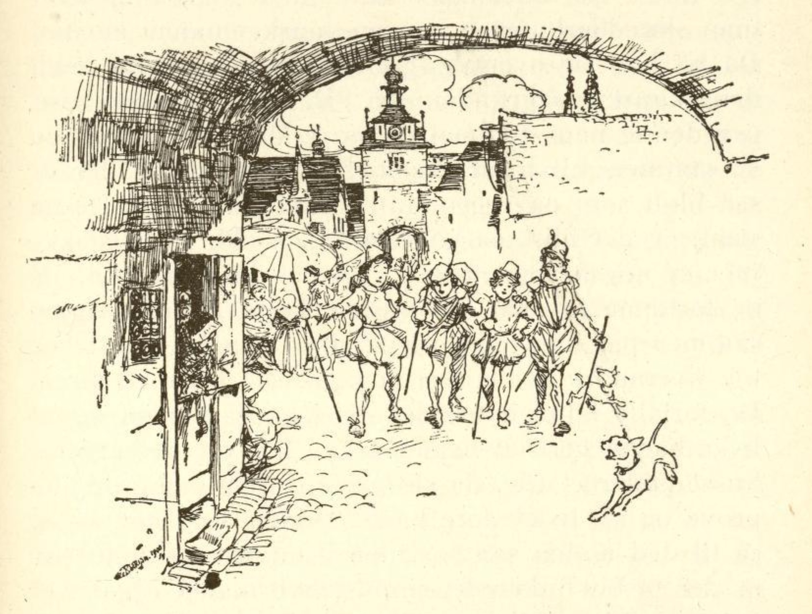

# De fire kunstrike brødrene

En fattig mann hadde fire sønner. Han sa til dem da han så dem vokse til: «Kjære barn, dere må ut i verden, for jeg har ikke noe å gi dere. Derfor får dere dra ut til fremmede land og lære et håndverk, og se til å slå dere gjennom.»

Da grep de fire brødrene vandringsstaven, tok avskjed med sin far og drog ut i verden. Da de hadde gått et stykke, kom de til et kryss som førte til fire forskjellige kanter. Da sa den eldste: «Her må vi skilles, men om fire år fra i dag vil vi igjen møtes på dette stedet, og i mellomtiden prøve lykken vår.»

Så gikk de hver sin vei, og den eldste møtte en mann som spurte ham hvor han ville hen og hva han ville ta seg til. «Jeg vil lære et håndverk,» svarte han. Da sa mannen: «Gå med meg og bli en tyv.» «Nei,» svarte han, «det er ikke noe ærlig håndverk, og enden på visa blir at synderen blir hengt opp som en knebel i en klokke.» «Å,» sa mannen, «for galgen behøver du ikke å være redd. Jeg vil bare lære deg å ta det som ellers intet menneske kan få.» Da lot han seg overtale og lærte hos mannen som tyv, og ble så flink at intet var sikkert for ham når han ville ha det.

Den andre broren møtte også en mann som spurte ham om hva han ville lære i verden. «Jeg vet det ikke ennå,» svarte han. «Så gå med meg og bli en stjernekikker. Det finnes intet bedre enn det, for intet blir skjult for en.» Dette syntes han godt om, og han ble en dyktig stjernekikker. Da han hadde utlært og ville gå videre, ga mesteren ham et glass og sa til ham: «Med dette kan du se hva som foregår på jorden og i himmelen, og intet kan bli skjult for deg.»

Den tredje broren møtte en jeger som tok ham i lære hos seg og lærte ham så godt opp i alt som hørte til jakten, at han ble en utlært jeger. Da han skulle reise, ga mesteren ham en bøsse og sa: «Med den feiler du aldri, og det du tar på kornet, det treffer du også.»

Den yngste broren møtte likeledes en mann som talte til ham og spurte hva han hadde i sinne. «Har du ikke lyst til å bli skredder?» sa han. «Å nei,» sa gutten, «å sitte krumbøyd slik fra morgen til kveld og sy omkring med nålen og pressejernet, det har jeg just ingen lyst til.» «Å, for snakk,» sa mannen, «hos meg lærer man skredderkunsten på en ganske annen måte.» Da lot han seg overtale, gikk med ham og lærte mannens kunst fra grunnen av. Da han skulle reise, ga denne ham en nål og sa: «Med denne kan du sy sammen alt du treffer på, enten det er så bløtt som en eggeplomme eller så hardt som stål, og det blir så godt sammensydd at det ikke mer er noen søm å se.»

Til den bestemte tid, da de forløpne fire år var omme, kom brødrene igjen sammen på krysset, og de hilste på hverandre og tok hverandre i hånden og gikk så hjem til faren. De fortalte ham hvordan det hadde gått dem, og at hver hadde lært sitt håndverk.

Nå satt de utenfor huset under et tre, da sa faren til dem: «La meg nå prøve og se hva dere kan.» Deretter så han opp og sa til den andre sønnen: «Oppe i toppen av dette treet er det et bokfinkerede. Si meg hvor mange egg det er i det?» Stjernekikkeren tok sitt glass frem, så opp og sa: «Det ligger fem egg i redet.» Nå sa faren til den eldste: «Ta nå du eggene uten å forstyrre fuglen som ligger og ruger.» Den kunstrike tyven kløv nå opp og tok de fem eggene bort under fuglen uten at den merket det, og brakte dem til sin far.

Faren tok dem nå og la ett på hver ende av bordet og det femte i midten og sa til jegeren: «Skyt nå alle disse fem eggene midt i to i ett skudd.» Jegeren la sin bøsse an og skjøt alle eggene midt i to i ett skudd, slik som faren hadde forlangt. «Nå kommer turen til deg,» sa han til den fjerde sønnen, «sy nå du eggene sammen igjen og likeså de unge fuglene som er i dem, så skuddet ikke skader dem noe.» Skredderne tok sin nål og sydde slik som faren ba ham.

Da han var ferdig, måtte tyven igjen bære dem opp i treet og legge dem under fuglen i redet uten at den merket det. Den ruget dem nå fullkommen ut, og et par dager etter krøp ungene frem, og der hvor skredderne hadde sydd dem sammen, hadde de en rød stripe om halsen.

«Ja,» sa den gamle til sine sønner, «dere har brukt tiden vel og riktig lært noe. Ellers kan jeg ikke si hvem av dere som er best. Når dere bare snart kunne komme til å få bruk for deres kunst!»

Ikke lenge deretter ble det et stort røre i landet, for kongedatteren var blitt bortført av en drage. Kongen sørget derover dag og natt og lot bekjentgjøre at den som brakte henne tilbake, skulle ha henne til kone. De fire brødrene talte seg imellom og sa at der var en anledning til å vise hva de dugde til, og de ble enige om å befri kongedatteren.

«Hvor hun er henne, skal jeg snart få vite,» sa stjernekikkeren, så gjennom sitt glass og sa: «Jeg ser henne. Hun sitter langt borte på en klippe i havet hos dragen som bevokter henne.» Da gikk han til kongen og ba om et skip til seg og sine brødre, og dro av sted med dem over havet inntil de kom dit.

Kongedatteren satt der og dragen lå i hennes skjød og sov. Jegeren sa: «Jeg tør ikke skyte den, for jeg kunne skyte den skjønne jomfruen med det samme.» «Så vil jeg prøve min lykke,» sa tyven, og stjal henne bort under dragen så varsomt og behending at uhyret ikke merket noe, men ble ved å snorke.

Fulle av glede løp de nå ut til skipet med henne og seilte ut på havet. Da kom dragen som var våknet og ikke hadde funnet kongedatteren, rasende etter dem og fnyste mens den fòr gjennom luften. Men da den var like over skipet og ville slippe seg ned, la jegeren sin bøsse an og skjøt den like i hjertet, så den falt død ned. Den falt like ned på skipet, og den var så stor at den slo det i tusen stykker, så de hadde bare et par planker å svømme på i det åpne sjø.

Da var skredderne ikke sen. Han sydde med et par store sting noen planker sammen, satte seg på dem, fòr hit og dit og samlet alle stykkene av skipet, og sydde dem så pent sammen at hele skipet snart var fullferdig og de kunne fare lykkelig hjem.

Da de brakte kongen hans datter tilbake, ble det stor glede, og han sa til de fire brødrene: «En av dere skal ha henne til gemalinde, men hvem av dere det skal være, får dere selv bli enige om.» Da oppstod det en strid mellom dem, og stjernekikkeren sa: «Hadde jeg ikke sett kongedatteren, ville alle deres kunster ha vært forgjeves, derfor er hun min.» Tyven sa: «Hadde jeg ikke stjålet henne bort fra dragen, ville deres søken ha vært til ingen nytte, derfor er hun min.» Jegeren sa: «Hadde jeg ikke drept dragen, ville den ha revet dere alle i stykker, derfor er hun min.» Skredderne sa: «Og hadde jeg ikke med min kunst sydd skipet sammen igjen, så hadde dere alle sammen druknet, derfor er hun min.»

Da sa kongen: «Dere har alle rett, og fordi dere ikke kan ha jomfruen alle sammen, skal ingen av dere ha henne. Men til belønning vil jeg gi hver av dere et halvt kongerike.» Da sa brødrene: «Det er også bedre enn at vi skulle bli uenige.» Kongen ga hver av dem et halvt kongerike, og de levde sammen med sin far i fryd og glede.
