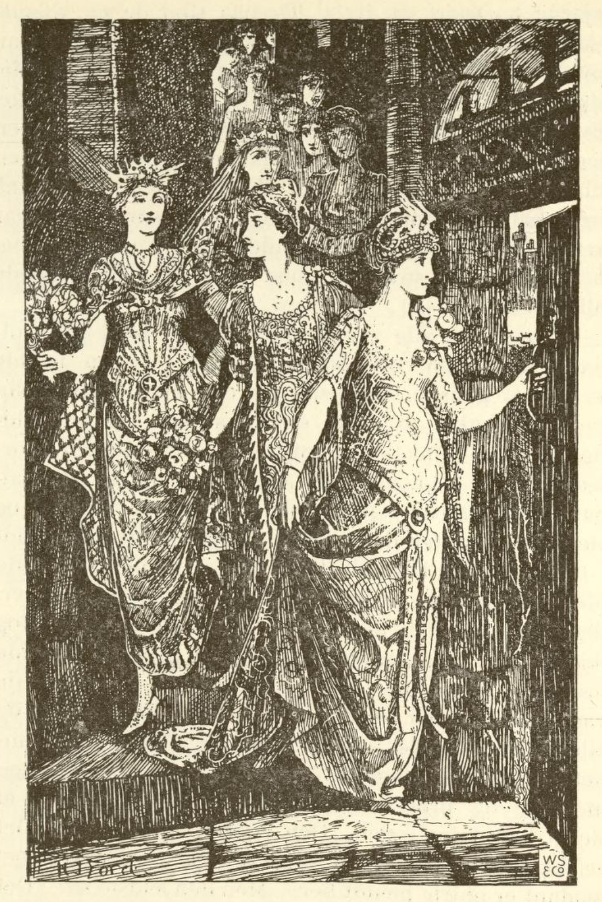
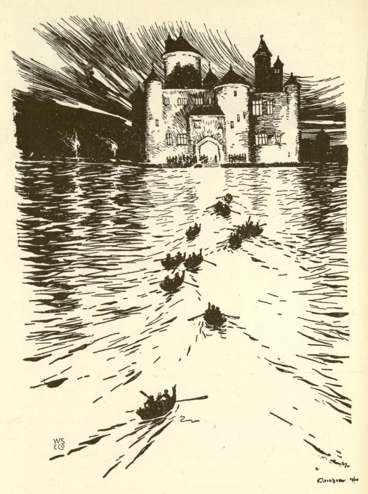

# De utdansede skoene

En konge hadde tolv døtre, den ene vakrere enn den andre. De hadde sine senger sammen på en sal, og når de skulle legge seg, ble dørene lukket og låst. Allikevel var deres sko hver morgen danset i stykker, og ingen visste hvor de hadde vært eller hvordan det hadde gått til.

Da lot kongen utrope at den som kunne oppdage hvor de danset om natten, skulle få lov til å velge en av dem til kone og bli konge etter hans død. Men den som meldte seg og ikke hadde funnet det ut på tre dager og tre netter, han skulle ha sitt liv forbrutt.

Snart kom det en kongesønn. Han ble vel mottatt, og om aftenen ble han ført til et kammer som var foran den sal hvor de tolv kongedøtrene sov. Der stod hans seng, og han skulle legge merke til hvor de gikk hen og danset. For at intet skulle være hemmelig, eller for at de ikke skulle gå ut på en annen kant, stod salsdørene åpne. Men kongesønnen sov inn, og da han våknet, hadde de tolv vært på dans, for deres sko stod der med hull i sålene.

Den andre og tredje aften gikk det likedan, og så hugget de hodet av ham. Men det kom enda mange og meldte seg til vågestykket, og alle måtte de la sitt liv.

Da hendte det seg at en stakkars soldat som var blitt såret i krigen og ikke kunne tjene lenger, gikk til den byen hvor kongen bodde. Da møtte det ham en gammel kone som spurte ham hvor han ville hen. «Jeg vet ikke riktig selv,» sa han, «men jeg kunne ha lyst til å bli konge og oppdage hvordan kongedøtrene danser sine sko i stykker.»

«Å,» sa den gamle konen, «det er ikke så vanskelig. Du må bare la være å drikke den vinen som en av dem bringer deg om kvelden, men du må late som du er fast sovnet.» Så ga hun ham en kappe og sa: «Når du slenger den omkring deg, så blir du usynlig og kan liste deg etter de tolv.»

Da soldaten hadde fått så gode råd, gjorde han alvor av det, gikk til kongen og meldte seg som frier. Han ble likeså godt mottatt som de øvrige og fikk kongelige klær på. Om aftenen ved sengetid ble han ført inn i forværelset, og da han ville gå til sengs, kom den eldste kongedatteren og brakte ham et beger med vin. Men han hadde bundet en svamp under haken, lot vinen renne ned i den og drakk ikke en dråpe. Så la han seg, og da han hadde ligget en stund, begynte han å snorke som om han lå i den dypeste søvn.

Dette hørte de tolv kongedøtrene. De lo høyt, og den eldste sa: «Han kunne nå også gjerne ha spart sitt liv!» Deretter stod de opp, åpnet skap, kister og skuffer og tok prektige klær frem, pyntet seg foran speilet og sprang omkring og gledet seg til dansen.

Men den yngste sa: «Jeg vet ikke hvordan det er fatt med meg. Dere er så glade, men jeg er så underlig til mote. Sikkert hender det oss en ulykke.»

«Din tosse,» sa den eldste, «du er så redd. Har du glemt hvor mange kongesønner som har vært her forgjeves? Soldaten hadde jeg ikke engang behøvd å gi en sovedrikk. Han var så blitt liggende allikevel.»

Da de nå alle var ferdige, så de først etter soldaten, men han rørte seg ikke. Da de nå trodde at de var ganske sikre, så gikk den eldste hen til sin seng og banket på den. Straks åpnet seg en falldør, og hun sank ned i jorden. Da så soldaten hvordan de fòr ned, den ene etter den andre etter alderen. Han reiste seg opp, tok sin kappe om seg og steg ned baketter den yngste og fulgte henne.

Midt i trappen kom han til å tråkke på hennes kjole. Da ble hun redd og ropte: «Det er ikke riktig fatt her! Det er noen som holder meg i kjolen.»

«Vær dog ikke så tåpelig,» sa den eldste, «du er blitt hengende fast ved en spiker.»

Så gikk de helt ned, og da de var kommet ned, stod de i en vidunderlig allé, og alle trærnes blader var av sølv og glinste og skinte. Soldaten tenkte: «Det er best å ta et tegn med seg,» og brøt en gren av et tre. Da lød det et sterkt knall fra treet. Den yngste ropte igjen: «Det er ikke riktig fatt her! Hørte dere ikke knallet? Noe slikt er aldri hendt her.»

Men den eldste sa: «Det var et gledeskudd, fordi vi snart har forløst våre prinser.»

Så kom de til en allé hvor alle bladene var av gull, og endelig til en tredje hvor de var av klare diamanter. Soldaten brøt av en gren med gullblader og en med diamanter, og hver gang lød det et knall, så den yngste prinsessen fòr sammen av skrekk. Men den eldste ble ved sitt, at det var gledeskudd.

Så gikk de videre inntil de kom til et stort vann. Der lå tolv båter ved stranden, og i hver båt satt det en vakker prins som ventet på de tolv prinsessene. Hver av dem tok en opp i båten til seg, men soldaten gikk inn i samme båt som den yngste.

Da sa prinsen: «Jeg er dog likeså sterk i dag som jeg pleier å være, men båten er mye tyngre å ro, og jeg må ro alt det jeg orker.»

«Hva kan det vel komme av,» sa den yngste, «det må sikkert komme av at det er så varmt i dag, for jeg er også så het.»

På den andre siden av vannet stod det et prektig opplyst slott, og derfra lød det en lystig musikk av pauker og trompeter. Dit rodde de og gikk inn, og hver prins danset med sin prinsesse. Men soldaten danset usynlig med dem, og når en holdt et beger med vin, så drakk han det ut, så det var tomt når de førte det til munnen. Den yngste ble igjen angst og bange over dette, men den eldste fikk henne til å tie.

De danset der like til klokka tre om morgenen. Da var det danset hull på alle sko, og de måtte holde opp. Prinsene rodde dem tilbake igjen over vannet, og denne gang satte soldaten seg foran i båten hos den eldste. Ved bredden tok de avskjed fra prinsene og lovet å komme igjen den følgende natt.

Da de var kommet til trappen, løp soldaten foran og la seg i sin seng. Da de tolv trette og langsomt kom opp, snorket han igjen så høyt at de sa: «Nå, for ham er vi da sikre nok.» Så tok de av sine skjønne klær, hengte dem opp og satte de utdansede skoene under sengen og la seg til å sove.

Om morgenen ville soldaten ikke si noe, for han ville enda se litt mer på hva de foretok seg. Han gikk derfor også med den andre og tredje natt, og alt gikk til som første gang, og de danset bestandig til skoene gikk i stykker. Den tredje gang tok han dessuten et beger med seg til merke.

Da den tid var kommet at han skulle svare, tok han de tre grenene og begeret og gikk til kongen. De tolv prinsessene stod bak døren og hørte hva han ville si. Da nå kongen spurte: «Hvor er mine tolv døtre og danser sine sko i stykker om natten?» svarte han: «De danser med tolv prinser i et underjordisk slott,» og nå fortalte han alt det han hadde sett og tok tegnene frem.

Da kalte kongen på sine døtre og spurte dem om soldaten hadde sagt sant. Da de så at de var forrådt og at det ikke hjalp å nekte, fortalte de alt. Så spurte kongen ham hvem han ville ha til kone. Han svarte: «Jeg er ikke mer ung, giv meg derfor den eldste.»

Samme dag holdt han bryllup og fikk løfte på riket etter kongens død. Men prinsene ble igjen forhekset i likeså mange dager som de hadde danset netter med de tolv prinsessene.
