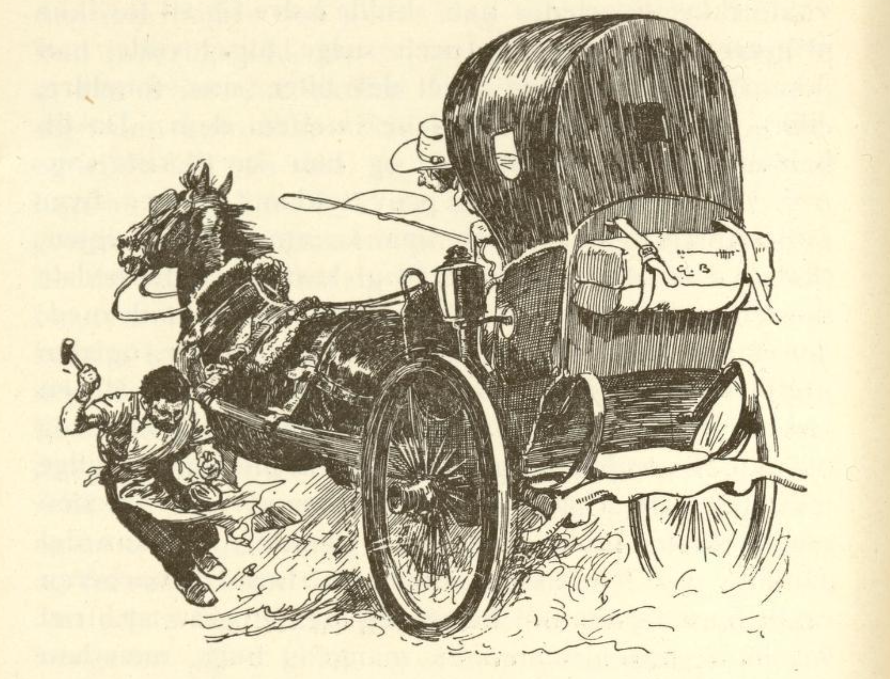

# De tre brødrene

En mann hadde tre sønner og for resten ingen ting unntatt et hus han bodde i. Nå ville gjerne alle tre ha huset etter hans død, men faren var like glad i den ene sønnen som i den andre, og han visste ikke hvordan han skulle bære seg ad for ikke å gjøre noen av dem urett. Selge huset ville han ikke, fordi han hadde arvet det etter sine foreldre, ellers hadde han delt pengene imellom dem.

Da fikk han endelig en god ide og han sa til sine sønner: «Dra ut i verden og prøv lykken og lær hver et håndverk. Når dere så kommer hjem igjen, skal den av dere få huset som kan gjøre det beste mesterstykket.»

Dette var sønnene vel fornøyd med. Den første ville bli smed, den andre barberer, og den tredje ville bli fekter. Så bestemte de en viss tid da de skulle møtes hjemme igjen, og så dro de ut.

Nå traff det seg også slik at alle ble dyktige mestere som virkelig kunne sitt håndverk. Smeden måtte besko kongens hester og tenkte: «Nå kan det da ikke slå feil at du må få huset.» Barberen barberte bare fornemme herrer og mente også at huset var hans. Fektemesteren fikk mang et hugg, men han bet tennene sammen og fant seg i det, for han tenkte: «Er du redd for et hugg, får du aldri i livet huset.»

Da nå den bestemte tiden var kommet, samlet de seg hjemme, men de visste ikke hvordan de skulle finne en god anledning til å vise sine kunster, og satt seg sammen for å finne ut av det.

Mens de satt slik kom det plutselig en hare løpende over jordet.

«Ei, ei,» sa barberen, «den kommer til riktig tid.» Han tok skålen og såpen, fikk den til å skumme til haren kom i nærheten, og så såpet han haren inn i fullt sprang og barberte den også i fullt sprang, så den fikk en liten snurrebart og han skar den ikke det aller minste og gjorde for resten ikke skade på noe hår.

«Godt gjort,» sa faren, «hvis de andre ikke gjør det bedre, så er huset ditt.»

Det varte ikke lenge før det kom en herre kjørende i en vogn i fullt firspann.

«Nå skal du se far, hva jeg kan,» sa smeden, sprang etter vognen, rev skoene av den ene hesten og la fire nye sko under, mens det gikk i fullt sprang.

«Du er pokker til kar,» sa faren, «og du gjør dine saker like så godt som din bror. Jeg vet ikke hvem jeg skal gi huset til.»

Da sa den tredje: «Far, la også meg gjøre en prøve,» og da det begynte å regne, trakk han ut sitt sverd og svang det i krysshugg over hodet, så det ikke falt en eneste dråpe på ham. Og da regnet ble sterkere, og til sist så sterkt som om man øste vann ned fra himmelen i spann, svingte han sverdet raskere og raskere og var like så tørr som om han satt i kakkelovnskroken.

Da faren så dette, ble han forbauset og sa: «Du har gjort det beste mesterstykket, huset er ditt.»

Begge de andre brødrene var tilfreds med det, slik som de hadde lovet, og fordi de var så glade i hverandre, ble de alle tre i huset, drev hvert sitt håndverk, og da de var så godt utlært og forsto sine ting, tjente de mange penger.

Slik levde de fornøyd til sin alderdom, og da den ene ble syk og snart døde, sørget de to andre over det så de også ble syke og snart døde, og fordi de hadde vært så gode og holdt så mye av hverandre, ble de alle tre lagt i en grav.
