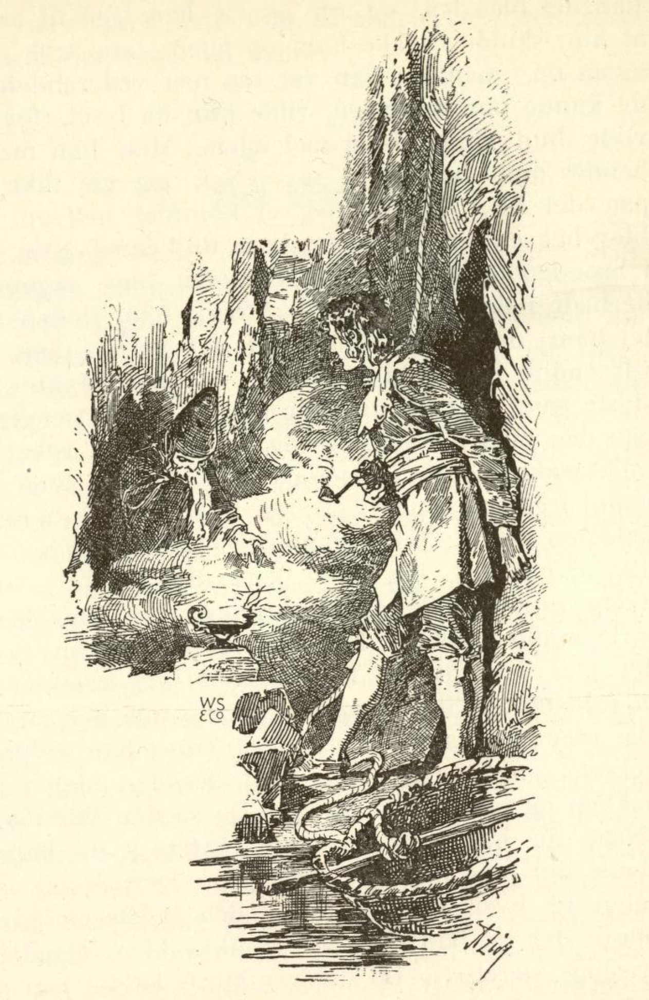

# Det blå lyset

En konge hadde en gang en soldat til tjener; han var meget gammel og skrøpelig; derfor sendte han ham bort og ga ham ingenting. Soldaten visste nå ikke hvormed han skulle friste livet, han gikk sørgmodig omkring hele dagen og kom om kvelden til en skog. Da han hadde gått en stund, så han et lys; det nærmet han seg og kom til et lite hus, og i dette bodde en gammel heks. Han bad henne om nattelogi og litt mat og drikke, men dertil sa hun nei; endelig sa hun: «Jeg får dog vise barmhjertighet imot deg, men da skal du i morgen grave min hele have om.» Soldaten lovte det og fikk nattelogi.

Neste dag spadde han heksens have, og med dette hadde han nok å bestille like til kvelden. Nå ville hun sende ham bort, men han sa: «Jeg er så trett, la meg dog bli her natten over.» Hun ville i første omgang ikke, men endelig tillot hun det, men så skulle han neste dag hugge et lass kjøkkenved. Neste dag hugget soldaten veden og hadde så fullt opp av arbeid like til kveld at han ikke orket å komme av sted; han bad da om nattelogi også den tredje natt, og derfor skulle han den dagen derpå hente det blå lyset opp av brønnen.

Heksen førte ham da til en brønn og bandt ham fast ved et langt tau og firte ham ned; og da han var der nede, fant han det blå lyset, og nå gjorde han tegn til henne at hun skulle trekke ham opp igjen; hun trakk ham også opp, men da han var så nær ved randen at de kunne nå hverandre, ville hun ha lyset, for så ville hun slippe ham ned igjen. Men han merket hennes onde hensikt og sa: «Nei, jeg gir ikke slipp på det blå lyset før jeg er kommet helt opp.» Da ble heksen sint og puttet ham tillikemed lyset ned i brønnen og gikk sin vei.

Soldaten ble sørgmodig dernede i den sorte, fuktige brønnen hvor døden ventet ham; da fikk han tilfeldigvis fatt på en pipe, den var enda halv full av tobakk, og han tenkte: for siste gang skal du nå røyke den ut. Han tente nå på den med det blå lyset og begynte å røyke; da tobakksrøyken fylte brønnen, kom det en liten sort mann frem og spurte: «Herre, hva befaler du meg?» Soldaten svarte: «Hva kan jeg befale deg?» Den lille mannen sa: «Jeg må tjene deg i alt.» «Så hjelp meg endelig ut av brønnen.» Da tok den sorte mannen ham ved hånden og brakte ham opp, og det blå lyset tok de med.

Da de var kommet opp, sa soldaten: «Slå meg nå den gamle heksen i hjel.» Da mannen hadde gjort det, viste han soldaten heksens gull og skatter, dem lasset soldaten på nakken og tok dem med seg. Da sa den lille mannen: «Når du har bruk for meg, behøver du bare å tenne din pipe med det blå lyset.» Deretter gikk soldaten til byen og tok inn i den beste gjestgivergården; der lot han seg gjøre smukke klær og innrette prektige værelser.

Da det var gjort, kalte han på den lille mannen og sa: «Kongen har sendt meg fra seg og latt meg sulte fordi jeg ikke dugde mer, bring meg nå kongedatteren hit i kveld, så skal hun opvarte meg som en annen pike og gjøre hva jeg befaler henne.» Mannen sa: «Det er en farlig sak.» Da gikk han hen og tok kongedatteren sovende ut av sengen og brakte henne til soldaten, og ham måtte hun nå adlyde og hun måtte gjøre hva han ville; om morgenen før hanegal brakte den lille mannen henne tilbake igjen.

Da hun var stått opp, fortalte hun det til sin far og sa: «Jeg har hatt en forunderlig drøm i natt, det forekom meg som om jeg ble bortført og var tjenestepike hos en soldat som jeg måtte opvarte.» Da sa kongen: «Putt lomma full av erter og gjør et hull i den (drømmen kunne være sann) så faller de ut, og vi kan finne sporet på gata.» Således gjorde hun også, den lille mannen hadde hørt hva kongen hadde rådet henne til.

Da det nå ble kveld og soldaten sa han igjen skulle hente ham kongedatteren, da strødde han i forveien hele byen full av erter, så de få som falt ut av prinsessens lomme, ikke kunne gjøre noe spor, og neste morgen hadde folk nok med å samle erter hele dagen igjennom. Kongedatteren fortalte igjen sin far hva som var hendt henne; da sa han: «Behold den ene skoen på deg og skjul den på det stedet hvor du er.» Den lille mannen hørte også dette, og da soldaten igjen ville ha kongedatteren til seg, sa han: «Nå kan jeg ikke mer hjelpe deg, du blir ulykkelig hvis hun kommer hit,» men soldaten ville ha sin vilje frem. «Ja, men så må du straks i morgen tidlig pakke deg ut av byen når jeg har brakt henne hjem igjen,» sa den lille mannen.

Kongedatteren beholdt en sko på seg og skjulte den hos soldaten i sengen; neste morgen, da hun igjen var kommet til sin far, lot han søke overalt i byen etter skoen, og den ble funnet hos soldaten. Han hadde riktig nok pakket seg ut av byen, men han ble snart innhentet og satt i fengsel. Der satt han nå i bånd og lenker, men ved den ilsomme flukt var det beste han eide blitt tilbake, nemlig det blå lyset og pengene, og han hadde ikke mer hos seg enn en krone.

Mens han nå satt sørgmodig ved vinduet av sitt fengsel, så han en kamerat gå forbi, han ropte på ham og sa: «Hvis du vil hente meg den lille bylten som jeg har liggende i gjestgivergården, så vil jeg gi deg en krone.» Kameraten gikk da hen og hentet det blå lyset og bylten til ham for kronen. Den fangne tente straks på sin pipe og lot den lille mannen komme. Han sa til soldaten: «Vær ikke redd, gå trøstig i retten og la alt skje, men ta det blå lyset med deg.»

Så ble han forhørt og dømt til å henges. Da han ble ført til galgen, bad han kongen om en nåde. «Hva er det for en?» sa denne. «La meg få lov å røyke en pipe på veien.» «Du kan gjerne røyke tre om du vil,» sa kongen. Da trakk han sin pipe frem og tente på den med det blå lyset, og den lille mannen kom straks frem. «Slå meg alt det pakket i hjel og hugg kongen i tre stykker.» Den lille mannen begynte å slå folk i hjel rundt omkring, da måtte kongen be ham om nåde, og for å beholde livet ga han soldaten riket og sin datter til ekte.
