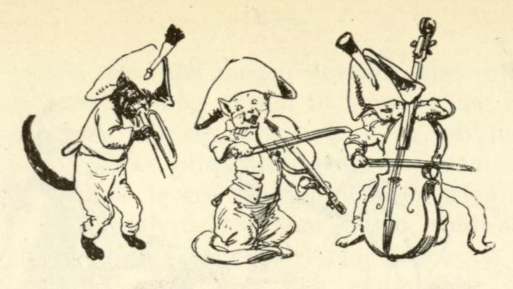
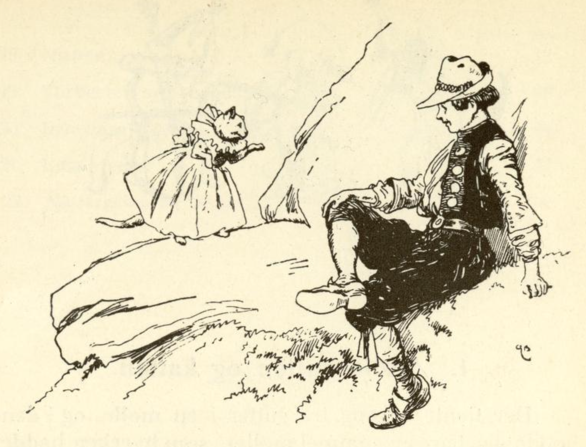

# Møllergutten og katten

Det tjente en gang tre gutter i en mølle, og i den bodde det bare en gammel møller som hverken hadde kone eller barn. Da de nå hadde tjent i noen år hos ham, sa han til dem: «Nå kan dere dra ut i verden, og den som kommer hjem igjen med den beste hest, ham vil jeg gi møllen.» Men den tredje av guttene var Askepot, ham holdt de andre for dum, og de unnet ham ikke møllen, men han brydde seg heller ikke om den.

De gikk da alle tre av sted med hverandre, og da de kom til en landsby, sa de to til den dumme Hans: «Du kan gjerne bli her, du får så aldri i dine levedager noen hest.» Men Hans gikk allikevel med dem, og da det ble mørkt, kom de til en hule hvor de la seg til å sove. De to kloke ventet til Hans var sovnet; da stod de opp, gikk sin vei og lot Hans ligge, og nå trodde de at de hadde gjort det riktig godt!

Da nå solen stod opp og Hans våknet, lå han i en dyp hule; han så seg overalt omkring og ropte: «Å Gud, hvor er jeg!» Nå reiste han seg og kravlet ut av hula, så kom han til en skog og tenkte: «hvordan skal jeg nå få fatt på en hest!» Mens han gikk og tenkte på dette, møtte han en liten broket katt! katten spurte: «Hans, hvor vil du hen?» «Å, du kan så allikevel ikke hjelpe meg.» «Ja, jeg vet nok hva du vil ha,» sa katten, «du vil ha en prektig hest, følg med meg og tjen meg tro i syv år, så vil jeg gi deg en som er så prektig at du aldri i dine levedager har sett make til den.»

Da tok hun ham med seg til sitt forheksede slott, og han måtte tjene henne, og hver dag hugge kjøkkenved; dertil fikk han en sølvøks og kiler og sag av sølv og en stor klubbe, men den var av kobber. Nå ja, han hugget kjøkkenved og ble hos henne og hadde det godt både med mat og drikke, men aldri så han noen levende sjel uten den brokete katten.

En gang sa den til ham: «Gå nå hen og slå engen min og berg høyet,» og ga ham så en sølvljå og et gullbryne, men bad ham at han endelig måtte levere alt riktig tilbake igjen. Hans gikk nå hen og gjorde slik som katten hadde sagt, og da han var ferdig og hadde brakt ljåen og brynet til hus, spurte han om hun enda ikke ville gi ham hans lønn. «Nei,» sa katten, «du må enda først gjøre en ting; se der har du tømmer av sølv og alt hva du behøver av sølv; derav må du først bygge meg et lite hus.»

Da bygget Hans huset ferdig og sa at nå hadde han bygget huset ferdig og enda ingen hest fått; men de syv år var nå forbi så nær som et halvt. Katten spurte om han ville se hennes hester. «Ja,» sa Hans. Da åpnet hun huset, og da hun lukket døra opp, stod det tolv hester på stalden, og de var så stolte og blanke og glimsende at han kunne speile seg i dem, og hans hjerte hoppet i livet av glede derover. Nå ga hun ham mat og drikke og sa: «gå nå hjem, hesten din får du ikke med deg, men om tre dager kommer jeg og bringer den.»

Han ga seg på veien til møllen. Dere all den tid hadde hun ikke gitt ham en ny kledning, men han måtte beholde sin gamle pjaltede kjole som han hadde da han kom dit, og i syv år var denne blitt både for kort og for trang. Da han nå kom hjem, så var også begge de andre møllerguttene kommet hjem, og de hadde hver brakt med seg en hest, men den enes var blind og den andres var lam. De spurte ham: «Hans, hvor har du din hest?» «Om tre dager kommer den etter.» Da lo de begge og sa: «Ja, du Hans, hvor vil du få en hest fra, det vil riktig nok bli et underlig dyr!»

Hans gikk inn i stua, men mølleren sa at han ikke fikk lov til å komme til bordet, for han var alt for pjaltet og ussel, det var skam om noen kom inn og fikk se det. Da ga de ham litt mat ute i gården, og da de skulle legge seg om kvelden, ville de to andre ikke gi ham sengerum, og til sist måtte han krype inn i stalden og legge seg på litt halm.

Da han våknet om morgenen, var alt de tre dager forbi, og der kom en vogn kjørende med seks hester for, så gilde at det skinte av dem, og en tjener førte den syvende hest til den fattige møllergutten; men ut av vogna steg en deilig kongedatter, og hun gikk inn i møllen, og denne kongedatteren var den lille brokete katten som Askepot hadde tjent hos i syv år.

Hun spurte mølleren hvor den tredje møllergutten var henne; da sa mølleren: «ham kan vi ikke la komme inn i møllen, for han er så ussel og fillete, og han ligger i stalden.» Da sa kongedatteren at de straks skulle hente ham. De hentet ham også, og han måtte holde sine klær sammen for å skjule seg; da lot kongedatteren tjeneren ta prektige klær frem, og de måtte vaske ham og kle ham på, og da han var ferdig, kunne ingen konge være vakrere å se.

Nå ville jomfrua se hestene som de to andre møllerguttene hadde brakt hjem; den ene var blind, den andre var lam. Så lot hun tjeneren bringe den syvende hest; da mølleren så denne, sa han at slik en hest var enda aldri kommet i hans gård. «Ja, den tilhører den tredje møllergutten,» sa kongedatteren. «Da skal han også ha møllen,» sa mølleren, men kongedatteren sa at hesten skulle være hans og han kunne beholde møllen også, og nå tok hun sin trofaste Hans og satte i vogna og kjørte av sted med ham.

Først kjørte hun nå til det lille huset med ham som han hadde bygget med sølvverktøyet; det var blitt til et stort slott og alt var av sølv og gull, og der giftet hun seg med ham, og han ble så rik at han hadde nok alle sine levedager.
