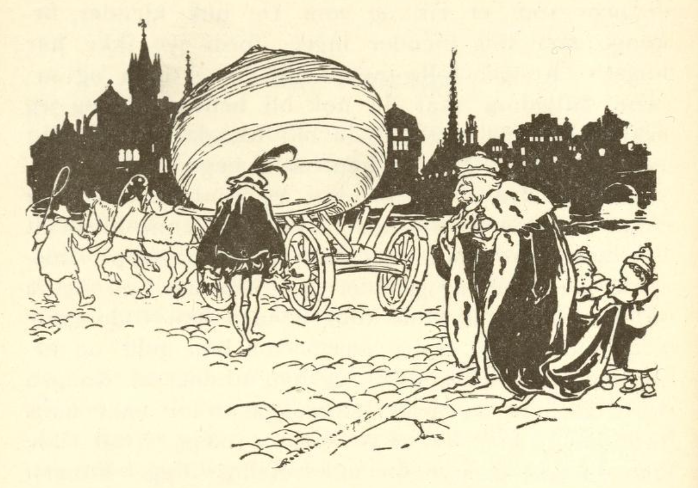

# Nepen

To brødre tjente som soldater, den ene var rik, den andre fattig. Men den fattige ville se å komme ut av sin nød, derfor trakk han soldaterkjolen av og ble bonde. Han spadde og grov et stykke jord og sådde nepefrø. Såden kom opp og det vokste frem en nepe som var både stor og tykk, og den ble bestandig tykkere og tykkere. Den ville aldri holde opp å vokse, så man kunne kalle den en dronning for alle neper, for aldri hadde man sett make til denne og vil heller ikke få det å se. Til sist ble den så stor at to hester knapt kunne trekke den, og bonden visste ikke hva han skulle gjøre med den, heller ikke visste han om den skulle bringe ham lykke eller ulykke.

Til sist tenkte han: «Hvis du selger den, så får du vel neppe stort for den, og hvis du selv vil spise neper, så smaker de små like så godt; best er det at du bringer den til kongen og forærer ham den.» Han lasset den da på vogna, spente to hester for, brakte den til kongsgården og ga kongen den. «Ei,» sa kongen, «det er en forunderlig ting, jeg har sett mye rart i mine dager, men make til denne har jeg enda aldri sett; av hva slags frø er den vokset opp? eller kanskje den alene er lyktes for deg, er du et lykkebarn?»

«Å nei,» sa bonden, «et lykkebarn er jeg ikke, jeg er en stakkars soldat som ikke mer kunne ernære meg, derfor hengte jeg soldaterkjolen på veggen og tok til å grave i jorden; jeg har enda en bror som er rik og som De nok kjenner, hr. konge, men meg kjenner ingen, fordi jeg ikke har noe.» Kongen følte medlidenhet med ham og sa: «Din fattigdom skal du nok bli befriet for, og jeg skal gi deg så mye at du blir like så rik som din bror.» Da ga kongen ham en mengde gull, åkrer, enger og kveg, så brorens rikdommer slett ikke kunne sammenlignes med hans.

Da denne hørte alt det hans bror hadde fått for en eneste nepe, misundte han ham og grunde på hvordan han også skulle gjøre lykke hos kongen, men han ville gjøre det enda mye bedre; derfor tok han gull og hester og brakte til kongen, og han trodde at kongen ville gi ham en mye større gave; for når hans bror hadde fått så mye for en nepe, hva ville han da ikke gi ham for slike deilige ting. Kongen mottok gaven og sa at han ikke visste å gi ham noe som var sjeldnere og bedre enn den store nepa. Den rike måtte da legge sin brors nepe på en vogn og kjøre den hjem.

Da han var kommet hjem, visste han ikke hvem han skulle la sin vrede og ergrelse gå ut over, men til sist fikk han onde tanker og bestemte å drepe sin bror. Han leide mordere som skulle legge seg i bakhold, og deretter gikk han til sin bror og sa: «Kjære bror, jeg vet en skjult skatt, den vil vi grave opp og dele med hverandre.» Den andre syntes godt om dette og gikk med uten å tenke på noe ondt; men da de kom ut, styrtet morderne over ham, bandt ham og ville henge ham opp i et tre.

Mens de holdt på med dette, hørte de sang og hestetrampen i det fjerne; derover ble de forskrekket og puttet ham over hals og hode i en sekk, heiste ham opp på en gren og lot ham henge; men han strevet så lenge til han fikk et hull på sekken så han kunne stikke hodet ut. Røverne tok benene fatt, men den som kom ridende på veien, var ingen annen enn en reisende student, en ung fyr som lystig sang sin vise mens han travet igjennom skogen.

Da bonden oppe i treet merket at en kom forbi, ropte han: «Velkommen, du kommer i en lykkelig time!» Studenten så seg omkring overalt, men visste ikke hvorfra stemmen kom; til sist sa han: «Hvem roper på meg?» Da svarte det fra treets krone: «Løft dine øyne opp, jeg sitter her oppe i visdommens sekk, i kort tid har jeg lært store ting, og alle skoler og universiteter har intet å bety mot dette; om en liten stund er jeg utlært, og da kommer jeg ned og er klokere enn alle mennesker i hele verden. Jeg kjenner alle stjerner og himmelskilt, jeg forstår meg på vindenes gang og å helbrede sykdommer og de krefter som er i urter, fugl og stein. Hvis du først satt her, skulle du få føle hvor herlig det er.»

Da studenten hørte alt dette, ble han forbauset og sa: «Velsignet være den time da jeg traff deg; kan ikke også jeg komme litt inn i sekken?» Han som satt der, lot som han ikke gjerne ville ut og sa: «En liten stund skal jeg nok slippe deg inn for gode ord og betaling, men du må bie litt, for det er enda noe tilbake som jeg først må lære.» Da studenten hadde ventet litt, ble tiden ham for lang og han bad at han dog ville la ham slippe inn, for hans tørst etter visdom var såre stor.

Da lot han deroppe som om han endelig ga etter og sa: «Hvis jeg skal komme ut av visdommens hus, må du fire sekken ned, og så skal du komme inn.» Studenten firte den hurtig ned, åpnet sekken og befriet ham, så ropte han selv: «La meg nå fort komme inn,» og ville straks inn i sekken med beina først. «Stopp,» ropte den andre, «slik går det ikke,» tok ham ved beina og satte ham på hodet i sekken og bandt den til, og da halte han visdomsstudenten opp i treet og lot ham svinge i lufta. «Hvordan står det til min kjære venn?» sa han, «nå føler du allerede at visdommen kommer og du gjør gode erfaringer, sitt derfor rolig og stille til du blir klokere.» Deretter steg han opp på studentens hest og red sin vei.
