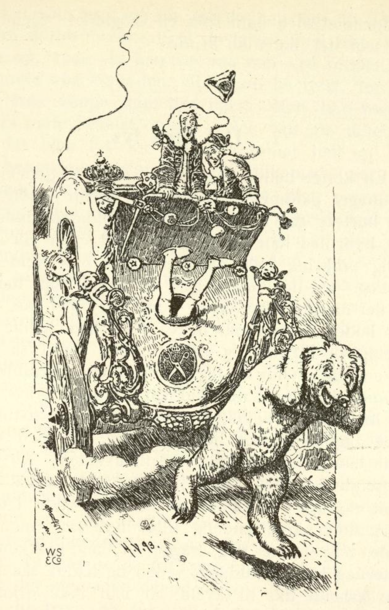

# Om den kloke lille skredderen

Det var en gang en prinsesse som var forferdelig stolt; når det kom en frier til henne, så ga hun ham noe å gjette på, og når han ikke kunne gjette det, så ble han sendt bort med spott og skam. Hun lot også bekjentgjøre at den som gjettet det hun spurte om, skulle få henne til ekte, og det kunne komme hvem som ville. Nå var det et sted tre skreddere, og de to eldste mente at de hadde gjort så mang et nett sting og hadde truffet det rette, derfor kunne det ikke slå feil, de traff det nok her også; men den tredje var en liten dum tingest som ikke en gang forsto sitt håndverk.

Derfor sa de to til ham: «Bli du hjemme, for du rekker ikke langt med din lille forstand;» men den lille skredderen lot seg ikke overtale, og han sa at når hadde han en gang satt seg det i hodet, og han skulle nok hjelpe seg, og så gikk han av sted som om hele verden var hans.

De meldte seg nå alle tre hos prinsessa og sa at hun skulle komme frem med sine gåter og spørsmål, for nå var de rette folk kommet; de hadde en forstand så fin at man kunne tre den gjennom et nåløye. Da sa prinsessa: «Jeg har to slags hår på hodet, hvorledes er det farget?» «Ikke annet,» sa den første, «det er hvitt og sort som salt og karve.» Prinsessa sa: «Du har gjettet galt, nå kan den andre svare.» Da sa den andre: «Er det ikke svart og hvitt, så er det brunt og rødt som min fars søndagskjole.» «Galt gjettet,» sa prinsessa; «nå kan den tredje svare, jeg synes han ser ut til å vite det.»

Da trådte den lille skredderen frem og sa: «Prinsessa har et sølvhår og et gullhår på hodet, og det er de to fargene.» Da prinsessa hørte det, ble hun blek og var nær ved å besvime av skrekk; for skredderlille hadde truffet svaret, og hun hadde sikkert trodd at ikke noe menneske i den hele verden kunne gjette det. Da hun kom til seg selv igjen, sa hun: «Dermed har du enda ikke vunnet meg, du må enda gjøre en ting; nede i stallen ligger det en bjørn, den skal du sove med i natt; er du da fortsatt i live i morgen, skal du få meg til kone.» Hun tenkte at nå hun skulle bli kvitt skredderen; for bjørnen hadde tatt livet av alle de menneskene den hadde fått fatt på. Skredderlille sa fornøyd: «Ja, det skal jeg nok gjøre.»

Da det nå ble kveld, ble skredderlille ført ned til bjørnen, og bjørnen ville også straks ha fatt på ham og gi ham en velkomsthilsen med sine labber. «Vent litt,» sa skredderlille, «jeg skal snart gjøre deg rolig;» da grep han i lomma etter en håndfull valnøtter, som om han ikke brydde seg om noe, bet dem i to og spiste kjernene; da bjørnen så dette, fikk den også lyst på nøtter. Skredderen tok i lomma og rakte den en håndfull, men det var ikke nøtter men runde steiner. Bjørnen stakk dem i kjeften, men han kunne ikke bite dem i to, hvor mye han enn bet og strevet. «Ei,» tenkte den, «du er en stor klodrian når du ikke en gang kan bite en nøtt i to,» og så sa den til skredderen: «Å, min venn, bit de nøttene i to for meg.»

«Der ser du hva du er for en kar,» sa skredderlille; «du har så stor en kjeft og kan allikevel ikke bite i to de små nøttene.» Da tok han steinen og puttet i stedet for den i en hast en nøtt i munnen, og knekk! var den i to. «Jeg må enda en gang prøve det,» sa bjørnen, «når jeg ser på det, synes jeg det er ingen sak.» Da ga skredderen den atter steinene, og bjørnen bet og arbeidet av alle livets krefter; Gud gi han hadde bitt dem i to!

Da det var forbi, tok skredderen frem en fiolin under frakken og spilte et lite stykke. Da bjørnen hørte det, kunne den ikke bære seg, men begynte å danse, og da den hadde danset en stund, syntes den at det var så morsomt at den sa til skredderen: «Si meg, er det vanskelig å lære å spille?» «Å nei, her kan du se, med den venstre fingrer jeg på strengene, og med den høyre fingrer jeg på strengene, det går lystig, hopp så så, si falle rallala!» «Vil du lære meg det?» sa bjørnen; «å spille slik, det ville jeg gjerne kunne, for så kunne jeg danse når jeg fikk lyst.» «Hjertelig gjerne,» sa skredderen, «hvis du har lyst til å lære det; men la meg se på dine labber, dine negler er skrekkelig lange, jeg må først skjære litt av dem.»

Da hentet han en skruestikke, og bjørnen la sine labber i den, men skredderlille sa: «Bi nå litt til jeg kommer igjen med saksa;» og så lot han bjørnen brumme så mye den ville, la seg i en krok på en bunt strå og sov inn. Da prinsessa om kvelden hørte bjørnen brumme så fælt, trodde hun at den nå gottet seg riktig og at det var forbi med skredderen. Om morgenen stod hun meget fornøyd opp; men da hun ser ned til stallen, står skredderlille nok så lystig i døra og var så frisk som en fisk i vannet. Da kunne hun ikke si et ord mer i mot, fordi hun offentlig hadde lovt det, og kongen lot spenne for en vogn; i den måtte hun kjøre til kirka med skredderen for å gifte seg med ham.

Da de nå var kommet inn i vogna, gikk begge de andre skredderne, som var falske i sitt hjerte og ikke unnet ham hans lykke, inn i stallen og skrudde bjørnen løs; den ble nå rasende og rente bak etter vogna. Da prinsessa hørte den brøle, ble hun redd og sa: «Akk, bjørnen er etter oss og vil hente deg.» Skredderen visste straks råd; han stilte seg på hodet, strakte beina ut av vognvinduet og ropte: «Ser du skruestikka; hvis du ikke går din vei, så skrur jeg deg fast igjen.» Da bjørnen så det, snudde den om og løp sin vei, men skredderlille kjørte nok så rolig til kirka, og prinsessa ble vidd til ham, og hun levde så fornøyd med ham som en skoglerke. Den som ikke tror det, bøter en krone.

