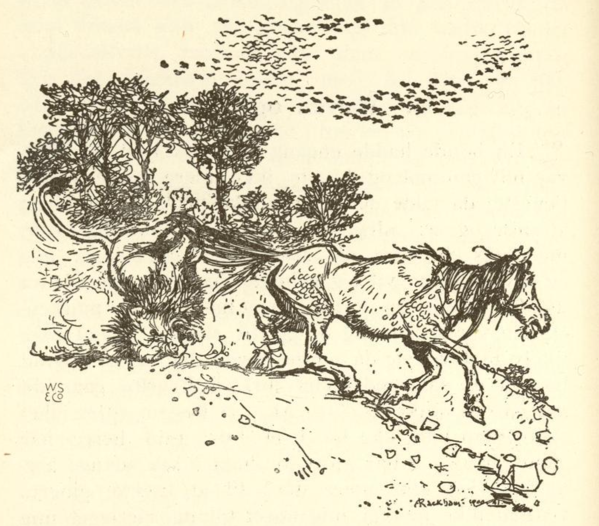

# Reven og hesten

En bonde hadde en gang en trofast hest, men den var blitt gammel og kunne ikke mer gjøre noen tjeneste; da ville dens herre ikke mer gi den noe å spise og sa: «Jeg kan nå ikke bruke deg mer, men hvis du viser deg så sterk at du bringer meg en løve hit, så vil jeg beholde deg, men pakk deg nå ut av stalden;» og dermed jaget han den ut i marken.

Hesten var sørgmodig og gikk til skogen for å søke litt ly mot været; da møtte reven den og sa: «Hva henger du så med hodet for, og hvorfor går du så ensom omkring.» «Ak,» sa hesten, «gjerrighet og troskap kan ikke bo i et hus; min herre har glemt hva jeg har gjort for ham i så mange år, og fordi jeg ikke mer duger til å trekke plogen, vil han ikke mer gi meg noe for og har jaget meg bort; han har riktig nok sagt at hvis jeg var så sterk at jeg kunne bringe ham en løve, ville han beholde meg, men han vet godt at jeg ikke kan det.»

Reven sa: «Det skal jeg nok hjelpe deg med, legg deg bare ned som om du var død, strekk deg ut og rør deg ikke.» Hesten gjorde som reven sa; men reven gikk til løven, som hadde sin hule tett ved, og sa: «Der borte ligger en død hest, kom og følg med meg, så kan du få deg et godt måltid.» Løven gikk med, men da den stod ved hesten, sa reven: «Her har du det ikke bekvemt nok, vet du hva, jeg vil binde hesten fast til deg ved halen, så kan du trekke den til din hule og fortære den i all makelighet.»

Løven syntes godt om dette råd og stilte seg således at reven kunne binde hesten fast til den. Den stod nok så stille og rolig, men med hestens hale bandt reven beina sammen på løven og bandt og knyttet alt så fast og sterkt at det ikke var mulig å rive det opp. Da reven var ferdig med dette, slo den på hesten og sa: «Trekk, Blakken, trekk!» Da sprang hesten med en gang opp og trakk løven av sted med seg. Løven begynte nå å brøle så fuglene i hele skogen fløy opp av skrekk, men hesten lot den brøle og trakk og slept den over marken like til sin herres dør.

Da herren så det, kom han på andre tanker og sa til hesten: «Du skal bli hos meg og ha det godt,» og han ga den nok å ete til dens siste dag.

