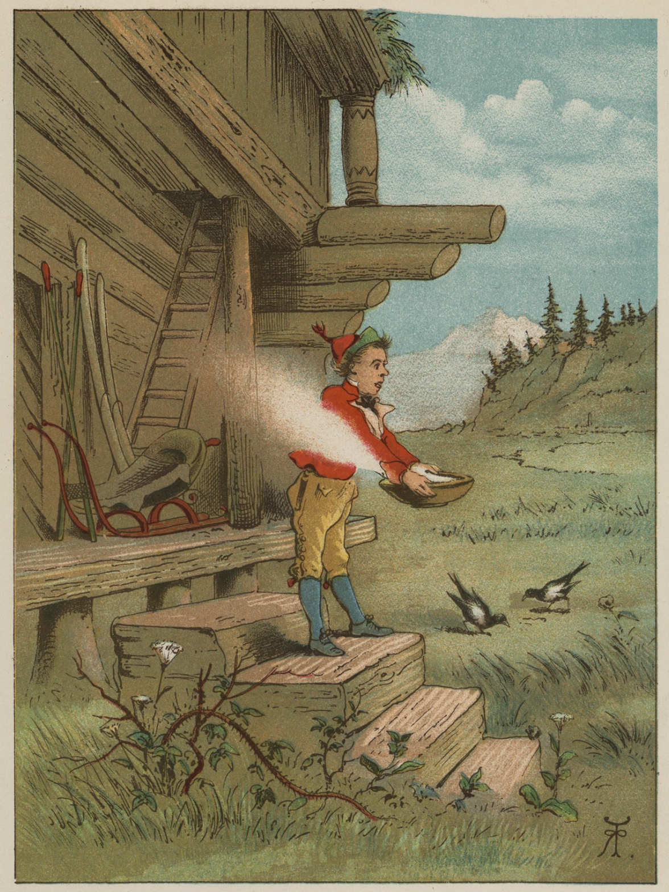
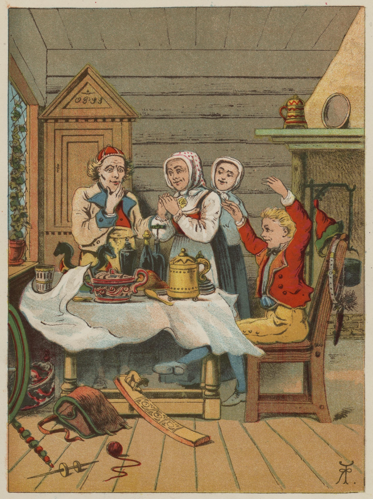
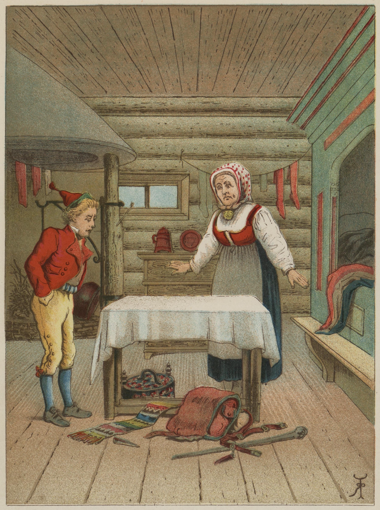
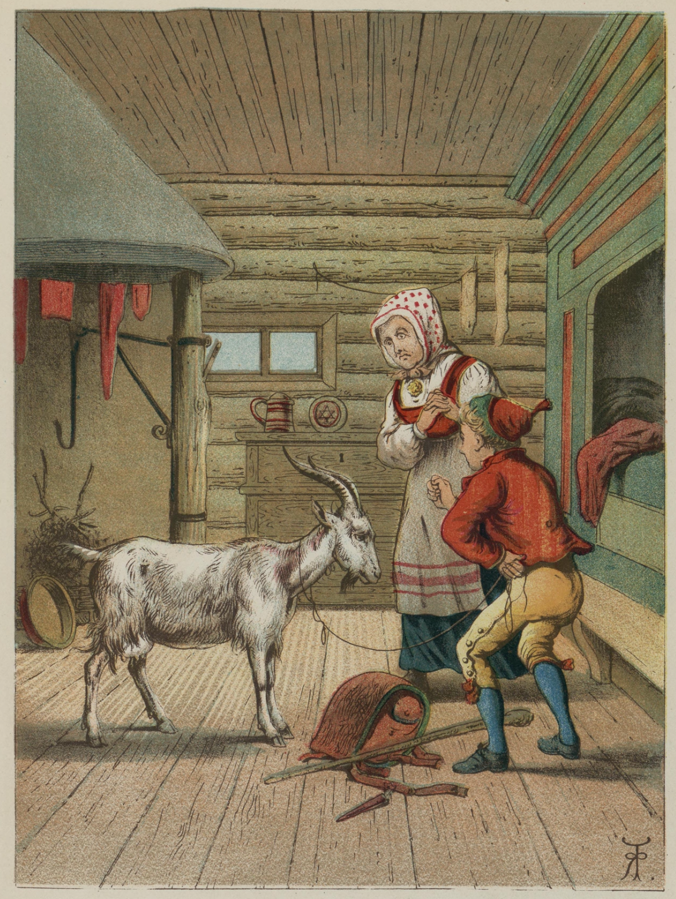
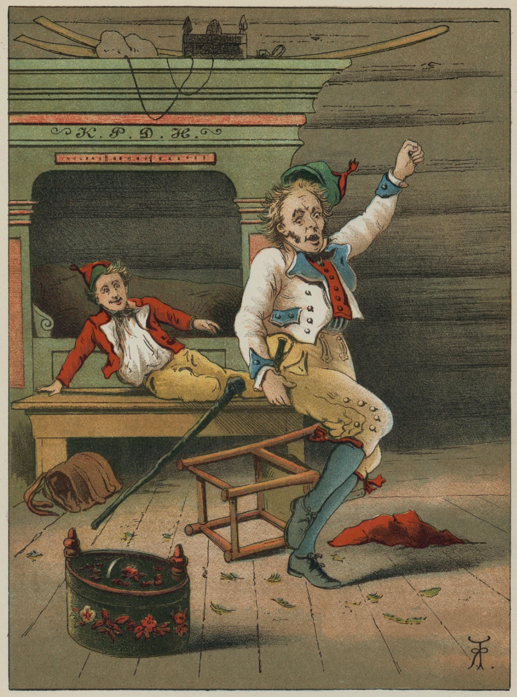

# Gutten som gikk til nordavinden for å kreve melet tilbake

Det var engang en gammel kone som hadde en sønn, og fordi hun var meget gammel og skrøpelig, så skulle gutten, sønnen hennes, gå til stabburet for henne for å hente grovmel til middag.

Men da han steg ut på stabburstrappa, så kom nordavinden fykende, tok melet fra ham og fór gjennom været med det.

Gutten gikk på stabburet etter mer, men da han steg ut på trappa, kom nordavinden fykende igjen og tok melet fra ham, og slik gikk det også den tredje gangen.

Dette gjorde gutten sint, og han syntes det var urimelig at nordavinden skulle holde på slik, og tenkte at han fikk lete nordavinden opp og kreve melet tilbake.

Han la av sted, men veien var lang, og han gikk og han gikk, og så kom han endelig til nordavinden.

«God dag,» sa gutten, «og takk for sist.»

«God dag,» svarte nordavinden – han var grov i målet – «og selv takk for sist. Hva vil du?» sa han.

«Å,» sa gutten, «jeg vil nok be deg om du vil være så snill å la meg få igjen det melet du tok fra meg på stabburstrappa. For lite har vi, og når du skal fare slik og ta det lille vi har, så blir det ikke annet enn sveltihjel.»

«Jeg har ikke noe mel,» sa nordavinden, «men siden du er så nødig, skal du få en duk som skaffer deg alt hva du kan ønske når du bare sier: 'Duk, bre deg ut og dekk opp med alle slags kostelige retter!'»

Det var gutten vel fornøyd med.

Men da veien var så lang at han ikke kunne nå hjem om dagen, gikk han inn til en gjestgiver på veien, og da de som var der skulle til å spise til aftens, la han duken på et bord som stod i krogen, og sa: «Duk, bre deg ut og dekk opp med alle slags kostelige retter!»

Ikke før hadde han sagt det, så gjorde duken det, og alle syntes det var en herlig ting. Men ingen likte det bedre enn gjestgiverkona.

Det var ikke stor jobb med steking og koking, med duking og dekking, med henting og fremsetting på det bordet, tenkte hun.

Da det derfor led ut på natta, da alle sov, tok hun guttens duk og la en annen i stedet, som var akkurat likedan som den han hadde fått av nordavinden, men som ikke kunne dekke opp med havrelefse engang.

Da gutten våknet, tok han duken sin og gikk av sted med, og den dagen kom han hjem til mora.

«Nå,» sa han, «har jeg vært hos nordavinden, det var en skikkelig mann, for han ga meg denne duken, og når jeg bare sier til den: 'Duk, bre deg ut og dekk opp med alle slags kostelige retter!' så får jeg all den maten jeg kan ønske meg.»

«Ja, det vet jeg visst,» sa mora, «men jeg tror det ikke før jeg ser det.»

Gutten skyndte seg, satte frem et bord, la duken på det og sa: «Duk, bre deg ut og dekk opp med alle slags kostelige retter!» men duken dekket ikke opp med en bit flatbrød engang.

«Der blir ikke annen råd enn jeg får gå til nordavinden igjen da,» sa gutten, og la av sted.

Ut på ettermiddagen kom han dit hvor nordavinden bodde.

«God kveld,» sa gutten.

«God kveld,» sa nordavinden.

«Jeg vil nok ha erstatning for melet du tok fra meg,» sa gutten, «for den duken jeg fikk, dugde ikke mye.»

«Jeg har ikke noe mel,» sa nordavinden, «men her har du en bukk som lager gullpenger, bare du sier: 'Min bukk, lag penger!'»

Den syntes gutten godt om. Men da det var så langt hjem at han ikke kunne rekke dit den dagen, så tok han igjen nattekvarter hos gjestgiveren.

Før han forlangte noe, prøvde han bukken, for han ville se om det var sant hva nordavinden hadde sagt, og det var riktig nok. Men da gjestgiveren så dette, syntes han det var en god bukk, og da gutten vel var falt i søvn, så tok han en annen som ikke lagde gullpenger, og satte den der i stedet.

Morgenen etter gikk gutten av sted, og da han kom hjem til si mora, sa han: «Nordavinden er en snill mann allikevel. Nå ga han meg en bukk som kan gjøre gullpenger, bare jeg sier: 'Min bukk, gjør penger!'»

«Det vet jeg visst,» sa mora, «det er ikke annet enn snakk, og jeg tror det ikke før jeg ser det.»

«Min bukk, gjør penger!» sa gutten, men det ble ikke penger det bukka gjorde.

Han gikk da igjen til nordavinden og sa at bukken ikke dugde til noe, og at han ville ha erstatning for melet.

«Ja, nå har jeg ikke noe annet å gi deg,» sa nordavinden, «enn den gamle kjeppen som står borte i krogen. Men den er slik at når du sier: 'Min kjepp, slå på!' så slår den, helt til du sier: 'Min kjepp, stille!'»

Da veien igjen var lang, så gikk gutten også inn til gjestgiveren den kvelden. Men fordi han kunne skjønne hvordan det var gått med duken og bukka, så la han seg straks til å snorke på benken og lot som han sov.

Gjestgiveren, som også kunne skjønne at kjeppen dugde til noe, fant en som lignet den, og ville sette den i stedet da han hørte at gutten snorket. Men i det samme gjestgiveren skulle ta stokken, ropte gutten: «Min kjepp, slå på!» og kjeppen tok til å banke gjestgiveren, så han hoppet både over bord og benker og ropte og skrek: «Å, Herregud! Å, Herregud! Gjør kjeppen rolig, ellers slår den meg i hjel! Du skal få igjen både duken og bukken.»

Da gutten syntes gjestgiveren hadde fått nok, sa han: «Min kjepp, stille!» tok duken og puttet i lomma og kjeppen i hånda, bant en snor om horna på bukken, og gikk hjem med alt.

Det var god erstatning for melet!

