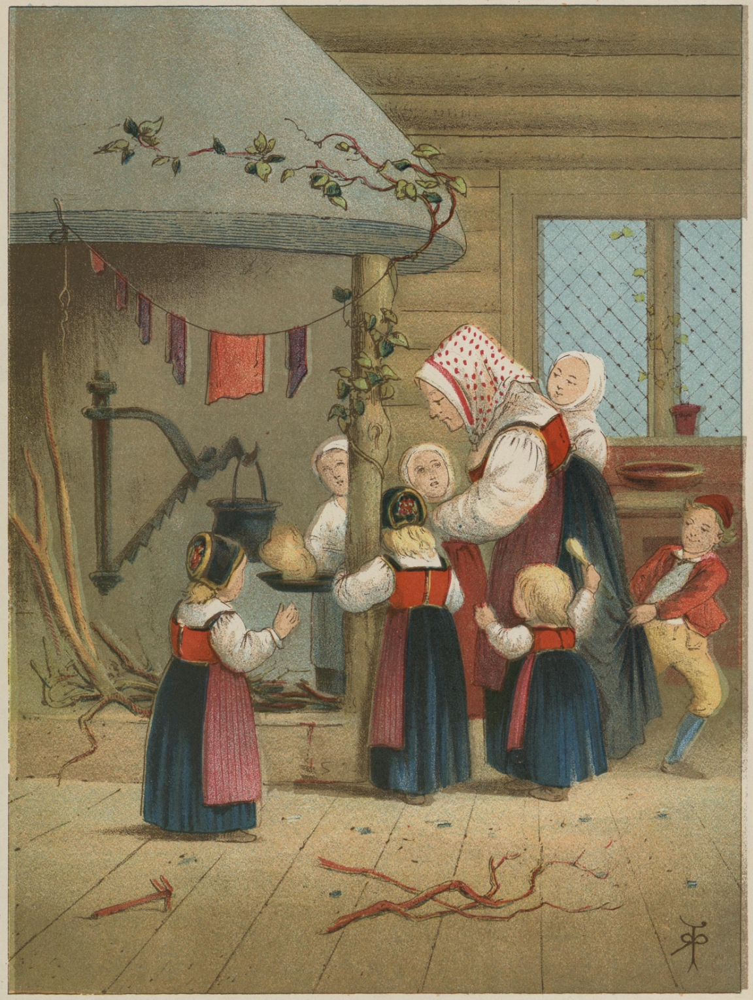
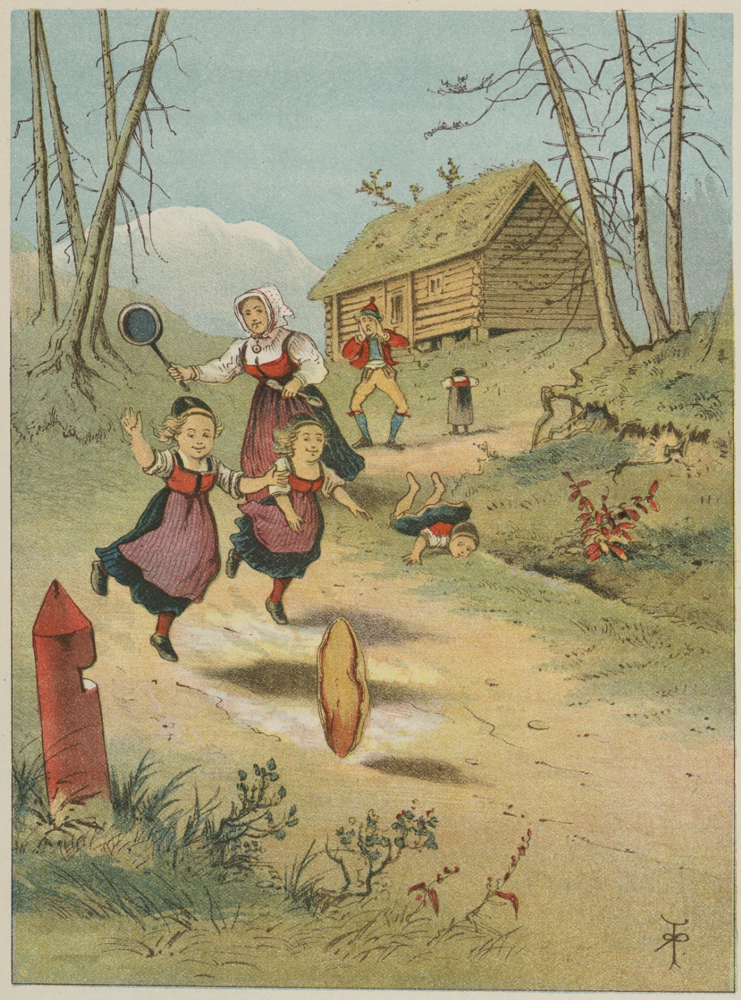
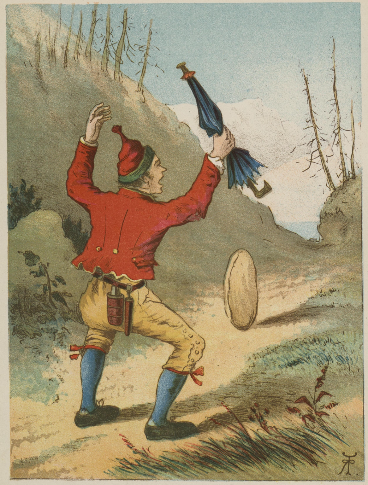
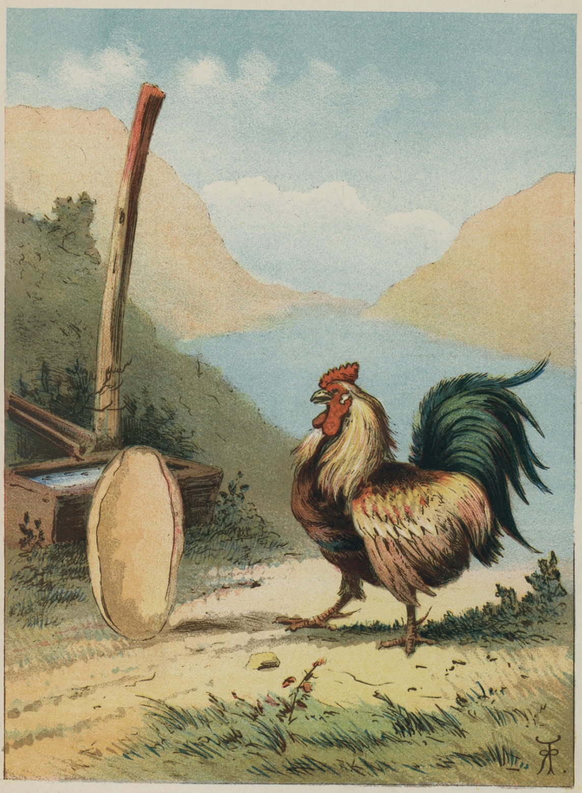
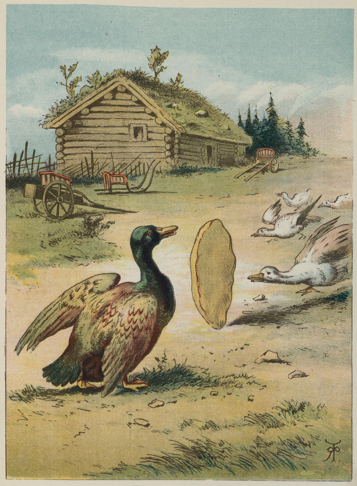
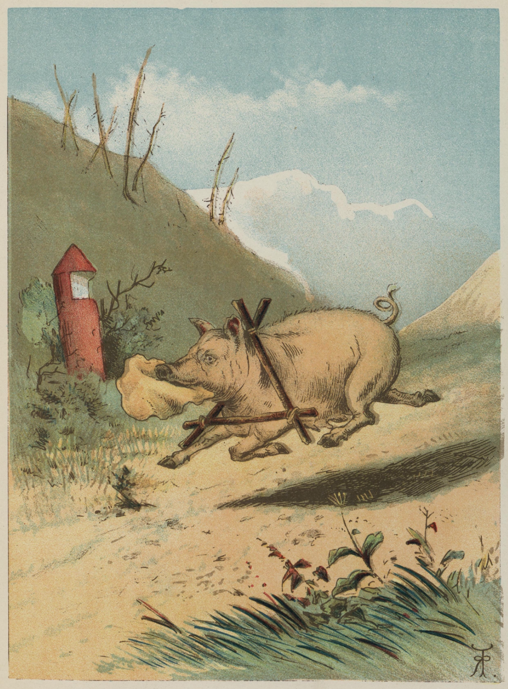

# Pannekaken

Det var en gang en kone som hadde syv sultne barn, og til dem stekte hun pannekake. Råmelkskake var det, og den lå i panna og øste så tykk og god at det var en lyst å se på den. Og barna stod rundt omkring, og gamlefar satt og så på.

«Å, la meg få litt pannekake, mor mi, jeg er så sulten,» sa det ene barnet.

«Å kjære deg,» sa det andre.

«Å kjære, vene deg,» sa det tredje.

«Å kjære, vene, snille deg,» sa det fjerde.

«Å kjære, vakre, vene, snille deg,» sa det femte.

«Å kjære, vakre, vene, gode, snille deg,» sa det sjette.

«Å kjære, vakre, vene, gode, snille, søte deg,» sa det syvende, og så ba de om pannekake alle sammen, det ene vakrere enn det andre, for de var så sultne og så snille.

«Ja, barna mine, vent nå bare til den snur seg,» sa hun. Til jeg får snudd den, skulle hun ha sagt – «så skal dere få pannekake alle sammen, deilig råmelkskake, se bare hvor tykk og fornøyd den ligger der.»

Da pannekaken hørte dette, ble den redd, og akkurat som det var, så snudde den seg av seg selv og ville ut av panna. Men den falt ned i den på den andre siden igjen, og da den hadde stekt seg litt på den også, så den ble fastere i fisken, og da hoppet den ut på gulvet og rullet av sted som et hjul ut gjennom døra og bort etter veien.

Hei da!

Kjerringen etter med panna i den ene hånda og sleiva i den andre, det forteste hun kunne, og barna etter henne igjen, og gamlefar hinket etter til sist.

«Hei, vil du vente, grip den, ta den, hei da!» skrek de i munnen på hverandre og skulle ta den på spranget og fange den igjen. Men pannekaken rullet og rullet, og akkurat som det var, var den så langt unna at de ikke kunne se den, for pannekaken var flinkere til beins enn alle sammen.

Da den hadde rullet en stund, så møtte den en mann. «God dag, pannekake,» sa mannen.

«Gud signe, Mann Brand,» sa pannekaken.

«Kjære min pannekake, rull ikke så fort, men vent litt og la meg få spise deg,» sa mannen.

«Når jeg har gått fra kone Krone, gamlefar og syv skrikebarn, så kan jeg vel gå fra deg, Mann Brand,» sa pannekaken, og rullet og rullet til den møtte en høne.

«God dag, pannekake,» sa høna.

«God dag, høne Pøne,» sa pannekaken.

«Kjære min pannekake, rull ikke så fort, men vent litt og la meg få spise deg,» sa høna.

«Når jeg har gått fra kone Krone og gamlefar, syv skrikebarn og Mann Brand, så kan jeg vel få gå fra deg, høne Pøne,» sa pannekaken og rullet som et hjul bortover veien.

Så møtte den en hane.

«God dag, pannekake,» sa hanen.

«God dag, hane Pane,» sa pannekaken.

«Kjære min pannekake, rull ikke så fort, men vent litt og la meg få spise deg,» sa hanen.

«Når jeg har gått fra kone Krone, gamlefar og syv skrikebarn, fra Mann Brand og fra høne Pøne, så kan jeg vel få gå fra deg, hane Pane,» sa pannekaken og begynte å rulle og rulle, det forteste den orket.

Da den hadde rullet en lang stund, så møtte den en and.

«God dag, pannekake,» sa anda.

«God dag, ande Vande,» sa pannekaken.

«Kjære min pannekake, rull ikke så fort, men vent litt og la meg få spise deg,» sa anda. «Når jeg har gått fra kone Krone, gamlefar og syv skrikebarn, fra Mann Brand, høne Pøne og fra hane Pane, så kan jeg vel få gå fra deg, ande Vande,» sa pannekaken, og til å rulle og rulle det forteste den orket.

Da den hadde rullet en lang, lang stund, møtte den en gås.

«God dag, pannekake,» sa gåsa.

«God dag, gåse Våse,» sa pannekaken.

«Kjære min pannekake, rull ikke så fort, men vent litt og la meg få spise deg,» sa gåsa.

«Når jeg har gått fra kone Krone, gamlefar og syv skrikebarn, fra Mann Brand, høne Pone, hane Pane og fra ande Vande, så kan jeg vel få gå fra deg, gåse Våse,» sa pannekaken og rullet av sted igjen. Da den så hadde rullet en lang, lang stund igjen, så møtte den en gasse.

«God dag, pannekake,» sa gassen.

«God dag, gasse Vasse,» sa pannekaken.

«Kjære min pannekake, rull ikke så fort, men vent litt og la meg få spise deg,» sa gassen.

«Når jeg har gått fra kone Krone, gamlefar og syv skrikebarn, fra Mann Brand, fra høne Pone, hane Pane, ande Vande og fra gåse Våse, så kan jeg vel få gå fra deg, gasse Vasse,» sa pannekaken og tok på å rulle og rulle, det forteste den orket.

Da den hadde rullet en lang, lang stund, så møtte den en gris.

«God dag, pannekake,» sa grisen.

«God dag, gylte Grisesylte,» sa pannekaken og begynte å rulle og rulle, det forteste den orket.

«Nei, vent litt,» sa grisen, «du trenger ikke å brassflyve så, vi to kan da gå i ro og slå følge over skogen, for det skal ikke være riktig trygt der,» sa den.

Det syntes pannekaken det kunne være noe i, og så gjorde de så. Men da de hadde gått en stund, kom de til en bekk.

Grisen fløt på flesket, det var ingen sak for ham. Men pannekaken kunne ikke komme over.

«Sett deg på trynet mitt,» sa grisen, «så skal jeg frakte deg over,» sa han.

Pannekaken gjorde så.

«Nøff, køff!» sa grisen og tok pannekaken i én jafs, og da pannekaken ikke kom lenger, er ikke eventyret lenger heller.

