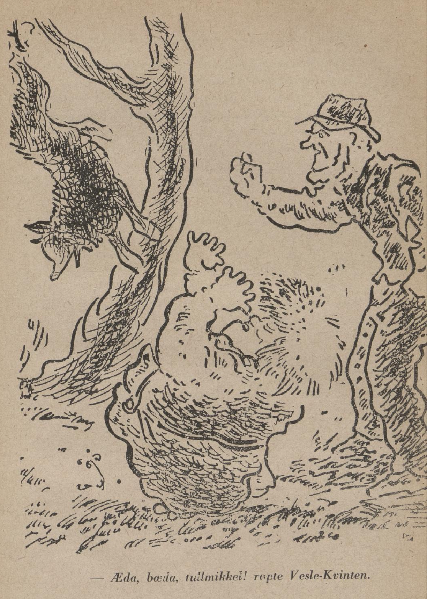

# Vesle-Kvinten bygger hønsegård

En vakker høstdag etter solefall gikk Vesle-Kvinten og dro seg oppi granskogen, uten å ha noe særs fore. Han pratet med seg sjøl, småsang og hilste på fugl og firbeint han fant, og slik holdt han det gående både drøyt og lenge, til han råkte borti en kar som var på jakt med ei diger luntebørse hengende over ryggen.

— God dag, sa mannen, du skulle vel ikke ha sett sneven av reven du vel?

— Nei, hverken teven eller sneven av reven, sa Vesle-Kvinten.

— Det var da skrot det da! No har jeg jaktet etter den i sju ganger sju døgn både jeg og sju andre, men like nytteløst er det. No har Mikkel hver eneste dag hele året igjennom stjålet både en og to høner. Vi både skaut og la ut åte og sakser, men enda var det ikke råd å få has på styggen.

— Det var ille det, sa Vesle-Kvinten. Men kan jeg stå deg til tjeneste, så vil jeg friste det jeg kan. Gå du bare heim og legg deg, du, og når det er gått sju ganger sju uker, skal vi snakkes ved.

Mannen syntes nok dette var et underlig svar, men det var det samme, tenkte han, bedre å få tak i Mikkel seint enn aldri. Dermed ruslet karene hver til sin kant.

Vesle-Kvinten tok vegen lenger opp i åsen, plukket seg noen digre klaser med rognebær og ruslet videre — til han kom midt inni tykke bjørkeskogen. Der satt det ei gammel skjære og brukte slarva.

— Nei, god dag, skjæremor, hilste Vesle-Kvinten. Det var da svært så vakkert du kan synge da. Jeg har mest aldri hørt så vakker sang før.

— Syns du det, flirte skjæra og satte nebbet sitt så stolt mot sky. Men det var da noen riktig gilde rognebær du har plukket da. Det er vel reven som skal ha dem da.

— Søte er de og lavt hang de, derfor tok jeg dem før reven skulle få tak i dem. Nei, for den eggtjuven og fugledreperen har jeg ikke noe til overs. Men se her, skjæremor, du skal få dem du, du er både en pen og ærlig fugl.

Vesle-Kvinten kastet bærklasen til henne. Skjæra ble så glad at den skrattet av glede.

— Det skal bli saker til meg og ungene mine, det, sa hun. Og så skal vi sitte og le til hønsetjuven når han drar forbi her om natten.

— Ja, denne Mikkel er en slem fyr det. Kom den ikke farende forbi meg istad med ei vakker skjære i munnen. Fy deg, sa jeg til den. Men vet du hva den svarte? Alle skjærene i skogen skal dø! Alle skjærene i skogen skal dø! Men jeg skal sannelig ta livet av den, jeg, dersom du vil vise meg hiet hans.

— Kom her, du, sa skjæra, jeg skal vise deg vegen, jeg.

Det bar av gårde nedover lia et drøyt stykke, til skjæra endelig slo seg ned i ei diger, gammel bjørk.

— Her er hiet, her er hiet! skrattet den og fløy oppover åsen igjen.

Vesle-Kvinten ga seg til å rusle fram og tilbake, langt over og lang til å møte Mikkel som kom vimsende til lyngrabbene.

— Hø, hva er du for en kar som går omkring her da? spurte Mikkel.

— Å, jeg er en stakkar som søker arbeid, svarte Vesle-Kvinten. Kanskje du trenger en dreng til hønseavl du?

— Nei, jaså, sa Mikkel, tankefull. Det var noe jeg hadde tenkt på og. For en kar som meg trenger saktens hjelp til å bygge hønsegård med øks og hammer. Har du noe grune på hønsegårdbygging du?

— Gjerne det, sa Vesle-Kvinten. Det skulde jeg akte være flink til. Det var god betaling med det samme, og spørsmålet var Mikkel. For du kan bygge både gode hønsegårder og dra på deg alt arbeidet med det, så hønseavl, spurte han ham. Da dersom du vil påta deg å lage og så drive hele hønsegården ferdig, så vil jeg betale deg godt for det.

— Akkurat, svarte Vesle-Kvinten. Han hogg og han kløde og han svettet så flisene fløy rundt om øra på ham både natt og døgnet, til den andre hønsegården kom på plass.

— Æda, bæda, tullmikkel! ropte Vesle-Kvinten. Her har du ei børse, og når det kommer mennesker i nærheten, gir du dem "kamfer og vatten".

Jo, det var grei skuring det, mente Vesle-Kvinten, og dermed lot han seg hyre som Mikkels hønsedreng.

Da det hadde gått sju ganger sju uker, ble det så tykt med høner i huset til Mikkel at det ikke var rom til flere.

— No har jeg mat i hundre år, og da sørger ikke jeg lenger, flirte Mikkel. Men skulle det komme noen her og forstyrre husfreden, har jeg lagt dette reipet oppi treet her. For er det noen som skal inn i hønsehuset, setter han foten i denne løkka utenfor døra, og dermed har vi bare å dra i reipet og heise ham i været etter det ene beinet. Siden skyter vi ham. Det skal bli moro det.

Mikkel skulle no stelle med låsen i døra, og som han holdt på å tukle med det, kom han til å sette det ene bakbeinet i løkka, og det var det samme som uløkka. Vesle-Kvinten dro i reipet alt han var kar til, og dermed ble Mikkel hengende og dingle i treet.

— Adjøs da, dåsemikkel, våsemikkel, flirte Vesle-Kvinten. Og på gjensyn da!

No ruslet Vesle-Kvinten beinvegen til husbonden som eide alle hønene og sa at no kunne han bare komme og hente dem alle sammen.

Dette trodde husbonden bare var snikksnakk og tull alt sammen, men da han ble synt vegen til Mikkels hønsegård og fikk se Mikkel sjøl dingle etter bakbeinet, fikk han syn for saken likevel. De stilte seg opp og pekte lang nese til Mikkel, danset og lo gjorde de også for å erte ham riktig til gagns.

— Æda, bæda, tullmikkel, sa Vesle-Kvinten.

— No skal du sannelig få unngjelde, ditt utyske, raste husbonden, han løftet geværet og ga den "kamfer og vatten".
