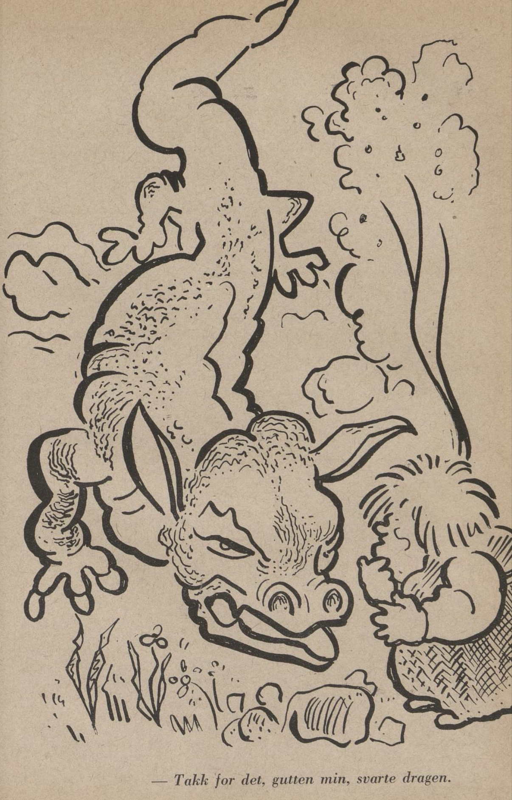

# Vesle-Kvinten og dragen

Det var en gang en stor og stygg drage som var så umåtelig glupsk og gjerrig av seg at den aldri fikk samlet i store nok lader. Den røvet med seg hopetall med jorddverger og haugbukker som den pultet inn i den digre hulen sin i Vassfjellet. Og var de først kommet dit inn, så var det sannelig ingen lett sak å komme derfra mere. For utafor hulen lå dragen og passet på som en smed og unte seg ikke søvnen engang. Og kom det noen farende forbi, så ble de bare kastet inn i hulen de og. Mangen en jorddverg og haugbukk prøvde på mange vis å komme dragen til livs for å redde folket sitt, men jo oftere de kom, jo kvikkere gikk det for seg med å få dem i hullet.

Stor-Kvinten i Storheia, som hver eneste høst leide jorddvergene og haugbukkene til slåttekarer, kom denne gangen aldeles i beit. Han visste ikke sin arme og syndige råd hvor han skulle ta slåttehjelpen fra. Til syvende og sist bestemte han seg for å lage seg en diger lanse av den største grana i Storheia for å gi seg i kamp med dragen.

Etterpå fikk han kjerringa si, bu Gull, til å erte ham opp, så han ble så sint som et uvær, og dermed salet han den svarte hesten sin og raste avsted så varmen gløyv under hovene. Da han kom til dragen, ropte han:

> Jeg vil kjøre deg i steiner sju.  
> Øie meg jeg er terga!  
> Jeg vil renske hol og bu,  
> krase alle berga!

No begynte dragen å røre på seg. Den åpnet kjeften sin og spyttet varme ut i luften og skreik:

> Hui, hui framfuse troll!  
> Med ild jeg slår det svart!  
> Hui, hui, akte ditt håll,  
> akte deg mot dragen glime (kjempe)!

Stor-Kvinten jog på hesten sin alt han kunne, og dermed rente han lansen i brystet på dragen.

Men det dugde nok ikke stort likevel, lansen gikk tvers av og hesten knakk nakken, og stort bedre gikk det ikke med Stor-Kvinten heller. Han gikk kant i kant inn gjennom hulen, og ble ikke skikkelig våken før han kom i lag med jorddvergene og haugbukkene der inne.

Oppe i Storheia gikk Gull og Vesle-Kvinten og ventet på at gubben sjøl skulle komme tilbake. De ventet i sju lange og sju breie, og jo mer de ventet, jo mindre så de likt til noen gubbe. Da visste ikke Gull bedre råd enn å ta med seg det store trollsverdet for å gi seg dragen i vold. Det var så stort og så tungt at hun måtte ete tre tønner med rå graut for å kunne svinge det i luften. Siden fikk hun Vesle-Kvinten til å terge seg så sint at blå logen sto ut av munnen hennes. Da hun langt om lenge kom fram til dragen nord i Vassfjellet, svang hun sverdet og skreik:

> Jeg vil tyne deg til rubb og bit!  
> Øie meg jeg er terga!  
> Jeg skal slå deg dau og kvit —  
> krase alle berga!

Dragen åpnet kjeften sin og spyttet varme ut i luften, og da Gull fikk se det, rente hun på den med sverdet. Men det dugde ikke stort det heller, det gikk tvert av, og kjerringa føyk som på ei vindbyge lukt inn i hulen.

No gikk Vesle-Kvinten og dreiv i ensomhet omkring i Storheia aldri så lenge, men til slutt ble han engstelig for at foreldrene kunne være ille farne, og derfor måtte han og ut og prøve lykken. Han ruslet avgårde, og som reisekamerat tok han med seg en smellfeit gris.

Da han langt om lenge kom fram til dragen, gikk han helt bort til den, klappet den på kinnet og sa:

— Kjære, snille drage! Jeg kommer for å takke deg for alle dine velgjerninger. Du har ryddet bort alle mine fiender, derfor er jeg den gladeste gutten i verden, aldri har jeg hatt det så godt i hele mitt liv. No kan jeg både sove og ete i fred for hele verden. Ta denne grisen som takk for hjelp og bistand! Og dersom du vil, skal du få en slik gris hver eneste dag så lenge jeg lever og har helse til å rusle.

Dragen ble så mild og blank i øynene med det samme, det var første gangen den hadde hørt at troll hadde god hel for den.

— Takk for det, gutten min, svarte den. Så snill en kar råkte jeg aldri før. Men når du er så snill så vil jeg be deg om en tjeneste til. Jeg er trett og trenger søvn, derfor vil jeg be deg holde vakt for meg og hulen min mens jeg sover i sju døgn. Det er det hele jeg trenger på sju år. Skulle noe galt skje mens jeg sover, stikker du denne lange stangen sju meter inn i det høyre neseboret mitt, det er den eneste måten jeg våkner på. Pass på at ild og varme ikke kommer nær kroppen min, da er jeg evig fortapt.

— Sov bare trygt du, drage, sa Vesle-Kvinten, for her er gutten du kan stole på i ett og alt.

Dermed la dragen seg ned og sov, den sov så det dundret i skog og berg, og da Vesle-Kvinten var sikker på at den var kommet vel inn i drømmenes rike, samlet han kvist og mose som han la omkring den, og deretter slo han med ildstål så varmen freste omkring den. Aldri hadde Vesle-Kvinten sett så diger en varme. Det freste og smalt i samfulle sju døgn, og det åttende døgnet var det ikke annet å se enn bare kvite askehaugen.

Vesle-Kvinten hentet foreldrene sine ut av hulen, og dermed frelste han også alle jorddvergene og haugbukkene. Det ble holdt stor fest i Storheia. Vesle-Kvinten ble hedersgjesten, han fikk så mye sneglemajones og froskejellé han bare orket å skuffe i seg.
