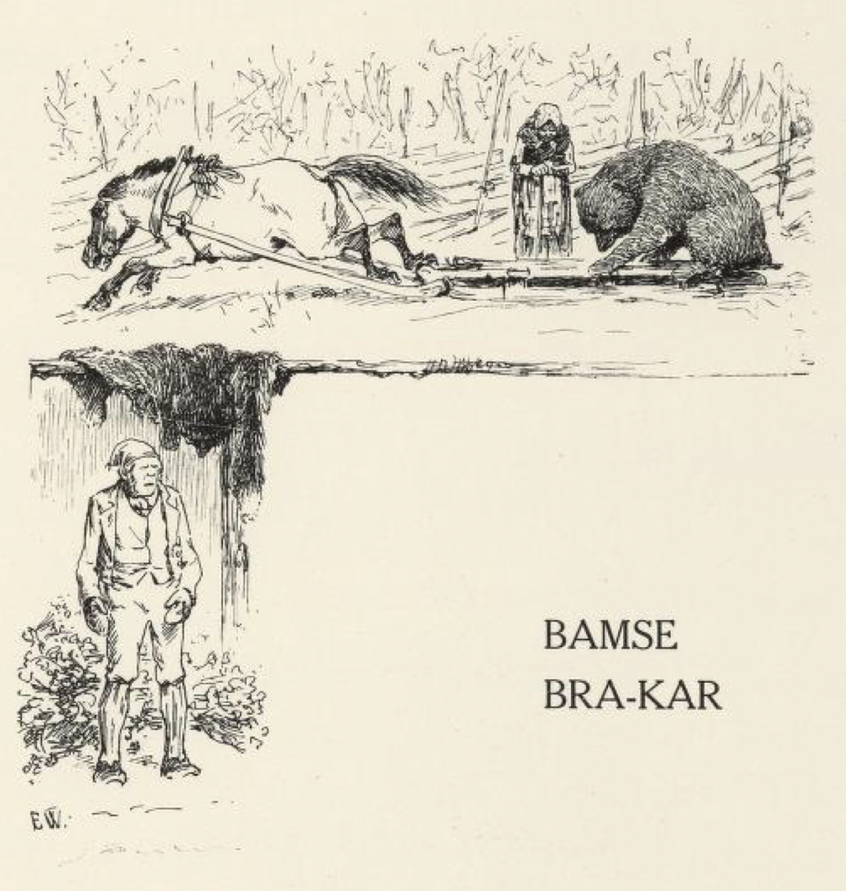
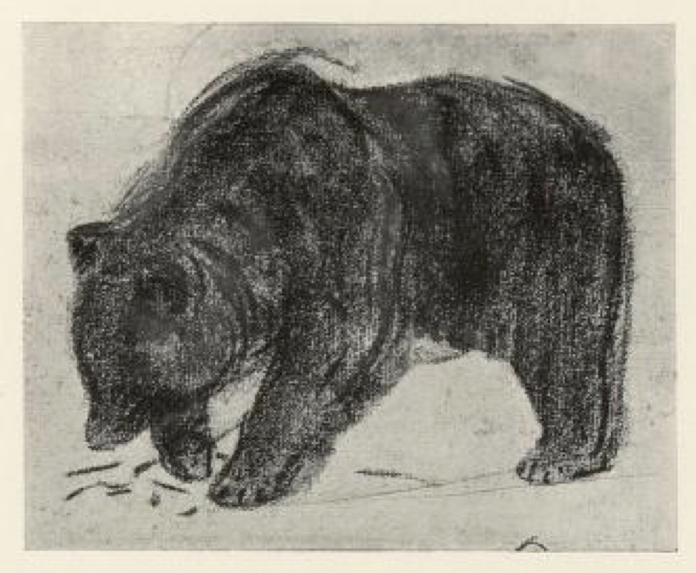
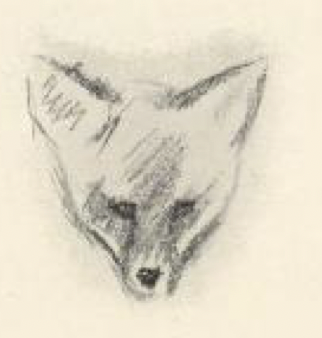

# Bamse Bra-kar

Det var en gang en bonde som reiste opp til fjells etter et løvlass til dyrene sine om vinteren.

Da han kom til løvhesjen, rygget han sleden med hesten tett inntil, og gikk opp i hesjen og begynte å velte løvkjerv ut på sleden. Men det var en bjørn i hesjen, som hadde lagt seg i hi der, og da den kjente at mannen begynte å romstere, så sprang den ut, rett ned på sleden. Da hesten fikk været av bamsen, ble den redd og satte avgårde, som den hadde stjålet både bjørnen og sleden, og det gikk mange ganger fortere samme veien ned enn den hadde kommet opp.

Bamse har ord for at han ikke skal være redd av seg; men han var ikke veldig fornøyd med skyssen denne gangen, der han satt; han holdt seg fast det beste han orket, og glante stygt til alle kanter, om han skulle kunne kaste seg av; men han var nok ikke vant med å kjøre, og så syntes han at der ikke var noen vun[^1].

Da han hadde kjørt et langt stykke, møtte han en kremmer.

«Hvor i guds navn skal futen hen i dag?» sa kremmeren; «han har visst knapp tid og lang vei, siden han kjører så fort?»

Men bjørnen svarte ikke et ord, han hadde nok med å holde seg fast.

Om en stund så møtte han en fattigkjærring. Hun hilste og nikket med hodet, og bad om en skilling i guds navn. Bjørnen sa ingen ting, men holdt seg fast og kjørte utover det forteste han klarte.

Da han kom et stykke lenger ned, møtte han Mikkel rev. «Hei, hei, er du ute og kjører?» skreik Mikkel; «bi litt, la meg få sitte bakpå og være skyssgutt!» Bamsen sa ikke et ord, men holdt seg vel fast, og kjørte så fort som hesten ville renne. «Ja, vil du ikke ta meg med, så skal jeg spå deg det, at om du kjører som en finmutt-kar i dag, henger du i morgen med ryggen bar,» skreik reven etter ham. Bjørnen hørte ikke et ord av det som Mikkel sa; han kjørte like fort.

Men da hesten kom på gården, satte den inn igjennom stalldøren i fullt firsprang, så den kledde av seg både sele og slede, og bjørnen slo skallen i dørbjelken, og så lå han død på flekken.

Bonden han lå i hesjen og veltet og veltet løvkjerv, til han trodde han hadde fullt lass på sleden; men da han skulle til å gjøre lasset, hadde han hverken hest eller slede. Så måtte han traske etter, for å finne hesten sin igjen.

Om en stund møtte han kremmeren.

«Har du møtt noen hest og slede?» sa han til kremmeren.

«Nei,» sa kremmeren, «men jeg møtte futen ned på her; han for så fort, han skulle visst bort og flå noen.»

Om en stund så møtte bonden fattigkjerringen.

«Har du møtt noen hest og slede?» sa han til fattigkjerringen.

«Nei,» sa kjerringen; «men jeg møtte presten ned på her; han skulle visst i sognebud, for han for så fort, og bondeskøds hadde han.»

En stund etter møtte bonden reven.

«Har du møtt noen hest og slede?» sa bonden.

«Ja,» svarte Mikkel; «men Bamse Bra-kar satt på, og kjørte som om han hadde stjålet både hest og redskap.»

«Fanden fare i ham; han kjører vel i hjel hesten min,» sa bonden.

«Så trekk av ham pelsen og stek ham på gloen,» sa Mikkel. «Men skulle du få igjen hesten din, så kunne du skysse meg over fjellet, for jeg kan fare lekkert,» sa reven, «og jeg skulle også ha lyst til å prøve hvordan det er å ha fire ben foran seg.»

«Hva gir du for skyssen?» sa bonden.

«Du kan få vått og tørt, hva du lyster,» sa reven; «alltid får du like så mye av meg som av Bamse Bra-kar; for han pleier å være grov til å ta seg betalt, når han tar skyss og henger seg på hesteryggen.»

«Ja, du skal få skyss over fjellet,» sa bonden, «hvis du vil møte meg her i morgen ved dette leitet.» Han skjønte at Mikkel gjorde narr av ham og var ute med revstrekene sine.

Så tok han med seg en ladd børse på sleden, og da Mikkel kom og tenkte han skulle få fri skyss, fikk han en haglladning i skrotten, og så dro bonden belgen av ham, så hadde han både bjørnehud og revebelg.

[^1]: vun = vunnen, sjanse til å komme unna
