# De tre kongsdøtre i berget det blå

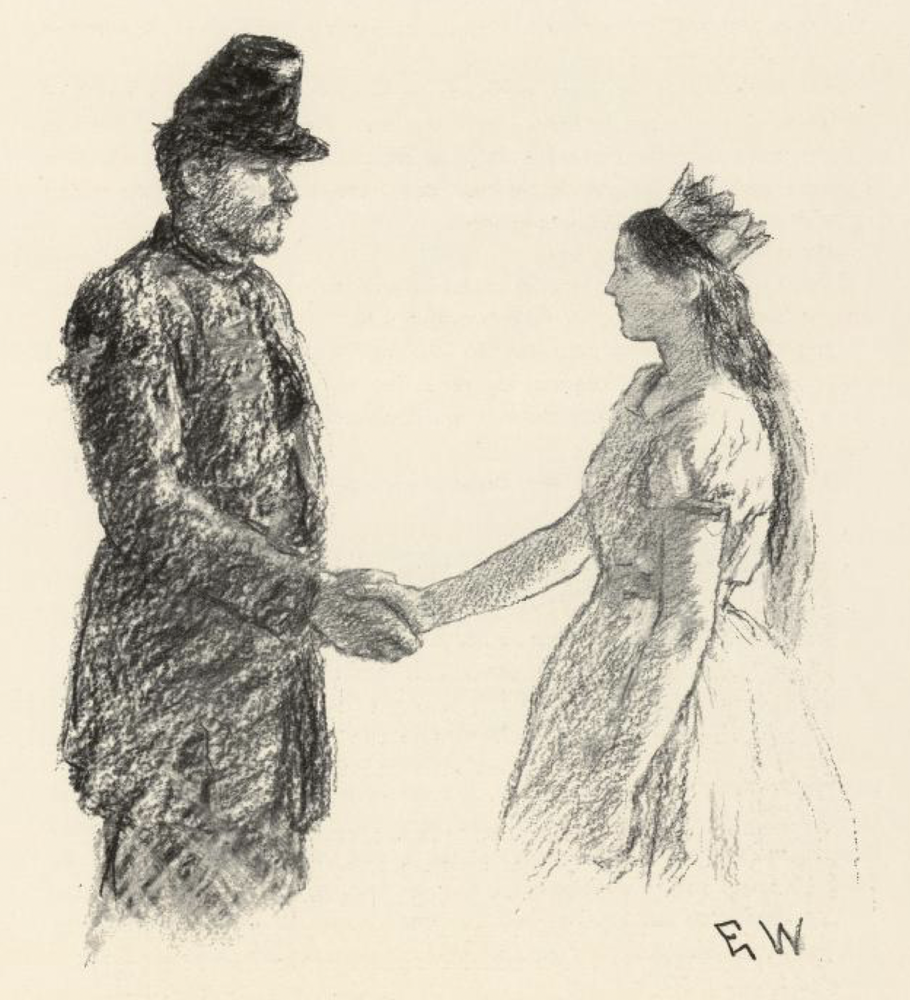

Det var engang en konge og en dronning som ingen barn hadde, og det tok de seg så nær, at de nesten ikke hadde en glad stund.

En dag sto kongen ute i svalen og så ut over de store jordene sine og alt han eide. Det var nok, og vel så det; men han syntes ikke han kunne ha noen glede av det, når han ikke visste hvor det skulle bli av alt etter hans tid. Som han sto der og grublet, kom det en gammel fattigkjerring, som gikk og bad om litt i Guds navn. Hun hilste og neiet seg, og spurte hva det feilte kongen, siden han så så uglad ut.

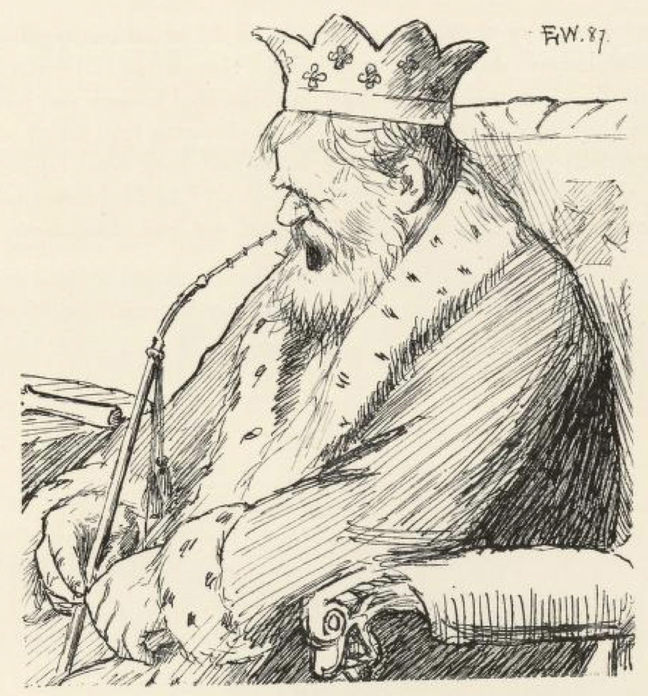

« Det kan ikke du gjøre noe ved, kona mi! » sa kongen; « det nytter ikke å fortelle deg det. »

« Det torde vel enda hende, » sa tigger-kjerringa; « det skal ofte lite til, når lykka vil. Kongen tenker på at han ingen arving har til land og rike; men det trenger han ikke å sørge for, » sa hun; « — han skulle ha tre døtre med dronningen sin, men han måtte akte dem vel, så at de ikke kom under bar himmel før de ble femten år gamle; ellers kom det en snefloke og tok dem. »

Da tiden kom, ble dronningen liggende og fikk et vakkert pikebarn; året etter gikk det likedan, og tredje året også. Kongen og dronningen var så glad at det ikke var måde på det; men så glad kongen var, husket han enda på å sette vakt for stuedøra, så prinsessene ikke skulle slippe ut.

Da kongsdøtrene vokste til, ble de både vakre og vene, og godt og vel hadde de det i alle måter. Det eneste var at de ikke fikk komme ut og leke seg, de som andre barn; men alt de tigget og bad foreldrene, og alt de gnålte på vakta, så nyttet det like lite; ut måtte de ikke, før de var femten år gamle allesammen.

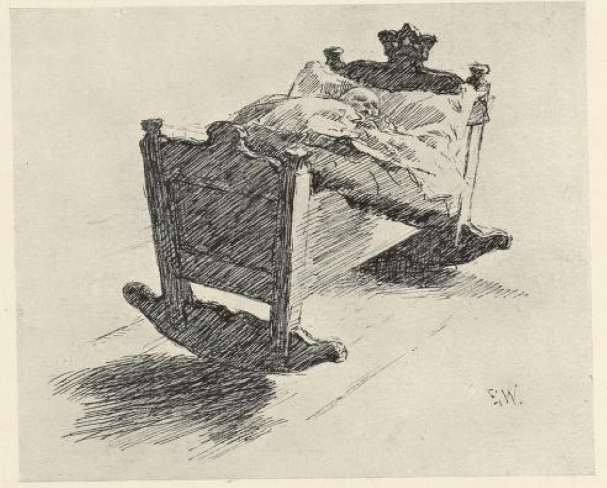

Så var det en dag, ikke lenge før den yngste kongsdatteren skulle fylle sitt femtende år. Kongen og dronningen var ute å kjøre i godværet, og prinsessene sto i vinduet og så ut. Sola skinte, og alt sto så grønt og vakkert, at de syntes de måtte ut — det fikk gå som det kunne. Så tigget og overhang de vakta alle tre, og bad at han skulle slippe dem ned i hagen; han kunne selv se, så varmt og vakkert det var, — det kunne da aldri komme vintervær en slik dag. Ja, han syntes ikke det så likt ut til det, vaktmannen heller; og når de endelig skulle og måtte ut, så fikk de vel gå, sa han; men det skulle bare være en ørliten stund, og han ville selv være med og passe på dem.

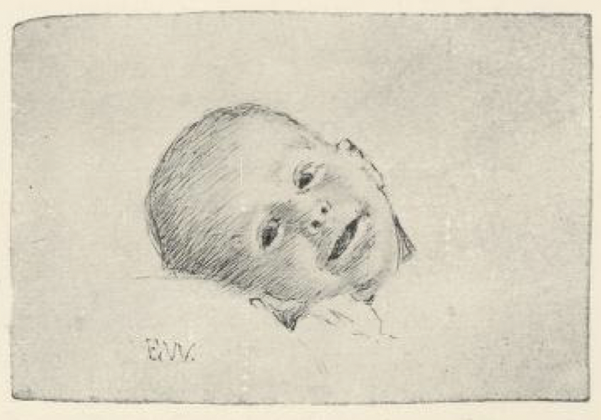

Da de kom ned i hagen, sprang de både høyt og lavt og plukket fanget fullt av blomster og grønt, det vakreste de så. Til sist rådet de ikke med mer; men som de skulle til å gå inn igjen, fikk de øye på en stor rose, som sto borte i den andre enden av hagen. Den var mange ganger vakrere enn alt det andre de hadde funnet, så den måtte de endelig ha. Men idet de bukket seg og skulle ta rosa, kom det en diger tett snefloke, og borte var de.

Der ble stor sorg over hele landet, og kongen lot lyse opp på alle kirkebakker, at den som kunne frelse prinsessene, skulle få halve riket og gullkronen hans og hvem av dem han ville til kone. Det var nok av dem som ville vinne et halvt kongerike og en prinsesse på kjøpet, kan en vite, så der reiste ut både fornemme og ringe til alle landets kanter. Men det var ingen som kunne finne kongsdøtrene, eller så mye som få spurlag på dem.

Da nå alle de store og høyeste i landet hadde vært ute, var det en kaptein og en løytnant som ville i veien og prøve seg. Å ja, kongen rustet dem ut både med sølv og gull, og ønsket dem lykke på reisen attåpå.

Så var det en soldat som bodde sammen med mor si i en liten stue bortenfor kongsgården. Han drømte en natt at han skulle ut og lete etter prinsessene, han med. Om morgenen sanset han enda det han hadde drømt, og snakket om det for mora. « Det kan gjerne være noe fanteskab som er kommet for deg, » sa kjerringa; « du må drømme det samme tre netter på rad, ellers er det ikke settende. » Men det gikk likeens de neste nettene, begge ganger kom den samme drømmen igjen: han syntes han skulle ut.

Så vasket han seg og drog på seg uniformen sin, og gikk opp i kjøkkenet på kongsgården; det var enda dagen etter at de to andre var draget avsted.

« Gå du hjem igjen, » sa kongen; « prinsessene henger nå vel for høyt for deg, » sa han. « Og så har jeg gitt ut så mange reisepenger, så det er ikke flere igjen i dag. Du får heller komme igjen en annen dag. »

« Skal jeg gå, vil jeg gå i dag, » sa soldaten; « reisepenger er jeg ikke nødig om, jeg vil ikke ha annet enn en dram på flaska og mat i taska, » sa han; « men en dyktig matsekk måtte det være, så mye kjøtt og flesk som han kunne bære. »

Ja, det skulle han få, når det ikke var annet han ville.

Så la han avsted, og han hadde ikke gått mange milene, før han tok igjen kapteinen og løytnanten.

« Hvor skal du hen? » sa kapteinen, da han så uniformen.

« Jeg skal ut og friste om jeg kunne finne kongsdøtrene, » svarte soldaten.

« Vi skal så, vi med, » sa kapteinen; « og siden du har samme ærende, kan du få lov å slå følge med oss; for finner ikke vi dem, så finner visst ikke du dem, min gutt! » sa han.

Da de hadde gått sammen en stund, tok soldaten av fra storveien, inn på en gangsti i skogen.

« Nei, hvor vil du hen? » sa kapteinen; « det er best å følge alfarveien, » sa han.

« Det lar seg tro det, » sa soldaten; « men her faller min vei. »

Han holdt stien han, og da de andre så det, snudde de og kom etter, de også. Det bar langt og lenger enn langt bortigjennom, over svære moer og oppetter trange avdaler. Til sist lysnet det, og da de kom helt ut av skogen, var der en lang, lang klopp som de måtte over, og på den kloppen sto en bjørn til vakt; den reiste seg på to og kom imot dem, som den ville spise dem.

« Hva gjør vi nå? » sa kapteinen.

« De sier at bjørnen skal være vill etter kjøtt, » sa soldaten, og kastet til den en femfjerding[^*].

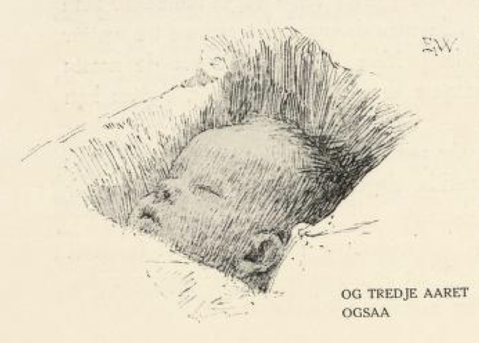

Så kom de forbi. Men ved den andre enden av kloppen sto en løve, og den brølte og kom imot dem med gabende kjeft, som den ville sluke dem.

« Nå er det best vi snur nesa hjem igjen; her kommer vi aldri levende forbi, » sa kapteinen.

« Å den er vel ikke så farlig, den heller, » sa soldaten; « jeg har hørt at løva skal være fys etter flesk, og i skreppa har jeg en halv gris, » sa han. Så kastet han en skinke til løva; den til å gnage og spise, og så slapp de frem om der også.

I kveldingen kom de frem til en stor, grom gård. Det ene rommet var gildere enn det andre, og det lyste og lovet, hvor de så hen. Men det mone nå ikke stort i skrotten, ved jeg. Kapteinen og løytnanten gikk og ringlet med pengene sine og ville gjerne kjøpt seg mat; men ikke så de folk, og ikke fant de matsmulen heller. Så bød soldaten dem kjøtt og flesk av matsekken sin. Da var de ikke storagtige og lot seg ikke nøde lenge, de tok for seg av det han hadde, som de aldri skulle smakt mat.

Dagen etter sa kapteinen, at de fikk på jakt og skaffe seg noe å leve av. Like ved gården var det en stor skog, og der var det fullt av både hare og fugl. Løytnanten skulle bli hjemme og passe huset og koke resten av nistematen. Imellomtiden skjøt de to andre så mye, at det var ikke mer enn så de orket å bære det hjem. Men da de kom til porten, var det så skrøpelig med løytnanten, at han nesten ikke var god til å lukke opp for dem.

« Hva er det på ferde med deg? » spurte kapteinen.

Jo, så fortalte han, at straks de var gått, kom det en ørliten kall med sidt skjegg — som gikk på krykker, og bad så vakkert om en skilling; men vel han hadde fått den, falt den ned på gulvet for ham, og alt han kavet etter den, var han ikke kar til å få tak i den, så støl og skjelvete var han. « Jeg syntes synd på den gamle kroken, » sa løytnanten, « og så bukket jeg meg og ville ta opp skillingen; men da var han hverken støl eller stiv lenger, han gav seg til å bruke krykkene sine på meg, til jeg snart ikke kunne bevege en lem. »

« Du måtte skamme deg, du som er kongens kar, at du har latt en gammel krøpling rundhjule deg, og at du taler om det på kjøpet, » sa kapteinen. « Pøh! I morgen skal jeg bli hjemme, så skal det spørres annet. »

Ja, neste dagen gikk løytnanten og soldaten på jakt, og kapteinen ble hjemme og skulle koke maten og stelle huset. Men gikk det ikke verre med ham, så gikk det da ikke bedre. Da det led på, kom gamlingen og bad om en skilling. Den slapp han idet han fikk den; borte var den, og borte ble den.

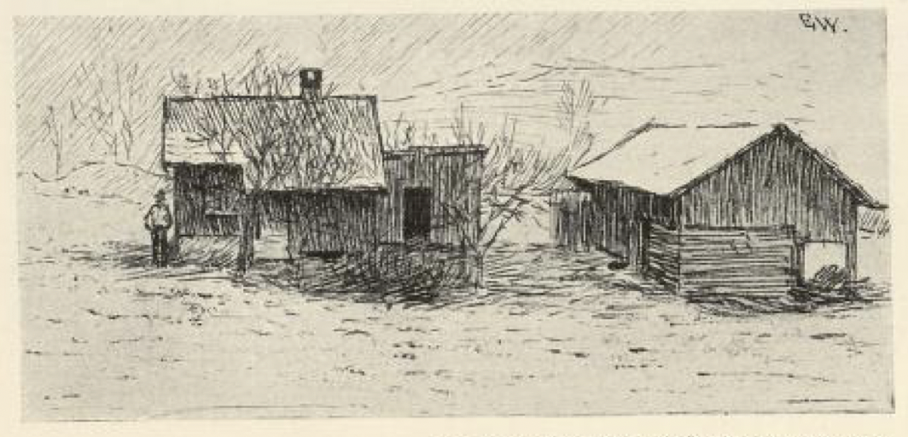

Så bad han kapteinen hjelpe seg med å finne den frem igjen, og han sanset ikke bedre enn at han lutet seg ned for å lete etter den. Men han hadde ikke bukket seg, før krøplingen gav seg til å denge ham med krykkene, og hver gang kapteinen ville til å reise på seg og ta igjen, fikk han et drag så det gnistret for øynene. Da de andre kom hjem om kvelden, lå han enda på samme flekken og kunne hverken glo eller gape.

Den tredje dagen skulle soldaten bli hjemme, mens de andre to gikk på skytteri. Kapteinen sa at han fikk akte seg vel, « for deg slår vel gamlingen kvikk i hjel, min gutt, » sa han. « Å, livet måtte sitte løst, når en skulle la slik en gammel krok ta det, » mente soldaten.

De var ikke mer enn vel ute av porten, før kallen var der og bad om en skilling igjen.

« Penger har jeg aldri eid, » sa soldaten, « men mat skal du få, først den blir ferdig, » sa han; « men skal vi få kokt den, så må du hugge ved. »

« Det kan jeg ikke, » sa kallen.

« Kan du ikke, så kan du vel lære, » sa soldaten; « det skal snart være gjort, følg bare med ned i skålen[^**]. »

Der drog han frem en svær stokk, hogg en sprenge i den og drev inn en blei[^***], så det ble en stor dyp sprekk.

« Nå må du legge deg ned og sikte vel langs etter sprekka, så skal du snart lære hvorledes det er å hugge ved, » sa soldaten; « imellomtiden skal jeg hugge og slå. »

Ja, gamlingen var ikke fulere enn at han gjorde som han bad ham, han la seg ned og siktet og siktet bortetter stokken. Da soldaten så at skjegget var kommet vel ned i sprekka, slo han bleien ut og mørbanka kallen med øksehammeren; så svingte han øksa over hodet og lovet at han skulle kløve hodeskallen på ham, om han ikke straks på timen sa hvor kongsdøtrene var henne.

« Spar livet, spar livet, skal jeg si deg det! » sa han. « Øst enfor, østenfor gården er det en stor haug, » sa kallen; « øverst på haugen skal du grave løs en firkantet torv, så ser du en svær stenhelle, og under den er det et dypt hull. I det hullet må du vinde deg ned, så kommer du til en annen verden, og der er prinsessene hos bergtrollene. Men det er langt og det er mørkt nedetter, og det bærer gjennom både vann og varme. »

Da soldaten hadde fått vite dette og det han ville, slo han gamlingen løs av stokkeklemma, og han var ikke sen med å by velleve.

Da nå kapteinen og løytnanten kom hjem, undret de seg over at de fant soldaten i live. Ja, han sa hvorledes det var gått til, fra først og til sist, og fortalte hvor kongsdøtrene var henne, og hvordan de skulle finne dem.

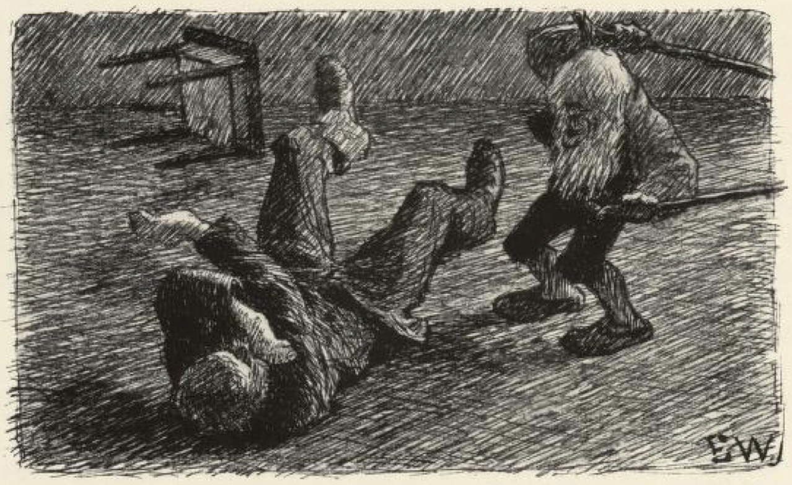

De ble så glad som de alt hadde fått dem, og da de hadde matstelt seg, tok de med seg en kurv og alle de rep og taug de kunne finne, og gikk til haugen alle tre. Der skar de først løs torva, så som kallen hadde sagt; nedenunder fant de en stor svær stenhelle, og den var det ikke mer enn så de var karer til å bende av. Så skulle de til å måle hvor dypt det var ned. De skjøt både to og tre ganger, men de fant ikke mer bunn den siste gangen enn den første. Til slutt måtte de skjøte ihop alt de hadde, både det grove og det granne; da kjente de at det rakk ned.

Kapteinen ville først i veien må vite; « men når jeg rykker i tauget, må dere svinte dere og dra meg opp igjen, » sa han. Det var både mørkt og stygt nedgjennom; men han tenkte han fikk herde på, om det bare ikke ble verre. Men rett som det var, sto kalde vasspruten om ørene på ham; dermed ble han livredd, og gav seg til å rykke i repet.

Ja, så ville løytnanten friste; men det gikk ikke stort likere med ham. Vel han var kommet gjennom vasflommen, fikk han se lyse luen i gapet under seg, og så ble han fælen og måtte gjøre vendereise, han med.

Så satte soldaten seg oppe; han lot det gå han, gjennom både vann og varme, like til han kom til bunns. Der nede var det stumme mørkt, så han så ikke neven for nesa. Ikke torde han slippe kurva heller, men gikk i ring og trevlet og famlet rundt omkring seg. Jo, så fikk han øye på en liten glime langt, langt borte, just som en dagning; den gikk han etter. Da han var kommet et stykke frem, tok det til å lysne om ham, og nå varte det ikke lenge, så så han at det rann en gullsol på himmelen der, og så ble det både lyst og vakkert, likesom i den rette verden. Først kom han til en svær buskap, med kyr så fete at det glinset av dem, og da han var forbi den, kom han til et stort gildt slott.

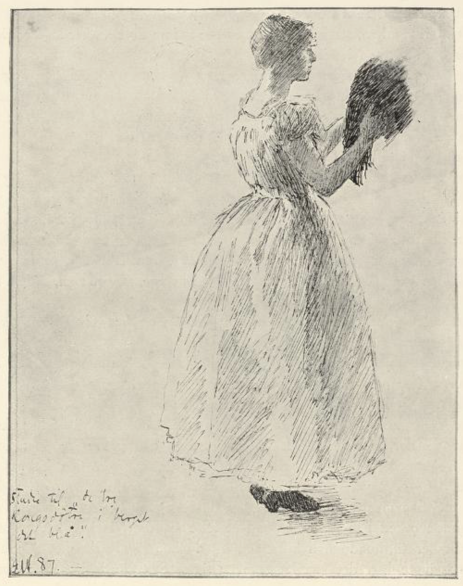

Der gikk han gjennom mange rom før han traff noen. Til sist hørte han en rokk som surret, og da han kom inn, satt den eldste kongsdatteren der og spant kobbertråd; og både stua og alt som i den var, var av bare blankskurt kobber.

« Å nei, kommer det kristent folk hit! » sa prinsessen. « Bære meg for deg, hva vil du her? »

« Jeg vil fri deg ut av berget, » svarte soldaten.

« Kjære vene, gå! Kommer trollet hjem, gjør han ende på deg idet samme. Han har tre hoder, » sa hun.

« Jeg er like glad om han så hadde fire, jeg, » sa soldaten; « er jeg kommet, så vil jeg bli. »

« Ja, når du er så stri, så får jeg vel se om jeg kan hjelpe deg, » sa kongsdatteren. Så sa hun at han skulle krype bak om det store bryggekaret som sto i forstua; imellomtiden skulle hun ta imot trollet og lyse ham til han sovnet; « men når jeg går ut og lokker på hønene, at de skal komme inn og plukke opp det som faller av hodet hans, så får du skynde deg å komme, » sa hun. « Men gå nå først ut og prøv om du kan svinge sverdet som ligger på bordet. »

Nei, det var for tungt, han kunne ikke så mye som rugge det. Så måtte han ta en styrkedrikk av hornet som hang bak gangdøra; da var det så vidt han kunne løfte det; ja så tok han én til, og dermed kunne han løfte det; men så tok han en riktig stor en, da svingte han sverdet så lett som det skulle være. Rett som det var, kom trollet susende, så det ristet i slottet.

« Tvi, tvi! Her lukter kristenmanns blod og ben i mitt hus, » sa han.

« Ja, her fløy en ravn ista, » sa kongsdatteren, « og hadde et manneben i nebbet, som han slapp ned i pipa; jeg kastet det nok ut, og sopte lenge og vel etter også, men det lukter vel enda. »

« Jeg kjenner vel det, » sa trollet.

« Men kom nå, skal jeg lyse deg, » sa prinsessen, « så tør her være bedre, når du våkner. »

Det var trollet straks villig til, og det varte ikke lange stunden før han sov så han snorket. Da hun merket at han var falt vel i søvn, satte hun stoler og dyner under hodene på ham, og gav seg til å lokke på hønene. Så listet soldaten seg inn med sverdet og slo av trollet alle tre hodene med ett hogg.

Prinsessen var så glad som en fele, og fulgte med ham til søstrene sine, for at han kunne fri dem ut av berget også. Først gikk de over et tun og siden inn gjennom mange lange rom, til de kom til en svær dør. « Ja, her får du gå inn, » sa kongsdatteren, « her er det. »

Da han åpnet døra, var det en stor sal innenfor, hvor alt var av rent sølv; der satt den mellomste og spant på en sølvrokk.

« Å, trøste deg! » sa hun, « hva vil du her? »

« Fri deg fra trollet, » sa soldaten.

« Å kjære vene, bare gå! » sa prinsessen; « finner han deg her, tar han livet ditt på flekka! »

« Det er von det, — tar jeg ikke hans først, » sa soldaten.

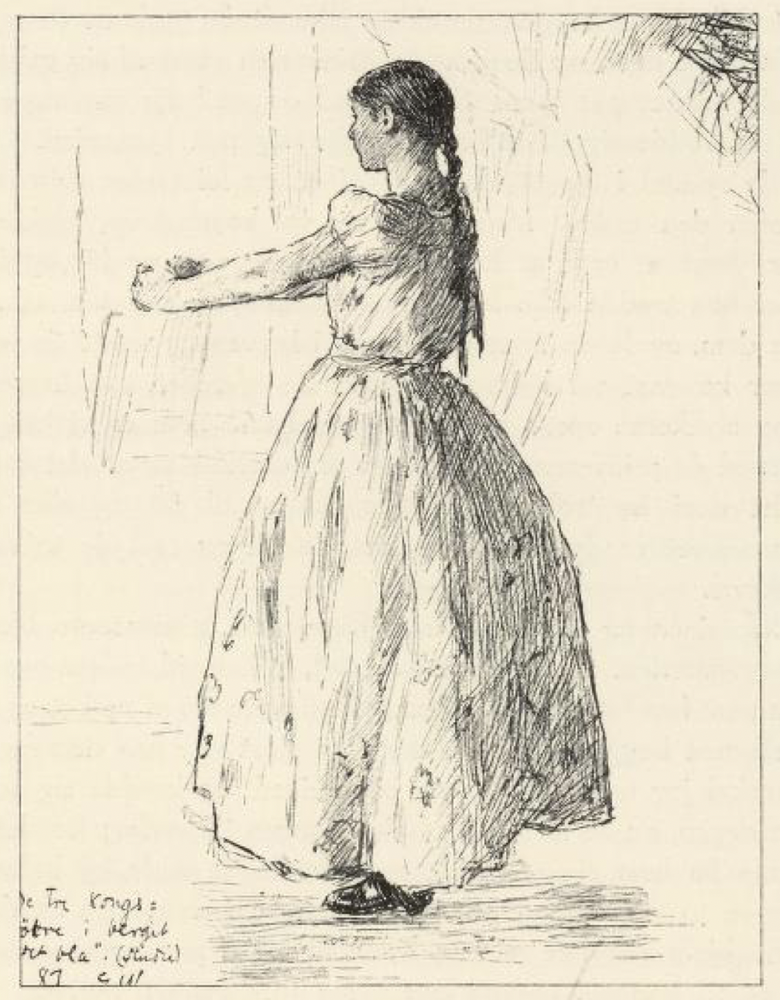

« Ja, vil du endelig, » sa hun, « så får du krype bak det større karet ute i forstua. Men du må skynde deg å komme, straks du hører jeg lokker på hønene. »

Men først måtte han prøve, om han var kar til å svinge trollsverdet som lå på bordet; det var mye større og tyngre enn det første, det var knapt nok han kunne rugge det. Så tok han tre drag av hornet; da var han god til å løfte det; og da han hadde tatt tre til, kunne han fegte med det, som det var en baksteflue.

Om litt tok det til å dure og brake så det var fælt, og like etter kom det et troll med seks hoder.

« Tvi, tvi! » sa han, straks han fikk nesene inn om døra, « her lukter kristenmanns blod og ben i mitt hus. »

« Ja tenk, for litt siden kom her en ravn flyvende med et lårben og slapp ned gjennom pipa, » sa kongsdatteren; « jeg kastet det ut, og han kastet det inn. Til sist fikk jeg det nå vekk og skyndte meg å røke etter; men lukta gikk vel ikke bort så snart likevel den, » sa hun.

« Nei, jeg kjenner vel det, » sa trollet.

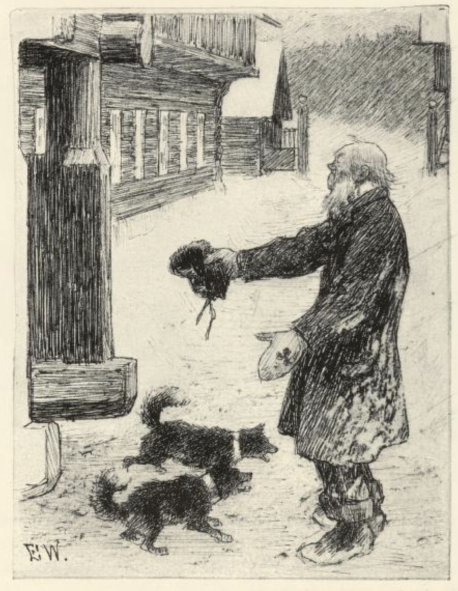

Men så var han trøtt og la hodene sine i fanget til prinsessen, og hun lyste dem, til de snorksov allesammen; da lokket hun på hønene, og så kom soldaten og hogg av alle seks hodene, som det var kålstilker de satt på.

Hun var ikke mindre glad hun enn den første, kan en nok vite; men best de danset og sang, husket de på den yngste søstera si, og så viste de soldaten over et stort tun til, og gjennom mange, mange rom, til han kom inn i gullsalen til den tredje kongsdatteren.

Hun satt og spant gulltråd på en gullrokk, og fra gulv til tak glinset det, så en kunne få vondt i øynene.

« Trøste og hjelpe både deg og meg! Hva vil du her? » sa hun som satt der. « Gå, gå, ellers dreper han oss begge to! »

« Like så godt to som én, » svarte soldaten.

Prinsessen gråt og bad; men det hjalp ikke, han ville bli og han skulle bli. Ja, da det ikke var annet for, så skulle han prøve om han kunne bruke trollsverdet ute på forstuebordet. Men det var ikke mer enn så han rugget det — det var enda mye større og sværere, det sverdet, enn de andre to. Så måtte han ha hornet ned av veggen og ta tre drag av det; men enda orket han ikke mer enn å løfte sverdet; da han hadde tatt tre styrkedrikker til, kunne han løfte det, og da han hadde drukket enda tre ganger, svingte han det så lett som en fjær. Så gjorde hun den samme avtalen med soldaten hun, som begge de andre: når trollet vel var sovnet, skulle hun lokke på hønene, og da fikk han være rapp og komme og gjøre det av med ham.

Best det var, kom det en dur og en dirring, som om vegger og tak ville ramle sammen.

« Tvi, tvi! Her lukter kristenmanns blod og ben i mitt hus, » sa trollet og veierte med alle ni nesene sine.

« Ja, du skulle aldri sett slikt: rett nå fløy her en ravn og slapp et manneben ned gjennom pipa; jeg kastet det ut, og han inn, og det varte og det rakk, » sa prinsessen. Hun fikk da gravet det ned til slutt, sa hun, og hadde nok både sopt og røket etter; men der satt vel igjen litt av lukta likevel.

« Jeg kjenner vel det, » sa trollet.

« Kom her og legg deg i fanget mitt, skal jeg lyse deg, » sa prinsessen; « så blir her vel bra til du har sovet. »

Ja, han gjorde så; og da han snorket som best, støttet hun under hodene med benker og dyner, så hun kom seg unna, og tok til å lokke på hønene. Så kom soldaten på hoselesten, og hogg til trollet, så at åtte hoder røyk av med én gang — sverdet var for kort og rakk ikke lenger.

Det niende hodet våknet og gav seg til å brøle: « Tvi, tvi, her lukter kristent! »

« Ja her er den som er kristent, » svarte soldaten; og før trollet fikk reist på seg og kunne få tak i noen, gav soldaten ham et hogg til, så det siste hodet trillet bortetter.

Det kan vel hende det ble glede på kongsdøtrene, nå de slapp å sitte og lyse trollhodene lenger; de visste ikke alt det gode de ville gjøre ham som hadde frelst dem, og den yngste prinsessen strøk av seg gullringen sin og knytet i håret på ham. Så sanket de med seg så mye gull og sølv som de trodde seg til å bære, og gav seg på hjemveien.

Straks de rykket i tauget, drog kapteinen og løytnanten prinsessene opp, den ene etter den andre. Men da de vel var kommet opp, tenkte soldaten, at det var dumt av ham at han ikke satte seg på og for opp før kongsdøtrene, for han trodde ikke kameratene sine mer enn så som så. Nå ville han prøve dem, og la en svær gullklump i kurva og smatt seg vel til side. Da den var kommet vel halvveis, hugget de av repet, så kurva dunket i berget og stykkene sprakk om ørene på ham. « Nå er vi kvitt ham, » sa de. Så truet de prinsessene på livet, om de ikke sa at det var de som hadde frelst dem fra trollene. De var nødige til det og aller mest den yngste; men livet er dyrt å miste, så de fikk nå råd, de to som hadde makta, likevel.

Da nå kapteinen og løytnanten kom hjem med prinsessene, ble det vel høytid i kongsgården. Kongen var så glad, at han visste ikke hva fot han skulle stå på; han tok frem den beste vinflaska si av skapet og skjenket dem til velkommen begge to, og var det ikke gjort ære på dem før, så ble det da nå, skal jeg tro. Og de gikk og keiket og krodde seg som herremenn hele dagen, nå de skulle få selve kongen til sverfar; for det var greit at de skulle ha hver sin av prinsessene, hvem de ville, og halve riket til deling. Begge to ville de ha den yngste kongsdatteren; men alt de bad og truet henne, hjalp det like mye; hun ville ikke på noe sett eller vis.

Så talte de til kongen, om de kunne få tolv manns vakt og sette om henne; hun var så tungsint av seg, siden hun hadde vært i berget, sa de, så de var redd for at hun skulle gjøre en ulykke. Jo, det var vel de fikk; og kongen sa selv til vakta, at de måtte akte godt på henne og følge henne hvor hun gikk og sto.

Så var det å lage til gjestebud for de to eldste, med brygg og med bakst; det skulle bli bryllup som hverken var hørt eller spurgt før, og de meltet og de baket og de slaktet, så det ikke ville ta noen ende.

Imellomtiden gikk soldaten der nede og drev i en annen verden. Han syntes det var tungt at han hverken skulle få se folk eller dagens lys mer; men noe fikk han ta seg til, tenkte han, og så gikk han fra rom til rom, både én dag og to dager og flere til, og lukket opp skap og skuffer, og grov oppe på hyller, og så på alle de gilde tinga som var der. Langt om lenge kom han til en bordskuffe; den drog han ut, og der lå det en gullnøkkel.

Så prøvde han seg frem med denne nøkkelen på alle de låsene som var; men det var ingen som den passet til, før han kom til et lite veggskap over senga, og inne i det fant han en gammel rusten pipe.

« Det kunne være rart å prøve om det er noen lyd i den, » tenkte han og stakk den i munnen. Så visste han ikke ordet av, før det tok til å suse og bruse fra alle kanter, og idet slo det ned en fugleflokk så svær at hele marka var sort.

« Hva vil vår herre i dag? » spurte de.

Var han deres herre, sa soldaten, så ville han nok vite om de kunne si ham noen råd til å slippe opp på jorda igjen.

« Nei, det var det ingen som kunne; men hun er ikke kommet mor vår enda, » sa de; « kan ikke hun hjelpe deg, er det ingen råd. »

Så pep han én gang til, og om litt hørte han noe som slo med vinger langt borte; idet begynte det å blåse så hardt at han for hus imellom som en høydott på tunet, og hadde han ikke fått tak i skigaren, så hadde han vel blåst bort med én gang. Dermed dusket det ned en ørn fremfor ham, så diger at det ikke var måde på det.

« Du kommer hvast du, » sa soldaten.

« Jeg kommer som du piper til, » svarte ørna.

Så spurte han, om hun visste råd for ham til å komme opp igjen fra den verden de var i.

« Det slipper ikke uflyvende herfra, » sa ørna. « Men vil du slakte tolv okser til meg, så jeg får spise meg vel mett, så skal jeg friste å hjelpe deg jeg. Har du kniv? » « Nei, men jeg har sverd, » sa han.

Da ørna hadde satt til livs de tolv oksene, bad hun ham slakte én til og ha med til niste. « Hver gang jeg gaper, må du være kjapp og slenge i meg et stykke, » sa hun, « for ellers orker jeg ikke opp med deg. »

Ja, han gjorde som hun bad om, og hengte to store kjøttsekker om halsen på henne, og selv smatt han inn imellom fjærene. Så skaket ørna vingene, og dermed bar det avsted med dem som en vind, så det tøt i lufta. Han som satt på, hadde nok å gjøre med å holde seg fast; det var med nød og neppe han kunne passe å kaste kjøttstykkene i gapet på ørna, hver gang hun slo det opp. Til sist tok det til å blåne av dagen over dem; da var ørna ved å skulle sakke, og flakset med vingene; men soldaten var ferdig og grep den siste bakfjerdingen og slengte til henne. Så fikk hun makt, og kom opp med ham. Og da hun hadde sittet en stund og hvilt seg i en stor grantop, satte hun avsted med ham igjen, så det lynte både til lands og til vanns der de for. Tett ved kongsgården steg han av, og ørna fløy hjem igjen; men først sa hun, at var det noe han ville, skulle han bare blåse i pipa, så kom hun straks.

Imellomtiden hadde de rustet seg i kongsgården, og det led til den tid kapteinen og løytnanten skulle ha bryllup med begge de eldste prinsessene. Men de var ikke stort gladere de enn den yngste søstera; det gikk aldri noen dag uten at de sørget og gråt, og til nærmere det led mot bryllupsdagen, til sorgfullere ble de. Sist på spurte kongen hva det var på ferde med dem; han syntes det var altfor rart at de ikke var lystige og glade, nå de var frie og frelst og skulle bli så vel gift. Noe måtte de si, og så sa den eldste, at de aldri ble glad mer, uten de kunne få et slikt brikkespill som de hadde i berget det blå.

Det mente kongen at han nok skulle skaffe dem, og så sendte han bud ut til alle de beste og gjeveste gullsmedene i landet, at de skulle gjøre et slikt gullbrikkespill til prinsessene. Men alt de prøvde, var det ingen som var god til å gjøre et sådan spill.

Til sist var det ikke flere gullsmeder igjen enn én, og det var en gammel skrøpelig en, som ikke hadde gjort noe på mange år, men bare kløtret med litt sølvarbeide, så vidt han kunne livnære seg. Ham gikk soldaten til og gav seg i lære hos; og han ble så glad ved å få en læregutt — for det hadde han ikke hatt på år og dag — at han grov frem en lerke av kista si og satte seg til å drikke med soldaten. Det varte ikke lenge før brennevinet gikk til hodet på ham, og da den andre merket det, talte han ham til å gå opp til kongen og si seg god for å gjøre spillet til kongsdøtrene. Det var han ferdig til på flekka; han hadde arbeidet det som var vel så gromt og grant, i sine dager han.

Da kongen hørte at det var en ute som kunne gjøre maken til brikkespillet, var han ikke lenge om å komme ut.

« Er det sant, det de sier, at du kan arbeide et slikt spill som døtrene mine vil ha? » spurte han.

« Ja, det var ingen løgn, » svarte smeden; « det sto han ved. »

« Det er godt, » sa kongen; « her har du gull til å arbeide den av; men kan du ikke, så skal du miste livet, siden du selv byr deg til, » og om tre dager skulle det være ferdig.

Den neste morgen, da gullsmeden hadde sovet rusen av seg, var han ikke fullt så kaut. Han både gråt og bar seg, og skjelte på læregutten sin, som hadde fått ham til å gjøre ulykker i fylla. « Nå var det likest at han kortet seg idet samme, » sa han, « for livet det var det ikke å spørre om; når ikke de beste og fornemste gullsmedene kunne gjøre et sådan spill, var det ikke likt seg at han skulle få det til. »

« Syt ikke for det, men kom med gullet, » sa soldaten; « jeg skal nok skaffe spillet jeg. Men jeg vil ha et rom for meg selv å arbeide i, » sa han.

Det fikk han idet samme, og takk attåpå.

Men det rakk og det varte; ingenting tok han seg til, annet enn å drive, og gullsmeden gikk og gav seg, fordi han aldri ville ta på med arbeidet.

« Bry deg om ingenting du, » sa soldaten, « det er langt til klokkeslaget. Er du ikke nøyd med det jeg har lovet, så kan du gjøre spillet selv. »

Det ble det samme det, både den dagen og den neste; og da smeden hverken hørte hammer eller fil fra rommet hans hele den siste dagen heller, gav han seg rent over, for nå var det ikke å tenke på å berge livet lenger, mente han.

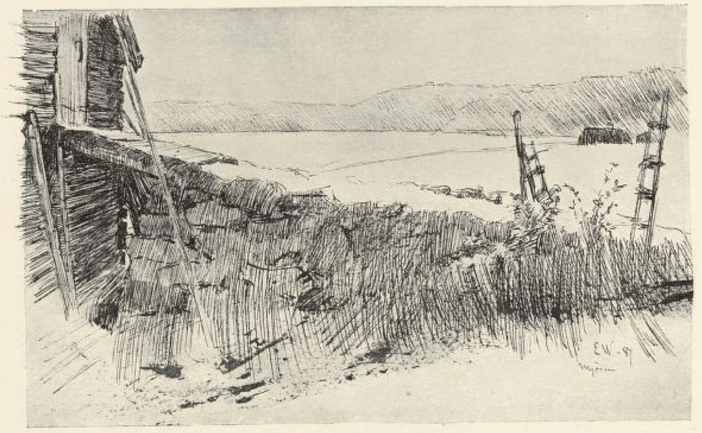

Men da det led utpå natta, lukket soldaten opp glasset og blåste i pipa si. Så kom ørna, og spurte hva det var han ville. « Det gullbrikkespillet som kongsdøtrene hadde i berget det blå, » sa soldaten. « Men du vil vel ha noe å leve av først? Borte på låven har jeg liggende to okseskrotter til deg, dem får du ta, » sa han. Da ørna hadde fått dem i seg, gjorde hun ikke veien lang, og lenge før sola rann, var hun tilbake igjen med spillet; så satte soldaten det innunder senga og la seg til å sove.

I åtten den neste morgen kom gullsmeden og bultet på døra til ham.

« Det var farlig til renn på deg, » sa soldaten; « dagen lang flyr du som mersgal; skal en nå ikke få sengefred heller, så skulle da noen være læregutt her! » sa han.

Men der hjalp hverken bud eller bønn den gangen, gullsmuden måtte inn og skulle inn, og til sist fikk han lettet kroken av.

Å jo, det kan vel være der ble ende på suten!

Men enda gladere enn gullsmeden ble prinsessene, da han kom opp på kongsgården med spillet, og gladest av dem alle var den yngste.

« Har du arbeidet det spillet selv du? » spurte hun.

« Nei, sant å si, så har jeg nok ikke det, » sa han, « det er en læregutt jeg har. »

« Den læregutten hadde jeg lyst til å se, » sa kongsdatteren.

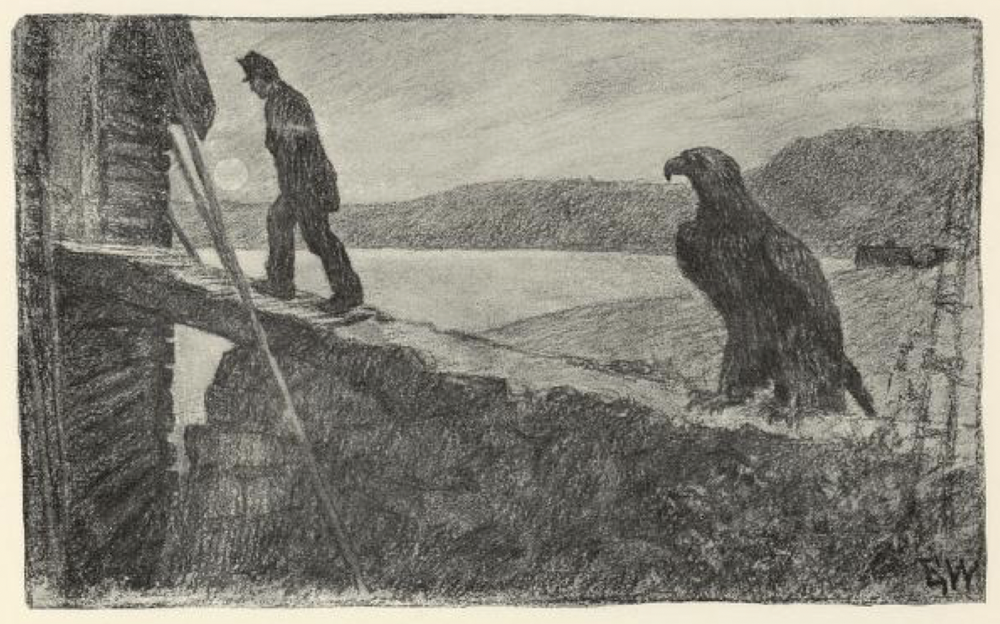

Ja, ham ville de ha fatt i alle tre, og hvis han ville nyte livet, så skulle han komme.

Han var ikke redd hverken kvinnfolk eller storfolk, mente soldaten; og hadde de moro av å se på fillene hans, så kunne de gjerne få den lysten styrt.

Den yngste kongsdatteren drog kjennsel på ham idet samme; hun skubbet vakta til side, løp hen og bød ham hånden og sa: « Goddag og takk for sist! »

« Her er den som frelste oss fra trollene i berget, » sa hun til kongen; « ham vil jeg ha! » Og så strøk hun av ham lua og viste dem ringen hun hadde bundet i håret hans.

Ja, så kom det ord og skor i hvorledes kapteinen og løytnanten hadde båret seg ad, og så fikk de undgjelde for det med livet; det var enden på herredømmet deres. Men soldaten fikk gullkronen og halve riket og holdt bryllup med den yngste kongsdatteren. Og der drakk de og turte[^****] både stivt og sterkt, for ture kunne de alle, om de ikke kunne frelse prinsessene; og har de ikke avdrukket, så sitter de vel og drikker og turer enda.

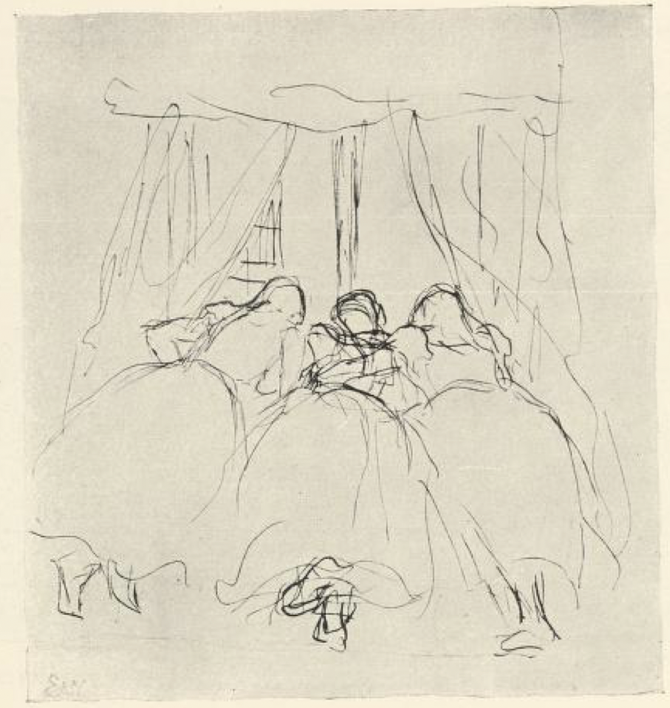

[^*]: Femfjerding: stor mengde kjøtt, ca. 5/4 av normal porsjon

[^**]: Skålen: verktøyskjulet, redskapsboden

[^***]: Blei: kile av tre eller metall

[^****]: Ture: skryte, føre store ord

