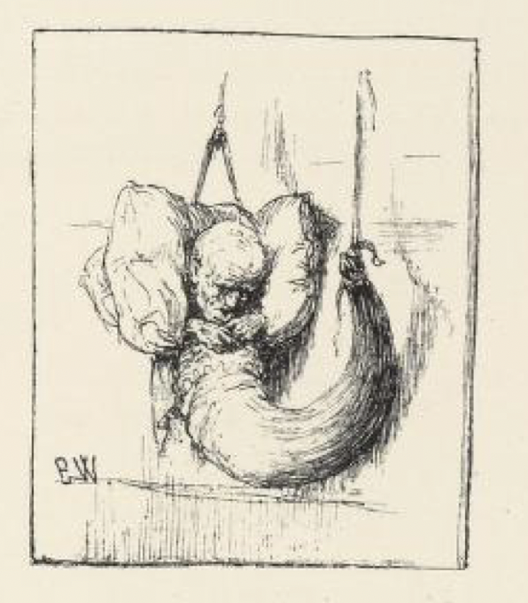
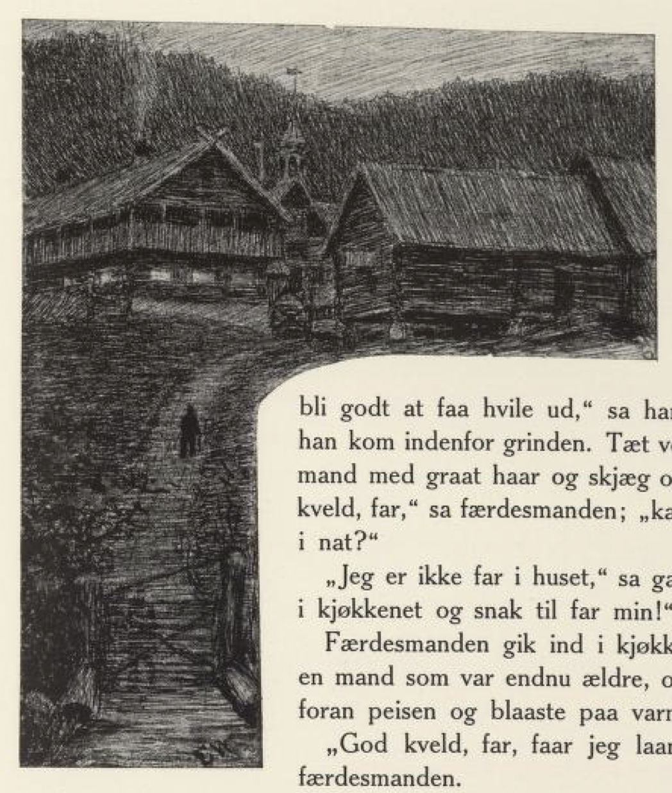

# Den syvende far i huset

Det var engang en mann som var ute å ferdes. Så kom han langt om lenge til en stor og vakker gård; det var en herregård så gild at den gjerne kunne ha vært et lite slott. «Her skal det bli godt å få hvile ut,» sa han ved seg selv, da han kom innafor grinda. Tett ved sto en gammel mann med grått hår og skjegg og hogg ved.

«God kveld, far,» sa ferdsamannen; «kan jeg få lånt hus i natt?»

«Jeg er ikke far i huset,» sa gamlingen; «gå inn i kjøkkenet og snakk til far min!»

Ferdsamannen gikk inn i kjøkkenet; der traff han en mann som var enda eldre, og han lå på kne foran peisen og blåste på varmen.

«God kveld, far, får jeg lånt hus i natt?» sa ferdsamannen.

«Jeg er ikke far i huset,» sa den gamle; «men gå inn og snakk til far min; han sitter ved bordet i stua.»

Så gikk ferdsamannen inn i stua og snakket til den som satt ved bordet; han var enda mye eldre enn begge de andre to, og han satt og hakket tenner, ristet og skalv, og leste i en stor bok, nesten som et lite barn.

«God kveld, far, vil du låne meg hus i natt?» sa mannen.

«Jeg er ikke far i huset; men snakk til far min, han som sitter i benken,» sa mannen som satt ved bordet og hakket tenner og ristet og skalv.

Så gikk ferdsamannen til ham som satt i benken, og han holdt på og skulle få seg en pipe tobakk; men han var så sammenkrøpet og ristet så på hendene, at han nesten ikke kunne holde på pipa.

«God kveld, far,» sa ferdsamannen igjen. «Kan jeg få lånt hus i natt?»

«Jeg er ikke far i huset,» svarte den gamle sammenkrøpne kallen; «men snakk til far min, som ligger i senga.»

Ferdsamannen gikk til senga, og der lå en gammel, gammel kall, som det ikke var noe annet levende å se på enn et par store øyne.

«God kveld, far, kan jeg få lånt hus i natt?» sa ferdsamannen.

«Jeg er ikke far i huset; men snakk til far min, som ligger i vogga,» sa kallen med de store øynene.

Ja, ferdsamannen gikk til vogga; der lå en eldgammel kall, så sammenkrøpet at han ikke var større enn et spedbarn, og han kunne ikke skjønne at det var liv, på annet enn at det laut[^1] i halsen på ham imellom.

«God kveld, far, kan jeg få lånt hus i natt?» sa mannen.

Det varte lenge før han fikk svar, og enda lenger før kallen ble ferdig med det; han sa, han som de andre, at han var ikke far i huset; «men snakk til far min, han henger i hornet på veggen.»

Ferdsamannen glante opp over veggene, og til sist fikk han øye på hornet også; men da han så etter ham som hang i det, var han ikke annerledes å se enn et fell[^2], som hadde likhet av et menneskeansikt.

Da ble han så fælen at han skreik høyt: «God kveld, far! Vil De låne meg hus i natt?»

Det pep oppe i hornet som en liten talltit[^3], og det var ikke mer enn så han kunne skjønne at det skulle være det samme som: «Ja, barnet mitt!»

Og nå kom det inn et bord som var dekket med de kosteligste retter og med øl og med brennevin, og da han hadde spist og drukket, kom det inn en god seng med renkalvsfeller, og ferdsamannen var nok så glad, fordi han langt om lenge hadde truffet den rette far i huset.

[^1]: Laut: laget en svak lyd, hveste

[^2]: Fell: tørket skinn eller hud

[^3]: Talltit: liten fugl, her brukt om noe som piper svakt
