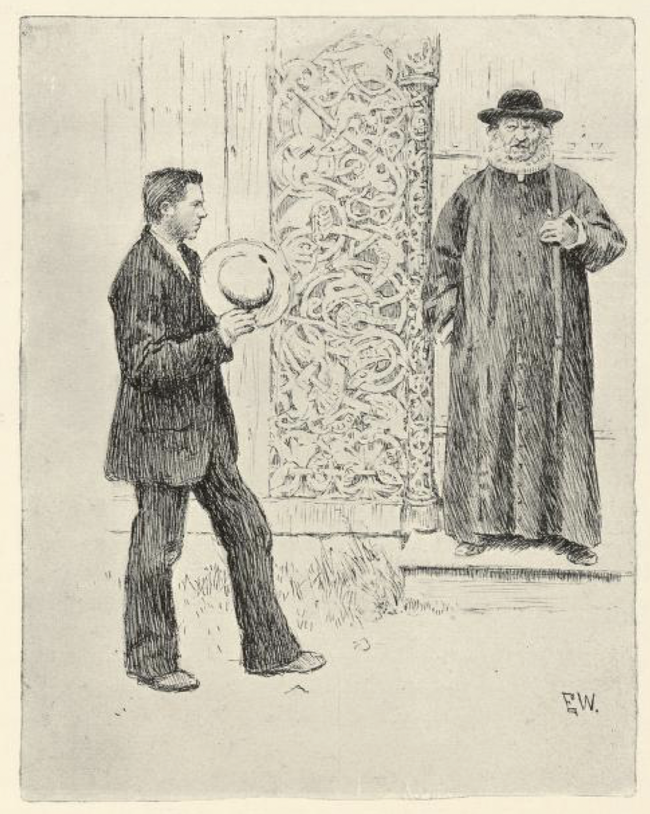
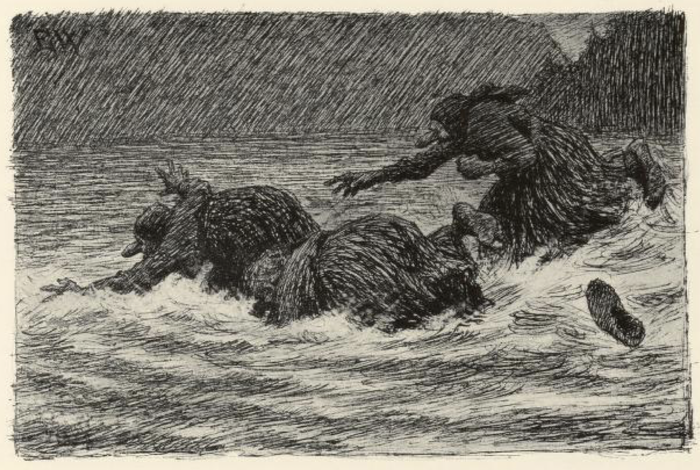
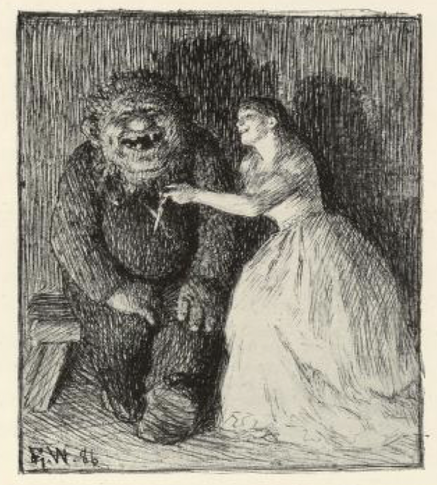
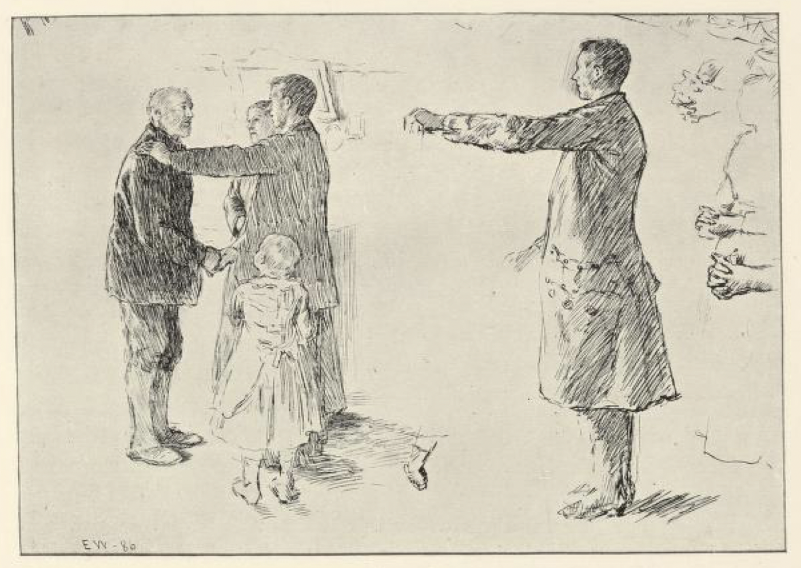
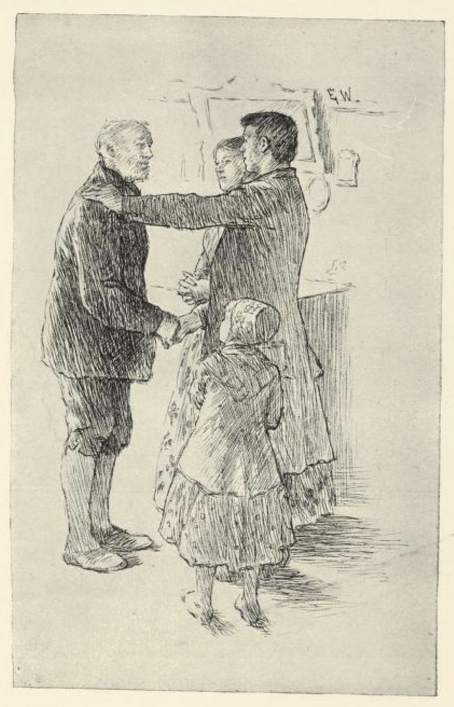
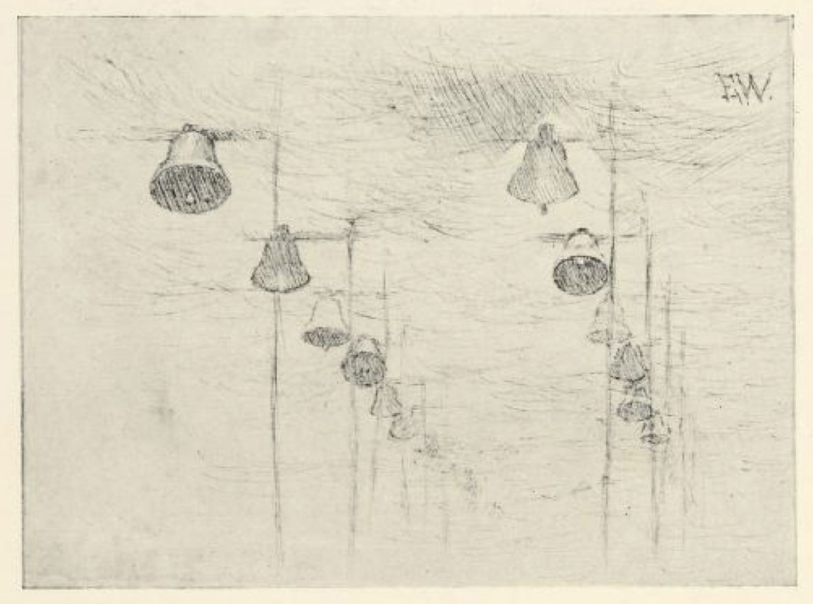
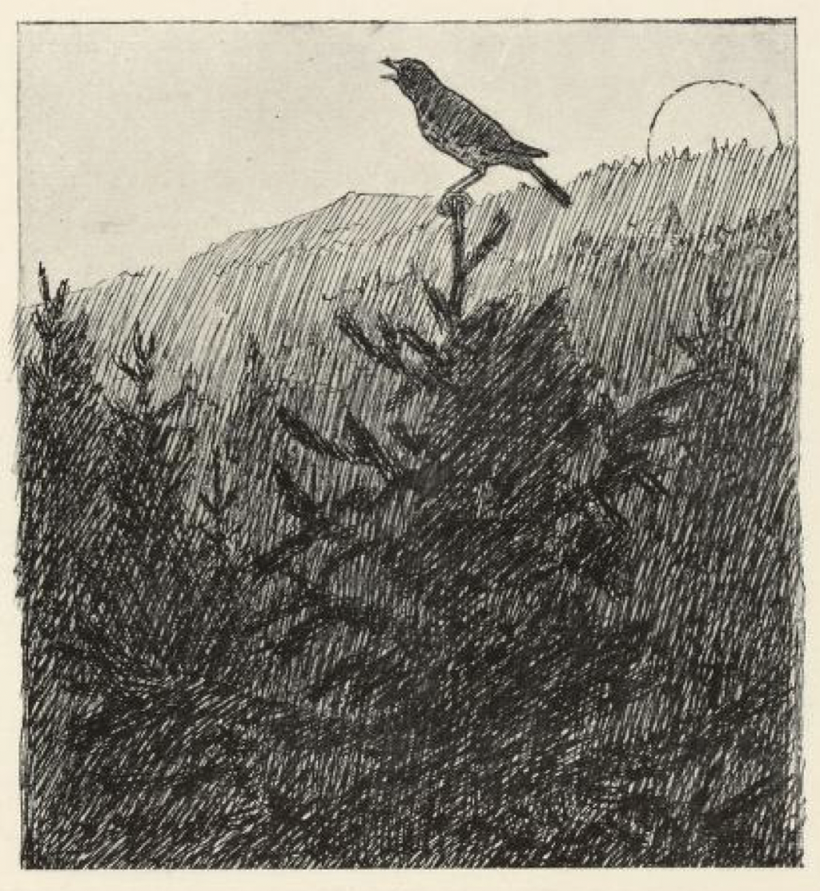

# Følgesvennen

Det var engang en bondegutt som drømte at han skulle få en prinsesse langt borte i landene, og hun var så rød og hvit som melk og blod, så rik at det aldri kunne bli ende på rikdommen hennes. Da han våknet, syntes han hun sto lyslevende for ham enda, og han tykte hun var så fin og deilig, at han ikke kunne være til, om han ikke fikk henne. Så solgte han det han hadde, og reiste ut i verden for å lete henne opp.

Han gikk langt og lengre enn langt, og om vinteren kom han til et land der alle alfarveiene lå ende bent ut og ikke gjorde noen bøyning. Da han hadde vandret like frem et fjerdingjærs tid, kom han til en by, og utenfor kirkedøra lå det en stor isklump som det sto et lik midt i, og den spyttet hele kirkealmuen på, da de gikk forbi den.

Gutten undret seg ved dette, og da presten kom ut av kirka, spurte han ham hva det skulle være til.

«Det er en grov illgjerningsmand,» sa presten; «han er rettet for sin ugudeliggheid skyld og opsatt der til spott og spe.»

«Hva er det han har gjort da?» spurte gutten.

«Her i livet var han vintapper,» sa presten, «og han blandet vinen med vann.»

Det syntes gutten ikke var så farlig gjerning, og når han hadde bøtet for det med livet,» sa han, «kunne de gjerne la ham komme i kristen jord og ha fred etter døden.»

Men det sa presten ikke kunne gå an på noget sett og vis; for der skulle folk til å bryte ham ut av isen, der skulle penger til å kjøpe kristenjord av kirka, graveren skulle ha betaling for graven, kirkeeieren skulle ha for klokkene, klokkeren for sangen, og presten for jordpåkastelsen.

«Tror du det er noen som vil betale alt det for en rettet synder?» spurte han.

«Ja,» sa gutten; «når han bare fikk ham i jorda, skulle han nok betale gravølet, av det vesle han hadde.»

Så brøt de vintapperen ut av isklumpen og la ham i kristen jord; de ringte og sang over ham, og presten kastet jord på, og de drakk gravøl, så de både gråt og lo om hverandre. Men da gutten hadde kostet gravølet, hadde han ikke mange skillingene i lomma.

Han gav seg på veien igjen; men han var ikke kommet langt, før det kom en mann etter ham, som spurte om han ikke syntes det var ødt å gå så alene.

«Nei, det syntes gutten ikke, for han hadde alltid noe å tenke på,» sa han.

Mannen spurte om han ikke ville ha en tjener.

«Nei,» sa gutten, «jeg er vant med å være min egen tjener, derfor trenger jeg ingen; og om jeg aldri så gjerne ville, så har jeg ikke råd til å ha tjener, for jeg har ikke penger til kost og lønn.»

«Tjener trenger du, det vet jeg bedre enn du,» sa mannen, «og du trenger til en tjener du kan lide på i liv og død. Vil du ikke ha meg til tjener, kan du ta meg til følgesvenn; jeg lover deg du skal ha gagn av meg, og det skal ikke koste deg en skilling; jeg skal frakte meg selv, og kost og klær skal det ikke ha noen nød med.»

«Ja, på den måten ville han gjerne ha ham til følgesvenn.»

Siden reiste de sammen, og mannen gikk for det meste foran og viste veien.

Da de hadde reist langt bortigjennom landene over åser og heier, kom de til et tverberg[^*]. Der banket følgesvennen på og bad at de skulle lukke opp. Det lukket seg opp for dem også, og da de kom langt inn i berget, kom troldkjærringen frem med en stol og bød dem: «Vær så snill og sitt ned, De kan være trette,» sa hun.

«Sitt selv!» sa mannen.

Så måtte hun sette seg ned, og da hun hadde satt seg, ble hun sittende der, for stolen var slik, at den ikke slapp det som kom nær den. Imens gikk de omkring i berget, og følgesvennen så seg omkring, til han fikk se et sverd som hang over døra. Det ville han endelig ha, og fikk han det, lovte han troldkjærringen at han skulle slippe henne av stolen.

«Nei,» skreg hun, «bed meg om alt annet! Alt annet kan du få, men ikke det, for det er mitt tresøster-sverd!» — De var tre søstre som eide det sammen.

«Ja så kan du sitte der til verdens ende,» sa mannen.

Men da hun hørte det, sa hun han skulle få det, når han ville løse henne.

Så tok han sverdet og gikk med det, og lot henne sitte der allikevel.

Da de hadde gått langt bort over nakne fjell og vide heier, kom de til et tverberg igjen. Der banket følgesvennen på, og bød at de skulle lukke opp. Det gikk som forrige gang, det lukket seg opp for dem, og da de kom langt inn i berget, kom det frem en troldkjærring med en stol og bad at de skulle sitte ned, de kunne være trette, sa hun.

«Sitt selv,» sa følgesvennen, og så gikk det henne som søster hennes, hun torde ikke annet, og da hun kom på stolen, ble hun sittende der hun sad. Imens gikk gutten og følgesvennen omkring i berget, og han lukket opp alle skap og skuffer, til han fant det han lette etter; det var et gullnøste. Det ville han endelig ha, og han lovte troldkjærringen, at ville hun gi ham det, så skulle han slippe henne av stolen. Hun sa han kunne få alt hun eide, men det ville hun ikke miste, for det var hennes tresøster-nøste. Men da hun hørte det at hun skulle bli sittende der til dommedag, om han ikke fikk det, så sa hun at han fikk ta det likevel, når han bare ville løse henne. Følgesvennen tok det han, men han lot henne bli sittende der hun sad.

Så gikk de mange dager over heier og gjennom skoger, til de kom til et tverberg igjen. Der gikk det like ens som med de to forrige: Følgesvennen banket på; det lukket seg opp, og inne i berget kom det en troldkjærring med en stol og bød dem sitte. Men følgesvennen sa: «Sitt selv,» og så sad hun der. De hadde ikke gått gjennom mange værelser, før han fikk se en gammel hatt, som hang på en knagg bak døra. Den ville følgesvennen ha; men kjærringen ville ikke være av med den, for det var tresøster-hatta hennes, og gav hun den bort, så ble hun rent ulykkelig. Men da hun hørte at hun skulle bli sittende til verdens ende, hvis han ikke fikk den, sa hun han kunne ta den, når hun bare slapp løs.

Da følgesvennen hadde fått hatta, bød han henne bli sittende der hun sad, liksom søstrene hennes.

Langt om lenge kom de til et sund. Da tok følgesvennen gullnøstet og kastet det så hardt mot berget på den andre siden av elva, at det kom tilbake igjen, og da han hadde kastet det noen ganger, ble det bro. Den gikk de over sundet på, og da de var kommet på den andre siden, bad mannen gutten at han skulle nøste tråden opp igjen det forteste han kunne; «for får vi den ikke fort opp, så kommer de tre troldkjærringene og river oss i stykker,» sa han. Gutten nøstet det forteste han orket, og da det ikke var mer igjen enn den siste tråden, kom troldkjærringene rykende; de fløy til vannet, så skodda sto foran dem, og grep etter enden; men de var ikke good for å få fat på den, og så druknet de i sundet.

Da de hadde gått i noen dager til, sa følgesvennen: «Nå kommer vi snart til det slottet hvor hun er prinsessen som du har drømt om, og når vi kommer dit, får du gå inn og si til kongen det du har drømt, og hva det er du reiser etter.» Da de kom frem, gjorde han det, og han ble nokså vel mottatt; han fikk ett rom til seg og ett til tjeneren sin, som de skulle være på, og da det led til den tid de skulle ha mat, ble han budt til middag ved kongens eget bord.

Da han fikk se prinsessen, kjente han henne straks igjen, og så at det var henne han hadde drømt om han skulle få. Han sa henne erended han hadde, og hun svarte at hun likte ham godt, og hun ville gjerne ta ham, sa hun, men først måtte han utsstå tre prøver. Da de hadde spist, gav hun ham en gullsaks, og så sa hun: «Den første prøven er at du skal ta og gjemme den, og gi meg den igjen i morgen middag; det er ikke noen vanskelig prøve, det jeg kan tro,» sa hun og drog på smilet; «men kan du det ikke, så mister du livet, det er loven, og så blir du rettet og lagt på steile[^**] og hodet satt på stake, slik som de frierne som du ser hodeskålene av utenfor vinduene;» der hang mannehoder rundt omkring kongsgården, som det sitter krager på garstaurene om høsten.

Det var vel noen kunst det, tenkte gutten. Men prinsessen var så lystig og vilter, og flokset slik med ham at han glemte både saksen og seg selv, og mens de styret og baset, lurte hun saksen fra ham, så han ikke merket det.

Da han kom opp på kammeret om aftenen, og fortalte hvorledes det hadde gått og det hun hadde sagt og om saksen hun gav ham å gjemme, sa følgesvennen: «Du har vel saksen hun gav deg?» Han kjente i alle lommene sine, men der var ingen saks, og gutten ble mer enn ille ved, da han skjønte den var borte.

«Ja, ja, gi deg til tåls, jeg får prøve å skaffe deg den igjen,» sa følgesvennen, og gikk ned i stalden; der sto det en stor, diger stallbukk som hørte prinsessen til, og den var slik at den kunne flyve mange ganger fortere gjennom lufta, enn den gikk på marken. Så tok han tresøster-sverdet og slo den mellom hornene med, og sa: «Når rider prinsessen til sin kjæreste i natt?» Bukken bræget og sa, det torde den ikke si, men da den fikk en tørn til, sa den at prinsessen skulle komme klokka elleve. Følgesvennen satte tresøster-hatta på seg, og så var han usynlig, og ventet til hun kom.

Da tok hun og smurte bukken med en salve som hun hadde i et stort horn, og sa: «Til veirs, til veirs over mønsås[^***] og kirkespir, over land, over vann, over berg, over dal, til min kjæreste, som venter meg i fjellet i natt!» I det samme bukken satte avsted, slengte følgesvennen seg opp bakpå, og det gikk som en vind gjennom veiret; de var ikke lenge om veien. Rett som det var, kom de til et tverberg; der banket hun på, og så for det ned igjennom fjellet med dem, til trollet som var kjæresten hennes.

«Nå er det kommet en ny frier som vil ha meg, venn min,» sa prinsessen. «Han er ung og vakker; men jeg vil ikke ha noen annen enn deg,» sa hun og gjorde seg lekker for bergtrollet. «Så satte jeg ham på prøve, og der er saksen han skulle gjemme og passe på, pass den nå du!» sa hun.

Så lo de så inderlig godt begge to, som om de alt hadde fått gutten på steile og hjul.

«Ja, jeg skal gjemme den, og jeg skal passe den, og jeg skal sove i brudens arm, når korpen hakker i guttens tarm,» sa trollet, og la saksen i et jernskrin med tre låser for; men i det samme de slapp saksen i skrinet, tok følgesvennen den. Det var ingen av dem som kunne se ham, for han hadde på seg tresøster-hatta, og så låste trollet igjen skrinet for ingenting, og nøklene gjemte han i hullet på den jekskla han hadde tryllverk i; der skulle gutten ha vondt for å finne den, mente han.

Da det led over midnatt, reiste hun hjem igjen. Følgesvennen satte seg bakpå bukken med henne, og de var ikke lenge om hjemveien.

Om middagen ble gutten bedt ned til kongens bord; men da hadde prinsessen slike leie fagter, og så kjønn og så kjeik var hun, at hun nesten ikke ville se til den siden gutten sad.

Da de hadde spist, la hun fjæset riktig i helligdagsfolder, gjorde seg smørblid og sa: «Du har vel kanskje den saksen jeg bad deg gjemme i går?»

«Ja, jeg har så, her er den,» sa gutten, tok den opp, og drev den i bordet, så det hoppet høyt. Prinsessen kunne ikke bli mer ille ved, om han hadde slått saksen i ansiktet på henne. Men hun gjorde seg lekker og blid likevel og sa:

«Siden du har passet så vel på saksen, så kan det ikke være vanskelig for deg å gjemme gullnøstet mitt, og passe på det, så du gir meg det igjen i morgen middag; men har du det ikke, så skal du miste livet og rettes, det er loven,» sa hun.

Det var ikke noen farlig sak det, mente gutten, og tok og puttet gullnøstet i lomma. Men hun tok på å spøke og flokse med ham igjen, så han glemte både seg selv og gullnøstet, og mens de styret og baset som aller best, stjal hun det fra ham, og lot ham gå.

Da han kom opp på kammeret og fortalte hva de hadde sagt og gjort, så spurte følgesvennen: «Du har vel gullnøstet hun gav deg?»

«Ja, det har jeg,» sa gutten og grep i lomma, der han hadde lagt det; men nei, han hadde ikke noget gullnøste, og nå ble han så rent ille ved igjen, at han ikke visste hva han skulle gjøre av seg.

«Ja, ja, slå deg nå til tåls,» sa følgesvennen, «jeg får prøve å få fat på det,» sa han, tok sverdet og hatta, og strøk til en smed og fikk lagt tolv våger jern på sverdet sitt.

Da han kom i stalden, gav han bukken et slag mellom hornene med det, så den tumlet, og så spurte han: «Når rider prinsessen til sin kjæreste i natt?»

«Klokka en, klokka tolv,» bræget bukken.

Følgesvennen satte tresøster-hatta på seg igjen, og ventet til hun kom fykende med smurningshornet og smurte bukken. Så sa hun som første gang: «Til veirs, til veirs, over mønsås og kirkespir, over land, over vann, over berg, over dal, til min kjæreste, som venter meg i fjellet i natt!» I det samme de satte avsted, slengte følgesvennen seg bakpå bukken, og det gikk som en vind bortigjennom veiret. Rett som det var, kom de til trollberget, og da hun hadde slått tre slag, for de inn igjennom det til trollet som var kjæresten hennes.

«Hvorledes har du gjemt gullsaksen jeg gav deg i går, vennen min?» sa prinsessen. «Frieren hadde den og gav meg den igjen,» sa hun.

Det var rent uråd, sa trollet, for han hadde låst den ned i et skrin med tre låser og gjemt nøkkelen i hullet på jekskla sin. Men da de låste opp og så etter, hadde trollet ikke noen saks i skrinet. Så fortalte prinsessen at hun hadde gitt frieren gullnøstet sitt.

«Her er det,» sa hun, «jeg tok det fra ham igjen, så han ikke merket det; men hva skal vi nå finne på, siden han kan slike kunster?»

Ja, trollet visste ikke riktig; men da de hadde tenkt seg litt om, fant de på at de skulle gjøre opp en stor varme og brenne gullnøstet, så var de sikre på at han ikke kunne få det. I det samme hun kastet det til varmen, sto følgesvennen ferdig og grep det, og ingen av dem så det, for han hadde tresøster-hatta på seg.

Da prinsessen hadde vært hos trollet en stund, og det begynte å lide mot morgenen, reiste hun hjem igjen; følgesvennen satte seg bakpå bukken med henne, og det gikk både fort og vel.

Da gutten var bedt til middags, gav følgesvennen ham nøstet. Prinsessen var enda mer kjønn og kaut enn forrige middagen, og da de hadde spist, snerpoet hun munnen sammen og sa: «Det var vel ikke så vel at jeg kunne få igjen gullnøstet mitt, som jeg gav deg å gjemme i går.»

«Jo,» sa gutten, «det skal du få, her er det,» sa han, og slo det i bordet, så bordet hoppet og kongen skvatt høyt i veiret.

Prinsessen ble så blek som et lik. Men hun gjorde seg snart blid igjen, og sa at det var godt gjort; nå hadde hun bare en liten prøve til. «Dersom du nå er så flink at du kan skaffe meg det jeg tenker på, til i morgen middag, så skal du både få ta meg og ha meg,» sa hun.

Gutten ble som om han var avdømt med livet; for han syntes, det var ikke råd å vite hva hun tenkte på, og enda mer uråd å skaffe det, og da han kom opp på kammeret sitt, var det nesten ikke mulig å stagge ham heller. Følgesvennen sa at han skulle være rolig; han skulle nok få greie på saken, slik som han hadde gjort begge de forrige gangene; og gutten slo seg endelig til ro og la seg til å sove.

Imens for følgesvennen til smeden og fikk lagt på sverdet sitt fire og tyve våger jern, og da det var gjort, gikk han til stalden og drev til bukken mellom hornene, så den tumlet vegimellem.

«Når skal prinsessen til sin kjæreste i natt?» sa han.

«Klokka ett,» bræget bukken.

Da det led mot tiden, sto følgesvennen i stalden med tresøster-hatta på, og da hun hadde smurt bukken og sagt som hun pleide, at de skulle fare til veirs, til kjæresten hennes som ventet henne i fjellet, gikk det avsted gjennom veir og vind igjen, og følgesvennen sad bakpå. Men han var ikke lethåndt denne gangen, for rett som det var, gav han prinsessen en tørn her og en der, så han mest helseslo henne. Da de kom til bergveggen, banket hun på porten, så den åpnet seg, og de for inn gjennom fjellet til kjæresten hennes.

Da hun kom frem, jamret hun seg for ham, bar seg ille og sa, hun visste ikke om veiret kunne være så hardt; men hun syntes det var noen med som slo både henne og bukken, og hun var visst både gul og blå over hele sin kropp, så ille hadde hun fart på veien. Og så fortalte hun at frieren hadde skaffet gullnøstet også; hvorledes det gikk til, kunne hverken hun eller trollet skjønne.

«Men vet du hva jeg nå har funnet ut?» sa hun.

«Nei, det kunne trollet ikke vite.»

«Jo,» svarte hun, «jeg har sagt at han skulle skaffe meg det som jeg tenkte på, til i morgen middag, og det var hodet ditt. Tror du han kan skaffe det, venn min?» sa prinsessen og kjelte for trollet.

«Det tror jeg inte,» sa trollet, og det svor han på, og så lo han og skogret verre enn en gast, og både trollet og prinsessen tenkte at gutten før skulle komme til å kle steile og hjul, og at ravnen skulle hakke hans øyne ut, før han kunne skaffe hodet til trollet.

Da det led på morgensiden, skulle hun hjem igjen; men hun var redd, sa hun, for hun syntes det var noen etter henne, og hun torde ikke reise hjem alene; trollet måtte følge henne på hjemveien. Ja, han skulle følge henne, og han fikk frem bukken sin, for han hadde maken til prinsessens, og smurte den og salvet den vel mellom hornene også. Da trollet hadde satt seg på, hengte følgesvennen seg bakpå med ham, og så bar det avsted bort gjennom lufta til kongsgården. Men på veien slo følgesvennen trollet og bukken og gav dem tørn på tørn og slag i slag med sverdet sitt, så de dalte mer og mer, og til sist var de nesten på vei til å synke ned i havet som de for over. Da trollet skjønte det var så galt ute, fulgte han prinsessen like hjem i kongsgården, og sto igjen utenfor, for å se hun kom godt og vel hjem. Men i det samme hun lukket døra etter seg, hugg følgesvennen hodet av trollet, og strøk opp på kammeret til gutten.

«Her er det som prinsessen tenkte på,» sa han.

Ja, det var både godt og vel, kan en vite, og da gutten ble bedt ned til bords og de hadde spist, var prinsessen så blid som en lerke.

«Du har kanskje det jeg tenkte på?» sa hun.

«Jamen har jeg det,» sa gutten, han rev det frem under kjoleflakt sitt, og slo det i bordet, så bordet og hele stellet reiste over ende. Prinsessen ble som hun hadde ligget i jorda; men hun kunne ikke nekte at det var det hun hadde tenkt på, og nå måtte han få henne, som hun hadde lovt. Så ble det drukket bryllup, og det ble stor glede over hele kongeriket.

Men følgesvennen tok gutten til side, og sa til ham at han nok kunne lukke sine øyne og late som han sov om brudenatten, men hvis han hadde livet kjært og ville lyde ham, da måtte han ikke la det komme en blund på dem, før han hadde skilt henne ved trollhamma hun hadde på, og den skulle han piske av henne med riset av ni nye bjerkelimer, og så skille av henne i tre kar med melk; først skulle han skrubbe henne i et kar med fjorgammel myse[^****], så skulle han gni henne i surmelk, og så skulle han skylle henne av i et sødmelkskar; limerne lå under senga, og karrene hadde han satt i kroken; det var ferdig altsammen. Ja, gutten lovte han skulle lyde ham og gjøre som han sa.

Da de var kommet i brudesenga om kvelden, lot gutten som om han la seg til å sove. Prinsessen reiste seg opp på albuen og så på ham, om han sov, og kilte ham under nesa. Gutten sov like godt. Så lugget hun ham i håret og i skjegget. Men han sov som en stokk, trodde hun. Så drog hun frem en stor slakterkniv under hodeputa og ville hakke hodet av ham. Men gutten for opp, slo kniven av hånda på henne, og grep henne i håret. Så pisket han henne med risene, og slet dem opp på henne, til det ikke var en pinne igjen. Da det var gjort, kastet han henne i mysekarret, og da fikk han se hva hun var for et dyr; hun var svart som en ravn over hele kroppen; men da han hadde skrubbet henne i myse, og skuret henne med surmelk, og skyllet henne opp i sødmelk, var trollhamma gått av henne, og hun var så blid og deilig, at hun aldri hadde vært så deilig før.

Den andre dagen sa følgesvennen at de måtte reise. Ja, gutten var reiseferdig, og prinsessen også, for hjemmegiftet hadde for lenge siden vært i stand. Om natten førte følgesvennen alt det gullet og sølvet og alle de kostbarhetene som var igjen etter trollet i fjellet, til kongsgården, og da de skulle reise om morgenen, var det så fullt overalt i hele gården, at de mest ikke kunne komme frem; det hjemmegiftet var mer verdt enn kongens land og rike, og de visste ikke hvorledes de skulle få fraktet det med seg. Men følgesvennen visste råd for uråd. Det var igjen seks slike bukker etter trollet, som kunne flyve i lufta. Dem lesset og ladet de så med gull og sølv, at de måtte gå etter marken og ikke orket å lette seg og flyve med det, og det som bukkene ikke var i stand til å bære, måtte bli igjen i kongsgården. Så reiste de langt og lengre enn langt, men til sist ble bukkene så trette og opgitt at de ikke orket å gå lengre.

Gutten og prinsessen visste ingen råd, men da følgesvennen så at de ikke kunne komme avsted, så tok han hele hjemmegiftet på nakken, la bukkene ovenpå, og bar det så langt frem at det ikke var mer enn en god halv mil dit hvor gutten hadde hjemmet sitt. Så sa følgesvennen: «Nå må jeg skilles fra deg; jeg kan ikke bli med deg lengre.» Men gutten ville ikke skilles fra ham, han ville ikke miste ham hverken for lite eller mye. Ja, så ble han med en halv mil til, men lengre kunne han ikke følge, og da gutten bad og nødde ham, at han skulle følge med hjem og bli hos ham, eller i det minste være med og ture hjemkommerøl hos far hans, sa følgesvennen, nei, det kunne han ikke.

Så spurte gutten hva han skulle ha, for det han hadde vært med og hjulpet ham.

«Skulle det være noe, måtte det være halvdelen av alt det han avlet i fem år,» sa følgesvennen.

«Ja det skulle han få.»

Da han var borte, la gutten igjen all rikdommen sin, og reiste tomreps hjem. Så turte de hjemkommerøl, så det både hørtes og spurtes over syv kongeriger, og da de var ferdig med det, fikk de vinterdrift all vinteren både med bukkene og med de tolv hestene som far hans hadde, før de fikk kjørt hjem alt gullet og sølvet.

Om fem år kom følgesvennen igjen og skulle ha sin del. Da hadde mannen delt alt i to like deler.

«Men det er én ting som du ikke har delt,» sa følgesvennen.

«Hva er det?» sa mannen; «jeg trodde jeg hadde delt alt.»

«Du har avlet et barn,» sa følgesvennen; «det får du også dele i to deler.»

Ja, det var så det. Han tok sverdet; men med det samme han løftet det og skulle kløve barnet, grep følgesvennen bak i sverdodden, så han ikke kunne hugge.

«Ble du ikke glad nå, du ikke fikk lov å hugge?» sa han.

«Jo, så glad har jeg aldri vært,» sa mannen.

«Ja, så glad var jeg, da du løste meg ut av isklumpen,» sa han. «Behold alt det du har; jeg trenger ikke til noe, for jeg er en svevende ånd,» sa han.

Han var vintapperen som sto i isklumpen utenfor kirkedøra, som alle spyttet på; og han hadde vært hans følgesvenn og hjulpet ham, fordi han gav det han hadde, for å skaffe ham fred og få ham i kristenjord.

Han hadde fått lov til å følge ham et år, og det var omme, da de skiltes siste gangen. Så hadde han fått lov til å se til ham igjen. Men nå måtte de skilles for alle tider, for nå ringte det etter ham med himmeriges klokker.

[^*]: Tverberg: berg som er åpent på tvers/siden

[^**]: Steile: henrettelse på hjul og stake

[^***]: Mønsås: møne og ås, takrygger på hus

[^****]: Myse: valle, det som blir igjen etter at melk er til ost

