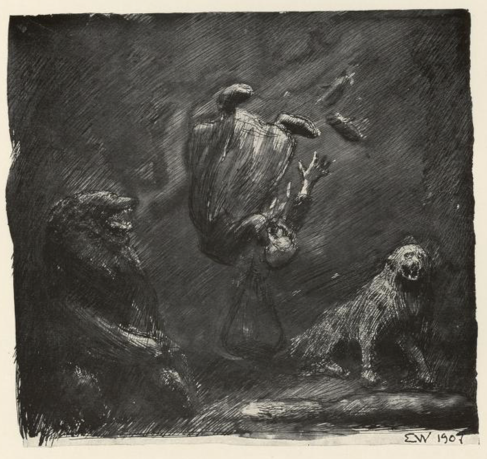
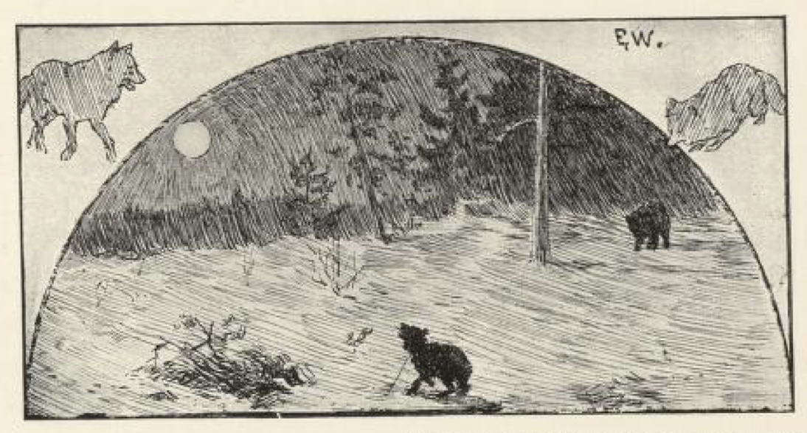

# Han far sjøl i stua

Det var engang en mann som bodde borte i en skog. Han hadde så mange sauer og gjeter; men aldri kunne han ha dem i fred for gråbeina[^*]. «Jeg skal vel lure den gråtassen,» sa han til sist, og gav seg til å grave en ulvestue[^**]. Da han hadde gravet dypt nok, satte han en stolpe midt ned i ulvestua, og på den stolpen slo han en skive, og på den skiva satte han en liten hund, og over graven la han kvist og bar og annet rusk, og ovenpå det strødde han snø, for at tassen ikke skulle se der var en grav under.

Da det led utpå natten, ble den vesle hunden lei av å stå der. «Vov, vov, vov!» sa den, og gjøyde mot månen. Så kom det en rev lakkende og lakkende, og tenkte han riktig skulle gjøre marked, og så gjorde han et hopp — lukk ned i ulvestua.

Da det led litt lenger utpå natten, så ble den vesle hunden så lei og så sulten, og så tok den på å gjø og gneldre: «Vov, vov, vov!» sa den. Rett som det var, kom det en gråbein tassende og tassende; han tenkte nok han skulle hente seg en fet steg, og så gjorde han et hopp — lukk ned i ulvestua.

Da det led udi grålysninga om morgenen, kom nordensnøen, og det ble så kaldt at den vesle hunden sto og frøs og skalv, og så var den så trøtt og sulten: «Vov, vov, vov, vov!» sa den og gjøyde i ett vekk. Så kom det en bjørn labbende og labbende bortetter, og husket på seg, og tenkte han skulle nok få seg en godbit på morgenkvisten; så husket han i vei ut på kvistene — lukk ned i ulvestua.

Da det led litt lenger ut på morgensida, kom det gående en gammel fantekjerring[^***], som slang gårdimellom med en pose på ryggen. Da hun fikk øye på den vesle hunden som sto der og gjøyde, måtte hun bort og se om der var kommet dyr i ulvestua om natten. Ja, hun la seg på knærne og kikket nedi.

«Er du kommet i fella nå, Mikkel?» sa hun til reven, for ham så hun først; «tilpass til deg, din hønsetyv! — Du og, gråtass?» sa hun til gråbeina; «har du revet geit og sau, så blir du nå pint og peiset død! — Eia meg da, bamse, sitter du også i stua, din merrflåer? Ja, deg skal vi rispe, og deg skal vi flå, og skallen din skal vi på buveggen slå!» skrek kjerringa, og var så rent opp i været og hyttet til bjørnen; men i det samme falt posen frem over hodet på henne, og kjerringa røyk — lukk ned i ulvestua.

Så satt de der og glodde på hverandre alle fire, hver i sin krok: Reven i det ene hjørnet, gråbeina i det andre, bjørnen i det tredje, og kjerringa i det fjerde.

Men da det ble riktig lyst, begynte Mikkel å riste på seg, og så vimset han omkring, for han tenkte vel han skulle prøve å komme ut. Men så sa kjerringa: «Kan du ikke sitte rolig du da, din sviverøv! og ikke gå slik og svinse og svanse? Se bare på han far sjøl i stua, han sitter så stø som en prest,» — for nå tenkte hun at hun skulle prøve å gjøre seg godvenner med bjørnen.

Men så kom mannen som eide ulvestua. Først drog han opp kjerringa, og så slo han i hjel alle dyrene, og han sparte hverken han far sjøl i stua eller tassen eller Mikkel sviverøv. Den natten syntes han at han hadde gjort et godt kast.

[^*]: Gråbeina = ulv

[^**]: Ulvestue = felle for å fange ulv

[^***]: Fantekjerring = omstreifende tiggerske
