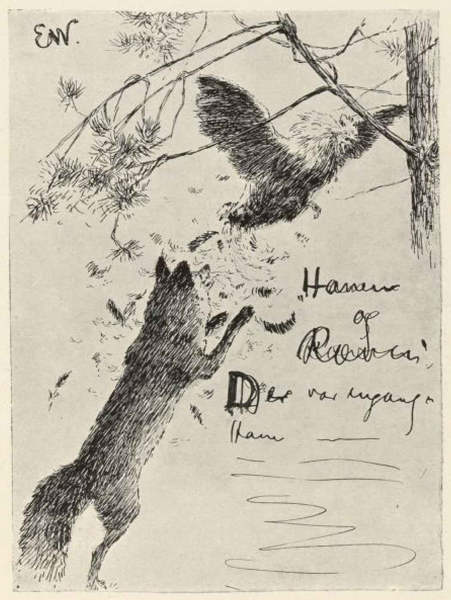
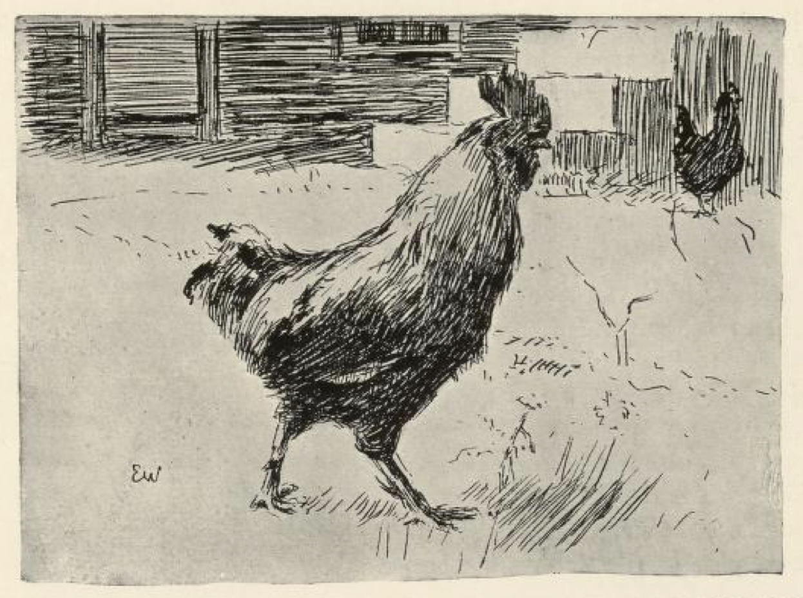

# Hanen og reven

Det var engang en hane som sto på en møkhaug og gol og flakset med vingene. Så kom reven til den.

« God dag! » sa reven. « Jeg hørte nok du gol, » sa han, « men kan du også stå på ett ben og gale og blunde, så som far din kunne, » sa Mikkel.

« Det kan jeg både godt og vel, » gol hanen, og sto på ett ben, men han blundet bare på det ene øyet, og da han hadde gjort det, så brisket han seg og slo med vingene, som om han hadde gjort noe stort.

« Det var vakkert, » sa reven; « det er mestlikt så vakkert som når presten messer i kirka. Men kan du også stå på ett ben og gale og blunde med begge øynene på én gang? Det tror jeg knapt du kan! » sa Mikkel. « Nei far din, det var kar til mann, » sa han.

« Å jeg kan da det, jeg med, » sa hanen, og sto på ett ben og blunket på begge øynene og gol. Hui! satte reven på ham, tok ham over nakken og slengte ham på ryggen, så han ikke fikk galt ut, før det bar til skogs med ham, så fort Mikkel orket å springe.

Da de kom under en gammel kvisteran, slengte Mikkel hanen i bakken, satte foten på brystet hans og ville ta seg en smakebite.

« Du er ikke så gudfryktig du, Mikkel, som far din, » sa hanen; « han korset seg og bad for maten han, » sa han.

Men Mikkel ville da være gudfryktig — bevares vel. Så slapp han taket og skulle til å legge labbene i kors og lese. Vips! fløy hanen opp i et tre.

« Du skal nok ikke slippe for det, » sa Mikkel ved seg selv; gikk så bort og kom igjen med et par skårefleiser[^*] etter tømmerhogger. Hanen kikket og kikket etter hva det kunne være.

« Hva har du der? » sa han.

« Det er brev jeg har fått fra paven i Roma, » sa reven; « vil du ikke hjelpe meg å lese dem, for jeg er ikke brevsynt[^**] selv. »

« Jeg ville så gjerne, men jeg tør ikke nå, » sa hanen. « Der kommer en skytter; jeg sitter bak leggen; jeg ser'n, jeg ser'n! » sa han.

Da reven hørte at hanen klunket om skytteren, satte han til sprang det forteste han kunne.

Den gang var det hanen som brukte revekroken[^***].

[^*]: Skårefleiser: fliser av tre, trespanl

[^**]: Brevsynt: som kan lese

[^***]: Revekroken: å lure, å være listig som en rev
