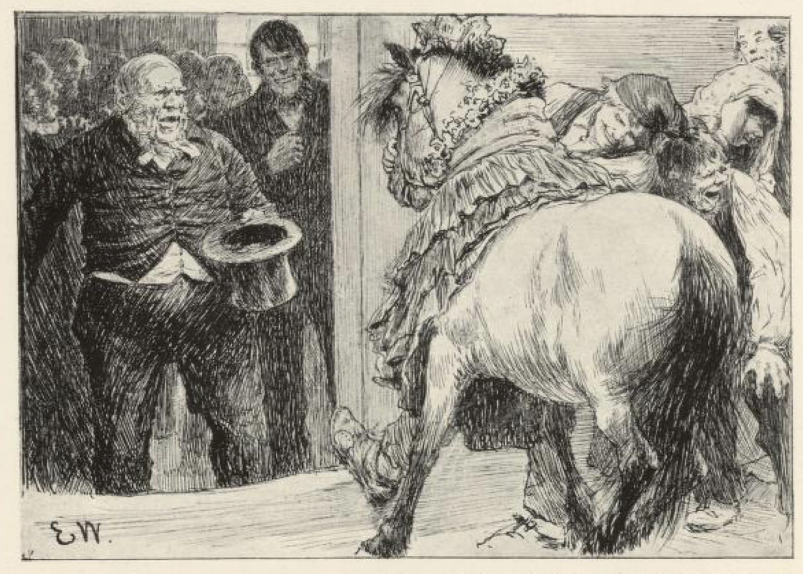

# Herremannsbruden

Det var engang en rik kakse[^*] som eide en stor herregård, og sølv hadde han på kistebunnen og penger på rente; men noe var det som vantet ham, for han var enkemann. En dag var datteren fra nannegården hos ham på arbeide. Henne likte herremannen riktig godt, og da hun var fattigfolks barn, tenkte han, at når han bare klunket om gifting, så måtte hun slå til med det samme. Så sa han til henne at han var kommet i tanker om å gifte seg igjen.

«Ja, ja, en kan falle på så mye,» sa jenta, hun sto der og smålo, og tenkte den gamle styggen kunne ha falt på det som høvde bedre for ham enn å gifte seg.

«Ja det var meningen det at du skulle bli kona mi da,» sa herremannen.

«Nei, ellers takk!» Var det likt seg det, mente hun.

Herremannen var ikke vant ved å høre nei, og dess nødigere hun ville ha ham, dess mer opsatt ble han på å få henne. Men da han ikke kom noen vei med henne, så sendte han bud etter far hennes, og sa til ham, at kunne han lage det så at han fikk henne, så skulle han gi ham etter de pengene han hadde lånt, og på kjøpet skulle han få det jordstykket som lå opp til enga hans. Ja, han skulle nok få rett på datteren, mente faren. «Hun er bare barnet og skjønner ikke sitt eget beste,» sa han.

Men alt han snakket for datteren, både vel og ille, så hjalp det ikke. Hun ville ikke ha herremannen, «om han så satt i malt gull til opp under ørene,» sa hun.

Herremannen ventet dag etter dag, men så ble han til sist harm og utålmodig, og så sa han til far til jenta, at om han skulle stå ved det han hadde lovt, så fikk han slå et slag i saken nå; for han ville ikke vente lenger.

Mannen visste ikke noen annen råd, sa han, enn at herremannen fikk lage alt i stand til bryllup, og når presten og bryllupsfolket var kommet, så fikk han sende bud etter jenta, som om det var et arbeid hun skulle være med på; og når hun kom, måtte hun bli viet i en snarvending, så hun ikke fikk tid til å områ seg.

Dette syntes herremannen var både godt og vel, og så lot han brygge og bake og lage til bryllup, så det hadde god skikk.

Da gjestebudsfolket var kommet, ropte herremannen på en av guttene sine, og sa til ham at han skulle stryke ned til nannermannen sør i gården og be ham at skikke det han hadde lovt. «Men er du ikke her igjen på flyende timen,» sa han og hyttet til ham med neven, «så skal vel —!» Mer fikk han ikke sagt, for gutten for av sted som han var brent.

«Jeg skulle hilse fra husbond og be om det du har lovt ham,» sa gutten til mannen sør i gården; «men det måtte være i røde rappet, for han har det farlig brått i dag,» sa han.

«Ja, ja, spring ned i enga og ta henne med deg, der går hun,» sa nannemannen.

Gutten av sted. Da han kom ned i enga, gikk datteren der og raket. «Jeg skulle hente det som far din har lovt husbond,» sa gutten.

«Ha ha, lur meg der!» tenkte hun. «Nei, skal du det?» sa hun; «det er vel den vesle blakke hoppa vår det? Du får gå bort og ta henne, hun står tjoret på den andre siden av erteåkeren,» sa jenta. Gutten kastet seg på ryggen av den vesle blakke og red hjem i fullt firsprang.

«Fikk du henne med deg?» sa herremannen.

«Hun står nede ved døra,» sa gutten.

«Så lei henne opp på kammeret etter mor,» sa herremannen.

«Kjære vene, hvorledes skal det gå til?» sa gutten.

«Du bare gjør som jeg sier, du,» sa herremannen. «Magter du henne ikke alene, så får du ta folkehjelp,» sa han; han tenkte jenta kunne slå seg ugrei.

Da gutten så fjesset til herremannen, så visste han det ikke nyttet å si imot der i gården. Han ned og fikk med alle de husmennene som var der; noen trakk i fremdelen, og noen skjøv på bak, og så fikk de endelig hoppa opp over trappene og inn i kammeret. Der lå brudestasen ferdig.

«Nå har jeg gjort det og, husbond,» sa gutten; «men det var et farlig strev, det verste jeg har hatt her på gården.»

«Ja ja, du skal ikke ha gjort det for ingenting,» sa husbonden. «Send så kvinnfolkene opp til å pynte henne.»

«Nei men kjære vene da!» sa gutten.

«Ikke noe prat! De skal pynte henne og hverken glemme krans eller krone,» sa husbonden. Gutten ned i kjøkkenet.

«Hør nå, jenter,» sa han; «nå skal dere opp og pynte den vesle blakke til brud; husbond vil nok gi gjestebudsfolket noe å flire av.»

Ja, jentene hengte på den vesle blakke alt det de hadde, og så gikk gutten ned, og sa at nå var hun ferdig, og det både med krans og krone.

«Godt og vel, kom med henne!» sa husbonden; «jeg skal selv ta imot henne i døra,» sa han.

Det ramlet svært i trappa; for hun steg ikke ned i silkesko, den bruden. Men da døra gikk opp og herremannsbruden kom inn i storstusalen, var det ikke fritt for der ble knis og flir. Og herremannen var så vel fornøyd av den bruden, at de sa han ikke fridde oftere.

[^*]: Kakse = en rik og innbilsk person
