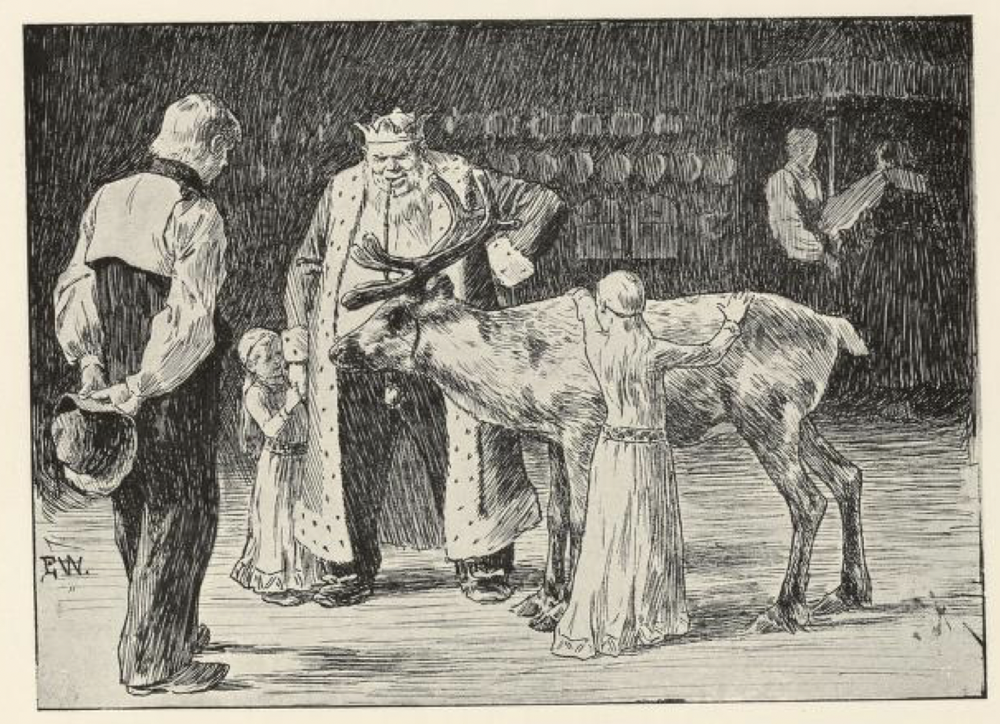
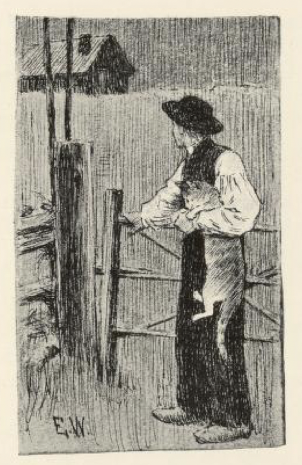
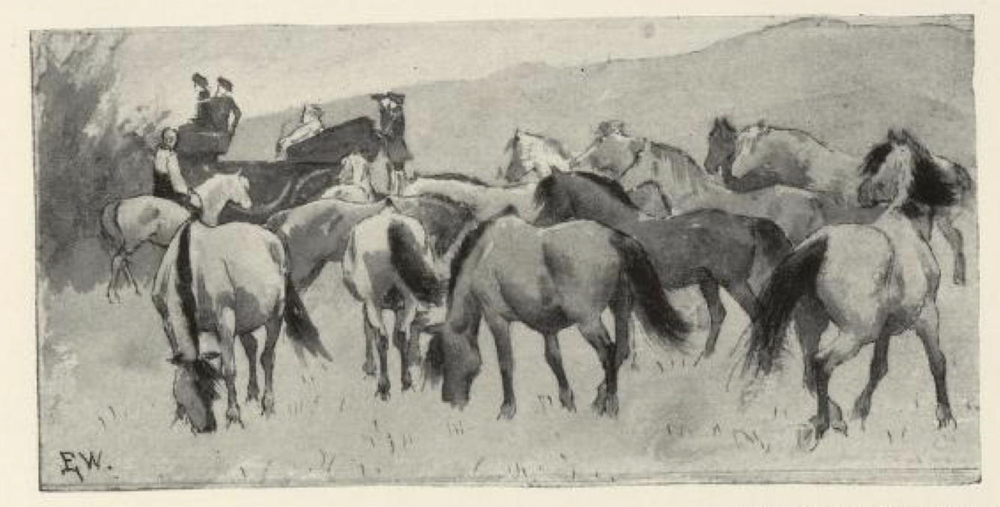

# Herreper

Det var engang et par fattige folk; de hadde ingenting unnet tre sønner. Hva de to eldste het, det vet jeg ikke, men den yngste het Per. Da foreldrene var døde, skulle barna arve dem, men det var ikke annet å få enn en gryte, en takke og en katt. Den eldste, som skulle ha det beste, han tok gryten: « Når jeg låner bort gryden, så får jeg alltid lov å skrape den, » sa han. Den andre tok takken: « For når jeg låner bort takken, får jeg alltid en smakelefsje, » sa han. Men den yngste han hadde ikke noe å velge imellom; ville han ha noe, så måtte det bli katten. « Om jeg låner katten bort, så får jeg ikke noe for henne, jeg, » sa han; « får katten en melkeskvet, så vil hun ha den selv. Men jeg vil ta henne med meg likevel; det er synd hun skal gå her og sette til. »

Så drog brødrene ut i verden for å prøve sin lykke, og hver tok sin vei. Men da den yngste hadde gått en stund, sa katten: « Du skal nok få like for det du ikke ville jeg skulle bli igjen i den gamle stua og sette til. Nå skal jeg gå bort i skogen jeg, og få fatt på noen rare dyr, så skal du gå opp på kongsgården, som du ser der borte, til kongen, og si at du nok kommer med en liten sending til ham. Når han da spør hvem den er fra, skal du si den er fra han Herreper. »

Ja, Per hadde ikke ventet lenge, så kom katten med et rensdyr fra skogen; den hadde fløyet opp i hodet på rensdyret, og da hun hadde satt seg imellom hornene på det, sa hun: « Går du ikke like til kongsgården, så klorer jeg øynene ut på deg. » Rensdyret torde da ikke annet.

Da nå Per kom til kongsgården, gikk han inn i kjøkkenet med rensdyret, og sa: « Jeg kommer med en liten sending til kongen jeg, om han ikke vil forsmå den. »

Kongen kom ut i kjøkkenet, og da han så det store gilde rensdyret, ble han vel glad. « Men kjære min venn! hvem er det som sender meg så gjev en sending da? » sa kongen.

« Å den kommer nok fra han Herreper, » sa gutten.

« Han Herreper? » sa kongen; « hvor skal jeg nå si han bor henne? » — for han syntes det var skam at han ikke skulle kjenne så bra en mann. Men det ville gutten slett ikke si ham; han torde ikke det for husbonden sin, sa han. Så gav kongen Per mange drikkepenger, og bad ham hilse så flittig hjemme og si mange takk for sendingen.

Den andre dagen gikk katten igjen i skogen, og fløy opp i hodet på en hjort, satte seg mellom øynene på den og truet den til å gå til kongsgården. Der gikk Per inn i kjøkkenet med den igjen, og sa at han nok kom med en liten sending til kongen, om han ikke ville forsmå den. Kongen ble enda gladere i hjorten, enn han hadde vært i rensdyret, og spurte igjen hvem det var som kunne skikke ham så gjev en sending. « Den er nok fra han Herreper, » sa gutten; men da kongen ville vite hvor Herreper bodde, fikk han samme svaret som dagen før, og den gangen fikk Per enda flere drikkepenger.

Tredje dagen kom katten med et elgsdyr. Da så Per kom inn i kjøkkenet i kongsgården, sa han at han hadde nok en liten sending til kongen, om han ikke ville forsmå den. Kongen kom straks ut i kjøkkenet, og da han fikk se det store gilde elgsdyret, ble han så glad at han ikke visste hva fot han skulle stå på, og den dag gav han Per enda mange, mange flere drikkepenger: det var visst hundre daler. Han ville endelig vite hvor han Herreper bodde, og grov og spurte både om det ene og det andre; men gutten sa at han slett ikke torde si ham det for husbonden sin, for han hadde nektet det, og det både hardt og strengt.

« Så bed Herreper at han besøker meg, » sa kongen.

« Ja det skulle gutten gjøre, » sa han.

Men da han kom ut av kongsgården igjen og traff katten, sa han: « Jo, du har stelt meg på et godt trav du; nå vil kongen jeg skal besøke ham, og jeg har jo ikke annet enn de fillene jeg står og går i. »

« Å, vær ikke redd for det, » sa katten; « om tre dager skal du få hester og vogn og så gilde klær at gullet skal dryppe av deg; så kan du nok besøke kongen. Men alt du ser hos kongen, skal du si, du har det mye gildere og finere hjemme; det må du ikke glemme. »

Nei, det skulle nok Per komme i hug, mente han.

Da nå de tre dagene var omme, kom katten med vogn og hester og klær og alt Per behøvde; altsammen var det så gildt at ingen hadde sett slikt før. Så reiste han, og katten sprang med. Kongen tok både godt og vel imot ham; men hva kongen bød ham og hva han viste ham, sa Per, det kunne være bra nok, men han hadde det enda finere og gildere hjemme. Kongen likte ikke dette mer enn så som så; men Per ble ved sitt; og til sist ble kongen så sint at han ikke kunne styre seg lenger. « Nå vil jeg være med deg hjem, » sa kongen, « og se om det er sant, at du har det så mye bedre og gildere. Men lyver du, så nåde deg, jeg sier ikke mer jeg! »

« Jo du har stelt meg på et godt trav, » sa Per til katten; « nå vil kongen være med meg hjem; men mitt hjem det er nok ikke greit å finne det. »

« Å, bry deg ikke om det, » sa katten; « reis du bare etter der jeg springer foran. »

Så reiste de, først Per, som kjørte etter der katten løp foran, og så kongen med alle sine.

Da de nå hadde kjørt et godt stykke, kom de til en stor, digger flok med vakre sauer; de hadde ull så lang at den mest nådde til jorden.

« Vil du si at den saueflokken er hans Herreper, når kongen spør deg, skal du få denne sølvskjeen, » sa katten til gjeteren; den hadde hun tatt med fra kongsgården.

« Ja, det ville han gjerne gjøre. »

Da så kongen kom, sa han til gjetergutten: « Nå har jeg aldri sett så stor og vakker en saueflok! Hvem eier den, vesle gutten min? »

« Det er nok hans Herreper, » sa gutten.

Om litt kom de til en stor, stor flok vakre brandede kyr; de var så fete at det glinset i dem.

« Vil du si at den bølingen[^*] er hans Herreper, når kongen spør deg, skal du få denne sølvøsen, » sa katten til gjæterjenta — sølvøsen hadde hun også tatt med seg fra kongsgården.

« Ja gjerne det, » sa gjæterjenta.

Da så kongen kom, ble han rent forundret over den store gilde bølingen; for så vakker en bøling syntes han aldri han hadde sett før, og så spurte han jenta som gikk og gjette, hvem som eide den brandede buskapen der?

« Å, det er han Herreper, » sa jenta.

Så reiste de litt igjen; og så kom de til en stor, stor flok med hester; det var de vakreste hester en kunne se, store og fete, og seks av hver farge, både røde og blakke[^**] og blå.

« Vil du si at den hestedriften er hans Herreper, når kongen spør deg, skal du få dette sølvstøpet, » sa katten til gjeteren — støpet hadde hun også tatt med fra kongsgården.

« Ja, det ville han nok, » sa gutten.

Da så kongen kom, ble han rent opp i unda over den store gilde hestedriften; for slike hester hadde han aldri sett maken til, sa han. Han spurte da gjetergutten hvem de røde og blakke og blå hestene hørte til.

« Det er nok hans Herreper, » sa gutten.

Da de så hadde reist et drygt stykke til, kom de til et slott; først var der en port av messing, så en av sølv, og så en av gull; selve slottet var av sølv, og så blankt at det skar i øyne, for solen skinte på det idet de kom. Der gikk de inn, og der sa katten at Per skulle si han bodde. Inneni var slottet enda gildere enn utenpå: alt var av gull, både stoler og bord og benker. Da kongen nå hadde gått omkring og sett på alt, både høyt og lavt, ble han ganske skamfull. « Jo, han Herreper har det gjevere enn jeg, det kan ikke nytte å nekte det, » sa han; og så ville han til å reise igjen. Men Per bad ham bie og spise til kvelds med seg, og det gjorde da kongen, men sur og gråten var han hele tiden.

Mens de satt til bords, kom trollet som eide slottet, og banket på porten. « Hvem er det som spiser min mat og drikker min mjød som svin her inne? » ropte trollet.

Straks katten hørte ham, løp hun ut til porten.

« Bi litt, skal jeg fortelle deg hvorledes bonden bærer seg ad med vinterrugen, » sa katten. « Først så kjører bonden åkeren sin, » sa hun; « så møker han, og så kjører han den igjen. »

Idet så rann solen.

« Se deg om, skal du se den vakre, deilige jomfrua bak deg! » sa katten til trollet.

Så snudde trollet seg, så fikk det se solen, og så sprakk det.

« Nå er alt dette ditt, » sa katten til Herreper; « nå skal du hugge hodet av meg du; det er det eneste jeg forlanger av deg, for det jeg har gjort mot deg. »

« Nei, » sa Herreper, « det vil jeg slett ikke gjøre. »

« Jo, » sa katten, « gjør du ikke det, så klorer jeg ut øynene på deg. »

Ja, så måtte Herreper gjøre det, så nødig han ville: han hogg hodet av katten.

Idet ble hun til den deiligste prinsesse som noen ville se for sine øyne, så Herreper ble rent inntatt i henne.

« Ja, denne herligheten har vært min før, » sa prinsessen, « men trollet der har forgjort meg, så jeg måtte være katt hos foreldrene dine. Nå får du da gjøre det du vil, om du vil ta meg til dronning, eller ikke; for nå er du konge over hele riket, » sa prinsessen.

Å jo, det kan vel hende at Herreper ville ha henne til dronning. Så ble det bryllup og gjestebud i åtte dager, og så var jeg ikke lenger med Herreper og dronningen hans jeg.

[^*]: Bøling: storfe, kveg

[^**]: Blakke: mørke hester, ofte med lysere flekker

