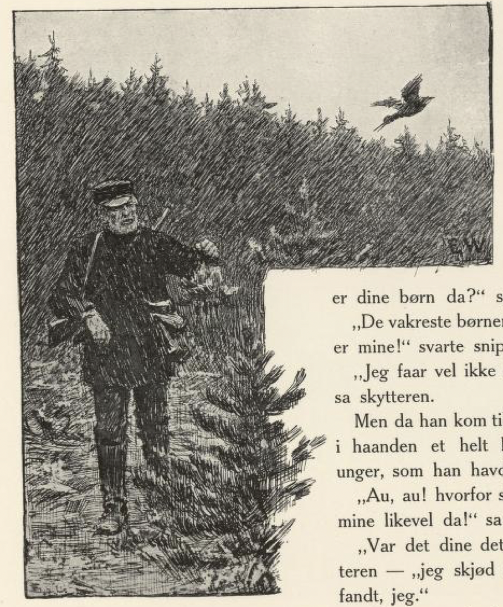

# Hver synes best om sine barn

Det var engang en skytter som var ute i skogen; så møtte han myrsnipen.

«Kjære vene, skyt ikke mine barn!» sa myrsnipen.

«Hva er det for noen som er dine barn da?» spurte skytteren.

«De vakreste barna i skogen går, er mine!» svarte snipen.

«Jeg får vel ikke skyte dem da,» sa skytteren.

Men da han kom tilbake, hadde han i hånden et helt knippe myrsnipeunger, som han hadde skutt.

«Au, au! hvorfor skjøt du barna mine likevel da!» sa snipen.

«Var det dine dette?» spurte skytteren — «jeg skjøt de styggeste jeg fant, jeg.»

«Å ja!» svarte snipen, «vet du ikke at hver synes best om sine barn.»

